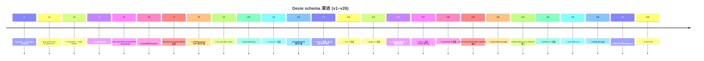

# 存储（Dexie schema v26）

<Status variant="stable">v26</Status>

<TLDR>
  所有浏览器侧状态通过 Dexie 存在 IndexedDB，库名 `cognia-claude`。 Schema 版本只增不改 ——
  每次发版加新 `.version(n)` 块，旧的永不修改。 当前版本 **v26**，共 40+
  张表；本页按版本逐一记录索引列表与迁移意图。
</TLDR>

<StatGrid>
  <Stat label="Schema 版本" value="26" hint="2024–2026" />
  <Stat label="表数" value="40+" hint="跨所有版本累计" />
  <Stat label="数据库名" value="cognia-claude" hint="历史值，保持不变" />
  <Stat label="单例表" value="1" hint="settings 表" />
</StatGrid>

Cognia 几乎所有浏览器侧状态都通过 **Dexie 存在 IndexedDB**。Schema 定义在 `lib/db/schema.ts`，当前版本 **v26**。Schema 版本只增不改 —— 永远不要修改既有的 `.version(n).stores({...})` 块。

## 数据库标识

```ts title="lib/db/schema.ts"
super("cognia-claude")
```

Dexie 数据库名是 `cognia-claude`（保留原始代号，避免对已有用户做迁移）。不要改。如非要改，需写一个迁移：首次启动从 `cognia-claude` 复制到新名，再删旧库。

## 表家族总览

下面按子系统归类列出全部表 —— 每张表都在某个版本中首次出现，并保持加入时的索引契约不变。完整版本历史见后文。

### 核心聊天（v1–v4）

| 表              | 索引                                                            | 用途                                  |
| --------------- | --------------------------------------------------------------- | ------------------------------------- |
| `sessions`      | `id, updatedAt, createdAt, kind, characterId, teamId`           | 聊天会话                              |
| `messages`      | `id, sessionId, [sessionId+createdAt], senderId`                | 聊天消息                              |
| `settings`      | `id`（始终 `"singleton"`）                                      | 全局设置（单例）                      |
| `promptPresets` | `id, updatedAt, isBuiltIn, isDefault, isFavorite, sortOrder, …` | 可复用提示片段（v12 扩展）            |
| `mcpServers`    | `id, name, enabled`                                             | MCP 服务器定义                        |
| `characters`    | `id, name, updatedAt, isBuiltIn`                                | 角色人格（[详见](./chat-and-skills)） |
| `skills`        | `id, name, updatedAt, isBuiltIn, category, source, status, …`   | 技能定义（v8 扩展）                   |
| `teams`         | `id, name, updatedAt, isBuiltIn`                                | 多角色团队                            |
| `sessionState`  | `sessionId, lastReadAt`                                         | 未读 / 最后阅读时间                   |

### 信任与备份（v6–v10）

| 表                  | 索引                             | 用途                               |
| ------------------- | -------------------------------- | ---------------------------------- |
| `trustedWorkspaces` | `path, trustedAt`                | 允许 shell-tool 执行的工作区       |
| `tts_provider_keys` | `id`                             | TTS provider key 的 web 模式回退表 |
| `backupHistory`     | `id, completedAt, type, success` | 备份记录（限 50 行）               |
| `skillResources`    | `id, skillId, [skillId+kind], …` | 技能附件（v8 引入）                |

### 画板（v11）

| 表                | 索引                                                           |
| ----------------- | -------------------------------------------------------------- |
| `canvasDocuments` | `id, title, language, type, updatedAt, createdAt`              |
| `canvasVersions`  | `id, documentId, [documentId+createdAt], isAutoSave`           |
| `canvasComments`  | `id, documentId, [documentId+createdAt], parentId, resolvedAt` |
| `canvasSessions`  | `id, documentId, ownerId, createdAt`                           |

详见 [Canvas 页](./canvas)。

### A2UI（v13）

| 表                 | 索引                                                                         |
| ------------------ | ---------------------------------------------------------------------------- |
| `a2uiApps`         | `id, name, updatedAt, createdAt, isBuiltIn, category, isFavorite, sortOrder` |
| `a2uiSurfaces`     | `id, appId, sessionId, updatedAt, createdAt, type`                           |
| `a2uiTemplates`    | `id, name, category, updatedAt, source`                                      |
| `a2uiEventHistory` | `id, surfaceId, [surfaceId+timestamp], timestamp, type`                      |

详见 [A2UI 系统](./a2ui-system)。

### 员工数字孪生（v14）

| 表            | 索引                                                                             |
| ------------- | -------------------------------------------------------------------------------- |
| `twinSources` | `&id, twinId, kind, format, status, fingerprint, [twinId+kind], [twinId+status]` |
| `twinChunks`  | `&id, twinId, sourceId, vectorDocId, [twinId+sourceId], [twinId+createdAt]`      |
| `twinProfile` | `&id, twinId`                                                                    |
| `twinDrafts`  | `&id, twinId, jobId, kind, status, [twinId+status], [twinId+kind]`               |
| `twinJobs`    | `&id, twinId, status, queuedAt, [twinId+status], [twinId+kind]`                  |

详见 [员工数字孪生](./employee-twin)。

### 插件（v15）

| 表                    | 索引                                                                          |
| --------------------- | ----------------------------------------------------------------------------- |
| `plugins`             | `id, name, version, status, source, type, enabled, lastUsedAt, *capabilities` |
| `pluginPermissions`   | `[pluginId+permission], pluginId, permission, decision, expiresAt`            |
| `pluginReviews`       | `[pluginId+id], pluginId, rating, createdAt`                                  |
| `pluginAnalytics`     | `[pluginId+key], pluginId, key, lastEventAt`                                  |
| `pluginScheduledJobs` | `id, pluginId, cron, lastRunAt, nextRunAt, status`                            |

详见 [插件系统](./plugin-system)。

### External Bridge（Wiki + MCP 审计，v17）

| 表             | 索引                                                               |
| -------------- | ------------------------------------------------------------------ |
| `wikiArticles` | `&id, &slug, scope, module, pageRank, generatedAt, [scope+module]` |
| `wikiSections` | `&id, articleId, [articleId+sectionIndex]`                         |
| `wikiManifest` | `&scope, lastBuildAt`                                              |
| `mcpAuditLog`  | `&id, ts, tool, allowed, [tool+ts]`（限 5 000 行）                 |

详见 [External Bridge](./external-bridge) 与 [Wiki 生成器](./wiki-generator)。

### 平台连接器（v18 / v19 / v21）

| 表                      | 索引                                                                                                                                            |
| ----------------------- | ----------------------------------------------------------------------------------------------------------------------------------------------- |
| `adapterInstances`      | `id, type, enabled, displayName, [type+enabled], createdAt, updatedAt`                                                                          |
| `platformIdentities`    | `&id, [platform+remoteUserId], [adapterId+remoteUserId], remoteUserId, platform, lastSeenAt`                                                    |
| `inboundLedger`         | `&id, [adapterId+platformMessageId], adapterId, receivedAt`（限 10 000 行）                                                                     |
| `outboundQueue`         | `&id, conversationKey, [conversationKey+createdAt], status, nextAttemptAt, idempotencyKey, [adapterId+status], createdAt`（v21 加 `createdAt`） |
| `conversationOverrides` | `&id, &conversationKey, sessionId, pinned, archived, updatedAt`（v19 加 `updatedAt`）                                                           |
| `connectorAudit`        | `&id, adapterId, kind, at, [adapterId+at]`（限 5 000 行）                                                                                       |
| `connectorDrafts`       | `&id, conversationKey, sessionId, [conversationKey+createdAt], status, expiresAt`                                                               |
| `connectorAttachments`  | `&id, [adapterId+remoteRef], adapterId, mimeType, fetchedAt, expiresAt`                                                                         |

详见 [平台连接器](./platform-connectors)。

### Claude 订阅用量（v20）

| 表                  | 索引                                                                      |
| ------------------- | ------------------------------------------------------------------------- |
| `subscriptionUsage` | `++localId, fetchedAt, status, source, [source+fetchedAt]`（限 1 000 行） |

详见 [Claude 订阅 OAuth](./claude-subscription-oauth)。

### 可视化工作流（v22）

| 表                  | 索引                                                                                           |
| ------------------- | ---------------------------------------------------------------------------------------------- |
| `workflows`         | `&id, name, updatedAt, createdAt, isBuiltIn, isTemplate, *tags, schemaVersion`                 |
| `workflowRuns`      | `&id, workflowId, status, startedAt, completedAt, [workflowId+startedAt], [workflowId+status]` |
| `workflowRunEvents` | `&id, runId, [runId+ts], stepId, [runId+stepId], type`                                         |
| `workflowTriggers`  | `&id, workflowId, kind, enabled, [workflowId+enabled], cron, nextFireAt`                       |

详见 [可视化工作流](./visual-workflows)。

### 移动端配对（v23 / v25）

| 表                    | 索引                                                      |
| --------------------- | --------------------------------------------------------- |
| `pairedDevices`       | `&deviceId, lastSeenAt, revokedAt, platform`              |
| `mobileOutboundQueue` | `&id, status, [status+nextAttemptAt], createdAt, command` |

详见 [移动端架构](./mobile-architecture)。

### 会话用量与草稿（v24 / v26）

| 表             | 索引                                                            |
| -------------- | --------------------------------------------------------------- |
| `sessionUsage` | `&messageId, sessionId, [sessionId+at], at, model, characterId` |
| `chatDrafts`   | `&sessionId, updatedAt`                                         |

`sessionUsage` 记录每条 assistant 消息的 token / 成本明细；`chatDrafts` 缓存每会话未发送的 Composer 内容。

## 版本历史



`lib/db/schema.ts` 中每个 `.version(n)` 块的语义：

| 版本    | 主题                  | 新增表 / 索引 / 迁移                                                                                                                                                  |
| ------- | --------------------- | --------------------------------------------------------------------------------------------------------------------------------------------------------------------- |
| **v1**  | 原始基线              | `sessions`、`messages`、`settings`。                                                                                                                                  |
| **v2**  | Prompt / MCP          | + `promptPresets`、`mcpServers`。                                                                                                                                     |
| **v3**  | Agent 体系            | + `characters`、`skills`、`teams`；session/message 索引扩展为 `kind / characterId / teamId / senderId`。                                                              |
| **v4**  | 会话状态              | + `sessionState`（unread / lastReadAt）。                                                                                                                             |
| **v5**  | Team 形态升级         | `Team.memberCharacterIds` (string[]) → `Team.members` (TeamMember[])；幂等 upgrade hook。                                                                             |
| **v6**  | 工作区信任            | + `trustedWorkspaces`（path / trustedAt）。                                                                                                                           |
| **v7**  | 多 agent 同步         | `McpServer.appsEnabled` 回填为 `{}`，避免 `undefined`。                                                                                                               |
| **v8**  | 技能扩展              | + `skillResources`；`skills` 索引扩展为 `category / source / status / lastUsedAt / canonicalId`；回填默认值。                                                         |
| **v9**  | TTS provider key 回退 | + `tts_provider_keys`（仅 web 模式使用；Tauri 走 OS keyring）。                                                                                                       |
| **v10** | 备份历史              | + `backupHistory`（限 50 行）。                                                                                                                                       |
| **v11** | 画板                  | + `canvasDocuments / canvasVersions / canvasComments / canvasSessions`。                                                                                              |
| **v12** | Prompt preset 富表单  | `promptPresets` 索引扩展（`isBuiltIn / isDefault / isFavorite / sortOrder / category / lastUsedAt`）；回填默认值。                                                    |
| **v13** | A2UI                  | + `a2uiApps / a2uiSurfaces / a2uiTemplates / a2uiEventHistory`；幂等种子化 A2UI bridge MCP；`characters.a2uiEnabled` 回填。                                           |
| **v14** | 员工数字孪生          | + `twinSources / twinChunks / twinProfile / twinDrafts / twinJobs`。                                                                                                  |
| **v15** | 插件                  | + `plugins / pluginPermissions / pluginReviews / pluginAnalytics / pluginScheduledJobs`。                                                                             |
| **v16** | 主题双变体迁移        | 无新表；`settings.customThemes[]` 中每行 `{colors, isDark}` 迁移为 `{tokens:{light,dark}, baseVariant, derivedVariant}`，借助 `lib/appearance/derive-variant`。幂等。 |
| **v17** | External Bridge       | + `wikiArticles / wikiSections / wikiManifest / mcpAuditLog`（最后一个限 5 000 行）。                                                                                 |
| **v18** | 平台连接器            | + 8 张连接器表（见上）。                                                                                                                                              |
| **v19** | 连接器纯索引          | `conversationOverrides` 加 `updatedAt` 单字段索引（驱动设置页 newest-first 排序）。                                                                                   |
| **v20** | Claude 订阅用量       | + `subscriptionUsage`（限 1 000 行；记录 `anthropic-ratelimit-unified-*` 头部快照）。                                                                                 |
| **v21** | outboundQueue 纯索引  | `outboundQueue` 加 `createdAt` 单字段索引（全局 newest-first 排序）。                                                                                                 |
| **v22** | 可视化工作流          | + `workflows / workflowRuns / workflowRunEvents / workflowTriggers`。                                                                                                 |
| **v23** | 移动端配对            | + `pairedDevices`（驱动 QR 配对 + JWT deny-list）。                                                                                                                   |
| **v24** | 每消息用量 + 成本     | + `sessionUsage`（由 SDK adapter 在每次 `result` 事件写入）。                                                                                                         |
| **v25** | 移动出站队列          | + `mobileOutboundQueue`（手机端写操作离线队列，最多重试 5 次）。                                                                                                      |
| **v26** | 聊天草稿              | + `chatDrafts`（每会话未发送的 Composer 内容）。                                                                                                                      |

<Callout type="info" title="幂等升级">
  每个版本都幂等 —— 打开旧库会自动按顺序升级到最新版本。Dexie 按顺序应用。 **永远不要修改之前的
  `.version(n)` 块。**
</Callout>

## Upgrade hooks

某些版本（v5、v7、v8、v12、v13、v16）有 `.upgrade(tx => { ... })` 钩子，仅在迁移到该版本时跑一次。常见模式：

- **回填索引** —— 读所有现存行、写派生字段、再 put。
- **种子化内置行** —— 缺失则插入内置角色 / 技能 / MCP 服务器。v13 的钩子会以 `name` 幂等查找 A2UI bridge MCP，缺失才插入。
- **改造行结构** —— 把旧字段翻译为新字段（v5 的 `memberCharacterIds → members`、v16 的主题双变体迁移）。

钩子必须：

- **幂等** —— 跑两次也安全（用户清空 + 重新导入时会发生）。
- **近同步** —— Dexie 用事务包裹；长 async 工作可以但会阻塞写。v16 的钩子用动态 `import()` 避免冷路径加载 culori。
- **测试覆盖** —— 每个 upgrade hook 都有同名测试。

## Settings 表

`settings` 是单例 —— 只有一行，键 `"singleton"`。结构是 `AppSettings`（`lib/claude/types.ts`），包含：

- API key 引用（实际密钥放 OS keyring，这里只放元数据）。
- 默认角色 / 模型 / 技能 ID。
- UI 偏好（主题、locale、字号、密度）。
- 调度器开关、备份调度 + 文件夹。
- 向量后端选择 + 连接、孪生 runtime 默认值。
- 自定义主题数组（v16 起为 `CustomTheme` 双变体形态）。
- External Bridge / Claude 订阅 / Connectors / Workflows 子系统的开关与凭据元数据。
- 遥测同意。

`SettingsSyncProvider` 是挂载它的 React provider，把行缓存到内存，并暴露批量写回 Dexie 的更新器。

## 新增表

<Steps>
  <Step>
    ### 定义行类型

    在 `lib/db/<name>.ts` 新建文件并导出：

    ```ts
    export interface MyNewRow {
      id: string
      indexedField: string
      otherField: number
      // ...
    }
    ```

  </Step>
  <Step>
    ### 在 schema.ts 顶部 import

    在 `lib/db/schema.ts` 顶部加 `import type { MyNewRow } from "./<name>"`。

  </Step>
  <Step>
    ### 添加 Table 字段

    在 `CogniaDB` 类中加 `myNewTable!: Table<MyNewRow, string>`。

  </Step>
  <Step>
    ### 升级 schema 版本

    ```ts
    this.version(27).stores({
      myNewTable: "id, indexedField, [indexedField+otherField]",
      // 只列出新表；既有表自动继承
    })
    ```

  </Step>
  <Step>
    ### （可选）加 upgrade hook

    若需要种子化内置行或从既有表回填：

    ```ts
    this.version(27).stores({...}).upgrade(async tx => {
      // 幂等迁移
    })
    ```

  </Step>
  <Step>
    ### 写测试

    `lib/db/<name>.test.ts` 覆盖增删改查；如加了 hook，再覆盖幂等性。

  </Step>
  <Step>
    ### 更新本文档页

    把新表加入相应的子系统分组，并在版本历史表中增加一行。

  </Step>
</Steps>

<Callout type="error" title="永远不要修改之前的 version 块">
  如果发现某个索引错了，**新建**一个版本重新声明该表的正确索引列表（v19 / v21
  就是这么做的）。修改旧版本会让已经迁移过那一步的用户进入孤儿状态。
</Callout>

## 复合主键

Dexie 通过数组语法支持复合主键。Cognia 在插件权限/评价/统计表中用：

```ts
pluginPermissions: "[pluginId+permission], pluginId, permission, decision, expiresAt"
//                   ^ 主键              ^ 二级索引
```

这样"用户撤销了插件 Y 的权限 X"就是一次 `delete([pluginId, permission])`，不必扫描。`pluginReviews / pluginAnalytics` 同此模式；连接器的 `[adapterId+platformMessageId]` 用复合键做 O(1) 去重。

## 限量表

部分表限量以避免无界增长：

| 表                  | 上限            | 修剪策略                                   |
| ------------------- | --------------- | ------------------------------------------ |
| `backupHistory`     | 50 行           | 每次 insert 后调用 `pruneBackupHistory()`  |
| `a2uiEventHistory`  | 每 surface ~200 | 超量时 insert 时修剪                       |
| `canvasVersions`    | 无界，但可压缩  | 画板 UI 提供"压缩历史"动作                 |
| `mcpAuditLog`       | 5 000 行        | `lib/db/mcp-audit-log.ts` 写入时 trim 最旧 |
| `inboundLedger`     | 10 000 行       | 出 / 入站去重缓存；LRU 修剪                |
| `connectorAudit`    | 5 000 行        | 写入时 trim 最旧                           |
| `subscriptionUsage` | 1 000 行        | `usage-collector.ts` 写入时 trim 最旧      |

新增高写入表时请先决定是否需要上限。

## 查询提示

- 优先索引查询 —— `db.messages.where("[sessionId+createdAt]").between([sid, 0], [sid, Date.now()])`。
- 大表别 `Collection.toArray()`；用 `.each(callback)` 流式处理。
- 多表写入用事务包裹：`db.transaction("rw", tableA, tableB, async () => {...})`，部分失败可回滚。
- Live query（`dexie-react-hooks` 的 `useLiveQuery`）在底层数据变化时自动重渲染。[数据 hooks](./data-hooks) 页有更多模式。
- 跨平台同步：[同步系统](./sync-system) 页讲 sync-projection 是如何消费这些表的。

## 清空数据

`lib/data/clear.ts` 暴露：

- `clearAll()` —— 清空所有 Dexie 表。维护 tab 的"重置"动作使用。
- `clearTables(names)` —— 清空指定表。

两者都在单 Dexie 事务中运行，保证一致性。

## 测试

- `lib/db/schema.test.ts` —— 打开 DB、跑所有 upgrade、验证行数。
- `lib/db/seed.test.ts` —— 内置种子化幂等性。
- 各表测试（`messages.test.ts`、`characters.test.ts`、`workflows.test.ts`、`adapter-instances.test.ts`、`paired-devices.test.ts` ……）—— CRUD + 索引覆盖。
- `lib/db/index.test.ts` —— 跨表事务与并发写。

## 下一篇

<Cards>
  <Card title="备份 & 数据传输" href="./backup-and-data" description="基于这些表构建备份载荷" />
  <Card title="数据 hooks" href="./data-hooks" description="dexie-react-hooks 的实战模式" />
  <Card title="插件系统" href="./plugin-system" description="使用 v15 插件 5 张表" />
  <Card title="员工数字孪生" href="./employee-twin" description="使用 v14 孪生 5 张表" />
  <Card
    title="平台连接器"
    href="./platform-connectors"
    description="使用 v18 / v19 / v21 连接器 8 张表"
  />
  <Card title="可视化工作流" href="./visual-workflows" description="使用 v22 工作流 4 张表" />
  <Card
    title="External Bridge"
    href="./external-bridge"
    description="使用 v17 Wiki + 审计 4 张表"
  />
  <Card title="移动端架构" href="./mobile-architecture" description="使用 v23 / v25 移动 2 张表" />
</Cards>
