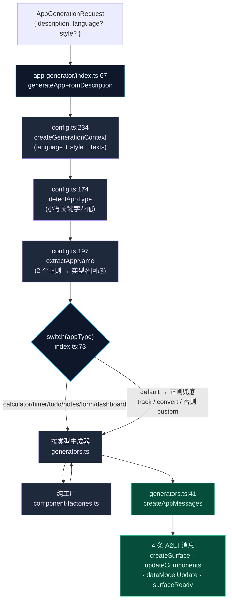
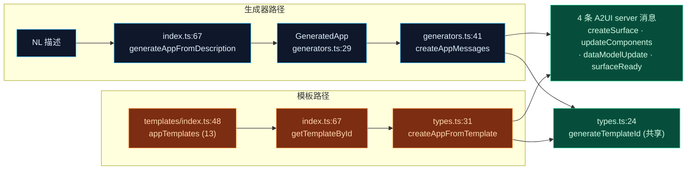

# 应用生成器与模板

<Status variant="experimental" />

<TLDR>
  **应用生成器**把一行描述变成完整的 A2UI 组件树，**全程不调用任何模型** —— 它是纯关键字/正则规则匹配。
  一条简短的流水线（`createGenerationContext` → `detectAppType` → `extractAppName` → 一个 `switch`）把请求路由到十个
  按类型划分的生成器之一，这些生成器再从 **13 个纯组件工厂** 组装出 surface。另外，一个含 **13 个硬编码内置模板**
  的注册表（`appTemplates`）提供开箱即用的应用。生成器与模板都会发出**完全相同的 4 条 A2UI 消息序列**。
  [A2UI Hub 页面](#hub-vs-workspace)（`app/a2ui/page.tsx`）是入口：`?app=<id>` 切到 Workspace，否则渲染 Hub，
  含 Flash 生成、可搜索的应用库与模板画廊。
</TLDR>

<StatGrid>
  <Stat label="LLM 调用" value="0" hint="纯关键字 + 正则匹配，零模型依赖" />
  <Stat label="按类型生成器" value="10" hint="generators.ts — calculator/timer/todo/notes/form/tracker/converter/custom/dashboard" />
  <Stat label="组件工厂" value="13" hint="component-factories.ts — 纯 A2UIComponent[] 构建器" />
  <Stat label="内置模板" value="13" hint="appTemplates 注册表 —— 不是 14 个" />
</StatGrid>

## 不依赖 LLM 的前提

<Callout type="warn">
  应用生成器**不会**调用任何模型。整条生成路径中没有任何 LLM、embedding 或网络调用。它是**纯关键字/正则规则匹配**：
  对描述做小写子串扫描（`detectAppType`）挑选应用类型，两个正则（`extractAppName`）提取名称，再由一个 `switch`
  分派到确定性的按类型生成器。相同描述始终产出相同的树。正是这一点让 Flash 生成既即时又可离线运行。
</Callout>

本子系统由两个协作的部分组成：

| 部分 | 入口 | 作用 |
| --- | --- | --- |
| **生成器** | `app-generator/index.ts:67` `generateAppFromDescription` | 通过规则把 NL 字符串 → `GeneratedApp`（components + dataModel + name） |
| **模板注册表** | `templates/index.ts:48` `appTemplates` | 13 个硬编码 `A2UIAppTemplate`，按 id/分类/搜索查找 |

两者都终结于**相同的 4 条 A2UI 消息序列**（`createSurface` · `updateComponents` · `dataModelUpdate` ·
`surfaceReady`）—— 生成器经由 `createAppMessages`（`generators.ts:41`），模板经由
`createAppFromTemplate`（`types.ts:31`）。两者都通过 `generateTemplateId`（`types.ts:24`）铸造 id。

<Files>
- lib/a2ui/
  - app-generator.ts — 向后兼容的桶文件 shim（re-export `./app-generator/`）
  - app-generator/
    - index.ts — 桶文件 + **主入口** `generateAppFromDescription` (67)
    - config.ts — 本地化、样式、`appPatterns`、检测辅助函数
    - generators.ts — 10 个按类型生成器 → `GeneratedApp`
    - component-factories.ts — 13 个纯 `A2UIComponent[]` 工厂
  - templates/
    - index.ts — **注册表** `appTemplates` (48) + 查找辅助函数
    - types.ts — `A2UIAppTemplate`、`generateTemplateId`、`createAppFromTemplate`
    - productivity.ts · utility.ts · form.ts · data.ts · social.ts — 13 个模板定义
- app/a2ui/
  - page.tsx — Hub vs Workspace 双模式 (914)
  - layout.tsx — metadata + 透传 (11)
</Files>

## 生成流水线

`generateAppFromDescription`（`index.ts:67`）是唯一入口。它解析生成上下文、对描述分类、提取名称，
然后通过一个 `switch` 分派到某个按类型生成器；该生成器调用一个或多个工厂，并把结果包装成 4 条消息序列。

### 分派 switch

`index.ts:73` 处的 `switch(appType)` 把检测到的类型映射到生成器。没有显式 case 的类型落入 `default`（88），
在那里两个正则先捕获 tracker/converter 意图，再由 `generateCustomApp` 兜底。

| `appType` | 路由到 | 生成器行号 |
| --- | --- | --- |
| `calculator` | `generateCalculatorApp` | `generators.ts:58` |
| `timer` | `generateTimerApp` | `generators.ts:104` |
| `todo` | `generateTodoApp` | `generators.ts:143` |
| `notes` | `generateNotesApp` | `generators.ts:175` |
| `survey` | `generateFormApp(…, "survey")` | `generators.ts:203` |
| `contact` | `generateFormApp(…, "contact")` | `generators.ts:203` |
| `dashboard` | `generateDashboardApp` | `generators.ts:552` |
| *default* `/追踪|track|记录|log|打卡/i` (89) | `generateTrackerApp` | `generators.ts:227` |
| *default* `/转换|换算|convert/i` (92) | `generateUnitConverterApp` | `generators.ts:274` |
| *default* 否则 (95) | `generateCustomApp` | `generators.ts:452` |

## 意图检测（`appPatterns`）

`detectAppType`（`config.ts:174`）将描述转小写，并遍历 `Object.entries(appPatterns)`（`config.ts:136`）——
**首个匹配胜出**，按插入顺序。每个 pattern 携带双语关键字与一个 `templateId`（对应的内置模板，Hub 在选择
提供模板而非生成应用时使用）。

| 意图 | 行号 | 关键字（zh / en） | `templateId` |
| --- | --- | --- | --- |
| `calculator` | 137 | 计算 · 计算器 · calculator · calc · 算 | `calculator` |
| `timer` | 141 | 计时 · 倒计时 · timer · countdown · 秒表 | `timer` |
| `todo` | 145 | 待办 · 任务 · todo · task · 清单 | `todo-list` |
| `notes` | 149 | 笔记 · 记事 · notes · memo · 便签 | `notes` |
| `survey` | 153 | 问卷 · 调查 · survey · form · 表单 · feedback | `survey-form` |
| `contact` | 157 | 联系 · contact · 留言 · message | `contact-form` |
| `weather` | 161 | 天气 · weather · 气温 · 温度 | `weather` |
| `dashboard` | 165 | 仪表盘 · dashboard · 数据 · 统计 · analytics · 图表 | `data-dashboard` |

`config.ts` 中的支撑辅助函数：`detectLanguage`（189）把任意 CJK 字符（`/[一-鿿]/`）映射为 `zh`，否则 `en`；
`extractAppName`（197）先试两个名称正则（198–201），再用类型名回退表（214–223），最后用默认值。
`getLocalizedTexts`（101，默认 `zh`）与 `getStyleConfig`（108，默认 `colorful`）喂给
`createGenerationContext`（234）。

<Callout type="warn">
  **weather 的陷阱。** `weather` 是 `appPatterns`（`config.ts:161`）中一个有效的可检测类型，但分派 `switch`
  （`index.ts:73`）**没有 `case "weather"`**。因此 "weather" 描述会穿过 `default` 落到 `generateCustomApp`。
  weather 只能通过它的**模板**（`utility.ts:235`）得到成品应用，永远无法经由生成器。
</Callout>

## 工厂层（13 个纯工厂）

`component-factories.ts` 含 13 个纯函数，每个返回 `A2UIComponent[]`（每个都以 `] as A2UIComponent[]` 结尾）。
字符串硬编码为 zh（带 emoji 标题）；绑定用 `{ path: "/foo" }`。calculator、timer、todo、notes、form、tracker
这几个生成器**委托**给这些工厂；而 converter、custom、dashboard 生成器则是**内联**构建组件树。

| 家族 | 工厂 | 行号 | 关键控件 |
| --- | --- | --- | --- |
| Calculator | `createBasicCalculatorComponents` | 8 | 4×4 键盘（`num_N` / `op_*` / `calculate` / `clear` / `delete`） |
| Calculator | `createTipCalculatorComponents` | 74 | Slider `tipPercent` |
| Calculator | `createBMICalculatorComponents` | 140 | Slider height/weight，Badge |
| Calculator | `createAgeCalculatorComponents` | 193 | DatePicker |
| Calculator | `createLoanCalculatorComponents` | 223 | 贷款输入 |
| Timer | `createTimerComponents(isPomodoro)` | 305 | pomodoro 预设（374）vs 1/5/10 分钟（398） |
| Productivity | `createTodoComponents(hasCategories, hasPriority, hasDueDate)` | 412 | 条件 `dueDate`（437） |
| Productivity | `createNotesComponents` | 505 | 笔记列表 |
| Form | `createSurveyComponents` | 559 | TextField / RadioGroup / TextArea |
| Form | `createContactComponents` | 609 | 联系字段 |
| Tracker | `createExpenseTrackerComponents` | 679 | Progress 预算，Select |
| Tracker | `createHealthTrackerComponents` | 759 | steps / water Progress |
| Tracker | `createHabitTrackerComponents` | 841 | streak Flame，List |

### 内联构建的生成器

三个生成器**不**委托工厂 —— 它们直接组装组件：

| 生成器 | 行号 | 内联范围 | 说明 |
| --- | --- | --- | --- |
| `generateUnitConverterApp` | 274 | 356–429 | 单位类型路由：temperature（291）/ weight（304）/ currency（319）/ length |
| `generateCustomApp` | 452 | 471–535 | 特性标记 input（461）/ button（462）/ list（463）/ chart（464） |
| `generateDashboardApp` | 552 | 559–606 | ComparisonCards / WidgetStatus / Chart + 预置 dataModel（608–628） |

委托型生成器同样带子路由：`generateCalculatorApp`（58）分支 tip（66）/ BMI（67）/ age（68）/ loan（69）/ basic；
`generateTimerApp`（104）检测 pomodoro（112）和 `(\d+)分钟` 预设（115）；`generateTodoApp`（143）设置
categories/priority/dueDate 标记（150–152）；`generateTrackerApp`（227）子路由 expense（234）/ health（236）/ habit。
所有 id 都来自从 `../templates` 引入的 `generateTemplateId(prefix)`（`generators.ts:7`）。

## 13 个内置模板

`appTemplates`（`templates/index.ts:48`，条目 L49–61）是注册表。它是 **13 个模板，不是 14 个**。
分布：productivity ×4、utility ×4、form ×2、data ×2、social ×1。

| id | 名称 | 分类 | 定义（`file:line`） |
| --- | --- | --- | --- |
| `todo-list` | Todo List | productivity | `productivity.ts:12` |
| `notes` | Quick Notes | productivity | `productivity.ts:95` |
| `habit-tracker` | Habit Tracker | productivity | `productivity.ts:178` |
| `shopping-list` | Shopping List | productivity | `productivity.ts:251` |
| `calculator` | Calculator | utility | `utility.ts:12` |
| `timer` | Timer | utility | `utility.ts:147` |
| `weather` | Weather Widget | utility | `utility.ts:235` |
| `unit-converter` | Unit Converter | utility | `utility.ts:335` |
| `survey-form` | Survey Form | form | `form.ts:12` |
| `contact-form` | Contact Form | form | `form.ts:130` |
| `data-dashboard` | Data Dashboard | data | `data.ts:12` |
| `expense-tracker` | Expense Tracker | data | `data.ts:147` |
| `profile-card` | Profile Card | social | `social.ts:12` |

`index.ts` 中的注册表辅助函数：`getTemplateById`（67）、`getTemplatesByCategory`（74）、`searchTemplates`（81）
—— 后者扫描 name/description/tags，驱动 Hub 搜索框。

### `A2UIAppTemplate` 形状与两个并行构建器

`A2UIAppTemplate`（`types.ts:10`）携带 `id` · `name` · `description` · `icon` · `category`
（`productivity` | `data` | `form` | `utility` | `social`）· `components` · `dataModel` · `tags`。
`templateCategories`（`types.ts:66`）保存 5 个分类的元数据条目。

存在**两个并行的消息构建器**，它们发出完全相同的 4 条 A2UI 消息序列：

| 构建器 | 行号 | 使用者 |
| --- | --- | --- |
| `createAppMessages` | `generators.ts:41` | 生成的应用（在 48–51 把 components + data 包成 4 条消息） |
| `createAppFromTemplate` | `types.ts:31` | 模板（template → 4 条 server 消息） |

两者都调用 `generateTemplateId`（`types.ts:24`，`${prefix}-${crypto.randomUUID()}`）铸造 surface id ——
在生成器路径和模板路径间共享。

## Hub vs Workspace

`app/a2ui/page.tsx`（914）是按 URL 区分的**双模式 hub**。`appIdFromUrl = searchParams.get("app")`（107）
驱动模式切换（329–331）：若 `appIdFromUrl` 存在则返回 `<A2UIWorkspace surfaceId={appIdFromUrl} />`，
否则渲染 Hub（333+）。因为用到 `useSearchParams`（101），默认导出把全部内容包进
`<Suspense fallback={<PageLoading/>}>`（907–913）。`app/a2ui/layout.tsx`（11）只设置 metadata
（`"A2UI Mini-Apps - Cognia"`，第 3 行）并透传 children。

### Flash 生成

hero prompt 驱动即时生成：`heroPrompt`（114），配 `QUICK_SUGGESTIONS`（79–86）与 `promptRef`（104）。
`handleFlashGenerate`（205）调用 `generateAppFromDescription({ description: heroPrompt })`（209），随后
`appBuilder.createCustomApp(result.name, result.components, result.dataModel)`（210）。Enter 提交（790–795）；
提交 Button（799）在 `isGenerating` 期间禁用。`handleSuggestionClick`（220）填充 prompt；
`handleTemplateSelect`（227）调用 `appBuilder.createFromTemplate(template.id)`。`handleOpenWorkspace`（322）执行
`router.push('/a2ui?app=<id>')`。一个 `?action=create` effect（196–203）聚焦创建 prompt 然后 `router.replace("/a2ui")`。

### Hub 各区块

| 区块 | 行号 | 要点 |
| --- | --- | --- |
| Header | 335 | 计数 `allApps.length`（350）+ `appTemplates.length`（353） |
| 继续工作卡片 | 385 | 渲染 `<A2UIInlineSurface>`（418） |
| 全部应用库 | 505 | 搜索（515）、排序 Select（533–547）、grid/list `viewMode`（549–566）、经 `CATEGORY_KEYS` + `CATEGORY_I18N_MAP` 的分类过滤（578–593）、应用卡 DropdownMenu |
| 模板库 | 734 | `filteredTemplates.map → <TemplateCard>`（753–759） |
| 创建工作室侧栏 | 766 | Flash 生成 composer |
| 对话框 | 873 | `DeleteConfirmDialog`（873）、预览 Dialog + `A2UIInlineSurface`（879）、`AppDetailDialog`（895） |

派生状态：`filteredApps` memo（131）与 `filteredTemplates` memo（166，组合 `searchTemplates` /
`getTemplatesByCategory` / `appTemplates`）。导出/导入：`handleExport`（268）、`handleExportAll`（287）、
`downloadJson`（88）、`handleImportFile`（302）。

## 相关页面

<Cards>
  <Card title="A2UI 系统" href="./index" description="协议概览、规范化往返、五种 server 消息、三条分派路径" />
  <Card title="目录与渲染" href="./catalog-rendering" description="生成/模板组件树最终经由的 类型→React 注册表" />
  <Card title="状态与持久化" href="./state-persistence" description="Zustand store、撤销/重做、localStorage LRU，以及支撑 Hub 应用库的 4 张 Dexie 表" />
</Cards>
