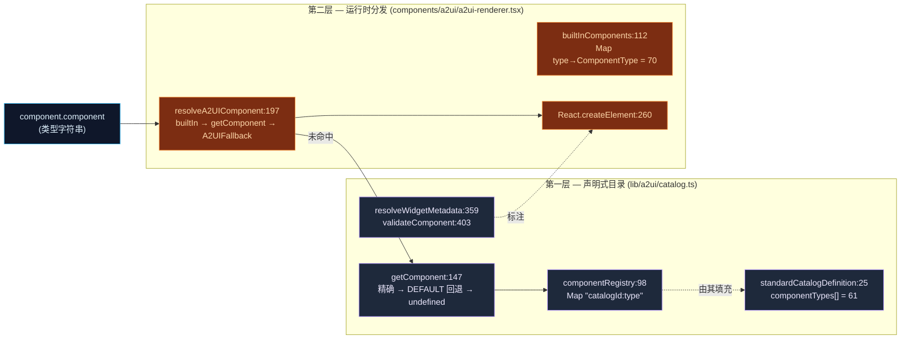
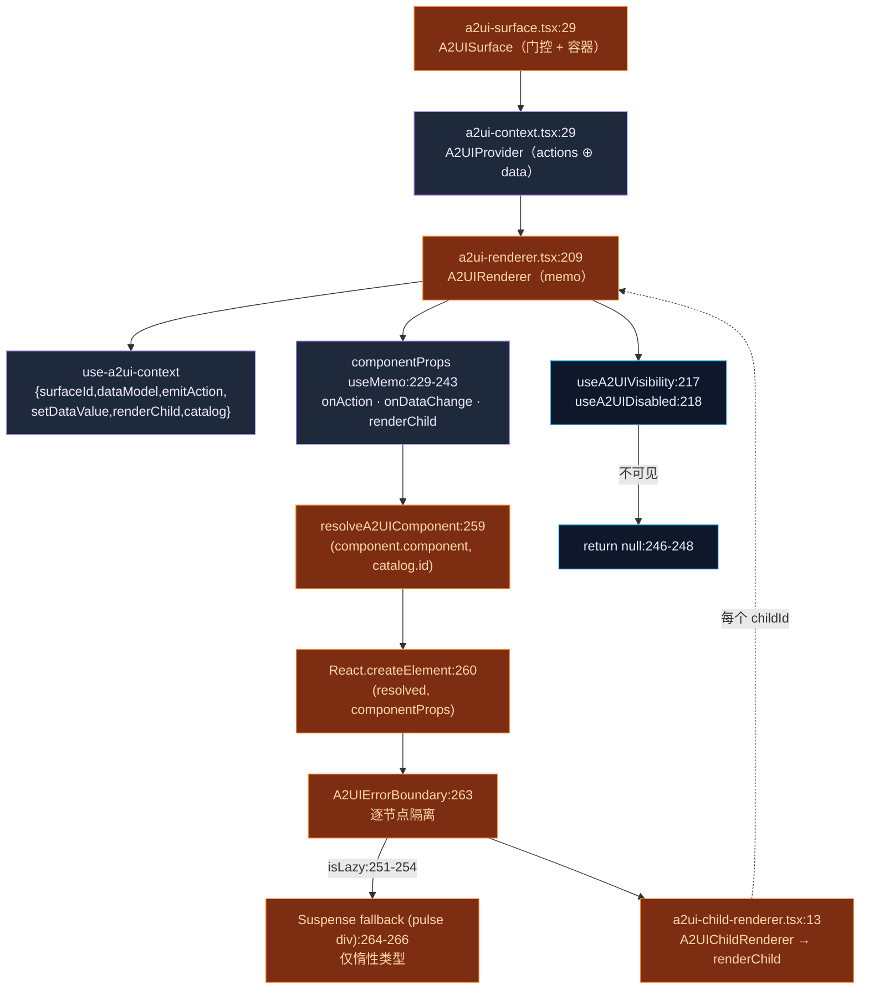
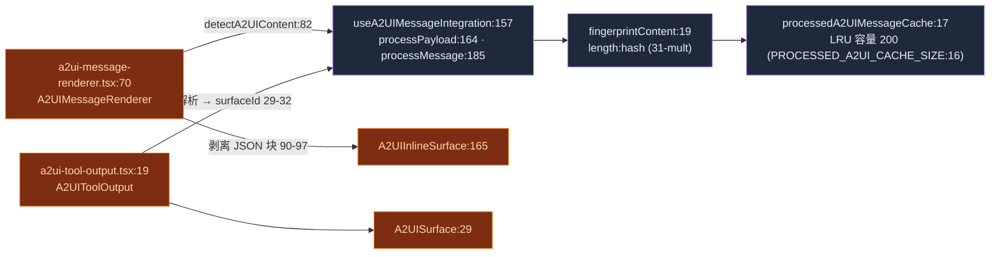

# 目录与渲染

<Status variant="experimental" />

<TLDR>
  A2UI 通过**两层叠加的注册表**把 `component` **类型字符串**（`"Button"`、`"Chart"` 等）变成真实的
  React 节点。轻量的 `lib/a2ui/catalog.ts` 保存 **61** 个标准类型的声明式清单以及元数据与校验；重量级的
  `components/a2ui/a2ui-renderer.tsx` 保存 **70** 条目的 `builtInComponents` 分发表，它才是*真正的*运行时
  注册表。容器（`a2ui-surface.tsx`）选择 inline / dialog / panel / fullscreen 外壳，`A2UIProvider` 把
  actions 与 data 拆分，`A2UIRenderer` 解析类型、调用 `React.createElement`，并把每个节点包进各自的错误
  边界。
</TLDR>

<StatGrid>
  <Stat label="目录类型" value="61" hint="catalog.ts standardCatalogDefinition.componentTypes (L32-91)" />
  <Stat label="分发条目" value="70" hint="a2ui-renderer.tsx builtInComponents (L114-190)" />
  <Stat label="仅渲染器独有" value="5" hint="Tabs · Accordion · Toggle · FormGroup · AcademicAnalysis" />
  <Stat label="组件家族" value="7" hint="layout · display · form · data · navigation · overlay · academic" />
</StatGrid>

## 两层注册表模型

一个类型字符串要经过两次查找，而这两层持有的**并非**同一份清单。理解这一拆分是看懂整个子系统的关键。

### 第一层 — `lib/a2ui/catalog.ts`（435 行）

目录是一张以 `` `${catalogId}:${type}` `` 为键（键在 L118 构造）的**扁平 `Map`**，值为
`A2UICatalogEntry { type, component, description?, schema? }`（L120-125）。它是*声明式*层：知道有哪些类型、
如何校验、以及如何解析 widget 元数据——但常规渲染路径并不依赖它。

| 符号 | 行 | 角色 |
| --- | --- | --- |
| `DEFAULT_CATALOG_ID` | 19 | `"cognia-standard-v1"`——回退目录 id |
| `standardCatalogDefinition` | 25 | `componentTypes[]` = **61** 个类型字符串（L32-91） |
| `componentRegistry` | 98 | 扁平 `Map<"catalogId:type", A2UICatalogEntry>` |
| `catalogRegistry` | 103 | `Map<catalogId, A2UIComponentCatalog>` |
| `registerComponent` | 108 | 设置 `componentRegistry["${catalogId}:${type}"]`（键 L118） |
| `registerComponents` | 131 | 批量注册 |
| `getComponent` | 147 | 精确键 → 回退到 `DEFAULT_CATALOG_ID`（L159-162）→ `undefined`（L164） |
| `hasComponent` | 170 | 成员判断 |
| `getRegisteredTypes` | 180 | 枚举键 |
| `createCatalog` | 196 | id 不同时合并默认目录（L208-218） |
| `registerCatalog` / `getCatalog` | 232 / 244 | 目录级注册 / 查询 |
| `unregisterComponent` / `clearRegistry` | 265 / 276 | 拆除 |
| `getStandardComponentTypes` | 284 | 61 类型清单 |
| `componentCategories` | 291 | 7 个桶：display / input / action / layout / data / overlay / navigation |
| `DEFAULT_WIDGET_METADATA` | 349 | `{ hostStrategy:"native", sizing:"auto", theme:"inherit", status:"ready", showChrome:true }` |
| `resolveWidgetMetadata` | 359 | 合并 `DEFAULT_WIDGET_METADATA` + RichOutput profile 路由（L367）+ `component.widget` |
| `getComponentCategory` | 391 | 类型 → 分类 |
| `validateComponent` | 403 | 返回 `{ valid, errors }` |
| `FALLBACK_COMPONENT_TYPE` | 435 | `"Text"`——**注意：渲染器未使用** |

**61** 个标准 `componentTypes`（L32-91）：`Text, Button, TextField, TextArea, Select, Checkbox, Radio,
RadioGroup, Slider, DatePicker, TimePicker, DateTimePicker, Card, Row, Column, List, Image, Chart,
Table, Dialog, Divider, Spacer, Progress, Badge, Alert, Link, Icon, RichOutput, ComparisonCards,
StepperShell, MockupFrame, WidgetStatus, Switch, Loading, Error, Empty, Animation, InteractiveGuide,
Avatar, Tooltip, Skeleton, Spinner, Toast, Combobox, DropdownMenu, ContextMenu, Popover, HoverCard,
Breadcrumb, Carousel, Drawer, Sheet, ScrollArea, Pagination, Sidebar, InputOTP, ToggleGroup,
ButtonGroup, InputGroup, Collapsible`。

`resolveWidgetMetadata`（L359）是 RichOutput profile 路由器（`routeRichOutputProfile`，于 L14 导入）把
host-strategy 提示回灌进组件 widget 元数据的地方——参见 [output profiles](./output-profiles)。

### 第二层 — `components/a2ui/a2ui-renderer.tsx` 分发表

渲染器自带一张 `builtInComponents` `Map<typeString, ComponentType>`（L112），含 **70** 条目（L114-190）。
渲染路径实际首先命中的就是这张注册表；只有未命中时才查目录。

| 符号 | 行 | 角色 |
| --- | --- | --- |
| `builtInComponents` | 112 | `Map<type, ComponentType>`——**70 条目**（L114-190），真正的注册表 |
| `resolveA2UIComponent` | 197 | `builtInComponents.get(type)` → `getComponent(type, catalogId)?.component` → `A2UIFallback`（L198-202） |
| `A2UIRenderer` | 209 | memo 化的主分发组件 |
| `withA2UIContext` | 278 | 在子树外挂载 provider 的 HOC |
| `registerBuiltInComponent` | 311 | 设置新分发条目（L315） |
| `isComponentRegistered` | 321 | 成员判断 |
| `getRegisteredComponentTypes` | 328 | 枚举 70 类型 |

三个重量级组件被**惰性**导入（L99-105），以免拖累首屏：`A2UIChart`（L99，recharts ≈ 200 KB）、
`A2UIAnimation`（L100）、`A2UIInteractiveGuide`（L103）——各自经由 `lazy(() => import(...))` 导入，并在
渲染时包进 `<Suspense>`。

<Callout type="warn">
  **70 vs 61 是有意为之，不是 bug。** 渲染器的分发表（70）是目录声明式清单（61）的严格超集。**5 个仅
  渲染器独有的额外类型**——`Tabs`、`Accordion`、`Toggle`、`FormGroup`、`AcademicAnalysis`——由
  `builtInComponents` 直接渲染，但**不在** `standardCatalogDefinition` 中，因此 `validateComponent`
  不会列出它们。另外，`DataExplorer` 在 store 摄入阶段被迁移为 `Table`（渲染器注释 L157-158）。目录的
  `FALLBACK_COMPONENT_TYPE = "Text"`（L435）**未被使用**——渲染器回退到 `A2UIFallback`（L197），从不回退
  到 `Text`。旧文档所说的「50+ 组件」对两层都低估了。
</Callout>

## 渲染管线

一个 surface 的流向是 容器 → provider → 渲染器 → 解析 → `createElement` → 隔离。渲染器刻意调用
`React.createElement` 而非 JSX（注释 L256-258），以规避 React-19 编译器对动态组件类型的规则。

`A2UIRenderer`（L209）内部逐步：

1. `useA2UIContext()`（L213）取出 `{ surfaceId, dataModel, emitAction, setDataValue, renderChild, catalog }`。
2. 可见性 / 禁用门控经由 `useA2UIVisibility`（L217）与 `useA2UIDisabled`（L218）；不可见节点返回 `null`（L246-248）。
3. `componentProps` 由 `useMemo`（L229-243）构造，注入 `onAction`（L221）、`onDataChange: setDataValue`、`renderChild`。
4. `isLazy` 检查（L251-254）决定是否需要 `<Suspense>` 包裹。
5. `resolveA2UIComponent(component.component, catalog?.id)`（L259）解析出 React 组件，随后 `React.createElement(resolved, componentProps)`（L260）实例化它。
6. 节点被包进 `<A2UIErrorBoundary>`（L263）；惰性类型额外加 `<Suspense fallback=…>`（L264-266）。

子节点不内联渲染：`A2UIChildRenderer`（`a2ui-child-renderer.tsx:13`，memo 化）把 `childIds` 映射为从
context（L18）取出的 `renderChild(childId)`（L23）。它被抽出纯粹是为了打破 渲染器 ⇄ 布局 的循环依赖。

## Surface 容器

`A2UISurface`（`a2ui-surface.tsx:29`）按 `surfaceType = surface.type`（L122）选择外壳，并以此索引
`lib/a2ui/constants.ts` 中的 `surfaceStyles[surfaceType]`（L125）与 `contentStyles[surfaceType]`（L126）。

| `surfaceType` | 行 | 容器类（`surfaceStyles`） |
| --- | --- | --- |
| `inline` | 30 | `"w-full"`——内联在聊天流中 |
| `dialog` | 31 | `"fixed inset-0 z-50 flex…bg-black/50"`——模态遮罩 |
| `panel` | 32 | `"w-full max-w-md border-l…"`——侧边面板 |
| `fullscreen` | 33 | `"fixed inset-0 z-50…"`——全屏接管 |

其上有两个便捷封装：`A2UIInlineSurface`（L165，`showLoading=false`，带边框卡片 L173）与
`A2UIDialogSurface`（L185，遮罩 / `Escape` → `deleteSurface` 于 L191-215，硬编码
`surfaceStyles.dialog` / `contentStyles.dialog` 于 L219、L227）。

`A2UISurface` 按**顺序**施加五道状态门控：无 surface → `null`（L77-79）；loading + `showLoading` →
spinner（L82-91）；error → destructive 横幅（L94-101）；`!surface.ready` → 小 spinner（L104-110）；无根
组件 → 「无内容」（L113-120）。只有通过后，`surfaceBody`（L124-143）才渲染样式化的 div → `A2UIProvider`
（L127-132，传入 `surface.catalogId` 与 `renderComponent` 回调 L72-74）→ `A2UIRenderer component={rootComponent}`
（L133），并带流式指示器（L134-139）。当存在 `surface.widget` 时，body 被 `A2UIWidgetShell`（L145-156）包裹。

surface 还订阅 `globalEventEmitter.onAction` / `onDataChange`（L50、L58），按 `surfaceId` 过滤后转发给其
props（L46-69）。

## Context 与绑定拆分

`A2UIProvider`（`a2ui-context.tsx:29`）刻意使用**两个** React context——一个给 actions，一个给 data——
这样 data-model 的频繁变更不会重渲 action 处理器。

| 关注点 | 符号 | 行 | 说明 |
| --- | --- | --- | --- |
| store 读取 | `surfaces[surfaceId]` / `emitAction` / `setDataValue` | 36 / 37 / 38 | 取自 `useA2UIStore` |
| 数据模型 | `dataModel = surface?.dataModel ?? {}` | 40 | 空安全 |
| 目录 | `getCatalog(catalogId)` | 42 | 解析当前目录 |
| action 触发 | `emitAction` | 44 | 在 `readOnly` 时短路（L46） |
| data 写入 | `setDataValue` | 52 | 在 `readOnly` 时短路（L54） |
| string 绑定 | `resolveString` → `resolveStringOrPath` | 60 | data-model 辅助 |
| number 绑定 | `resolveNumber` | 67 | data-model 辅助 |
| boolean 绑定 | `resolveBoolean` | 74 | data-model 辅助 |
| array 绑定 | `resolveArray` | 81 | data-model 辅助 |
| 子渲染 | `renderChild` | 95 | `components[id]` 未命中 → warn + `null`（L98-101），否则 `renderComponent(component)`（L102） |

两个 provider 嵌套：`A2UIActionsCtx.Provider`（L136，值 `actionsValue` L108）包裹
`A2UIDataCtx.Provider`（L137，值 `dataValue` L122）。Hooks 从 `@/hooks/a2ui/use-a2ui-context` 再导出
（L143-151）。`resolve*OrPath` 辅助来自 `@/lib/a2ui/data-model`（L13-19），把声明式绑定（字面值**或**
JSON-Pointer 路径）转成具体运行时值——参见 [protocol core](./protocol-core)。

## 错误隔离与 Widget Shell

每个渲染节点都在渲染器 L263 被包进 `A2UIErrorBoundary`（`a2ui-error-boundary.tsx:47`，类组件），因此单个
坏组件绝不会拖垮整个 surface。

| 符号 | 行 | 角色 |
| --- | --- | --- |
| `A2UIErrorFallback` | 20 | i18n 回退函数 + 重试 + `ErrorTraceDetails`（L42） |
| `A2UIErrorBoundary` | 47 | 类边界 |
| `getDerivedStateFromError` | 53 | 翻转 `hasError` |
| `componentDidCatch` | 57 | `loggers.ui.error` `"[type#id]"`（L58-62） |
| `handleRetry` | 65 | 清除错误状态 |
| `render` | 69 | `hasError` 时回退（L70-78），否则 `children`（L80） |

当 surface 携带 widget 元数据时，`A2UIWidgetShell`（`a2ui-widget-shell.tsx:21`）绘制可选 chrome。
`showFallback = status === "fallback" || "error"`（L33）；chrome 徽标由 `showChrome`（L40）门控；默认值为
`hostStrategy="native"`、`status="ready"`、`showChrome=true`（L26-28）；shell 暴露
`data-testid="a2ui-widget-shell"`（L37）。

## 组件家族

分发表的 70 条目源自各家族 barrel。渲染器拉入约 60 个家族 import（L16-96）；下表的 barrel 计数为权威。

| 家族 | barrel | 数量 | 成员（节选） |
| --- | --- | --- | --- |
| layout | `layout/index.ts` | 11 | Fallback, Row, Column, Card, Divider, Spacer, Dialog, Tabs, Accordion, StepperShell, MockupFrame |
| display | `display/index.ts` | 16 | Text, Image, Icon, Link, Badge, Alert, Progress, Loading, Error, Empty, RichOutput, ComparisonCards, WidgetStatus, Animation, InteractiveGuide（+ Skeleton / Spinner / Toast / Avatar） |
| form | `form/index.ts` | 14 | Button, TextField, TextArea, Select, Checkbox, Radio, RadioGroup, Slider, DatePicker, TimePicker, DateTimePicker, FormGroup, Switch, Toggle |
| data | `data/index.ts` | 3 | Chart, Table, List |
| navigation | `navigation/index.ts` | 7 | Breadcrumb, Carousel, Drawer, Sheet, Pagination, Sidebar, ScrollArea |
| overlay | `overlay/index.ts` | 5 | Tooltip, Popover, HoverCard, DropdownMenu, ContextMenu |
| academic | `academic/index.ts` | 3 | AcademicPaperCard, AcademicSearchResults, AcademicAnalysisPanel |
| rich-output | `rich-output/` | 6 | ChartJs, CanvasSimulation, ThreeScene, ToneSynth, D3ForceGraph, SvgPlotter（RichOutput **profile** 渲染器，非目录类型） |

分发表（L114-190）把 70 条目分组为：Layout（10）、Display（13）、Form（15）、Data（3）、Anim（2）、
Academic（1）、P0-display（4：Avatar, Skeleton, Spinner, Toast）、P0-overlay（5：Tooltip, Popover,
HoverCard, DropdownMenu, ContextMenu）、P1-form（5：Combobox, InputOTP, ToggleGroup, ButtonGroup,
InputGroup）、P1-nav（7：Breadcrumb, Carousel, Drawer, Sheet, ScrollArea, Pagination, Sidebar）、
P1-layout（1：Collapsible）。

### 共享渲染辅助

| 辅助 | file:line | 角色 |
| --- | --- | --- |
| `resolveIcon` | `resolve-icon.ts:12` | `icons[name] ?? null`；空名 → `null`（L13）——lucide-react 查找 |
| `ANIMATION_VARIANTS` | `animation.ts:16` | 10 个预设（fadeIn20, fadeOut25, slideIn30, slideOut43, scale56, bounce61, pulse68, shake75, highlight82, none89） |
| `getAnimationVariants` | `animation.ts:99` | `none → none()`（L104），`customAnimation` 透传（L108），否则 `ANIMATION_VARIANTS[type] ?? fadeIn`（L116） |
| `getTransitionConfig` | `animation.ts:123` | `ease:"easeOut"`，`repeat:"infinite" → Infinity`（L139），默认 `duration 0.5` / `delay 0`（L124-125） |
| `DEFAULT_CHART_COLORS` | `chart-constants.ts:9` | `["#8884d8","#82ca9d","#ffc658","#ff7300","#00C49F"]` |
| `CHART_TOOLTIP_STYLE` | `chart-constants.ts:14` | 使用 `hsl(var(--popover))` / `hsl(var(--border))` |

## 聊天内联与工具输出渲染

两个轻量渲染器无需完整 surface 面板即可把 A2UI 投射进聊天流与工具结果块，二者均由 LRU 缓存支撑，使重渲的
消息不必重新解析。

- **`A2UIMessageRenderer`**（`a2ui-message-renderer.tsx:70`）：调用 `detectA2UIContent`（L82），剥离 JSON
  代码块（L90-97），渲染 `A2UIInlineSurface`（L142）。`hasA2UIContent`（L150）是廉价守卫。
  `useA2UIMessageIntegration` hook（L157）驱动 `processPayload`（L164，缓存键控）、`processMessage`（L185）、
  `renderA2UIContent`（L198）。缓存是一张 `Map`（`processedA2UIMessageCache`，L17），上限为
  `PROCESSED_A2UI_CACHE_SIZE = 200`（L16），以 `fingerprintContent`（L19，含 31 乘子的 `length:hash`）为键。
- **`A2UIToolOutput`**（`a2ui-tool-output.tsx:19`）：把工具输出解析为 `surfaceId`（L29-32），在挂载时运行
  `processPayload`（L34-38），并渲染完整 `A2UISurface`（L54-59）。`hasA2UIToolOutput`（L67）门控它；
  `A2UIStructuredOutput`（L74）是结构化变体。

## 文件

<Files>
  <Folder name="lib/a2ui/" defaultOpen>
    <File name="catalog.ts — 类型字符串 → 组件注册表，61 标准类型，元数据 + 校验 (435)" />
    <File name="resolve-icon.ts — resolveIcon(name): icons[name] ?? null (15)" />
    <File name="animation.ts — ANIMATION_VARIANTS（10 预设）, getAnimationVariants, getTransitionConfig (144)" />
    <File name="chart-constants.ts — DEFAULT_CHART_COLORS, CHART_TOOLTIP_STYLE (18)" />
  </Folder>
  <Folder name="components/a2ui/" defaultOpen>
    <File name="a2ui-renderer.tsx — builtInComponents (70), resolveA2UIComponent, A2UIRenderer 分发" />
    <File name="a2ui-child-renderer.tsx — A2UIChildRenderer（打破 渲染器⇄布局 循环）" />
    <File name="a2ui-surface.tsx — A2UISurface 容器 + Inline/Dialog 封装，5 道状态门控" />
    <File name="a2ui-context.tsx — A2UIProvider，actions/data context 拆分，绑定解析器" />
    <File name="a2ui-error-boundary.tsx — A2UIErrorBoundary 逐节点隔离 + 重试" />
    <File name="a2ui-widget-shell.tsx — A2UIWidgetShell chrome (showChrome / hostStrategy / status)" />
    <File name="a2ui-message-renderer.tsx — 聊天内联渲染 + LRU 缓存（容量 200）" />
    <File name="a2ui-tool-output.tsx — 工具结果 → A2UISurface" />
    <Folder name="layout/">
      <File name="index.ts — 11: Fallback, Row, Column, Card, Divider, Spacer, Dialog, Tabs, Accordion, StepperShell, MockupFrame" />
    </Folder>
    <Folder name="display/">
      <File name="index.ts — 16 display + Skeleton/Spinner/Toast/Avatar" />
    </Folder>
    <Folder name="form/">
      <File name="index.ts — 14: Button … FormGroup, Switch, Toggle" />
    </Folder>
    <Folder name="data/">
      <File name="index.ts — 3: Chart, Table, List" />
    </Folder>
    <Folder name="navigation/">
      <File name="index.ts — 7: Breadcrumb, Carousel, Drawer, Sheet, Pagination, Sidebar, ScrollArea" />
    </Folder>
    <Folder name="overlay/">
      <File name="index.ts — 5: Tooltip, Popover, HoverCard, DropdownMenu, ContextMenu" />
    </Folder>
    <Folder name="academic/">
      <File name="index.ts — 3: AcademicPaperCard, AcademicSearchResults, AcademicAnalysisPanel" />
    </Folder>
    <Folder name="rich-output/">
      <File name="(6 个 profile 渲染器) — ChartJs, CanvasSimulation, ThreeScene, ToneSynth, D3ForceGraph, SvgPlotter" />
    </Folder>
  </Folder>
</Files>

## 目录条目形状

<TypeTable
  type={{
    type: {
      description: "组件类型字符串（如 `\"Button\"`）。Map 键为 `${catalogId}:${type}`。",
      type: "string",
      required: true,
    },
    component: {
      description: "经由 React.createElement 实例化的 React 组件。",
      type: "ComponentType",
      required: true,
    },
    description: {
      description: "可选的人类可读摘要，呈现于工具链中。",
      type: "string",
    },
    schema: {
      description: "可选的 prop schema，被 validateComponent（L403）消费。",
      type: "object",
    },
  }}
/>

## 相关

<Cards>
  <Card title="A2UI 系统" href="./index" description="子系统总览与规范往返" />
  <Card title="协议核心" href="./protocol-core" description="Schema v0.9、解析器、JSON-Pointer 数据模型、事件总线" />
  <Card title="输出 Profile 与富输出" href="./output-profiles" description="22 条 intent→strategy 路由，喂给 resolveWidgetMetadata" />
  <Card title="状态与持久化" href="./state-persistence" description="Zustand store、撤销/重做、LRU、Dexie 表" />
</Cards>
