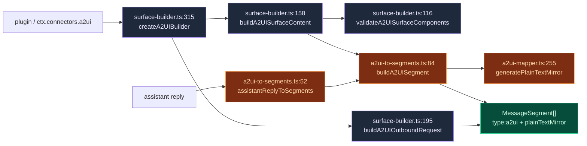
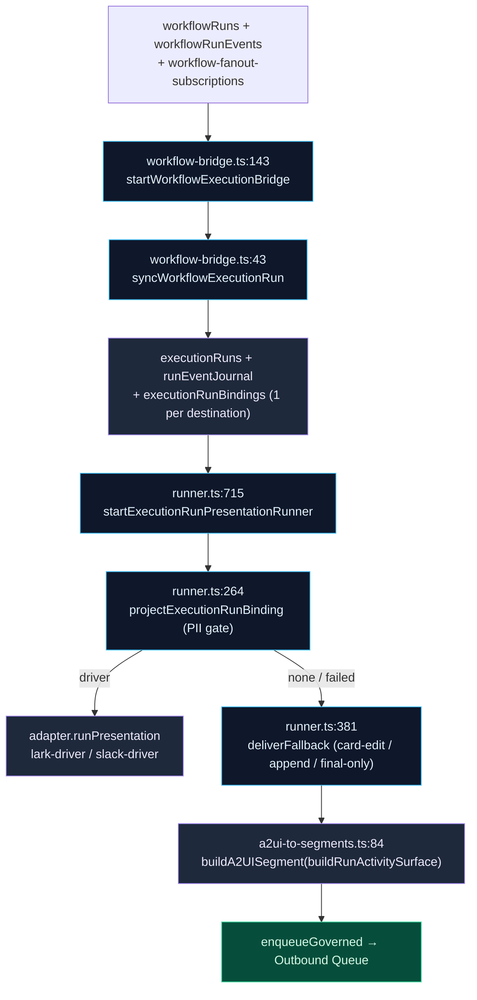

# IM 连接器桥接

<Status variant="experimental" />

<TLDR>
  A2UI 输出的是声明式 React 组件树，但一个 IM 平台（Lark / Telegram / Discord）只能渲染自己的富内容原语 —— 一张卡片、一行按钮、一张图片、一个链接。本桥接层就是两个世界之间「有损但忠实」的适配层。**出站**方向：用面向插件的工厂构建表面（`surface-builder.ts`），把助手回复转成带 `plainTextMirror` 兜底的出站 `MessageSegment[]`（`a2ui-to-segments.ts`），并在系统提示里告知模型目标适配器的能力矩阵能承载哪些 A2UI 种类（`capability-evaluator.ts`）。**入站**方向：把平台富内容投射成给 Inbox 渲染器用的 `InboundA2UIBlock`（`projectInboundToA2UI` → 各平台 `inbound-to-a2ui.ts`），并把按钮点击路由到 AI 摘要轮次或某个工作流控制处理器。本桥接层的**工作流投射**只有审批卡片（`workflow-to-a2ui.ts`）；实时进度与终态卡片来自持久化的执行运行流水线 —— `lib/execution/workflow-bridge.ts` + `lib/connectors/run-presentation/runner.ts` —— 而非桥接层本地的循环。
</TLDR>

<StatGrid>
  <Stat label="桥接模块" value="4 + 3" hint="lib/connectors/a2ui-bridge/ (4) + lib/a2ui/ handlers (3)" />
  <Stat label="能力等级" value="4" hint="native · simulated · fallback · unsupported" />
  <Stat label="表面工厂" value="14" hint="a2uiComponent in surface-builder.ts:218" />
  <Stat label="实时运行卡片" value="run-presentation" hint="lib/connectors/run-presentation/runner.ts，2 s 合并" />
</StatGrid>

## 为什么需要 IM 桥接

A2UI 的核心前提是模型能输出**真正的 UI**。这在 webview 里行得通，因为目录会把组件树直接渲染进 React DOM。但 IM 平台没有这样的渲染器 —— Lark 想要交互式卡片 schema，Telegram 想要内联键盘，Discord 想要 embed。它们都无法执行任意的 `component: "Select"` 节点。

因此本桥接层是一个**有损、能力感知的投射层**。它从不假设表面会原样渲染。每条路径都携带 `plainTextMirror`，使最坏情况仍是一条可读的文本消息；适配器声明的能力矩阵会被渲染进模型自己的系统提示，这样它就能事先被告知 —— 哪些内容能在这趟旅程中幸存、哪些不能。

<Files>
  - lib/connectors/a2ui-bridge/surface-builder.ts — 面向插件的纯表面构建器（支撑 `ctx.connectors.a2ui`）
  - lib/connectors/a2ui-bridge/capability-evaluator.ts — 适配器能力矩阵 → 系统提示段落
  - lib/connectors/a2ui-bridge/a2ui-to-segments.ts — 助手回复 → 出站 `MessageSegment[]`
  - lib/connectors/adapters/_shared/inbound-a2ui-dispatch.ts — `projectInboundToA2UI`：入站平台负载 → `InboundA2UIBlock`
  - lib/connectors/a2ui-bridge/workflow-to-a2ui.ts — 纯函数审批表面构建器（`buildApprovalSurface`）
  - lib/connectors/run-presentation/runner.ts — 实时运行卡片（不属于桥接层；在平台连接器文档中说明）
  - lib/a2ui/connector-callback-handler.ts — 通用回调 → AI 摘要轮次
  - lib/a2ui/workflow-approval-handler.ts — `wf_approve` / `wf_cancel` 派发器
  - lib/a2ui/workflow-fanout-handler.ts — `wf_fanout_approve` / `wf_fanout_cancel` 派发器
</Files>

## 出站：表面 → 分片

### 构建表面（`surface-builder.ts`）

`createA2UIBuilder`（`surface-builder.ts:315`）是 `ctx.connectors.a2ui` 背后那个纯净、未受门控的构建器 —— 插件用 14 个工厂组装出一个扁平的组件列表，构建器负责校验它们并按 id 键入一个规范的 `A2UISegmentContent`。工厂集 `a2uiComponent`（`surface-builder.ts:218`）覆盖 `text`、`button`、`card`、`row`、`column`、`alert`、`image`、`link`、`select`、`textField`、`list`、`divider`、`badge` —— 每个都返回 `{ id, component: "<Kind>", … }`。

| 步骤 | 函数（`surface-builder.ts`） | 行为 |
| --- | --- | --- |
| 校验引用 | `validateA2UISurfaceComponents` (116) | 空 → throw (120)；缺 `id` → throw (126)；重复 `id` → throw (129)；解析根 (135)；根缺失 → throw (136)；悬空引用 → throw (142) |
| 收集引用 | `collectChildRefs` (87) | 收集 `children` / `footer` / `actions` (90) + 嵌套 `tabs` / `items[].children` (97) |
| 按 id 键入 | `buildA2UISurfaceContent` (158) | 校验 (159) → 构建 `Record<id, component>` (162-164) → 组装 `{components, dataModel:{}, rootId}` (166) + 可选 `surfaceType` / `catalogId` / `widget` / `title` (171-174) |
| 包成分片 | `buildA2UIMessageSegment` (182) | `buildA2UISurfaceContent` → `buildA2UISegment`（`a2ui-to-segments:84`） |
| 一次性请求 | `buildA2UIOutboundRequest` (195) | 包成 `OutboundRequest`，在有 `input.text` 时追加尾部 `{type:"markdown"}` (199-201)，通过 `newIdempotencyKey` 铸造 `surfaceId` + `idempotencyKey` (205) |

根解析（`surface-builder.ts:135`）：显式 `rootId` → 若存在该 id 的组件则取 `"root"` → `components[0].id`。`A2USurfaceBuildError` 类（`surface-builder.ts:48`）是所有校验抛错的唯一类型化失败。

### 回复 → 分片 + 文本镜像（`a2ui-to-segments.ts`）

一旦助手回复携带了 A2UI 表面，`assistantReplyToSegments`（`a2ui-to-segments.ts:52`）会把它压平成有序的出站分片：

- 顺序 = `a2uiSurfaceOrder ?? Object.keys(surfaces)`（`:55`）；每个表面 → `buildA2UISegment`（`:60`）。
- 非空尾部 `text` → `{type:"markdown", md:text}`（`:67`）。
- 文本为空**且**无表面 → `{type:"text", text:""}`（`:72`），使回复永不静默。

`buildA2UISegment`（`a2ui-to-segments.ts:84`）是承重原语：它从 `widget.fallbackText`（若为字符串则 trim —— `:88-89`）派生 `plainTextMirror`，否则用 `generatePlainTextMirror(content)`（`:91`，mapper 在 `a2ui-mapper.ts:255`），随后返回 `{type:"a2ui", surfaceId, content, plainTextMirror}`（`:92-97`）。这个镜像就是能力贫弱的适配器最终展示的内容。

## 能力降级阶梯

`capability-evaluator.ts` 让模型知道对某个适配器哪些东西可以依赖。四个等级构成一条最坏情况阶梯：**`native` → `simulated` → `fallback` → `unsupported`**（每一级都严格劣于前一级；`A2UIComponentSupport` 在 `capability.ts:150`）。

本模块里刻意**不再**保留逐表面的评估器 —— 适配器在渲染时于自己的出站映射器内按自身 `A2UICapabilityMatrix` 分支，`plainTextMirror` 为映射器画不出来的一切兜底。（早前的 `evaluateSurfaceAgainstCapability` / `CapabilityEvaluation` 遍历器没有运行时消费者，已于 2026-08-18 移除。）留下的是提示词侧那一半：`buildCapabilityPromptSection(platform, matrix, skillCapabilities?)`（`capability-evaluator.ts:30`）：

1. 通过 `componentKindsByLevel(matrix, level)`（`:35-38`，辅助函数在 `capability.ts:177`）派生各等级的 kind 列表 —— 对 `A2UI_COMPONENT_KINDS` 遍历一遍，因此未知 kind 永远不会出现。
2. 每个非空等级输出一条 bullet（`:43-58`）：原生渲染 / 仅经多步 UX 可用（不要假设同回合回复）/ 降级为纯文本 / 不支持 —— 不要发出。
3. 从 `skillCapabilities` 追加一条可选的内置技能 bullet（`:59-67`）。

这段文字由 `lib/claude/build-options.ts:resolveSendOptions`（`:1929-1935`）消费 —— 就是模型在撰写前看到的、按频道定制的 A2UI 能力提示。

| 等级 | 含义 | 对模型的指引 |
| --- | --- | --- |
| `native` | 适配器直接渲染该 kind | 自由使用 |
| `simulated` | 用另一种原语近似 | 可接受；预期有轻微保真度损失 |
| `fallback` | 只有 `plainTextMirror` 幸存 | 优先文本友好的内容 |
| `unsupported` | 硬底 —— 丢弃或重新设计 | 该频道避免使用 |

`A2UICapabilityMatrix`（`capability.ts:152`）由 `buildA2UICapabilityMatrix`（`capability.ts:159`）从每个适配器的 `../<platform>/capability.ts` 生成；`A2UI_COMPONENT_KINDS` 是两侧共同遍历的封闭组件字符串集合。

## 入站：平台负载 → InboundA2UIBlock + 回调

### 把平台负载投射成 `InboundA2UIBlock`（`inbound-a2ui-dispatch.ts`）

> 本文档的早期版本描述过一个 `segmentsToA2UI`（`segments-to-a2ui.ts`）模块，声称它把入站分片折叠成单个 A2UI `Column` 表面。该模块已**作为死代码移除** —— 它零调用者。真实的入站投影**不**复用出站的 A2UI 表面形状，而是为 Inbox 渲染器产出一棵专用的 `InboundA2UIBlock` 树。

`projectInboundToA2UI`（`inbound-a2ui-dispatch.ts:26`）是总线侧的派发器。总线对每条入站 `create` 事件调用它一次，传入平台 kind 与原始平台负载；它 switch 到匹配的各平台 mapper（`../<platform>/inbound-to-a2ui.ts`，`slack`、`lark`、`discord`、`telegram`、`onebot`、`wecom`、`wechat-personal`、`wechat-oa`、`matrix`、`qq-official`、`dingtalk` 各一个），返回一个 `InboundA2UIBlock`（`inbound-a2ui-types.ts:50`）或 `null`。mapper 是**尽力而为**的：nullish 负载、未映射的平台，或抛异常的 mapper，都会归结为 `null`（`:40`、`:66`、`:68-76`），总线随即回退到纯文本渲染。

产出的 `InboundA2UIBlock` 会被持久化到 `StoredMessage.metadata.inboundA2UI`，并由 `components/chat/message-parts/inbound-a2ui-renderer.tsx` 遍历，使 Inbox 展示平台原生的富结构。该 block 是完整 `A2UISurface` 的一个刻意收窄的子集 —— 一个 `source` 芯片、一个可选 `title`，以及一个 `InboundA2UINode` 数组构成的 `body`：

| 节点 kind（`inbound-a2ui-types.ts`） | 渲染为 |
| --- | --- |
| `text`（emphasis `muted`/`bold`/`italic`/`code`） | 行内文本 |
| `heading`（level 1–3） | 标题 |
| `image`（`url/alt/width/height`） | 图片 |
| `link`（`href/label`） | 超链接 |
| `button`（`url` 或 `actionId`、`style`） | 动作按钮 |
| `divider` | 分隔线 |
| `row` / `column` / `list`（`ordered?`） | 布局容器 |
| `card`（`title/subtitle/children`） | 卡片 |
| `alert`（tone `info`/`warning`/`success`/`error`） | 提示框 |
| `mention` / `reply_context` / `raw_json` | 提及 · 回复预览 · 原始逃生舱 |

mapper 无法在 `body` 里表达的内容会塞进 `raw`，并藏在 `
` 后面供调试。注意这条入站路径**不是**出站 `assistantReplyToSegments`（`a2ui-to-segments.ts`）的逆操作 —— 出站把助手表面扁平化为可传输的 `MessageSegment[]`，入站则把原始平台负载提升为紧凑的 `InboundA2UIBlock`；二者是各自独立的投影，并非一对互逆。

### 按钮点击 → AI 摘要轮次（`connector-callback-handler.ts`）

`defaultConnectorCallbackHandler`（`connector-callback-handler.ts:35`）是通用回调路径 —— 用户在渲染后的表面里点了一个按钮，桥接层把它转成一次新的 AI 轮次：

1. **历史。** `appendA2UIEventHistory(event)`（`:40`）写入一行 id `cb:<triggerId>`、type `"userAction"`、`payload.source "connector"`（`:64-80`），随后按 timestamp 容量驱逐最旧的行（`EVENT_HISTORY_CAP = 1000` 在 `:28`；驱逐在 `:83-90`，通过 `orderBy("timestamp").limit().primaryKeys()` + `bulkDelete`）。
2. **摘要。** `conversationKey = boundConversationKey ?? event.conversationKey`；`null` → return（`:43-44`）。否则 `synthesizeCallbackPrompt`（`:45`）构建 `[A2UI <platform> callback] surface=… component=… action=… value=… payload=<json>`（`:99-108`），`runConnectorDigestTurn` 以 `sourceTaskId cb:<triggerId>` 运行（`:46-55`，函数在 `lib/connectors/scheduled-outbound`）。

<Callout type="warn">
  **总线路由分流。** `lib/connectors/bus.ts:dispatchConnectorCallback` 是唯一的入站入口。它**并不**把一切都送给通用摘要处理器 —— 它对 `wf_approve` / `wf_cancel` 做特例 → `workflow-approval-handler`，对 `wf_fanout_approve` / `wf_fanout_cancel` → `workflow-fanout-handler`。其余一切（含普通按钮点击）落入 `defaultConnectorCallbackHandler` 的摘要轮次。
</Callout>

## 工作流投射

实时工作流运行必须在 IM 会话内呈现。本桥接层只拥有**审批握手**：`workflow-to-a2ui.ts` 持有纯函数 `buildApprovalSurface` 构建器。实时进度与终态卡片**不再**在这里构建 —— 它们来自下文描述的持久化执行运行流水线。

### 纯构建器（`workflow-to-a2ui.ts`）

| 构建器（`workflow-to-a2ui.ts`） | 产出 |
| --- | --- |
| `buildApprovalSurface` (48) | `Card` + `Row` + 2 个 `Button`；镜像追加 `回复 1 同意 / 2 取消`。Action id = `WF_APPROVE_PREFIX`（`"wfapp:"`, 25）+ `bindingId` / `WF_CANCEL_PREFIX`（`"wfcan:"`, 26）+ `bindingId`（49-50）；按钮 value 携带 action id；`surfaceType: "inline"` |

输入为 `ApprovalSurfaceInput { bindingId, workflowName, summary? }`（28）；该表面由 `wf_run_workflow_by_name` 插件工具作为工具结果的一部分发出，Dexie I/O + `recordCallbackBinding` 由调用方负责。早前的 `buildProgressSegment` / `buildCumulativeStatusSurface` / `buildFinalSurface` 构建器与 `buildWorkflowRunDeepLink` 深链已于 2026-08-18 随 `workflow-progress-runner` 模块一并退役。

<Callout type="info">
  这个构建器里仍然**没有任何时间间隔常量** —— 它是纯函数。实时卡片的节奏由运行呈现 runner 掌管（`COALESCE_MS = 2 s`，`run.started` / `step.started` / 终态 / interrupt 事件立即执行，5 s 耗时心跳）。
</Callout>

### 实时卡片：执行桥 + 运行呈现 runner

连接器引导（`install-connector-runtime.ts:738-739`）启动的两个 runner 取代了旧的桥接层本地扇出循环：

- `startWorkflowExecutionBridge`（`lib/execution/workflow-bridge.ts:143`）用 `liveQuery` 监视 `workflowRuns`（+ `workflowRunEvents` + `listForWorkflow` 扇出订阅），并对每个运行由 `syncWorkflowExecutionRun`（`:43`）创建一条持久的 `executionRuns` 行（`execution:workflow:<runId>`），记录 `plan.created` / `run.started` / 映射后的步骤事件，并按目的地各写一条 `executionRunBindings` 行 —— 触发方的 `triggeredBy.{adapterId, conversationKey}` **加上每个已启用的扇出订阅**（`:84-129`）。
- `startExecutionRunPresentationRunner`（`lib/connectors/run-presentation/runner.ts:715`）用 `liveQuery` 监视 `active` / `degraded` 绑定，在 `latestSnapshot.revision > lastProjectedRevision` 时调用 `projectExecutionRunBinding`（`:264`）：PII 门（`projectImSafeSnapshot`，`:179`）→ 原生 `adapter.runPresentation` 驱动（`lark-driver.ts:320` / `slack-driver.ts:51`）对同一张卡片 `open` / `update` / `finish` → 失败或无驱动时 `deliverFallback`（`:381`），由 `resolveCapabilityAwareFallbackDeliveryMode`（`:223`）选择 `card-edit` / `append` / `final-only`，用 `buildA2UISegment` 包裹 `buildRunActivitySurface`，经投递网关以 `source: "workflow"` 入队。

完整机制 —— 合并、游标提交、降级审计、原生 kill switch —— 见[平台连接器 › AI 循环与 A2UI 桥](../platform-connectors/ai-and-a2ui)。

## 工作流控制处理器

当用户点击审批或订阅按钮时，两个总线侧处理器闭合循环。两者都读取自己的 payload、要求 IM 来源、push 单条文本确认，并删除同胞绑定（这样按钮无法被点击两次）。

### 同意 / 取消（`workflow-approval-handler.ts`）

`handleWorkflowApprovalCallback`（`workflow-approval-handler.ts:84`）：

- 畸形 / 缺 key → 删除同胞 + 中止（`:88-99`）；`readPayload`（`:40`）要求 `triggeredFrom.source === "im"`（`:43`）。
- **取消**（`:110`）→ push `⊘…已取消`，幂等 `wfcan:<surfaceId>`（`:116`）+ 删除同胞。
- **同意**（`:122`）→ `startWorkflowFromIM({workflowId, runParams, triggeredFrom})`（`lib/workflow/runtime/start-from-im`）。`!ok` → push `✗ 无法启动`，幂等 `wferr:`（`:129-139`）；`ok` → push `✅ … 已启动 (runId=…)`，幂等 `wfok:`（`:142-148`）+ 删除。

`deleteSiblingBindings`（`:53`）按共享 `surfaceId` 同时删除 Approve 和 Cancel；`pushOutboundText`（`:65`）以 `source "workflow"` 入队单条 `{type:"text"}` 出站。

### 扇出订阅 / 取消（`workflow-fanout-handler.ts`）

`handleWorkflowFanoutCallback`（`workflow-fanout-handler.ts:91`）：

- 畸形 / 缺失 → 删除 + 中止（`:94-104`）；`readPayload`（`:38`）校验 `target` 形状（`:42-48`），`createdBy` 默认 `"claude-tool"`（`:54`）。
- **取消**（`:115`）→ push `⊘ 已取消订阅`，幂等 `wf-fanout-cancel:`（`:121`）+ 删除。
- **同意**（`:127`）→ `createFanoutSubscription({workflowId, adapterId: target.adapterId, conversationKey: target.conversationKey, createdBy})` + push `✅ 已订阅`，幂等 `wf-fanout-ok:`（`:133-139`）+ 删除。

`createFanoutSubscription` 写入的是执行桥经 `listForWorkflow`（`lib/execution/workflow-bridge.ts:152`）读取的**同一张** `workflow-fanout-subscriptions` 表 —— 每个已启用订阅都会成为该运行额外的一条 `executionRunBindings` 行，这正是让未来某次运行的卡片扇出到本频道的原因。权限在**上游**工具层强制：target 被钉死为当前 IM 会话，因此处理器从不接受跨频道 target。

## 下一步

<Cards>
  <Card title="A2UI System" href="./index" description="本桥接所投射的协议、解析器、目录、渲染器与 store" />
  <Card title="Platform connectors" href="../platform-connectors" description="桥接接入的适配器、总线与出站队列" />
  <Card title="Visual workflows" href="../visual-workflows" description="执行桥镜像为持久执行运行的工作流运行时与运行事件流" />
</Cards>
