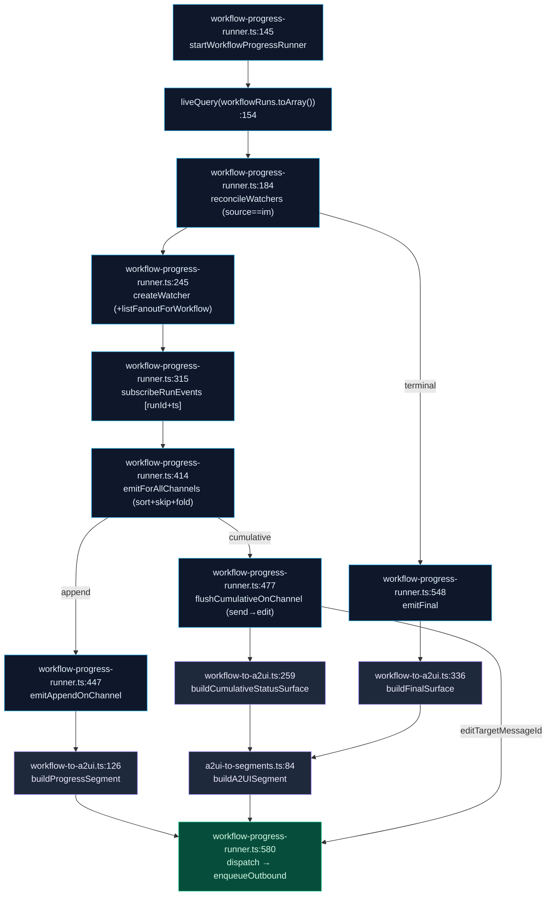

# IM 连接器桥接

<Status variant="experimental" />

<TLDR>
  A2UI 输出的是声明式 React 组件树，但一个 IM 平台（Lark / Telegram / Discord）只能渲染自己的富内容原语 —— 一张卡片、一行按钮、一张图片、一个链接。本桥接层就是两个世界之间「有损但忠实」的适配层。**出站**方向：用面向插件的工厂构建表面（`surface-builder.ts`），把助手回复转成带 `plainTextMirror` 兜底的出站 `MessageSegment[]`（`a2ui-to-segments.ts`），并按目标适配器的能力矩阵给每个表面评分（`capability-evaluator.ts`）。**入站**方向：把平台分片折叠回单个 A2UI `Column` 表面（`segments-to-a2ui.ts`），并把按钮点击路由到 AI 摘要轮次或某个工作流控制处理器。**工作流投射**：把实时运行渲染为审批卡片、逐步进度行、就地编辑的累积状态卡片，以及终态摘要 —— 由一个事件驱动的后台 runner（`workflow-progress-runner.ts`）扇出到每个订阅频道，**无轮询计时器**。
</TLDR>

<StatGrid>
  <Stat label="桥接模块" value="6 + 3" hint="lib/connectors/a2ui-bridge/ (6) + lib/a2ui/ handlers (3)" />
  <Stat label="能力等级" value="4" hint="native · simulated · fallback · unsupported" />
  <Stat label="表面工厂" value="14" hint="a2uiComponent in surface-builder.ts:218" />
  <Stat label="Runner 节奏" value="event-driven" hint="liveQuery 扇出，无计时器" />
</StatGrid>

## 为什么需要 IM 桥接

A2UI 的核心前提是模型能输出**真正的 UI**。这在 webview 里行得通，因为目录会把组件树直接渲染进 React DOM。但 IM 平台没有这样的渲染器 —— Lark 想要交互式卡片 schema，Telegram 想要内联键盘，Discord 想要 embed。它们都无法执行任意的 `component: "Select"` 节点。

因此本桥接层是一个**有损、能力感知的投射层**。它从不假设表面会原样渲染。每条路径都携带 `plainTextMirror`，使最坏情况仍是一条可读的文本消息；每个出站表面在发送前都会先对适配器声明的能力评分，这样模型就能在自己的系统提示里被告知 —— 哪些内容能在这趟旅程中幸存、哪些不能。

<Files>
  - lib/connectors/a2ui-bridge/surface-builder.ts — 面向插件的纯表面构建器（支撑 `ctx.connectors.a2ui`）
  - lib/connectors/a2ui-bridge/capability-evaluator.ts — 表面 vs 适配器能力矩阵
  - lib/connectors/a2ui-bridge/a2ui-to-segments.ts — 助手回复 → 出站 `MessageSegment[]`
  - lib/connectors/a2ui-bridge/segments-to-a2ui.ts — 入站平台分片 → 单个 A2UI `Column`
  - lib/connectors/a2ui-bridge/workflow-to-a2ui.ts — 纯函数 工作流 → A2UI 构建器
  - lib/connectors/a2ui-bridge/workflow-progress-runner.ts — 后台扇出循环
  - lib/a2ui/connector-callback-handler.ts — 通用回调 → AI 摘要轮次
  - lib/a2ui/workflow-approval-handler.ts — `wf_approve` / `wf_cancel` 派发器
  - lib/a2ui/workflow-fanout-handler.ts — `wf_fanout_approve` / `wf_fanout_cancel` 派发器
</Files>

## 出站：表面 → 分片

### 构建表面（`surface-builder.ts`）

`createA2UIBuilder`（`surface-builder.ts:315`）是 `ctx.connectors.a2ui` 背后那个纯净、未受门控的构建器 —— 插件用 14 个工厂组装出一个扁平的组件列表，构建器负责校验它们并按 id 键入一个规范的 `A2UISegmentContent`。工厂集 `a2uiComponent`（`surface-builder.ts:218`）覆盖 `text`、`button`、`card`、`row`、`column`、`alert`、`image`、`link`、`select`、`textField`、`list`、`divider`、`badge` —— 每个都返回 `{ id, component: "<Kind>", … }`。

| 步骤 | 函数（`surface-builder.ts`） | 行为 |
| --- | --- | --- |
| 校验引用 | `validateA2UISurfaceComponents` (116) | 空 → throw (120)；缺 `id` → throw (126)；重复 `id` → throw (129)；解析根 (135)；根缺失 → throw (136)；悬空引用 → throw (142) |
| 收集引用 | `collectChildRefs` (87) | 收集 `children` / `footer` / `actions` (90) + 嵌套 `tabs` / `items[].children` (97) |
| 按 id 键入 | `buildA2UISurfaceContent` (158) | 校验 (159) → 构建 `Record<id, component>` (162-164) → 组装 `{components, dataModel:{}, rootId}` (166) + 可选 `surfaceType` / `catalogId` / `widget` / `title` (171-174) |
| 包成分片 | `buildA2UIMessageSegment` (182) | `buildA2UISurfaceContent` → `buildA2UISegment`（`a2ui-to-segments:84`） |
| 一次性请求 | `buildA2UIOutboundRequest` (195) | 包成 `OutboundRequest`，在有 `input.text` 时追加尾部 `{type:"markdown"}` (199-201)，通过 `newIdempotencyKey` 铸造 `surfaceId` + `idempotencyKey` (205) |

根解析（`surface-builder.ts:135`）：显式 `rootId` → 若存在该 id 的组件则取 `"root"` → `components[0].id`。`A2USurfaceBuildError` 类（`surface-builder.ts:48`）是所有校验抛错的唯一类型化失败。

### 回复 → 分片 + 文本镜像（`a2ui-to-segments.ts`）

一旦助手回复携带了 A2UI 表面，`assistantReplyToSegments`（`a2ui-to-segments.ts:52`）会把它压平成有序的出站分片：

- 顺序 = `a2uiSurfaceOrder ?? Object.keys(surfaces)`（`:55`）；每个表面 → `buildA2UISegment`（`:60`）。
- 非空尾部 `text` → `{type:"markdown", md:text}`（`:67`）。
- 文本为空**且**无表面 → `{type:"text", text:""}`（`:72`），使回复永不静默。

`buildA2UISegment`（`a2ui-to-segments.ts:84`）是承重原语：它从 `widget.fallbackText`（若为字符串则 trim —— `:88-89`）派生 `plainTextMirror`，否则用 `generatePlainTextMirror(content)`（`:91`，mapper 在 `a2ui-mapper.ts:257`），随后返回 `{type:"a2ui", surfaceId, content, plainTextMirror}`（`:92-97`）。这个镜像就是能力贫弱的适配器最终展示的内容。

## 能力降级阶梯

`capability-evaluator.ts` 把一个表面对照某个适配器评分，让模型知道哪些东西可以依赖。四个等级构成一条最坏情况阶梯：**`native` → `simulated` → `fallback` → `unsupported`**（每一级都严格劣于前一级；`A2UIComponentSupport` 在 `capability.ts:124`）。

`evaluateSurfaceAgainstCapability`（`capability-evaluator.ts:55`）：

1. 通过 `walkA2UISurface(surface, node => presentKinds.add(node.component))` 收集出现的 kind（`:60-62`，walker 在 `a2ui-mapper.ts:50`）。
2. 未知 kind → `continue` / 跳过（`:71-74`）。
3. 已知 kind → `matrix[kind] ?? "fallback"`（`:76`）。
4. 归桶进 `CapabilityEvaluation`（`:28`）并棘轮推进 `worstCase`：`native` (77)，`simulated` 从 native 上抬 (79-81)，`fallback` 从 native/simulated 上抬 (82-84)，`unsupported` 设硬底 (85-87)。

`buildCapabilityPromptSection`（`capability-evaluator.ts:106`）随后渲染一段系统提示文字：它通过 `componentKindsByLevel`（`:111-114`）派生各等级的 kind 列表，每个等级输出一条 bullet（`:119-134`），外加一条 skill bullet（`:135-142`）。这段文字由 `lib/claude/build-options.ts:resolveSendOptions`（头部 `:6-16`）消费 —— 就是模型在撰写前看到的、按频道定制的 A2UI 能力提示。

| 等级 | 含义 | 对模型的指引 |
| --- | --- | --- |
| `native` | 适配器直接渲染该 kind | 自由使用 |
| `simulated` | 用另一种原语近似 | 可接受；预期有轻微保真度损失 |
| `fallback` | 只有 `plainTextMirror` 幸存 | 优先文本友好的内容 |
| `unsupported` | 硬底 —— 丢弃或重新设计 | 该频道避免使用 |

`A2UICapabilityMatrix`（`capability.ts:126`）由 `buildA2UICapabilityMatrix`（`capability.ts:133`）生成；`isKnownKind`（`capability-evaluator.ts:147`）与 `A2UI_COMPONENT_KINDS` 防范无法识别的组件字符串。

## 入站：分片 → 表面 + 回调

### 把平台分片折叠成一个 Column（`segments-to-a2ui.ts`）

`segmentsToA2UI`（`segments-to-a2ui.ts:48`）把一条入站平台消息折回成单个 A2UI `Column` 表面。每种分片 kind 通过 `:67-144` 的 switch 映射到一个组件：

| 分片 kind | → 组件（id 前缀） | 备注（`segments-to-a2ui.ts`） |
| --- | --- | --- |
| `text` (68) | `Text`（`text-`） | 同时 push 进 `textParts` |
| `markdown` (75) | `Text`（`text-`） | |
| `image` (82) | `Image` `src/alt/width/height`（`img-`） | |
| `card` (96) | `Card` `title=card.kind`（`card-`） | |
| `video` / `voice` / `file` (112) | `Link`，标签 `[file]` / `[voice]` / `[video]`（`link-`） | |
| `location` (127) | `Text` 📍 标签（`text-`） | glyph 在 `:130` |
| `a2ui` (135) | **原样**返回 | 已是表面 |
| 默认 (142) | 折叠进文本 | `mention` / `emoji` / `code` / `reply` / `poll` |

`nextSurfaceId`（`segments-to-a2ui.ts:27`）铸造 `inbound:<platform>:<adapterId>:<messageId>:<n>`（`:29`，基于模块级 `surfaceCounter`，在 `:25`）。空输入 → `null`（`:54`）；无可映射子项 → `null`（`:147`）。根 `Column` 携带 `children: childIds`，id `"root"`（`:149-150`）；内容为 `{components, dataModel:{}, rootId, surfaceType:"inline"}`（`:152-157`），且 `plainTextMirror = textParts.join("\n")`（`:163`）。

### 按钮点击 → AI 摘要轮次（`connector-callback-handler.ts`）

`defaultConnectorCallbackHandler`（`connector-callback-handler.ts:35`）是通用回调路径 —— 用户在渲染后的表面里点了一个按钮，桥接层把它转成一次新的 AI 轮次：

1. **历史。** `appendA2UIEventHistory(event)`（`:40`）写入一行 id `cb:<triggerId>`、type `"userAction"`、`payload.source "connector"`（`:64-80`），随后按 timestamp 容量驱逐最旧的行（`EVENT_HISTORY_CAP = 1000` 在 `:28`；驱逐在 `:83-90`，通过 `orderBy("timestamp").limit().primaryKeys()` + `bulkDelete`）。
2. **摘要。** `conversationKey = boundConversationKey ?? event.conversationKey`；`null` → return（`:43-44`）。否则 `synthesizeCallbackPrompt`（`:45`）构建 `[A2UI <platform> callback] surface=… component=… action=… value=… payload=<json>`（`:99-108`），`runConnectorDigestTurn` 以 `sourceTaskId cb:<triggerId>` 运行（`:46-55`，函数在 `lib/connectors/scheduled-outbound`）。

<Callout type="warn">
  **总线路由分流。** `lib/connectors/bus.ts:dispatchConnectorCallback` 是唯一的入站入口。它**并不**把一切都送给通用摘要处理器 —— 它对 `wf_approve` / `wf_cancel` 做特例 → `workflow-approval-handler`，对 `wf_fanout_approve` / `wf_fanout_cancel` → `workflow-fanout-handler`。其余一切（含普通按钮点击）落入 `defaultConnectorCallbackHandler` 的摘要轮次。
</Callout>

## 工作流投射

实时工作流运行必须在 IM 会话内呈现。`workflow-to-a2ui.ts` 持有**纯**构建器；`workflow-progress-runner.ts` 是**后台循环**，决定何时、向哪里发出它们。

### 纯构建器（`workflow-to-a2ui.ts`）

| 构建器（`workflow-to-a2ui.ts`） | 产出 |
| --- | --- |
| `buildApprovalSurface` (63) | `Card` + `Row` + 2 个 `Button`；镜像追加 `回复 1 同意 / 2 取消`。Action id = `WF_APPROVE_PREFIX`（`"wfapp:"`, 40）+ `bindingId` / `WF_CANCEL_PREFIX`（`"wfcan:"`, 41）+ `bindingId`（64-65）；按钮 value 携带 action id（81 / 87） |
| `buildProgressSegment` (126) | 每个步骤事件一行 markdown（非步骤事件返回 `null`）：started ▶…开始 (136)；completed ✓…完成（dur）(137-145)；failed ✗…失败：msg (147-153)；skipped ⊘…跳过 (155) |
| `buildCumulativeStatusSurface` (259) | 一张就地编辑的 `Card`：表头按 `state.status` (261-276)，逐步 `Text` `step_<i>` (288-293)，可选 `Divider` + 正文 (298-302)，尾部 `openLink` `Link` (303) |
| `buildFinalSurface` (336) | 终态摘要 `Card`：状态图标/文本 (339-347)，正文 = error（failed）/ output（succeeded）(350-355)，深链 (357) |

支撑类型：`CumulativeStepStatus`（182，`running|succeeded|failed|skipped`）、`CumulativeStepEntry`（184）、`CumulativeStatusState`（196）；辅助函数 `statusIcon`（220，`▶✓✗⊘`）、`statusLine`（233）、`truncate`（392）、`pickErrorMessage`（397）、`stringifyOutput`（404）、`formatDuration`（414）。深链 `buildWorkflowRunDeepLink`（173）→ `cognia://workflow-run/<wf>/<run>`。上限：`OUTPUT_SUMMARY_MAX = 500`（37）、`ERROR_MESSAGE_MAX = 280`（38）、`CUMULATIVE_TERMINAL_BODY_MAX = 500`（218）；每个表面都是 `surfaceType: "inline"`。

<Callout type="info">
  这些构建器里**没有任何时间间隔常量**。节奏完全由事件驱动 —— 每个频道每来一批新工作流事件就发出一次。runner 从不靠计时器唤醒。
</Callout>

### 扇出 runner（`workflow-progress-runner.ts`）

`startWorkflowProgressRunner`（`workflow-progress-runner.ts:145`）订阅一个 Dexie `liveQuery(workflowRuns.toArray())`（`:154`）并协调每个运行的 watcher。它只跟踪 `triggeredBy.source === "im"` 且携带 `adapterId` + `conversationKey` 的运行（`reconcileWatchers:192-195`）；watcher 通过 `creatingWatchers` promise 去重只创建一次（`:203-219`），在终态状态下经 `emitFinal` 后 `delete`（`:225-233`），运行消失时被 GC（`:236-242`）。`ACTIVE_STATUSES`（63）与 `TERMINAL_STATUSES`（64）把控生命周期。

每个 watcher（`createWatcher:245`）建立自己的频道集，并通过 `subscribeRunEvents`（`:315`）订阅每个运行的事件 —— 一个对 `workflowRunEvents.where("[runId+ts]")` 的 `liveQuery`（`:316-321`），喂给 `emitForAllChannels`（`:414`）。该路由器按 `ts` 排序（`:419`），跳过 `ts <= lastEmittedTs`（`:425`），把每个事件折叠进状态（`foldEventIntoState:337`，`:427`），推进 `lastEmittedTs`（`:431`），然后按频道派发：累积模式 → `flushCumulativeOnChannel`（`:437`），追加模式 → `emitAppendOnChannel`（`:440`）。

**两种发出模式：**

- **追加**（`emitAppendOnChannel:447`）—— 每个事件一个分片：`buildProgressSegment`（`workflow-to-a2ui:126`）→ `dispatch`（`:580`）。幂等键 `progress:…:<ev.id>`（`:467`）。
- **累积**（`flushCumulativeOnChannel:477`）—— 单张卡片**先发后就地编辑**，通过 `channel.flushing` / `flushQueued` 重入串行化（`:482-485, 521-527`）。首个事件 = 入口发送，缓存 `entryJobId`（`:493-503`）；后续事件从 `outboundQueue.get(entryJobId)` 解析 `platformMessageId`（`:506-509`），带 `editTargetMessageId` 派发（`:511-519`）。构建链：`buildStateSnapshot`（395）→ `buildCumulativeStatusSurface`（`workflow-to-a2ui:259`）→ `buildA2UISegment`（`a2ui-to-segments:84`）→ `dispatch`。表面模板：`wf-status:<run>:<chan>`（`:490`）、入口幂等 `wf-status-entry:…`（`:498`）、更新 `wf-status:…:<lastEmittedTs>`（`:515`）。

`emitFinal`（`:548`）：累积 → 抬高 `lastEmittedTs` 后再 flush（`:559-560`）；追加 → `buildFinalSurface` → `buildA2UISegment` → `dispatch`（`:562-573`），幂等 `wf-final:…`（`:563`）。`dispatch`（`:580`）构建一个 `OutboundRequest` 并调用 `enqueueOutbound`（`lib/db/outbound-jobs`），在设置时带 `editTargetMessageId`（`:603`）、`source: "workflow"` + `sourceWorkflow {workflowId, runId, nodeId}`（`:605-610`）。`defaultSupportsEdit`（136）探测 `getBus().getAdapter(adapterId).edit` 来选模式；频道扇出在 `createWatcher`（`:291`）中读取 `listFanoutForWorkflow`（`lib/db/workflow-fanout-subscriptions`）。

## 工作流控制处理器

当用户点击审批或订阅按钮时，两个总线侧处理器闭合循环。两者都读取自己的 payload、要求 IM 来源、push 单条文本确认，并删除同胞绑定（这样按钮无法被点击两次）。

### 同意 / 取消（`workflow-approval-handler.ts`）

`handleWorkflowApprovalCallback`（`workflow-approval-handler.ts:84`）：

- 畸形 / 缺 key → 删除同胞 + 中止（`:88-99`）；`readPayload`（`:40`）要求 `triggeredFrom.source === "im"`（`:43`）。
- **取消**（`:110`）→ push `⊘…已取消`，幂等 `wfcan:<surfaceId>`（`:116`）+ 删除同胞。
- **同意**（`:122`）→ `startWorkflowFromIM({workflowId, runParams, triggeredFrom})`（`lib/workflow/runtime/start-from-im`）。`!ok` → push `✗ 无法启动`，幂等 `wferr:`（`:129-139`）；`ok` → push `✅ … 已启动 (runId=…)`，幂等 `wfok:`（`:142-148`）+ 删除。

`deleteSiblingBindings`（`:53`）按共享 `surfaceId` 同时删除 Approve 和 Cancel；`pushOutboundText`（`:65`）以 `source "workflow"` 入队单条 `{type:"text"}` 出站。

### 扇出订阅 / 取消（`workflow-fanout-handler.ts`）

`handleWorkflowFanoutCallback`（`workflow-fanout-handler.ts:91`）：

- 畸形 / 缺失 → 删除 + 中止（`:94-104`）；`readPayload`（`:38`）校验 `target` 形状（`:42-48`），`createdBy` 默认 `"claude-tool"`（`:54`）。
- **取消**（`:115`）→ push `⊘ 已取消订阅`，幂等 `wf-fanout-cancel:`（`:121`）+ 删除。
- **同意**（`:127`）→ `createFanoutSubscription({workflowId, adapterId: target.adapterId, conversationKey: target.conversationKey, createdBy})` + push `✅ 已订阅`，幂等 `wf-fanout-ok:`（`:133-139`）+ 删除。

`createFanoutSubscription` 写入的是与 `workflow-progress-runner.createWatcher` 读取**同一张** `workflow-fanout-subscriptions` 表 —— 在此订阅正是让未来某次运行扇出到本频道的原因。权限在**上游**工具层强制：target 被钉死为当前 IM 会话，因此处理器从不接受跨频道 target。

## 下一步

<Cards>
  <Card title="A2UI System" href="./index" description="本桥接所投射的协议、解析器、目录、渲染器与 store" />
  <Card title="Platform connectors" href="../platform-connectors" description="桥接接入的适配器、总线与出站队列" />
  <Card title="Visual workflows" href="../visual-workflows" description="进度 runner 所投射的工作流运行时与运行事件流" />
</Cards>
