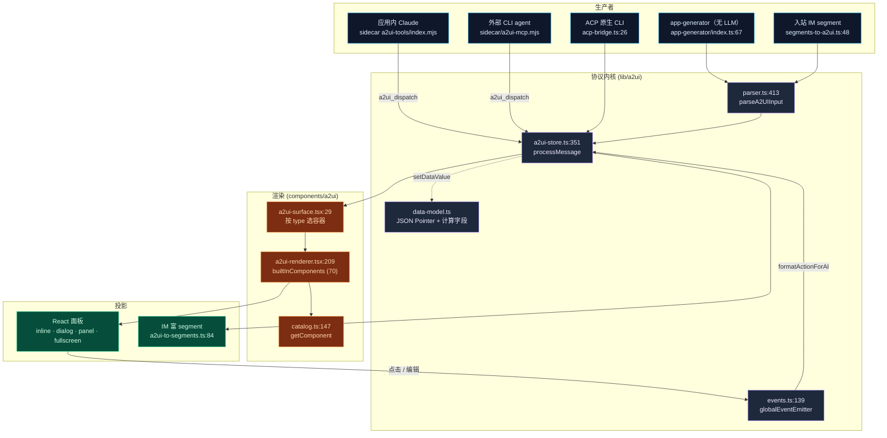
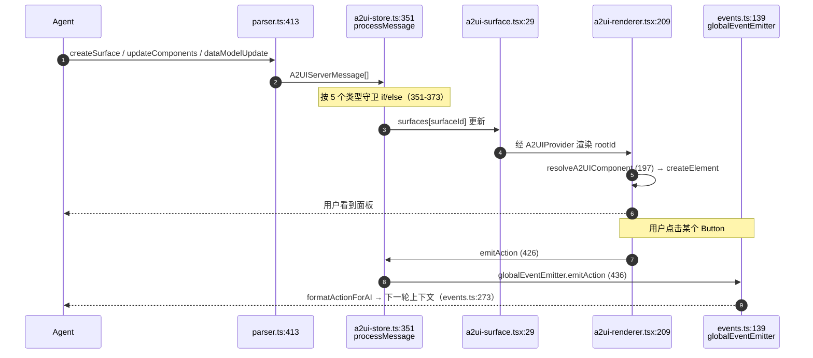

# A2UI 系统

<Status variant="experimental" />

<TLDR>
  A2UI（Agent-to-UI）让模型输出**真正可交互的 UI**——一个表单、一张图表、一个仪表盘——而不仅仅是
  markdown。agent 调用 MCP 工具发出声明式组件树；浏览器 renderer 把它变成实时 React 面板；用户的点击
  作为 `userAction` 事件流回 agent。这套协议被三种运行时共享——应用内 Claude 会话、外部 CLI agent
  （Cursor / Codex / Gemini / Claude Code）、IM 连接器（飞书 / Telegram / Discord……）——靠的是
  一份 schema（`types/a2ui/schema.ts`，v0.9）和一个 Zustand store
  （`stores/a2ui/a2ui-store.ts:processMessage`）。
</TLDR>

<StatGrid>
  <Stat label="Server 消息" value="5" hint="createSurface · updateComponents · dataModelUpdate · deleteSurface · surfaceReady" />
  <Stat label="MCP 工具" value="5 / 4" hint="schema 声明 5 个 · sidecar 实现 4 个" />
  <Stat label="组件类型" value="70" hint="builtInComponents 分发表 · 标准 catalog 61 个" />
  <Stat label="输出 profile" value="22" hint="lib/a2ui/output-profiles.ts" />
  <Stat label="内置模板" value="13" hint="lib/a2ui/templates/" />
  <Stat label="Schema 版本" value="v0.9" hint="types/a2ui/schema.ts:3" />
</StatGrid>

## 它解决什么

模型不止能输出 markdown——也能输出 **UI**。A2UI 把这条回路标准化：

1. agent 调 `a2ui_create_surface` → webview 里出现一个面板。
2. agent 调 `a2ui_update_components` → 组件树被（重新）构建；renderer diff DOM。
3. 用户点了按钮或改了字段 → renderer 向事件总线发出 `userAction` / `dataModelChange`。
4. 聊天回路把这些事件折叠进下一轮 → agent 继续编排。

下面的一切都是同一份声明式契约（`types/a2ui/schema.ts`），由同一个 parser、同一个 catalog、同一个
renderer、同一个 store 实现——再投影到 agent 所在的那个运行时。

## 模块地图

逐模块页含行级精确的内部细节。下面每个卡片就是一个文档页。

<Cards>
  <Card title="协议内核" href="./protocol-core" description="Schema v0.9、parser、JSON-Pointer 数据模型 + 计算字段、进程内事件总线" />
  <Card title="目录与渲染" href="./catalog-rendering" description="type→React 注册表（70 种）、surface 容器、context/绑定、错误隔离、组件族" />
  <Card title="MCP 工具与桥接" href="./mcp-bridge" description="工具 schema 与 3 条跨进程 dispatch 通路（socket、进程内 SDK、ACP stdout）" />
  <Card title="输出 profile 与富输出" href="./output-profiles" description="22 条 intent→策略 路由、富输出 renderer、缩略图、学术 surface" />
  <Card title="应用生成器与模板" href="./app-generator" description="无 LLM 的自然语言→组件树、13 个内置模板、A2UI Hub 页面" />
  <Card title="IM 连接器桥接" href="./im-bridge" description="A2UI ⇄ 平台 segment 映射、能力降级、工作流进度投影" />
  <Card title="状态与持久化" href="./state-persistence" description="Zustand store（消息入口）、撤销/重做、localStorage LRU、4 张 Dexie 表" />
</Cards>

## 架构全景

## 标准往返回路

这是每个运行时共享的回路——`processMessage` 是唯一的摄入点，`globalEventEmitter` 是唯一的出口。

## 五种 Server 消息

契约是五种消息类型（`types/a2ui/schema.ts`），不是四种。每一种通过一个 parser 类型守卫与一个 store
action 一一对应。

| 消息 `type` | 守卫（`parser.ts`） | Store action（`a2ui-store.ts`） | 效果 |
| --- | --- | --- | --- |
| `createSurface` | `isCreateSurfaceMessage` (43) | `createSurface` (219) | 分配 surface（inline / dialog / panel / fullscreen） |
| `updateComponents` | `isUpdateComponentsMessage` (47) | `updateComponents` (266) | 替换组件树（压入撤销快照） |
| `dataModelUpdate` | `isUpdateDataModelMessage` (53) | `updateDataModel` (298) | 合并（默认）或替换数据模型 |
| `deleteSurface` | `isDeleteSurfaceMessage` (59) | `deleteSurface` (241) | 销毁 surface |
| `surfaceReady` | `isSurfaceReadyMessage` (63) | `setSurfaceReady` (453) | 翻转 `ready`，renderer 揭示面板 |

简化简写 `{ surface, components, dataModel }` 会被 `parseSimplifiedA2UI`（`parser.ts:301`）自动展开成
这条 4 消息序列。

## 三条入口，一个 store

A2UI 有三条独立的 dispatch 通路，它们最终都汇入
`useA2UIStore.getState().processMessage`：

| 通路 | 生产者 | 传输 | 落点 |
| --- | --- | --- | --- |
| **独立 MCP** | 外部 CLI agent | 本地 socket / 命名管道 → Rust `a2ui_bridge` → `a2ui://dispatch` | `ipc.ts:38` |
| **进程内 SDK** | 应用内 Claude 会话 | sidecar stdout `emit({type:"a2ui_dispatch"})` → Tauri emit | `ipc.ts:38` |
| **ACP stdout 嗅探** | ACP 原生 CLI | 逐行扫描 stdout | `acp-bridge.ts:46` |

完整管路、环境变量（`COGNIA_BRIDGE_SOCKET`）与 socket 路径见
[MCP 工具与桥接](./mcp-bridge) 页。

## 相比旧文档的变化

这个子系统早已超出最初的单页描述。具体更正：

| 旧文档说法 | 实际 | 来源 |
| --- | --- | --- |
| "4 个 MCP 工具" | schema 声明 **5** 个（新增 `a2ui_handle_connector_action`）；sidecar 实现 4 个 | `mcp-tool-schemas.ts:53` |
| "50+ 组件" | 分发表注册 **70** 个；标准 catalog 61 个 | `a2ui-renderer.tsx:112`、`catalog.ts:32` |
| "21 个输出 intent" | **22** 个 profile | `output-profiles.ts:91` |
| "14 个内置模板" | **13** 个 | `templates/index.ts:48` |
| "Dexie v13" | a2ui 表在 v13 引入；schema 当前已到 **v65** | `lib/db/schema.ts:573`、`:1692` |
| （未提及） | 现已存在完整的 **IM 连接器桥接** + 工作流进度投影 | `lib/connectors/a2ui-bridge/` |

## 安全模型

A2UI 组件**直接渲染进主 React 树**（不同于用 iframe 隔离的 Artifacts）。因此安全边界就是 catalog：

- 只有**预注册**的组件类型会渲染。未知 `component` 字符串落到 `A2UIFallback`
  （`a2ui-renderer.tsx:197`）——绝不当作代码解释。
- `Text` 以纯文本渲染，绝不用 `dangerouslySetInnerHTML`。
- agent 提供的 action 字符串经事件总线路由；**绝不执行**。
- 当 `widget.hostStrategy` 为 `sandboxed-html` / `artifact-preview` 时，内容被转到 iframe 隔离的
  artifact 面板，而非内联渲染（见 [输出 profile](./output-profiles)）。

扩展 catalog 时，要对每个新组件审计 XSS 面（富文本、`iframe`、SVG `foreignObject`、`data:` URL 都需要
白名单过滤）。

## 下一步

<Cards>
  <Card title="A2UI MCP 桥" href="../mcp/a2ui-bridge" description="a2ui-mcp.mjs 与进程内 a2ui-bridge 的工具表与协议" />
  <Card title="External Bridge" href="../external-bridge" description="把工具暴露给外部 agent" />
  <Card title="Artifacts / 沙箱" href="../artifacts-sandbox" description="另一条 UI 通路：iframe 隔离的一次性内容" />
  <Card title="平台连接器" href="../platform-connectors" description="IM 桥接的接入点" />
</Cards>
