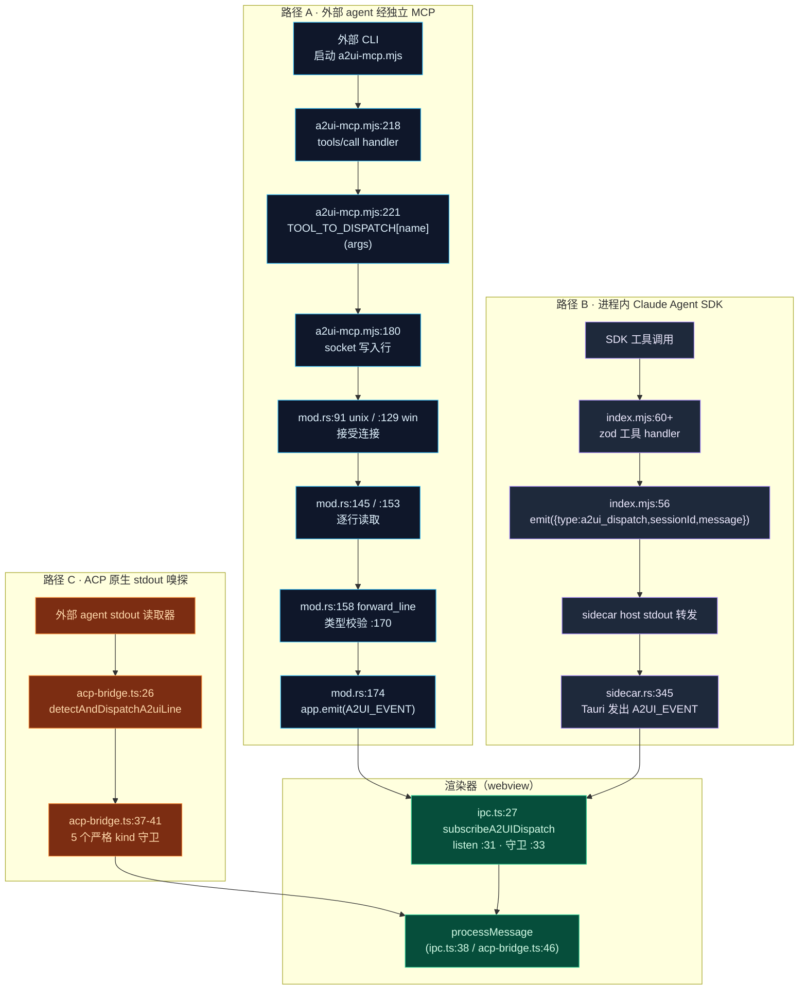
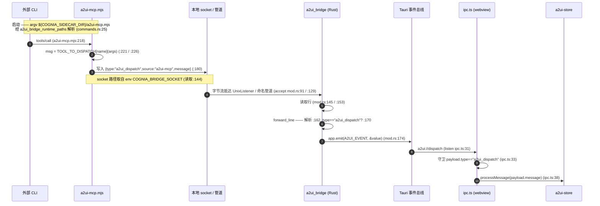

# MCP 工具与桥接

<Status variant="experimental" />

<TLDR>
  A2UI 由**运行在其它进程里的 agent** 产出 —— 外部 CLI、内置的 Claude Agent SDK 会话、ACP 原生工具
  —— 但它必须渲染进**唯一**的 webview React 树。本页描述使其成立的桥接层：MCP **工具 schema**
  （`lib/a2ui/mcp-tool-schemas.ts`）、独立的 stdio MCP 服务器（`sidecar/a2ui-mcp.mjs`）、进程内 SDK
  服务器（`sidecar/a2ui-tools/index.mjs`），以及 Rust 本地 IPC 监听器（`src-tauri/src/a2ui_bridge/`）。
  三条相互独立的派发路径汇聚到 `useA2UIStore.getState().processMessage`。线上信封恒为
  `{ type: "a2ui_dispatch", message }`；Tauri 通道恒为 `a2ui://dispatch`；工具名恒以
  `mcp__a2ui-bridge__*` 命名空间限定。
</TLDR>

<StatGrid>
  <Stat label="工具数（schema）" value="5" hint="mcp-tool-schemas.ts:53 —— 额外含 a2ui_handle_connector_action" />
  <Stat label="工具数（sidecar）" value="4" hint="a2ui-mcp.mjs:56 · a2ui-tools/index.mjs —— 第 5 个未实现" />
  <Stat label="派发路径" value="3" hint="socket/管道 · 进程内 SDK · ACP stdout 嗅探" />
  <Stat label="桥接版本" value="0.9.0" hint="mcp-tool-schemas.ts:15 · MCP protocolVersion 2024-11-05" />
</StatGrid>

## 它解决什么

A2UI 的渲染器、parser 与 store 都活在 **webview** 里。但 A2UI 消息的*生产者*几乎从不是 webview ——
它是运行在 sidecar Node 进程里的模型、独立 OS 进程里的外部 CLI，或在 stdout 上流式输出 JSON 的 ACP
工具。桥接层的职责，是把来自这些生产者中任意一个的声明式组件树消息，准确地送到唯一入口
`useA2UIStore.getState().processMessage`，且生产者无需知道自己走的是哪条传输路径。

它依靠**一种信封形状**与**一个 Tauri 通道**来达成：

| 常量 | 值 | 定义 / 使用位置 |
| --- | --- | --- |
| 派发信封 `type` | `"a2ui_dispatch"` | `ipc.ts:17` / `:33`、`a2ui-mcp.mjs:180`、`index.mjs:56`、`mod.rs:170` |
| Tauri 事件通道 | `"a2ui://dispatch"` | `ipc.ts:14`、`sidecar.rs:23` |
| 工具命名空间前缀 | `mcp__a2ui-bridge__` | `mcp-tool-schemas.ts:229`、`index.mjs:190` |
| 服务器名 | `a2ui-bridge` | `mcp-tool-schemas.ts:14`、`a2ui-mcp.mjs:30`、`index.mjs:15` |
| 服务器 id | `builtin:a2ui-bridge` | `mcp-tool-schemas.ts:13` |
| 桥接 / schema 版本 | `0.9.0`（"A2UI v0.9"） | `mcp-tool-schemas.ts:15`、`a2ui-mcp.mjs:29`、`index.mjs:16` |
| MCP `protocolVersion` | `2024-11-05` | `a2ui-mcp.mjs:206` |
| Socket 来源标签 | `a2ui-mcp` | `a2ui-mcp.mjs:180` |

## 工具 Schema 集合

`lib/a2ui/mcp-tool-schemas.ts` 是桥接工具的**权威 JSON-Schema 声明**（`A2UI_BRIDGE_TOOLS`，`:53`
处的只读数组）。它声明了**五个**工具。每个工具名都由 `namespacedA2UIToolNames`（`:228`）投射进 MCP
命名空间，在 `:229` 把每个工具映射为 `` mcp__${A2UI_BRIDGE_SERVER_NAME}__${t.name} ``。

| 工具 | 必填输入 | 可选输入 | 定义于 |
| --- | --- | --- | --- |
| `a2ui_create_surface` | `surfaceId`、`surfaceType`（枚举 `inline` / `dialog` / `panel` / `fullscreen`） | `catalogId`、`title`、`widget` | `:55` |
| `a2ui_update_components` | `surfaceId`、`components`（数组，至少 1） | — | `:75` |
| `a2ui_data_model_update` | `surfaceId`、`data` | `merge`（布尔，默认 `true`） | `:93` |
| `a2ui_delete_surface` | `surfaceId` | — | `:111` |
| `a2ui_handle_connector_action` | `surfaceId`、`actionType`（枚举 `button` / `select` / `checkbox` / `input` / `submit` / `dismiss` / `platform_specific`） | `componentId`、`value`、`payload`、`platform`（`telegram` / `discord` / `slack` / `lark` / `onebot`）、`triggerId`、`conversationKey` | `:121` |

共享子 schema —— `componentSchema`（`:27`）与 `widgetSchema`（`:37`，含
`hostStrategy` / `sizing` / `theme` / `showChrome` / `fallbackText` / `minHeight`）—— 被
`a2ui_create_surface` 与 `a2ui_update_components` 引用。

<Callout type="warn">
  **4 对 5 的漂移。** TS schema（`mcp-tool-schemas.ts`）声明了**5** 个工具 —— 它额外加入
  `a2ui_handle_connector_action`（`:121`），用于把 IM 通道动作注入回某个 surface。但**两个** sidecar
  运行时 —— `sidecar/a2ui-mcp.mjs`（`TOOLS` 于 `:56`）与 `sidecar/a2ui-tools/index.mjs`（zod 工具
  `:60`–`:171`）—— 都只实现了最初的**4** 个（`create_surface`、`update_components`、
  `data_model_update`、`delete_surface`）。第五个工具在 sidecar 层是**已声明但未实现**：它存在于
  agent 所见的 schema 行中，但目前没有任何运行时 handler 会为它触发。
</Callout>

## McpServer 投影行

为使桥接出现在应用的 MCP 服务器注册表中，`buildA2UIBridgeMcpRow`（`:197`）把工具集投影为一个
`McpServer` Dexie 行。该行由 `lib/db/seed.ts`（v13 upsert）写入，并由 `isA2UIBridgeRow`（`:218`）
识别。

<TypeTable
  type={{
    enabled: {
      type: "false",
      description: "默认禁用 —— 桥接是按需启用的；该行是接线模板，而非自启动服务器。",
    },
    transport: {
      type: '"stdio"',
      description: "以子进程方式经 stdin/stdout JSON-RPC 启动。",
    },
    args: {
      type: "string[]",
      description: "`${COGNIA_SIDECAR_DIR}/a2ui-mcp.mjs`（:204）—— 占位符在启动时解析。",
    },
    id: {
      type: "13",
      description: "A2UI_BRIDGE_SERVER_ID = \"builtin:a2ui-bridge\"。",
    },
    version: {
      type: '"0.9.0"',
      description: "A2UI_BRIDGE_VERSION（:15）。",
    },
  }}
/>

`${COGNIA_SIDECAR_DIR}` 标记是常量 `SIDECAR_DIR_PLACEHOLDER`（`:18`）；它**不是**真实路径。启动时
渲染器经 `a2ui_bridge_runtime_paths` 命令向 Rust 索要具体路径，并替换该占位符。
`defaultA2UIAppsEnabled`（`:175`）决定是否提供桥接本身。

## 三种入口，一个 Store

存在三条相互独立的派发路径。它们在传输上完全不同，但目的地完全一致 ——
`useA2UIStore.getState().processMessage(message)`。



### 路径 A —— 外部 agent 经独立 socket MCP

这是最长的路径：外部 CLI 把 `sidecar/a2ui-mcp.mjs` 作为自己的 MCP 服务器运行，A2UI 消息经**本地
socket / 命名管道**进入 Rust，再由 Rust 在 Tauri 事件总线上重新发出。



独立服务器是自包含的 —— 仅依赖 Node 的 `readline` / `net` / `crypto`。`connectIpc`
（`a2ui-mcp.mjs:143`）读取 `process.env.COGNIA_BRIDGE_SOCKET`（`:144`），并以
`net.createConnection(path)`（`:150`）建立连接；若 socket 不可用，则经 `scheduleReconnect`（`:169`）
每 2 秒重试。`TOOL_TO_DISPATCH`（`:108`）把每个工具名映射到协议消息构建器（`createSurface`
`:109`、`updateComponents` `:117`、`dataModelUpdate` `:122`、`deleteSurface` `:128`）。在 `:180`
写入的线上行为：

```js
ipcSocket.write(JSON.stringify({ type: "a2ui_dispatch", source: "a2ui-mcp", message }) + "\n")
```

### 路径 B —— 进程内 Claude Agent SDK

对于应用内的 Claude 会话，**没有 socket，也没有 Rust 转发**。`buildA2UIBridgeServer`
（`sidecar/a2ui-tools/index.mjs:54`）经 `createSdkMcpServer` 构建一个 SDK MCP 服务器，其内部
`dispatch` 仅把同一信封发到 **sidecar 父进程的 stdout**（`:56`）：

```js
emit({ type: "a2ui_dispatch", sessionId, message })
```

sidecar host 转发它，Tauri 在 `sidecar.rs:345` 发出 `A2UI_EVENT` —— 抵达完全相同的 `ipc.ts:27`
订阅者与 `ipc.ts:38` 的 `processMessage`。当设置了 `alwaysLoad` 时（`:178`），四个工具
（`create_surface` `:60`、`update_components` `:93`、`data_model_update` `:119`、`delete_surface`
`:150`）会常驻。

### 路径 C —— ACP 原生 stdout 嗅探

最短的路径既绕过 MCP **也**绕过 socket。ACP 原生外部 CLI 直接在 stdout 上输出 A2UI JSON 行。stdout
读取器把每一行经 `detectAndDispatchA2uiLine`（`lib/a2ui/acp-bridge.ts:26`）管道处理：它先 trim，要求
以 `{` 开头（`:28`），`JSON.parse`（`:31`），再针对**五种 A2UI 服务器消息 kind**（`:37`–`:41`：
`isCreateSurfaceMessage`、`isUpdateComponentsMessage`、`isUpdateDataModelMessage`、
`isDeleteSurfaceMessage`、**`isSurfaceReadyMessage`**）严格守卫候选对象。被识别的行被派发到
`useA2UIStore.getState().processMessage`（`:46`），并返回 `true`，使调用方不会再把它作为普通 ACP
事件重新转发。

<Callout>
  路径 C 的第五个守卫是 **`surfaceReady`** —— 不是 `handle_connector_action`。ACP 嗅探器里的“五”
  指协议中的五种*服务器消息 kind*，这与 schema 中的五个 *MCP 工具* 是不同的集合。
</Callout>

渲染器侧的订阅者 `subscribeA2UIDispatch`（`lib/a2ui/ipc.ts:27`）是路径 A 与 B 的公共落点：它在
Tauri 之外为空操作（`:29`），调用 `listen(A2UI_EVENT)`（`:31`），对 `payload.type === "a2ui_dispatch"`
做形状守卫（`:33`），随后调用 `processMessage`（`:38`）。其信封类型 `A2UIDispatchEnvelope`（`:16`）
为 `{ type: "a2ui_dispatch", sessionId?, message: A2UIServerMessage }`。

## 环境变量与路径解析

占位符与 socket 的协调，由 Rust 拥有并向渲染器暴露的两个值驱动。

| 名称 | 写入方 | 读取 / 解析方 |
| --- | --- | --- |
| `COGNIA_BRIDGE_SOCKET`（env） | Rust `set_var`（`mod.rs:82`）；亦见 `RuntimePaths.socket_path`（`commands.rs:31`） | sidecar `a2ui-mcp.mjs:144` |
| `${COGNIA_SIDECAR_DIR}`（argv 占位符） | 常量 `SIDECAR_DIR_PLACEHOLDER`（`mcp-tool-schemas.ts:18`），用于 args 的 `:204` | `RuntimePaths.sidecar_dir`（`commands.rs:30`，来自 `sidecar_dir(&app)` `commands.rs:26`） |
| socket / 管道路径 | `socket_path()`（`mod.rs:34`） | 经 `a2ui_bridge_runtime_paths`（`commands.rs:25`）暴露 |

`a2ui_bridge_runtime_paths`（`src-tauri/src/a2ui_bridge/commands.rs:25`）是返回 `RuntimePaths` 结构体
（`:19`）的 `#[tauri::command]`，该结构体带有 snake_case 线上键 `sidecar_dir` 与 `socket_path`（由
测试 `runtime_paths_serialize_uses_snake_case_keys` 于 `:40` 断言）。渲染器在启动时调用它一次，以解析
MCP 行 `args` 中的 `${COGNIA_SIDECAR_DIR}`，并获知 socket 路径。

## Rust 本地 IPC 监听器

`src-tauri/src/a2ui_bridge/mod.rs` 是路径 A 的接收端。`socket_path(app)`（`:34`）按平台分支：

| 平台 | 路径 | 定义于 |
| --- | --- | --- |
| Windows | 命名管道 `\\.\pipe\cognia-next-a2ui-bridge` | `mod.rs:48` |
| Unix | `<app_local_data>/a2ui-bridge.sock` | `mod.rs:56` |

`spawn(app)`（`:62`）解析路径（`:63`），移除陈旧 socket（`:74`），**设置 `COGNIA_BRIDGE_SOCKET`
环境变量**（`:82`）以便被启动的 MCP 服务器能找到它，随后绑定 —— Unix 上为 `UnixListener`（`:87`），
Windows 上为 `named_pipe::ServerOptions`（`:118`）—— 并对每个连接运行 accept 循环。每个连接被逐行
读取：`handle_unix_stream`（`:143`）与 `handle_named_pipe`（`:151`）都汇入 `forward_line(app, line)`
（`:158`），后者解析 JSON（`:162`），检查 `type == "a2ui_dispatch"`（`:170`，否则在 `:171` 告警并忽略），
并以 `app.emit(A2UI_EVENT, &value)`（`:174`）把它发到 Tauri 总线。`A2UI_EVENT` 从
`crate::claude::sidecar` 导入（`:28`），在那里定义为
`pub const A2UI_EVENT: &str = "a2ui://dispatch"`（`sidecar.rs:23`）。

## 优雅降级

桥接的设计使得缺失或未绑定的 socket **绝不会让工具调用失败**。在路径 A 中，`a2ui-mcp.mjs` 在构建并
写出派发行后总是返回成功的 `tools/call` 响应；socket 写入是即发即忘，若连接尚未建立，`connectIpc` 会
经 2 秒定时器（`scheduleReconnect` `:169`）重连。从外部 agent 视角看，工具就是成功了 —— UI 会在渲染器
开始监听后出现。Rust 侧同样会丢弃格式错误或非 `a2ui_dispatch` 的行并告警（`mod.rs:171`），而非拆毁
连接。这使得无头外部运行（未附着 webview）不会报错：agent 拿到 `ok`，而 surface 会在渲染器存在时即时
物化。

## 桥接文件

<Files>
  <Folder name="lib/a2ui" defaultOpen>
    <File name="mcp-tool-schemas.ts —— 5 个 JSON-Schema 工具定义 + buildA2UIBridgeMcpRow (197) + namespacedA2UIToolNames (228)" />
    <File name="ipc.ts —— subscribeA2UIDispatch (27) · A2UIDispatchEnvelope (16) · A2UI_EVENT (14)" />
    <File name="acp-bridge.ts —— detectAndDispatchA2uiLine (26) · 5 个 kind 守卫 (37-41)" />
  </Folder>
  <Folder name="sidecar">
    <File name="a2ui-mcp.mjs —— 独立 stdio JSON-RPC 2.0 MCP 服务器 · 4 工具 (56) · socket 写入 (180)" />
    <File name="a2ui-tools/index.mjs —— 进程内 SDK MCP · buildA2UIBridgeServer (54) · 内部 emit (56)" />
  </Folder>
  <Folder name="src-tauri/src/a2ui_bridge">
    <File name="mod.rs —— socket_path (34) · spawn (62) · forward_line → app.emit (158-174)" />
    <File name="commands.rs —— a2ui_bridge_runtime_paths (25) · RuntimePaths (19)" />
  </Folder>
  <Folder name="src-tauri/src/claude">
    <File name="sidecar.rs —— A2UI_EVENT 常量 (23) · 进程内 Tauri emit (345)" />
  </Folder>
</Files>

## 下一步

<Cards>
  <Card title="A2UI 系统" href="./index" description="概览、规范往返、五种服务器消息" />
  <Card title="协议核心" href="./protocol-core" description="schema v0.9、parser、数据模型、进程内事件总线" />
  <Card title="MCP 系统" href="../mcp" description="更广义的 sidecar MCP host、内置工具与工具派发" />
  <Card title="外部桥接" href="../external-bridge" description="向外部 agent 暴露工具" />
</Cards>
