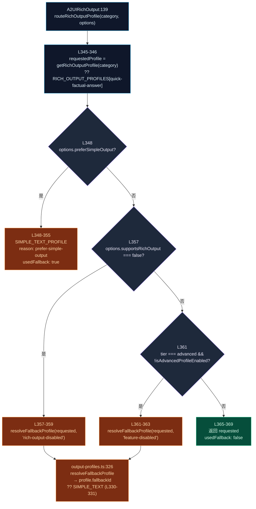
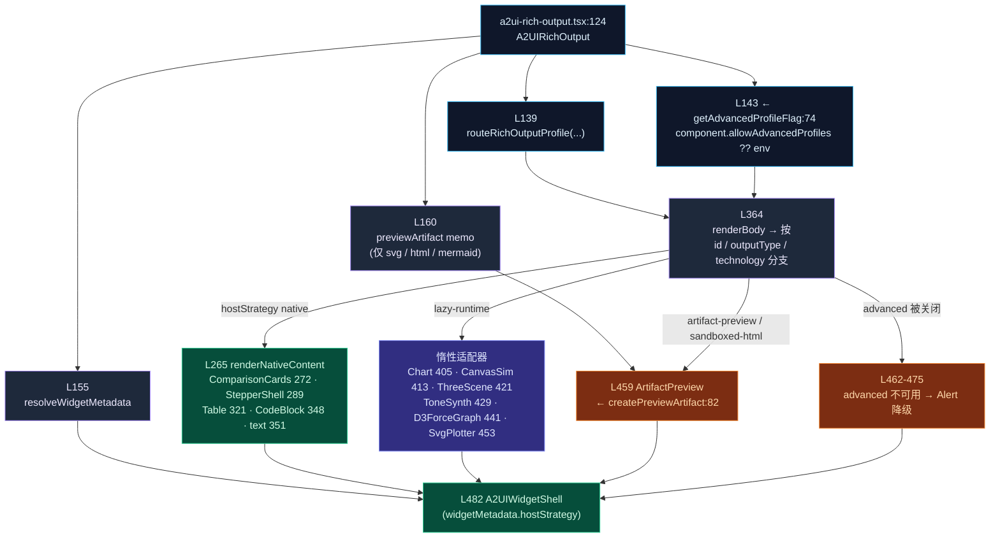

# 输出 Profile 与富输出

<Status variant="experimental" />

<TLDR>
  当 agent 想"展示"某样东西 —— 一张图示、一个图表、一个 3D 场景、一段温暖的话 —— 它选择的是
  **intent category（意图类别）**，而不是渲染器。一个 **output profile** 就是把该意图转换成具体
  **渲染策略** 的查表：内联 A2UI 原生组件、惰性加载的运行时适配器（Chart.js / Three.js / Tone.js /
  d3 / canvas），或 iframe 隔离的 artifact preview。`routeRichOutputProfile`
  （`output-profiles.ts:341`）是路由器；它在 **22** 条 profile 注册表上跑一个 5 步降级阶梯。渲染器
  `A2UIRichOutput`（`a2ui-rich-output.tsx:124`）消费路由结果并分派 body。
</TLDR>

<StatGrid>
  <Stat label="输出 Profile" value="22" hint="RICH_OUTPUT_PROFILES · output-profiles.ts:91" />
  <Stat label="Host 策略" value="4" hint="native · artifact-preview · sandboxed-html · lazy-runtime" />
  <Stat label="advanced 层 Profile" value="7" hint="受特性开关控制，默认 ON" />
  <Stat label="惰性运行时适配器" value="6" hint="ChartJs · CanvasSim · ThreeScene · ToneSynth · D3ForceGraph · SvgPlotter" />
</StatGrid>

## 什么是 Output Profile

A2UI 的基础渲染器把声明式组件树渲染成内联 React。但有些意图需要 *不同的* 载体：一个 Chart.js
canvas、一个沙箱 `<iframe>`、一个 Three.js 场景。与其让 agent 指定渲染器，agent 指定的是
**intent category**（`how-it-works-physical`、`trends-over-time`、`3d-visualization`、
`emotional-support`……），由 profile 注册表把该意图映射到正确的渲染策略。

`RichOutputProfile`（`output-profiles.ts:56`）携带了渲染器做该决策所需的一切：

<TypeTable
  type={{
    id: {
      description: "稳定的 profile 标识符；等于其 intent category 字面量。",
      type: "RichOutputRequestCategory",
    },
    title: {
      description: "profile 的可读标签。",
      type: "string",
    },
    outputType: {
      description: "产出物的种类（svg · html · mermaid · chart · canvas · plain-text · code · warm-text）。",
      type: "RichOutputType",
    },
    technology: {
      description: "渲染技术（svg · html · mermaid · chartjs · canvas · threejs · tonejs · d3 · none）。",
      type: "RichOutputTechnology",
    },
    hostStrategy: {
      description: "body 在哪里渲染 —— native · artifact-preview · sandboxed-html · lazy-runtime。",
      type: "RichOutputHostStrategy",
    },
    artifactType: {
      description: "被转入 preview 面板时要构建的 artifact 种类。",
      type: "ArtifactType",
    },
    fallbackId: {
      description: "本 profile 无法渲染时降级到的 profile。由 resolveFallbackProfile 解析。",
      type: "RichOutputRequestCategory | undefined",
    },
    rolloutTier: {
      description: '"core"（始终可用）或 "advanced"（受特性开关控制，默认 ON）。',
      type: "RichOutputRolloutTier",
    },
  }}
/>

类型词汇表与注册表共存：`RichOutputType`（27，**8** 种，L28-35）、`RichOutputTechnology`（37，**9**
个值，L38-46）、`RichOutputHostStrategy`（48，**4** 个值，L49-52）、`RichOutputRolloutTier`（54）。
唯一的外部依赖是来自 `@/types/artifact` 的 `ArtifactType`（L1）。

<Callout type="warn">
  旧文档里漂移过的两个计数：实际是 **22 个 profile / 22 个 intent category**（不是 21），并且恰好有
  **4 种 host 策略** —— `native`、`artifact-preview`、`sandboxed-html`、`lazy-runtime`。`none` 是一种
  *technology*，不是 host 策略。
</Callout>

## 22 个 Profile

`RICH_OUTPUT_PROFILES`（`output-profiles.ts:91`）是一张 22 条目的 record（L92-311）。每一行把一个
意图映射到一个渲染策略和一个 fallback。

| # | id（intent category） | 行 | outputType | technology | hostStrategy | tier |
| --- | --- | --- | --- | --- | --- | --- |
| 1 | `how-it-works-physical` | 92 | svg | svg | artifact-preview | core |
| 2 | `how-it-works-abstract` | 102 | html | html | sandboxed-html | core |
| 3 | `process-steps` | 112 | svg | svg | artifact-preview | core |
| 4 | `architecture-containment` | 122 | svg | svg | artifact-preview | core |
| 5 | `database-schema-erd` | 132 | mermaid | mermaid | artifact-preview | core |
| 6 | `trends-over-time` | 142 | chart | chartjs | lazy-runtime | **advanced** |
| 7 | `category-comparison` | 152 | chart | chartjs | lazy-runtime | **advanced** |
| 8 | `part-of-whole` | 162 | chart | chartjs | lazy-runtime | **advanced** |
| 9 | `kpis-metrics` | 172 | html | html | sandboxed-html | core |
| 10 | `design-a-ui` | 182 | html | html | sandboxed-html | core |
| 11 | `choose-between-options` | 192 | html | html | sandboxed-html | core |
| 12 | `cyclic-process` | 202 | html | html | sandboxed-html | core |
| 13 | `physics-math-simulation` | 212 | canvas | canvas | lazy-runtime | **advanced** |
| 14 | `function-equation-plotter` | 222 | svg | svg | artifact-preview | core |
| 15 | `data-exploration` | 232 | html | html | sandboxed-html | core |
| 16 | `creative-decorative-art` | 242 | svg | svg | artifact-preview | core |
| 17 | `3d-visualization` | 252 | html | threejs | lazy-runtime | **advanced** |
| 18 | `music-audio` | 262 | html | tonejs | lazy-runtime | **advanced** |
| 19 | `network-graph` | 272 | html | d3 | lazy-runtime | **advanced** |
| 20 | `quick-factual-answer` | 282 | plain-text | none | native | core |
| 21 | `code-solution` | 292 | code | none | native | core |
| 22 | `emotional-support` | 302 | warm-text | none | native | core |

那 **7** 个 advanced 层 profile（`trends-over-time`、`category-comparison`、`part-of-whole`、
`physics-math-simulation`、`3d-visualization`、`music-audio`、`network-graph`）恰好就是会拉取重量级
运行时适配器的那些 —— 这也是它们共享 `lazy-runtime` host 策略并被特性开关守护的原因。

注册表上的访问器：`listRichOutputProfiles`（L314）返回所有行；`getRichOutputProfile`（L318）按类别
查一条。私有常量 `SIMPLE_TEXT_PROFILE_ID`（L89）把通用 fallback 钉死为 `"quick-factual-answer"`。

## Host 策略

`hostStrategy` 字段决定 body *在哪里* 渲染。共有 4 种（`output-profiles.ts:49-52`）：

| Host 策略 | 行 | 载体 | Profile | 技术 |
| --- | --- | --- | --- | --- |
| `native` | 49 | 内联 A2UI React 组件 | `quick-factual-answer`、`code-solution`、`emotional-support` | plain-text / code / warm-text |
| `artifact-preview` | 50 | iframe 隔离的 artifact 面板 | svg + mermaid 类 profile | svg、mermaid |
| `sandboxed-html` | 51 | iframe 隔离的 artifact 面板 | html 类 profile | html |
| `lazy-runtime` | 52 | 惰性加载的运行时适配器 | 7 个 advanced profile | chartjs / canvas / threejs / tonejs / d3 |

`native` 与两种 iframe 策略是在 **信任 vs 能力** 之间权衡：native 内容直接渲染进主 React 树（廉价、
安全、受限）；`artifact-preview` / `sandboxed-html` 转入 iframe 隔离的 artifact 面板（见
[Artifacts / 沙箱](../artifacts-sandbox)）；`lazy-runtime` 让 body 保持内联，但把重量级的
图表 / 3D / 音频 bundle 延迟到 profile 真正被选中时才加载。

## 路由器：`routeRichOutputProfile`

`routeRichOutputProfile`（`output-profiles.ts:341`）是唯一的决策点。它先解析请求的 profile（若类别
未知则降级到 `quick-factual-answer`），然后跑一个 5 步阶梯。第一个命中者胜出。

路由器返回一个 `RichOutputRoutingResult`（`output-profiles.ts:82`），含 `requestedProfile`、解析后的
`profile`、一个 `usedFallback` 标志，以及一个 `RichOutputRoutingReason`（L77）—— 取值为
`feature-disabled`、`prefer-simple-output` 或 `rich-output-disabled` 之一。配套 helper：

| Helper | 行 | 作用 |
| --- | --- | --- |
| `resolveFallbackProfile` | 326 | 解析 `profile.fallbackId`；若缺失则降级到 `SIMPLE_TEXT_PROFILE_ID`（L330-331）。 |
| `isAdvancedProfileEnabled` | 322 | 默认 **ON**：除非开关 *恰好* 为 `false`，否则返回 `true`（L323）。 |
| `RichOutputRoutingOptions` | 71 | 输入旋钮：`preferSimpleOutput`、`supportsRichOutput`、`featureFlags`。 |

## 渲染器：`A2UIRichOutput`

`A2UIRichOutput`（`components/a2ui/display/a2ui-rich-output.tsx:124`）是 React 侧。它调用路由器、读取
advanced 开关，然后 `renderBody`（L364）根据解析后 profile 的 `id` / `outputType` / `technology` 分支
选择渲染路径：内联 native 组件、6 个惰性适配器之一，或由 `createPreviewArtifact`（L82）构建的
`ArtifactPreview`。

6 个惰性适配器以动态 import 引入（L28-55），因此它们的运行时永不进入基础 bundle：`ChartJs`（28）、
`CanvasSimulation`（31）、`ThreeScene`（36）、`ToneSynth`（41）、`D3ForceGraph`（46）、`SvgPlotter`
（51）。

### Advanced 特性开关

两层守护 advanced 层输出，且都默认 **ON**：

- **路由器层** —— `isAdvancedProfileEnabled`（`output-profiles.ts:322`）除非开关 *恰好* 为 `false`，
  否则返回 `true`。当一个 advanced profile 在开关关闭时被请求，路由器经
  `resolveFallbackProfile(..., "feature-disabled")` 降级。
- **渲染器层** —— `getAdvancedProfileFlag`（`a2ui-rich-output.tsx:74`）读取
  `component.allowAdvancedProfiles`，回退到 env 开关
  `NEXT_PUBLIC_ENABLE_ADVANCED_RICH_OUTPUT_PROFILES !== "false"`（L79）。若某个 profile 以
  advanced-但-不可用 漏过，渲染器显示 Alert 降级（L462-475）而非加载重型适配器。

解析后的 `hostStrategy` 经 `resolveWidgetMetadata`（L155）传入 `A2UIWidgetShell`，让 shell 知道 body
是内联还是被转入 iframe。

## Native 内容分派

当 `hostStrategy` 为 `native` 时，`renderNativeContent`（`a2ui-rich-output.tsx:265`）选择一个具体的
内联渲染器：

| 分支 | 行 | 组件 | 备注 |
| --- | --- | --- | --- |
| Comparison | 272 | `A2UIComparisonCards` | 响应式 2 列网格（`a2ui-comparison-cards.tsx:13`），空态在 23，点击 71-85 |
| Stepper | 289 | `A2UIStepperShell` | 用于 `process-steps` 类内容的步进 shell |
| Table | 321 | `A2UITable` | 表格 native 渲染 |
| Code | 348 | `CodeBlock` | 用于 `code-solution` |
| Text | 351 | 纯 `div` | `warm-text` / `plain-text` 的兜底 |

native 数据的路径解析使用共享的 data-model helper（来自 `@/lib/a2ui/data-model` 的
`getValueByPath` / `resolveArrayOrPath` / `resolveStringOrPath`，在 L15 导入）。

## 缩略图

`lib/a2ui/thumbnail.ts`（350）用 `html2canvas` 加 `localStorage` 缓存把活动的 A2UI surface 捕获成
缓存预览图。

```mermaid
flowchart LR
  CAP["thumbnail.ts:137<br/>captureSurfaceThumbnail"]
  SEL["L142<br/>querySelector([data-surface-id])"]
  GEN["L150 → generateThumbnail:49<br/>html2canvas"]
  FIT["L84-102<br/>等比缩放 → 新 canvas"]
  DRAW["L109 ctx.drawImage<br/>L113 toDataURL(mime, quality)"]
  Q["L116-119<br/>> 50KB? 以 quality 0.2 重编码"]
  RES["L121 ThumbnailResult"]
  SAVE["L278 saveThumbnail<br/>→ saveThumbnailCache:241"]
  CLEAN["L256 cleanupOldThumbnails<br/>丢弃 > 7 天 (L258)"]

  CAP --> SEL --> GEN --> FIT --> DRAW --> Q --> RES
  RES --> SAVE
  SAVE -->|"配额错误"| CLEAN

  classDef cap fill:#0f172a,stroke:#38bdf8,color:#e0f2fe
  classDef gen fill:#1e293b,stroke:#a78bfa,color:#ede9fe
  classDef store fill:#064e3b,stroke:#34d399,color:#d1fae5
  class CAP,SEL cap
  class GEN,FIT,DRAW,Q,RES gen
  class SAVE,CLEAN store
```

关键常量与接口：

| 符号 | 行 | 细节 |
| --- | --- | --- |
| `DEFAULT_OPTIONS` | 32 | width 280 / height 180 / quality 0.8 / format `webp` / bg `#ffffff` / scale 1（L34-38） |
| `THUMBNAIL_STORAGE_KEY` | 41 | `"a2ui-app-thumbnails"` |
| `MAX_THUMBNAIL_SIZE` | 42 | `50 * 1024`（50KB）—— 超过后质量自动降低（L116） |
| `generatePlaceholderThumbnail` | 160 | 无 DOM 时用 canvas 渐变 + 圆形首字母 + 截断标题 |
| `saveThumbnailCache` | 241 | 失败时 → `cleanupOldThumbnails`（丢弃超过 7 天的条目，L258） |
| `syncThumbnailsWithApps` | 335 | 清理孤立的 `appId` |

其他缓存方法：`loadThumbnailCache`（224）、`getThumbnail`（290）、`deleteThumbnail`（298）、
`isThumbnailStale`（307）、`getAllThumbnails`（320）、`clearAllThumbnails`（327）。依赖：`html2canvas`
（L6）、来自 `@/lib/logging` 的 logger（L7）。

## 学术 Surface

`lib/a2ui/academic-templates.ts`（798）是一组用于研究 surface 的 **纯函数** A2UI server-message
构造器 —— 不渲染、无副作用。每个构造器组装组件 + 一个数据模型，然后发出 **4** 条 `A2UIServerMessage`
（`createSurface` → `updateComponents` → `dataModelUpdate` → `surfaceReady`），返回
`{ surfaceId, messages }`。

| 构造器 | 行 | Surface |
| --- | --- | --- |
| `createPaperCardSurface` | 41 | 单论文卡片（在 194-197 发出消息） |
| `createSearchResultsSurface` | 206 | 搜索结果列表 |
| `createAnalysisPanelSurface` | 365 | 分析面板 |
| `createPaperComparisonSurface` | 529 | 论文并排比较 |
| `createReadingListSurface` | 649 | 阅读列表 |

`AcademicTemplateType`（L16）枚举 7 种 surface 类型。i18n 通过双语 bundle 流转
（`academicTemplateMessages` L25、`getAcademicTemplateMessages` L30、带 `{key}` 插值的
`formatTemplateMessage` L34）；id 来自 `generateTemplateId`（如 L46）。`academicTemplates` 对象
（L790）是默认导出（L798）。依赖：来自 `@/types/a2ui/schema` 的 `A2UIComponent` / `A2UIServerMessage`
（L6）、来自 `@/types/academic` 的 `Paper` / `LibraryPaper` / `PaperAnalysisType`（L7）、来自
`@/i18n/config` 的 `defaultLocale` / `Locale`（L8）、捆绑的 `a2ui.json` 消息集（L9-10），以及来自
`./templates` 的 `generateTemplateId`（L11）。

对应的 React 组件位于 `components/a2ui/academic/` —— barrel `index.ts` 重新导出 `AcademicPaperCard`
（L6）、`AcademicSearchResults`（L7）和 `AcademicAnalysisPanel`（L8）。`A2UIAnalysisAdapter`
（`a2ui-analysis-adapter.tsx:17`）**不在** barrel 中；它在渲染器加载时以 `"AcademicAnalysis"` 名义
桥接进 catalog。

## Fixture

`lib/a2ui/rich-output-fixtures.ts`（42）提供 4 个用于测试与预览的示例 fixture（`richOutputFixtures`，
L8）—— 每个代表一种典型策略：

| Fixture | 行 | 类别 |
| --- | --- | --- |
| `directResponse` | 9 | `quick-factual-answer`（native） |
| `svgDiagram` | 15 | `how-it-works-physical`（artifact-preview） |
| `mermaidSchema` | 22 | `database-schema-erd`（artifact-preview） |
| `htmlDashboard` | 29 | `kpis-metrics`（sandboxed-html） |

`RichOutputFixtureKey`（L38）作为 record 的键；`getRichOutputFixture`（L40）按键查一条。无外部 import。

## 文件地图

<Files>
  <Folder name="lib/a2ui" defaultOpen>
    <File name="output-profiles.ts" annotation="370 —— 注册表 + 路由器（22 个 profile）" />
    <File name="rich-output-fixtures.ts" annotation="42 —— 4 个示例 fixture" />
    <File name="thumbnail.ts" annotation="350 —— html2canvas + localStorage 缓存" />
    <File name="academic-templates.ts" annotation="798 —— 纯函数 4-消息学术构造器" />
  </Folder>
  <Folder name="components/a2ui/display">
    <File name="a2ui-rich-output.tsx" annotation="124 —— 策略分派渲染器" />
    <File name="a2ui-comparison-cards.tsx" annotation="13 —— 响应式 2 列网格" />
    <File name="a2ui-widget-status.tsx" annotation="24 —— ready/loading/fallback/error 图标" />
    <File name="a2ui-interactive-guide.tsx" annotation="79 —— 步进引导（≤8 个圆点）" />
  </Folder>
  <Folder name="components/a2ui/academic">
    <File name="index.ts" annotation="barrel —— PaperCard / SearchResults / AnalysisPanel" />
    <File name="a2ui-analysis-adapter.tsx" annotation="17 —— 以 AcademicAnalysis 桥接（不在 barrel）" />
  </Folder>
</Files>

## 下一步

<Cards>
  <Card title="A2UI 系统" href="./index" description="协议总览、往返回路与模块地图" />
  <Card title="Catalog 与渲染" href="./catalog-rendering" description="类型→React 注册表、surface 容器、错误隔离" />
  <Card title="Artifacts / 沙箱" href="../artifacts-sandbox" description="artifact-preview / sandboxed-html 转入的 iframe 隔离路径" />
</Cards>
