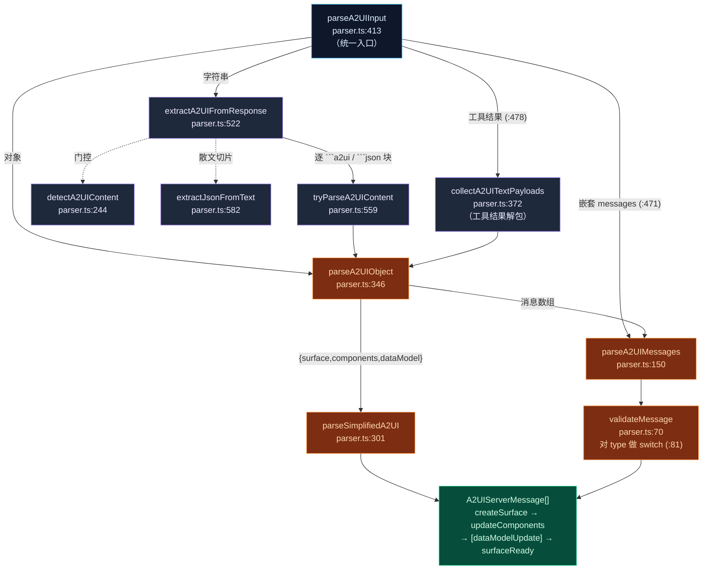
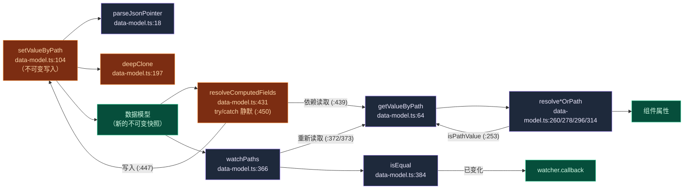
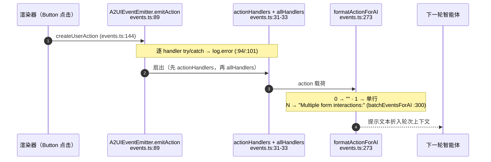

# 协议内核

<Status variant="experimental" />

<TLDR>
  协议内核是 `lib/a2ui` 中与运行时无关的那一层 —— 不涉及 React、不涉及 store、不涉及 MCP。它由四个协作模块组成：
  `parser.ts` 把原始的智能体输出（字符串、代码块、工具结果）转成有类型的 `A2UIServerMessage[]`；
  `data-model.ts` 通过 RFC 6901 JSON Pointer 把组件属性绑定到数据模型，并解析计算字段；
  `events.ts` 是进程内总线，把用户操作扇出并格式化成下一轮智能体上下文；再加上一组叶子工具
  （`constants.ts`、`format.ts`、`list-utils.ts`）和 `index.ts` barrel。所有内容都对齐到同一份 schema ——
  `types/a2ui/schema.ts`，文件头标注 "Based on A2UI Protocol v0.9"。
</TLDR>

<StatGrid>
  <Stat label="Schema 版本" value="v0.9" hint="types/a2ui/schema.ts:3 文件头 · version 字段位于 :910" />
  <Stat label="服务端消息" value="5" hint="createSurface · updateComponents · dataModelUpdate · deleteSurface · surfaceReady" />
  <Stat label="parser.ts" value="656 行" hint="parseA2UIInput (413) 是统一入口" />
  <Stat label="data-model.ts" value="528 行" hint="JSON Pointer get/set + 6 个计算字段 helper" />
</StatGrid>

## Schema-v0.9 契约

集群中的每个模块都按 `types/a2ui/schema.ts` 进行类型约束。文件头（`:3`）写着
"Based on A2UI Protocol v0.9"，`version` 字段位于 `schema.ts:910`。Schema 仍然是 v0.9 —— 协议内核尚未升级。

契约是**五**种服务端消息类型。解析器通过专门的类型守卫校验每一种，而它产出的联合类型
（`A2UIServerMessage[]`）是下游消费者唯一能看到的东西。

| 消息 `type` 字面量 | 守卫（`parser.ts`） | 行号 | 作用 |
| --- | --- | --- | --- |
| `createSurface` | `isCreateSurfaceMessage` | 43 | 分配一个 surface；默认 `surfaceType` 为 `"inline"` |
| `updateComponents` | `isUpdateComponentsMessage` | 47 | 携带组件树 |
| `dataModelUpdate` | `isUpdateDataModelMessage` | 53 | 携带 / 合并数据模型（守卫 `type === "dataModelUpdate"`） |
| `deleteSurface` | `isDeleteSurfaceMessage` | 59 | 拆除一个 surface |
| `surfaceReady` | `isSurfaceReadyMessage` | 63 | 通知 surface 可以被揭示 |

五个类型字面量大致发出于 `parser.ts:82, 96, 106, 117, 126`。默认 `surfaceType` `"inline"` 出现在
`:90`、`:311`、`:631`；新生成的 surface id 是 `surface-${Date.now()}`（`:310`），回退值为
`"default"`（`:566`）。

### 简化简写

智能体很少手写四消息序列。一个紧凑的 `{ surface, components, dataModel }` 对象会被
`parseSimplifiedA2UI`（`parser.ts:301`）展开成规范序列：

```text
{ surface, components, dataModel }
   └─ parseSimplifiedA2UI (301)
        ├─ createSurface
        ├─ updateComponents
        ├─ dataModelUpdate      (仅当存在 dataModel 时)
        └─ surfaceReady
```

`createA2UISurface`（`parser.ts:617`）以编程方式镜像了同样的展开逻辑，供已持有类型对象（而非 JSON）的调用方使用。

## 解析器管线

`parser.ts`（656 行）是漏斗：任意智能体输出进，有类型的 `A2UIServerMessage[]` 出。唯一的统一入口是
`parseA2UIInput`（`:413`）。它只从 `@/types/a2ui/schema` 导入 `type` 声明（`:6-16`）—— 没有其他
`lib/a2ui` 模块、没有外部库。

### 公开接口

| 符号 | 行号 | 作用 |
| --- | --- | --- |
| `parseA2UIInput` | 413 | **统一入口** —— 接受字符串 / 对象 / 工具结果并递归 |
| `extractA2UIFromResponse` | 522 | 字符串分支：从围栏代码块或裸 JSON 中提取 A2UI |
| `parseA2UIMessage` | 143 | 单消息解析 |
| `parseA2UIMessages` | 150 | 数组解析 → 逐元素 `validateMessage` |
| `parseA2UIString` | 191 | 解析 JSON 字符串 |
| `parseA2UIJsonl` | 208 | 解析按行分隔的 JSON |
| `detectA2UIContent` | 244 | 廉价门控：这段文本是否可能包含 A2UI？ |
| `createA2UISurface` | 617 | 编程式简写 → 4 消息序列 |
| `A2UIParseResult` / `A2UIUnifiedParseResult` / `A2UIParseInputOptions` | 21 / 30 / 36 | 结果 + 选项类型 |

### 内部阶段

| 符号 | 行号 | 作用 |
| --- | --- | --- |
| `validateMessage` | 70 | 对 `message.type`（`:81`）做 `switch` → 收窄为服务端消息 |
| `parseSimplifiedA2UI` | 301 | `{surface,components,dataModel}` → 4 消息序列 |
| `parseA2UIObject` | 346 | 对象分派：简化形式 vs. 消息数组 |
| `resolveSurfaceId` | 361 | 选取 / 合成一个 surface id |
| `collectA2UITextPayloads` | 372 | 工具结果解包（`text` / `result` / `content[].text` / `resource.text`） |
| `tryParseA2UIContent` | 559 | 逐代码块尝试 |
| `extractJsonFromText` | 582 | 括号深度扫描，从散文中切出 JSON |

### 流程

`parseA2UIInput`（`:413`）按输入形态分派。**字符串**被路由到 `extractA2UIFromResponse`（`:522`），
它遍历每个 ` ```a2ui ` / ` ```json ` 围栏代码块（正则在 `:524` / `:534`），逐个通过
`tryParseA2UIContent`（`:559`）尝试，并回退到裸 JSON。裸载荷由 `detectA2UIContent`（`:244`）门控，
若仍嵌在散文中，则由 `extractJsonFromText`（`:582`）经括号深度扫描切出。**对象**直接进入
`parseA2UIObject`（`:346`）。`parseA2UIInput` 还会在嵌套的 `messages` 数组上递归（`:471`），并通过
`collectA2UITextPayloads`（`:478` → `:372`）解包工具结果信封。



## 数据模型 —— JSON Pointer 绑定

`data-model.ts`（528 行）实现绑定层：RFC 6901 JSON Pointer、不可变 get/set、让任意属性既可为字面量
又可为指针的 `*OrPath` 解析器，以及计算字段。它只从 `@/types/a2ui/schema` 导入 `type` 声明（`:6-12`）——
`A2UIPathValue`、`A2UIStringOrPath`、`A2UINumberOrPath`、`A2UIBooleanOrPath`、`A2UIArrayOrPath`。无其他依赖。

### 指针原语

| 符号 | 行号 | 作用 |
| --- | --- | --- |
| `parseJsonPointer` | 18 | RFC 6901 拆分；处理 `~0` / `~1` 转义（`:39`） |
| `encodeJsonPointerSegment` | 46 | 转义一个段（`:48`） |
| `createJsonPointer` | 54 | 把段拼成指针 |
| `getValueByPath` | 64 | 读取指针处的值 |
| `setValueByPath` | 104 | **不可变**写入 —— 深拷贝、自动创建中间节点 |
| `deleteValueByPath` | 154 | 不可变删除 |
| `deepClone` | 197 | 结构化克隆 |
| `deepMerge` | 218 | 递归合并 —— **数组是被替换，而非合并** |

`setValueByPath`（`:104`）是承重的写入器：它调用 `parseJsonPointer`（`:18`）和 `deepClone`（`:197`），
然后通过测试*下一个*段是否为数字（`:124`）来决定每个缺失的中间节点应是数组 `[]` 还是对象 `{}`。

### 解析器 —— 字面量或指针

任意组件属性既可为字面量，又可为 `{ path }` 引用。`resolve*OrPath` 家族通过探测 `isPathValue`
（`:253` 守卫）并经 `getValueByPath` 读取，来折叠这个联合类型。

| 解析器 | 行号 | 读取 |
| --- | --- | --- |
| `resolveStringOrPath` | 260 | string \| `{path}` |
| `resolveNumberOrPath` | 278 | number \| `{path}` |
| `resolveBooleanOrPath` | 296 | boolean \| `{path}` |
| `resolveArrayOrPath` | 314 | array \| `{path}` |
| `getBindingPath` | 332 | 从绑定中提取指针 |
| `createRelativePathResolver` | 342 | 作用于子路径的解析器（读取于 `:349` / `:354`） |

### 计算字段

`resolveComputedFields`（`:431`）遍历一个 `ComputedFieldRegistry`（`:425`）：对每个字段，经
`getValueByPath`（`:439`）读取其依赖，运行 `field.compute`，再用 `setValueByPath`（`:447`）写回结果。
失败会被**静默跳过** —— 整个 `compute` 被包在 `try/catch`（`:450`）里，所以一个坏字段绝不会污染整个模型。
`computedHelpers`（`:461`）是一组常见归约的工厂：

| Helper | 行为 | 备注 |
| --- | --- | --- |
| `sum` | 对路径上的数字求和 | — |
| `count` | 数组长度 | — |
| `countWhere` | 条件计数 | — |
| `currency` | 格式化为金额 | 默认符号 `"$"`，小数位 `2`（`:481`） |
| `concat` | 连接值 | — |
| `percentage` | 部分 / 总数 → % | `Math.round((p/t)*100)`（`:498`） |

### 监听路径

`watchPaths`（`:366`）接入响应式监听器：每次模型变更时，它经 `getValueByPath`（`:372` / `:373`）
重新读取每个被监听路径，用内部的 `isEqual`（`:384`）与上一个值比较，仅在真正变化时触发
`watcher.callback`。`extractReferencedPaths`（`:506`）递归遍历组件树（`:509`），把每个 `.path`（`:512`）
收集进一个 `Set` —— 用于计算一个 surface 的最小监听集。



## 事件总线

`events.ts`（399 行）是进程内出口：渲染器中的用户交互流入 `A2UIEventEmitter`，并以可供下一轮智能体使用的
格式流出。它持有集群中唯一的模块内代码导入：从 `@/lib/a2ui/data-model`（`:12`）导入 `getValueByPath` 和
`parseJsonPointer`。它还从 `@/lib/logging`（`:13`）导入 `loggers`，别名为 `log = loggers.ui`（`:15`），
并从 schema 导入 `type` 声明（`:6-11`）。

### Emitter API

| 成员 | 行号 | 作用 |
| --- | --- | --- |
| `A2UIEventEmitter`（class） | 30 | 总线本体 |
| private `actionHandlers` / `dataChangeHandlers` / `allHandlers`（Sets） | 31-33 | 订阅者集合 |
| `maxListeners = 50` | 34 | 泄漏阈值 |
| private `checkListenerLeak` | 39 | 仅开发态的 `>maxListeners` 警告 |
| `listenerCount` | 55 | 跨集合计数 |
| `onAction` | 62 | 订阅 action → 返回取消订阅闭包 |
| `onDataChange` | 71 | 订阅数据变更 → 取消订阅闭包 |
| `onAny` | 80 | 同时订阅两者 → 取消订阅闭包 |
| `emitAction` | 89 | 扇出一个 action |
| `emitDataChange` | 109 | 扇出一个数据变更 |
| `clear` | 129 | 清空所有 handler |
| `globalEventEmitter` | 139 | 进程单例 |

`emitAction`（`:89`）先迭代 `actionHandlers` 再迭代 `allHandlers`，每个 handler 都包在各自的
`try/catch` → `log.error`（`:94` / `:101`）里，因此一个抛错的订阅者无法破坏整个扇出。
`emitDataChange`（`:109`）同理（`:114` / `:121`）。各 `on*` 订阅（`:62` / `:71` / `:80`）都会调用
`checkListenerLeak`（`:39`）→ `listenerCount`（`:55`），超过 `maxListeners` 时（仅开发态）告警；
每个都返回一个取消订阅闭包。

### Action → AI 格式化

| 符号 | 行号 | 作用 |
| --- | --- | --- |
| `createUserAction` | 144 | 构造一个 action（`+ timestamp: Date.now()`） |
| `createDataModelChange` | 163 | 构造一个数据模型变更事件 |
| `ActionTypes` | 180 | ~30 个 action 类型字面量（`:180-226`） |
| `getComponentAction` | 231 | 探测 `action` / `clickAction` / `closeAction` / `dismissAction` |
| `buildActionData` | 250 | 读取 `component.component` / `value` / `text` |
| `formatActionForAI` | 273 | 单个 action → 提示文本 |
| `formatDataChangeForAI` | 293 | 单个变更 → 提示文本 |
| `batchEventsForAI` | 300 | N 个事件 → 批量提示文本 |
| `collectFormData` | 326 | 收集一个表单的值 |
| `validateFormData` / `ValidationResult` | 353 / 348 | 表单校验 |

`batchEventsForAI`（`:300`）经 `formatActionForAI`（`:273`） / `formatDataChangeForAI`（`:293`）路由：
零事件 → `""`，一个 → 单行格式化文本，N 个 → 带项目符号的 `"Multiple form interactions:"` 头部。
批处理是**基于数量，而非基于时间** —— 本模块没有 batch-window-ms，也没有历史上限。`collectFormData`
（`:326`）复用数据模型原语：`parseJsonPointer`（`:333`） + `getValueByPath`（`:335`）。



<Callout type="warn">
  **`dataModelUpdate`（服务端消息）≠ `dataModelChange`（客户端事件）。** 携带模型补丁的服务端消息使用字面量
  `"dataModelUpdate"`。用户编辑字段时发出的客户端变更事件使用**不同**的字面量 `"dataModelChange"`
  （`events.ts:169`）。它们是有意区分的两个字符串，流向相反 —— 智能体→UI vs. UI→智能体。
  比对到错误的那个会静默丢弃事件。
</Callout>

## 叶子工具

三个依赖极轻的 helper 补全了内核。

| 文件 | 行数 | 导出（行号） | 备注 |
| --- | --- | --- | --- |
| `format.ts` | 33 | `formatRelativeTime` (9), `formatAbsoluteTime` (25) | `"just now"` / `"Nm/h/d ago"` 否则用 locale 日期；阈值 `60000` / `3600000` / `86400000` / `604800000`（`:14-17`）；无导入 |
| `list-utils.ts` | 27 | `getItemKey` (9), `getItemDisplayText` (19) | key = `item.id` 否则索引；display = string/number/bool 直通，object → `label`\|`text`\|`name`\|`title` 否则 `JSON.stringify`；无导入 |
| `constants.ts` | 93 | `CATEGORY_KEYS` (12), `surfaceStyles` (29), `ANALYSIS_TYPE_VALUES` (80) | 纯数据 |

`constants.ts` 承载共享 UI 数据：`CATEGORY_KEYS`（`:12`，
`["productivity","data","form","utility","social"]`）、`CATEGORY_I18N_MAP`（`:14`）、按 `surfaceType`
划分的容器 CSS `surfaceStyles`（`:29`，inline / dialog / panel / fullscreen）与 `contentStyles`
（`:39`）、`ANALYSIS_TYPE_ICONS`（`:50`）、`ANALYSIS_TYPE_I18N_KEYS`（`:65`）以及
`ANALYSIS_TYPE_VALUES`（`:80`，12 条）。它唯一的依赖是从 `@/types/academic`（`:6`）`type` 导入的
`PaperAnalysisType`。

## Barrel

`index.ts`（203 行）重新导出整个 `lib/a2ui`，让消费者从一处导入。核心模块出现在：`parser`（`:7`）、
`data-model`（`:27`）、`events`（`:74`）、`format`（`:147`）、`constants`（`:156`）、`list-utils`
（`:167`）。其余重导出覆盖在别处记录的渲染与投影层：`catalog`（`:53`）、`templates`（`:93`）、
`app-generator`（`:118`）、`thumbnail`（`:131`）、`animation`（`:150`）、`chart-constants`（`:153`）、
`academic-templates`（`:170`）、`output-profiles`（`:181`）、`rich-output-fixtures`（`:198`）。

## 集群文件

<Files>
  <Folder name="lib/a2ui" defaultOpen>
    <File name="parser.ts — 656 行 · parseA2UIInput (413)" />
    <File name="data-model.ts — 528 行 · JSON Pointer + 计算字段" />
    <File name="events.ts — 399 行 · A2UIEventEmitter + globalEventEmitter (139)" />
    <File name="constants.ts — 93 行 · 共享 UI 常量" />
    <File name="format.ts — 33 行 · 相对/绝对时间" />
    <File name="list-utils.ts — 27 行 · 列表 key/display helper" />
    <File name="index.ts — 203 行 · barrel 重导出" />
  </Folder>
  <Folder name="types/a2ui">
    <File name="schema.ts — 文件头 v0.9 (:3) · version 字段 (:910)" />
  </Folder>
</Files>

## 相关

<Cards>
  <Card title="A2UI System" href="./index" description="子系统总览 —— 生产者、往返回路、安全模型" />
  <Card title="Catalog & rendering" href="./catalog-rendering" description="解析后的消息如何变成实时 React 树" />
  <Card title="MCP tools & bridge" href="./mcp-bridge" description="智能体输出如何经三种传输到达 parseA2UIInput" />
  <Card title="State & persistence" href="./state-persistence" description="摄入 A2UIServerMessage[] 的 Zustand store" />
</Cards>
