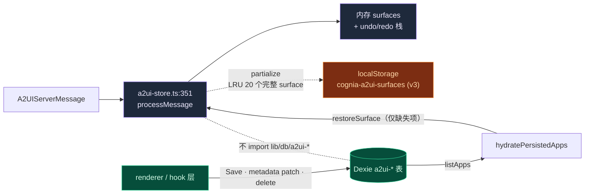
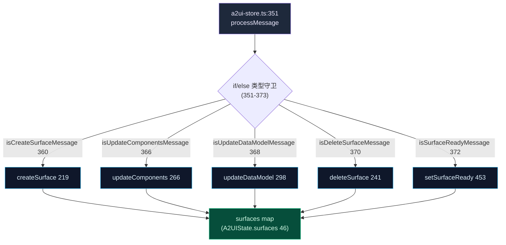
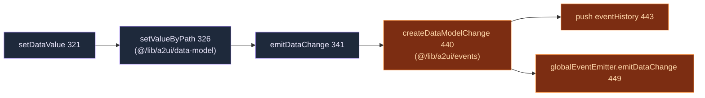

# 状态与持久化

<Status variant="experimental" />

<TLDR>
  A2UI 把状态保存在**两个相互独立的层**中，二者互不调用。Zustand store
  (`stores/a2ui/a2ui-store.ts`) 是所有 server message 的唯一摄入入口，也是运行时的事实来源。它把**最近 20 个
  ready surface 的完整内容**持久化到 `localStorage`（key 为 `cognia-a2ui-surfaces`）。四张 Dexie 表
  （`a2uiApps`、`a2uiSurfaces`、`a2uiTemplates`、`a2uiEventHistory`）是一个**独立的可持久化层**，由 renderer/hook
  层调用，store 不直接 import 它。在迷你应用路由中，`hydratePersistedApps()` 读取已保存的 `a2uiApps` 行，并通过
  `restoreSurface` 恢复缺失的运行时树；没有 durable row 的旧模板实例继续使用确定性重建作为兜底。undo/redo
  仅存在于内存中（50 条栈，300 ms 防抖）。
</TLDR>

<StatGrid>
  <Stat label="持久化层" value="2" hint="zustand→localStorage（20 个完整运行时 surface） · Dexie（durable 已保存行）" />
  <Stat label="localStorage LRU 上限" value="20" hint="MAX_PERSISTED_SURFACES，仅 ready surface" />
  <Stat label="撤销历史" value="50" hint="MAX_HISTORY_ENTRIES，300 ms 防抖" />
  <Stat label="event-history 上限" value="1000" hint="Dexie a2uiEventHistory，裁剪最旧 100 条" />
</StatGrid>

## 两个持久化层（请先读这里）

<Callout type="warn">
  Zustand store 与 Dexie `a2ui-*` 表是**两个相互独立的持久化层**。store 的 `partialize` 按 LRU 把 localStorage
  限制为最近 20 个 ready surface，但保留每个 surface 的完整 component tree 与 data model。Dexie **不被 store
  直接 import**；Save、hydrate、metadata patch 与 delete 都在 hook 中跨越 durable 边界。写 store 不会写 Dexie，
  但 `useA2UIAppBuilder.hydratePersistedApps()` 会有意读取 Dexie，并在运行时 surface 缺失时调用经过校验的
  `restoreSurface()` action。
</Callout>

| 关注点 | Zustand store (`a2ui-store.ts`) | Dexie 表 (`lib/db/a2ui-*.ts`) |
| --- | --- | --- |
| 介质 | `localStorage`（zustand `persist`） | IndexedDB（Dexie） |
| key / name | `cognia-a2ui-surfaces`（version 3） | 表 `a2uiApps` / `a2uiSurfaces` / `a2uiTemplates` / `a2uiEventHistory` |
| 保存内容 | 20 个完整 ready 运行时 surface（含 components/dataModel） | 完整已保存行：components、dataModel、rootId、审计 |
| 范围 | 运行时事实 + 上次会话恢复 | 用户保存的 app、panel/fullscreen surface、template、审计轨迹 |
| 上限 / 淘汰 | LRU 20 个 ready surface，按 `updatedAt` 降序 | event-history 裁剪到 1000 行 |
| 调用方 | 每条 server message + UI 动作 | renderer/hook 层（**不是** store） |
| undo/redo | 仅内存（不参与 persist） | — |



## store 作为消息入口

`useA2UIStore` (`a2ui-store.ts:212`) 通过 `create` 创建一次，持有整个运行时 A2UI 状态。每条 server message——
来自三条 dispatch 路径中的任意一条——都汇入 `processMessage` (`351`)。

### 状态结构

`A2UIState` (`44-65`)：

<TypeTable
  type={{
    surfaces: { type: "Record<string, A2UISurfaceState>", description: "46 — 每个 {id,type,catalogId,title,widget,components:Record<id,Component>,dataModel,rootId,createdAt,updatedAt,ready}" },
    activeSurfaceId: { type: "string | null", description: "47 — rehydrate 时重新推导" },
    eventHistory: { type: "A2UIEvent[]", description: "50 — userAction + dataModelChange，有上限" },
    maxEventHistory: { type: "number", description: "51 — 初值 100（@129）" },
    loadingSurfaces: { type: "Set / Record", description: "54" },
    streamingSurfaces: { type: "Set / Record", description: "57" },
    errors: { type: "Record<string, string>", description: "60" },
    "undoStacks / redoStacks": { type: "Record<string, A2UIHistoryEntry[]>", description: "63-64 — 不持久化" },
  }}
/>

相关类型与常量：`A2UIHistoryEntry` (`30`，一个对 `components` + `dataModel` 的 undo/redo 快照)；`A2UIActions`
(`70`)；`initialState` (`125`)；`MAX_HISTORY_ENTRIES = 50` (`38`)；`HISTORY_DEBOUNCE_MS = 300` (`39`)。
旧数据迁移辅助：`migrateLegacyComponent` (`144`，`DataExplorer → Table`)、`migrateComponentMap` (`154`)、
`normalizePersistedSurfaces` (`167`)。

### 动作表

| 动作 | 行号 | 说明 |
| --- | --- | --- |
| `createSurface` | 219 | 分配 surface |
| `deleteSurface` | 241 | 拆除 |
| `setActiveSurface` | 261 | |
| `updateComponents` | 266 | `pushSnapshot` (268) + `migrateLegacyComponent` (276) |
| `getComponent` | 292 | |
| `updateDataModel` | 298 | 快照 (300) + `deepMerge`/`deepClone` (306) |
| `setDataValue` | 321 | `setValueByPath` (326) 后 `emitDataChange` |
| `getDataValue` | 344 | `getValueByPath` (347) |
| `processMessage` | 351 | **唯一摄入入口**（路由见下） |
| `processMessages` | 377 | 批量 |
| `processMessageStream` | 384 | 流式 |
| `setSurfaceStreaming` | 413 | |
| `emitAction` | 426 | `createUserAction` (427) → eventHistory（按 `maxEventHistory` 切片，431）→ `globalEventEmitter.emitAction` (436) |
| `emitDataChange` | 439 | `createDataModelChange` (440) → eventHistory (443) → `globalEventEmitter.emitDataChange` (449) |
| `setSurfaceReady` | 453 | |
| `setSurfaceLoading` | 474 | |
| `setError` | 484 | |
| `pushSnapshot` | 500 | 300 ms 防抖 (509) |
| `undo` / `redo` | 540 / 580 | |
| `canUndo` / `canRedo` | 620 / 624 | |
| `getSurface` | 629 | |
| `clearEventHistory` | 633 | |
| `reset` | 637 | |

### `processMessage` 路由

`processMessage` (`351-373`) 从 `get()` (`352-358`) 解构相关动作，然后跑一条由五个类型守卫组成的 `if/else`
链（从 `@/lib/a2ui/parser` 导入）：

| 守卫 | 行号 | 调用 |
| --- | --- | --- |
| `isCreateSurfaceMessage` | 360 | `createSurface(surfaceId, surfaceType, {catalogId, title, widget})` (361) |
| `isUpdateComponentsMessage` | 366 | `updateComponents(surfaceId, components)` (367) |
| `isUpdateDataModelMessage` | 368 | `updateDataModel(surfaceId, data, merge)` (369) |
| `isDeleteSurfaceMessage` | 370 | `deleteSurface(surfaceId)` (371) |
| `isSurfaceReadyMessage` | 372 | `setSurfaceReady(surfaceId)` (373) |



### 出口路径

store 同时也是唯一的出口：用户变更通过 `globalEventEmitter` 流出。



`emitAction` (`426`) 遵循对称路径：`createUserAction` (`427`) → push `eventHistory` 并按 `maxEventHistory`
切片 (`431`) → `globalEventEmitter.emitAction` (`436`)。`updateDataModel` (`298`) 通过 `deepMerge` /
`deepClone` (`306`，来自 `@/lib/a2ui/data-model`) 合并。

### 选择器

barrel `stores/a2ui/index.ts` 重新导出 `useA2UIStore` 以及九个选择器 (`1-12`)：`selectSurface` (`710`)、
`selectActiveSurface` (`712`)、`selectSurfaceComponents` (`715`)、`selectSurfaceDataModel` (`718`)、
`selectIsSurfaceLoading` (`721`)、`selectSurfaceError` (`724`)、`selectEventHistory` (`727`)、
`selectRecentEvents` (`729`)、`selectIsSurfaceStreaming` (`732`)。

## 撤销 / 重做

undo/redo **仅在内存中**——`undoStacks` / `redoStacks` (`63-64`) 被排除在 persist `partialize` 之外。
一个快照捕获 `components` + `dataModel`（`A2UIHistoryEntry`，`30`）。

- `pushSnapshot` (`500`) **防抖 300 ms**（`HISTORY_DEBOUNCE_MS`，第 `509` 行），让快速连续的编辑合并为一步历史。
- 栈以 `MAX_HISTORY_ENTRIES = 50` (`38`) 为上限。
- `updateComponents` (`266`) 与 `updateDataModel` (`298`) 在变更前 push 一个快照。
- `undo` (`540`) / `redo` (`580`) 恢复快照；`canUndo` (`620`) / `canRedo` (`624`) 控制 UI。

## localStorage persist 配置

zustand `persist` 配置 (`641-702`)：

| 项 | 行号 | 行为 |
| --- | --- | --- |
| `name` | persist 配置 | `cognia-a2ui-surfaces` —— **localStorage**，不是 Dexie |
| `version` | persist 配置 | `3` |
| `migrate` | persist 配置 | → `normalizePersistedSurfaces` |
| `onRehydrateStorage` | persist 配置 | 重新规范化 surface，重新推导 `activeSurfaceId` |
| `partialize` | 当前 store persist 块 | LRU 上限 + 完整 surface（见下） |

`partialize` 是承重部分：

1. 按 LRU 上限取 `MAX_PERSISTED_SURFACES = 20`。
2. **只保留 `ready` surface**，按 `updatedAt` 降序。
3. 完整保留入选 surface，包括 `components`、`dataModel` 与 `rootId`。
4. 持久化 `{ surfaces: persistedSurfaces, activeSurfaceId }`；undo/redo 栈被排除。

LRU 窗口内的最近 surface 可由 store 直接恢复；窗口外的已保存 surface 由 `hydratePersistedApps()` 从
`a2uiApps` 恢复。只有不存在 durable row 的旧模板实例才走确定性模板重建。已有可渲染本地 surface 优先于
durable row，因此 hydrate 不会覆盖尚未保存的运行时编辑。

## 四张 Dexie 表

可持久化层位于 `lib/db/`。这些表最早在 Dexie `version(13)` 引入；**当前**的 schema 版本是
`version(118)`。表类声明在 `lib/db/schema.ts`。

### 行类型 (`lib/db/a2ui-types.ts`)

| 表 | 行类型 | 用途 |
| --- | --- | --- |
| `a2uiApps` | `A2UIAppRow` (35) | 用户保存的迷你 app |
| `a2uiSurfaces` | `A2UISurfaceRow` (65) | 运行时 panel/fullscreen surface（inline 留在内存） |
| `a2uiTemplates` | `A2UITemplateRow` (86) | 在内置之上的用户自定义模板 |
| `a2uiEventHistory` | `A2UIEventHistoryRow` (105) | 给 Debugger 用的有上限审计轨迹 |

<TypeTable
  type={{
    "A2UISurfaceRow": { type: "interface (65)", description: "id 66 · appId? 68 · sessionId? 70 · type 71 · components 72 · dataModel 73 · rootId 74 · catalogId? 75 · widget? 76 · createdAt 77 · updatedAt 78" },
    "A2UIAppRow": { type: "extends A2UIAppInstance (35)", description: "components 37 · dataModel 39 · rootId 41 · catalogId? 43 · widget? 45 · isBuiltIn? 47 · isFavorite? 49 · sortOrder? 51 · usageCount? 53 · lastUsedAt? 55 · updatedAt 57" },
    "A2UITemplateRow": { type: "interface (86)", description: "id 87 · name 88 · category 89 · description? 90 · components:A2UIComponent[] 91 · dataModel 92 · rootId 93 · isBuiltIn:false 94 · source:\"user\"|\"imported\" 95 · thumbnailUrl? 96 · createdAt 97 · updatedAt 98" },
    "A2UIEventHistoryRow": { type: "interface (105)", description: "id 106 · surfaceId 107 · type:\"userAction\"|\"dataModelChange\" 108 · payload 109 · timestamp 110" },
  }}
/>

### 索引字符串（自 v13 起未变）

| 表 | 声明 | 索引字符串 (`schema.ts`) |
| --- | --- | --- |
| `a2uiApps` | 114 | `id, name, updatedAt, createdAt, isBuiltIn, category, isFavorite, sortOrder` (573) |
| `a2uiSurfaces` | 115 | `id, appId, sessionId, updatedAt, createdAt, type` (574) |
| `a2uiTemplates` | 116 | `id, name, category, updatedAt, source` (575) |
| `a2uiEventHistory` | 117 | `id, surfaceId, [surfaceId+timestamp], timestamp, type` (576) |

`a2uiEventHistory` 上的 `[surfaceId+timestamp]` 复合索引支撑了按 surface 的逆时序事件查询。`version(13)` 块还会
upsert 进程内 `a2ui-bridge` MCP server 行，并回填 `a2uiEnabled = false`（`schema.ts:550`、`583`）。

### CRUD 函数

| 模块 | 函数 | 行号 | 说明 |
| --- | --- | --- | --- |
| `a2ui-apps.ts` | `listApps` / `getApp` | — | durable 已保存应用读取 |
| | `upsertApp` / `bulkUpsertApps` | — | 事务写入；已有 built-in 会拒绝整次写入 |
| | `patchAppMetadata` | — | 只改可变 metadata；未保存 id 返回 `false`；保留 component tree |
| | `deleteApp` | — | 若 `isBuiltIn` 则**抛出** `"Cannot delete built-in app"` |
| | `deleteAllUserApps` | — | 保留 built-in |
| | `touchApp` | — | 更新 `lastUsedAt` + `usageCount` |
| `a2ui-surfaces.ts` | `listSurfaces` | 8 | |
| | `getSurface` | 12 | |
| | `listSurfacesForSession` | 16 | |
| | `upsertSurface` | 20 | **排除 inline** —— `if type === "inline" return` (22) |
| | `deleteSurface` | 26 | |
| | `deleteAllSurfaces` | 30 | |
| `a2ui-templates.ts` | `listTemplates` | 8 | |
| | `getTemplate` | 12 | |
| | `listTemplatesByCategory` | 16 | |
| | `upsertTemplate` | 20 | |
| | `bulkUpsertTemplates` | 24 | 空守卫 |
| | `deleteTemplate` | 29 | |
| | `deleteAllUserTemplates` | 33 | |
| `a2ui-event-history.ts` | `appendEvent` | 13 | 尽力而为（try/catch 吞掉，22）；当 `count > MAX` 按 timestamp 删除最旧 100 条 (17-21) |
| | `listEvents` | 33 | limit 钳制 1..1000 (34)；给定 `surfaceId` 时用 `[surfaceId+timestamp]` 复合索引 (38-41)；逆时序；按 `type` 后置过滤 (44) |
| | `clearEvents` | 47 | |

### 可持久化层不变式

- **内置保护** —— single upsert、bulk upsert、metadata patch 与 delete 都拒绝修改已有 `isBuiltIn` app。
  bulk upsert 使用事务，因此与 built-in 同批的用户行也不会被部分写入。`deleteAllUserApps` 与
  `deleteAllUserTemplates` 都保留 built-in。
- **inline 排除** —— `upsertSurface` (`a2ui-surfaces.ts:20`) 对 `type === "inline"` 提前返回 (22)：inline
  surface 仅运行时存在，从不写入 Dexie。只有 `panel` / `fullscreen`（以及 `dialog`）surface 是可持久化的。
- **event-history 上限** —— `a2ui-event-history.ts` 以 `MAX_ROWS = 1000` (`9`) 为上限，超出时裁剪
  `TRIM_BATCH = 100` (`11`) 条最旧行；`appendEvent` 吞掉失败，使审计永不打断 UI 动作。

## schema 版本真相

<Callout type="info">
  A2UI 表**在 Dexie `version(13)` 引入**，该版本块包含四张 A2UI 表的定义，索引字符串自此未变。
  **当前/最新** schema 版本是 `version(118)`。因此 “Dexie v13” 表示引入版本，而不是线上 schema：描述
  “何时出现”时引用 v13，描述当前数据库时引用 v118。
</Callout>

## 文件

<Files>
```
stores/a2ui/
  a2ui-store.ts          # Zustand store —— processMessage (351)、persist (641-702)、undo/redo
  index.ts               # barrel：useA2UIStore + 9 个选择器

lib/db/
  schema.ts              # A2UI 表在 v13 引入；当前 schema v118
  a2ui-types.ts          # A2UIAppRow 35 · A2UISurfaceRow 65 · A2UITemplateRow 86 · A2UIEventHistoryRow 105
  a2ui-apps.ts           # 读取 · 受保护事务 upsert · metadata patch · delete · touch
  a2ui-surfaces.ts       # listSurfaces 8 … upsertSurface 20（排除 inline）… deleteAllSurfaces 30
  a2ui-templates.ts      # listTemplates 8 … upsertTemplate 20 … deleteAllUserTemplates 33
  a2ui-event-history.ts  # MAX_ROWS 1000 (9)、TRIM_BATCH 100 (11)、appendEvent 13、listEvents 33
```
</Files>

## 下一步

<Cards>
  <Card title="A2UI 系统" href="./index" description="子系统总览——五种 server message、三条 dispatch 路径、往返回路" />
  <Card title="协议核心" href="./protocol-core" description="Schema v0.9、parser、JSON-Pointer 数据模型与进程内事件总线" />
  <Card title="数据与存储" href="../../data/storage" description="更广的 Dexie schema 与存储架构" />
</Cards>
