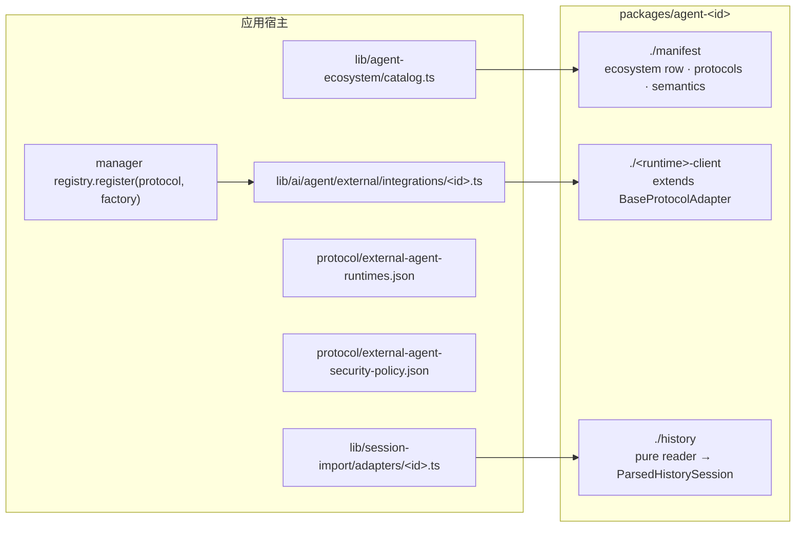

# 新增 Agent

一个集成就是一个了解某个运行时协议与格式的包。它从不直接触碰机器，从不决定策略，
也从不存储任何东西。`@cognia/agent-dsh`、`@cognia/agent-codex`、`@cognia/agent-aider` 与
`@cognia/agent-pi` 是参考实现，照着它们的布局做即可。



## 1. 判断是否需要一个包

- **普通 ACP agent 不需要自己的包**：它只是运行时目录中由 `@cognia/agent-acp` 的 ACP
  客户端运行的一行。厂商特例属于 ACP 厂商 profile（阶段 3；目前仍是客户端内部的分支）。
- **拥有自己协议的运行时**（某种 RPC 方言、SDK、每回合一个 CLI 进程）或**拥有自己
  会话存储的运行时**，才需要一个包。

## 2. 创建包

在 `packages/agent-<id>/` 下：

| 文件 | 内容 |
| --- | --- |
| `package.json` | `"private": true`、`"license": "AGPL-3.0-only"`、每个入口只发布 dist 的 `exports`（`types` / `import` / `require` / `default`），依赖 `@cognia/agent-contracts` 与 `@cognia/agent-runtime-kit`（`workspace:*`），不依赖其他 `@cognia` 包 |
| `tsconfig.json` | `paths` 只列出上述包，因此任何 `@/…` 导入都会编译失败 |
| `tsup.config.ts` | `src/` 下每个非测试模块都是公开子路径，ESM + CJS，`dts: true` 作为独立编译检查，同级 `@cognia/*` 包保持 external |
| `LICENSE` | 与同级包一致的 AGPL-3.0-only |
| `src/*.ts` + `src/*.test.ts` | 每个模块都有就近测试 |

然后接入工作区：在根 `package.json` 中加入 `workspace:*` 依赖（及其 `pnpm-lock.yaml`
importer），在根 `tsconfig.json` 中加入 `@cognia/agent-<id>` 的 paths，在
`jest.config.ts` 中加入 `moduleNameMapper`，若 CLI 导入它则修改 `cli/tsconfig.json`，
并在 `scripts/build/pack-test-agent-package.mjs` 中添加一个列出所有入口与冒烟程序的 spec。

## 3. Manifest

`./manifest` 是纯数据：导入它不得加载任何运行时、进程或传输模块（pack 测试会检查）。
它导出一个 `AgentIntegrationManifest`（`packages/agent-contracts/src/ecosystem.ts:81`）：

- `ecosystem`：`AgentEcosystemEntry` 行，包括运行时 id、会话来源 id、迁移厂商、
  根目录键、插件生态、subagent 与 memory id。`lib/agent-ecosystem/catalog.ts` 直接
  列出这一行而不是复制它（见 `codexManifest.ecosystem` 与
  `deepseekHarnessManifest.ecosystem`）。
- `protocols`：包的适配器所说的每个协议及其 `AgentExecutionSemantics`。

如实声明语义（`packages/agent-contracts/src/semantics.ts`）：

| 字段 | 要回答的问题 |
| --- | --- |
| `cancel.scope` | 停止一个回合时只结束该回合（`turn`）、会话（`session`）还是进程（`process`）？ |
| `cancel.reconnectsAfterCancel` | 取消后会话是否必须重新打开？ |
| `resume` | `native`、`relaunch-with-session`、`history-replay` 或 `unsupported` |
| `fork` | `native`、`native-turn-boundary`、`before-entry` 或 `unsupported` |
| `approvals` | `per-tool-call`、`profile-fixed` 或 `none` |
| `processModel` | `shared`、`per-session`、`per-turn` 或 `remote` |

这些不是装饰。若某会话的取消需要重连，管理器会把它从缓存中移除
（`lib/ai/agent/external/manager.ts` 中的 `cancel`）；Agent Team 也从不把结束会话的取消报告为
暂停（`ExternalAgentManager.cancelRetiresSession`）。什么都不声明的
适配器会被视为 `UNDECLARED_EXECUTION_SEMANTICS`：取消可能导致进程退出，不能恢复也
不能分叉，审批一律询问。

## 4. 运行时客户端

继承 `BaseProtocolAdapter`（`packages/agent-runtime-kit/src/base-adapter.ts:123`），
所有面向机器的依赖都从构造函数传入：

- `AgentProcessHost`（`packages/agent-contracts/src/host.ts:51`）：spawn、写入、终止、
  探测命令，以及订阅 stdout、stderr 与退出事件；
- `AgentFileHost`（`host.ts:81`）：运行时把状态放在工作区文件中时使用。每次读、写、删除都
  要指明允许的根目录；`isWithinRoot` 会在 agent 进程有机会绕过文件平面打开某个路径之前
  拒绝它（例如 Aider 的聊天文件与上下文文件）；
- 运行时经 HTTP 访问时（OpenCode 服务、A2A 对端、远程 ACP agent）使用 `AgentFetch`：
  宿主的流式 fetch，而不是全局 fetch；
- WebSocket 传输（远程 ACP agent）使用 `AgentWebSocketFactory`：宿主的套接字能携带认证
  头并遵守代理策略，裸 `WebSocket` 做不到；
- agent 要求宿主在其拥有的终端里运行命令时（ACP `terminal/*`、终端认证）使用
  `AgentTerminalHost`；
- `AgentOutboundGate`：**必需**，适配器发出的每个提示或载荷都要经过它；
- 只有宿主能回答的问题，用包内定义类型、由宿主实现的运行时专属服务接口来表达（例如 Pi 的
  `PiHostServices`：校验内置扩展、列出已存会话），而不是由包去调用字符串命令；
- 运行时需要时，再传入 `AgentLaunchEnvironmentResolver`、`AgentApprovalPolicy`、
  `AgentDiagnosticRedactor`（对进程输出做凭证脱敏）与 `AgentLogger`。

实现 `ExternalAgentAdapterCore`。可选能力（恢复、分叉、转向、会话模型、模型目录、认证、
压缩、会话列表）是带守卫的独立能力（`supportsResume(adapter)` 等），只有运行时确实支持
时才实现。

宿主需要的厂商专属控制是带类型的扩展，而不是类检查：

```ts
export const acmeControls = defineAdapterExtension<AcmeAdapter>(
  "acme.controls",
  (adapter) => (adapter instanceof AcmeAdapter ? adapter : undefined)
)
// host side
const acme = manager.getAdapterExtension(agentId, acmeControls)
```

## 5. 历史读取器（运行时保存会话时）

`./history` 把文件内容转换为 `ParsedHistorySession`
（`packages/agent-contracts/src/history.ts:85`）：中立的 `HistoryPart`、回合用量、
规范状态，以及一份明确列出它丢弃了什么的清单。使用 runtime kit 的 `historyText` /
`historyTool` / … 辅助函数构建 part（`packages/agent-runtime-kit/src/history.ts`）。

读取器从不读取文件系统，从不构建宿主行，也从不存储任何东西。每条诊断字符串都要经过
`HistoryReaderHost.redactText`（必需）；无法映射的记录使用 `boundedDiagnostic`。
`lib/session-import/adapters/` 下的宿主适配器负责发现，并用
`lib/session-import/history-to-stored.ts` 映射结果。

设置、命令、subagent 与 memory 的迁移读取器留在迁移子系统中（ADR-0107），不属于包。

## 6. 在宿主中注册

1. **适配器工厂**：`lib/ai/agent/external/integrations/<id>.ts`（附测试）用应用的进程
   宿主（`createAgentTransportProcessHost`）、需要时的文件宿主
   （`createAgentTransportFileHost`）、作为出站闸门的 `hasNoLeakingPiiDeep` 以及作为诊断
   脱敏器的 `redactCredentialText` 构建工厂（参见 `integrations/dsh.ts` 与
   `integrations/aider.ts`）。管理器在 `registerBuiltinProtocolAdapters` 中按协议注册它。
2. **运行时与预设行**：`protocol/external-agent-runtimes.json`，由
   `pnpm audit:external-agent-runtimes` 检查。
3. **授权单独处理**：spawn 白名单与审批默认值在
   `protocol/external-agent-security-policy.json` 和宿主权限守卫中。注册包或在 manifest
   中声明需求都不会授予任何权限。
4. **CLI**：若 CLI 也要运行该 agent，为它提供同一组端口的 Node 实现。

## 7. 验证

```bash
pnpm test -- packages/agent-<id>
```

```bash
node scripts/build/pack-test-agent-package.mjs agent-<id>
```

```bash
pnpm audit:external-agent-runtimes
```

为声明的语义补一个管理器级测试，例如取消一个 `process` 级会话后它会从缓存中移除。
