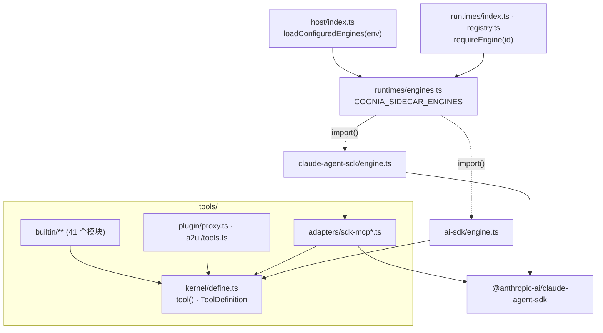

# 引擎与工具

sidecar 承载两个内置引擎：**Claude Agent SDK** 引擎
（`sidecar/src/runtimes/claude-agent-sdk/`）和供应商中立的 **AI SDK** 引擎
（`sidecar/src/runtimes/ai-sdk/`）。AI SDK 引擎、宿主和内置工具无需 Claude Agent SDK
即可运行；只有宿主加载 Claude 引擎时才会加载该 SDK。



## 引擎加载

`sidecar/src/runtimes/engines.ts` 拥有引擎表：

- `COGNIA_SIDECAR_ENGINES`（`ENGINES_ENV`，`engines.ts:24`）是由 `claude-agent-sdk` 与
  `ai-sdk` 组成的逗号列表。未设置或为空时两个都加载，目前所有宿主都是如此。未知 id 会让
  宿主在读取第一帧之前停止（`enginesFromEnv`，`engines.ts:27`；入口记录错误并以 1 退出）。
- `loadEngines`（`engines.ts:48`）动态导入每个引擎的外观模块（`claude-agent-sdk/engine.ts`、
  `ai-sdk/engine.ts`），只导入一次。
- 路由通过 `requireEngine(id)`（`engines.ts:61`）访问引擎（`runtimes/index.ts:50`、
  `runtimes/registry.ts:26`）。宿主未加载的引擎会以
  `runtime engine "<id>" is not loaded on this host` 失败关闭：回合以该错误结束，
  不会有其他引擎顶替。
- `loadConfiguredEngines(env)`（`host/index.ts:91`）在宿主接受帧之前运行
  （`entry/agent-host.ts`）。
- `session_api`（列出、读取、分叉已存储会话）是 Claude Agent SDK 的功能；没有该引擎的宿主
  会回答 `session API requires the "claude-agent-sdk" engine, which this host did not load`。

能力表（`runtimes/capabilities.ts`、`runtimes/registry.ts`）无需加载任何引擎即可导入，
所以路由决策与能力检查不会加载引擎。

引擎不会在调用方不知情时被重试：每个引擎保留自己的重试规则，加载或选择引擎都不会额外增加重试。

## 工具

内置工具只定义一次，且与引擎无关（示意）：

```ts
import { tool } from "../../kernel/define.ts"

export const gitDiff = tool(
  "git_diff",
  "Show the working-tree diff",
  { path: z.string().optional() },
  async (args) => toolText(await diff(args.path)),
  { searchHint: "diff changes", alwaysLoad: false }
)
```

`tool()`（`sidecar/src/tools/kernel/define.ts:61`）返回只含中立字段（`alwaysLoad`、
`searchHint`）的 `ToolDefinition`，由各引擎各自翻译：

| 引擎 | 翻译方式 |
| --- | --- |
| Claude Agent SDK | `toSdkMcpToolDefinition`（`tools/adapters/sdk-mcp.ts:77`）写入 `_meta["anthropic/alwaysLoad"]` 与 `_meta["anthropic/searchHint"]`；`buildPluginToolsServer` 与 `buildA2UIBridgeServer`（`tools/adapters/sdk-mcp-{plugin,a2ui}.ts`）把中立的插件与 A2UI 定义包装成 SDK MCP 服务器 |
| AI SDK | 直接读取 `def.alwaysLoad` 与 zod schema |
| 外部 agent | MCP 工具桥提供同一批定义；`parseToolArgs` / `toolInputJsonSchema`（`tools/kernel/args.ts`）从同一个 zod 形状推导对外公布的 JSON Schema 并校验参数 |

插件往返（`tools/plugin/proxy.ts`，`buildPluginToolDefinitions`）与 A2UI 工具
（`tools/a2ui/tools.ts`，`buildA2UIToolDefinitions`）都是中立的；只有适配器会用它们构建 SDK 服务器。

## Wire 不依赖 SDK

sidecar 的 `SendOptions`（`sidecar/src/shared/wire/inbound.ts`）的运行模式字段取自渲染端自己的
契约，而不是 SDK 的 `Options`：

| 字段 | 类型 |
| --- | --- |
| `permissionMode` | `AgentPermissionMode`（`@cognia/agent-config-types/agent-modes`） |
| `settingSources` | `AgentSettingSource[]` |
| `effort` | `AgentEffortLevel` |
| `agents` | `Record<string, AgentDefinition>`（`@cognia/agent-config-types/claude-agent-sdk-options`） |
| `mcpServers` | `Record<string, McpServerWireConfig>` |

因此渲染端与 sidecar 共享同一份定义。Claude 引擎把这些值交给 SDK `Options` 时是一次受检
赋值：若 SDK 修改了某个联合类型，这次交接会编译失败，而不是让 wire 悄悄跟着 SDK 变化。

账本闸门也以同样方式拆分：`runtimes/common/call-ledger-gate.ts` 与引擎无关；具有 SDK 形状的
信封模式 hook（`buildLedgerToolHooks`）位于 `runtimes/claude-agent-sdk/ledger.ts`。

## 厂商闸门

`pnpm audit:sidecar-architecture` 强制执行这一拆分
（`scripts/gates/sidecar-architecture.json`，`vendorIsolation`）：

- **运行时闭包。** 从 `entry/agent-host.ts`、`runtimes/ai-sdk/engine.ts`、
  `tools/kernel/define.ts`、`tools/plugin/proxy.ts` 与 `tools/a2ui/tools.ts` 出发，
  没有任何静态值导入能到达 `@anthropic-ai/claude-agent-sdk`。动态导入（引擎加载器）与
  仅类型导入在此不计。
- **`allowedIn`。** 在 `runtimes/claude-agent-sdk/`、`tools/adapters/sdk-mcp*`、
  `hooks/events*`、`hooks/native-executor*` 以及 Claude 引擎的测试脚手架之外，任何文件
  都不得引用该 SDK，仅类型导入也不行。这两个 hook 模块只会经由 Claude 引擎的
  `options.ts`（通过 `hooks/agent-hooks.ts`）被访问。

`sidecar/src/runtimes/engines.test.ts` 在运行时证明这一点。它在 SDK 无法解析的情况下
（`test-support/block-claude-agent-sdk.ts`）启动真实宿主，并检查三件事：一次 AI SDK 回合
能对一个脚本化的 OpenAI 兼容服务完成；Anthropic 回合与 `session_api` 会以上述错误被拒绝；
要求加载 Claude 引擎的宿主无法启动。

## 限制

- **引擎不是 npm 包。** 它们位于 sidecar 中，这是一个拥有独立 lockfile 的 Node 项目，
  以未构建方式运行（ADR-0197），并独立进行类型检查与测试（`pnpm sidecar:typecheck`、
  `pnpm sidecar:test`）。宿主以进程方式使用它：桌面应用启动它，Agent SDK 则把它的 agent
  host 作为 `@cognia/agent-host-*` 二进制发布。
- **工具内核留在 sidecar 中。** `parseToolArgs` 与 `toolInputJsonSchema` 会对用 sidecar
  自身 zod 构建的 schema 调用 `z.object` 与 `z.toJSONSchema`。`link:` 包会把真实路径解析到
  根 `node_modules`，从而看到第二份 zod；而转换按设计会失败开放（无法表示的 schema 会公布为
  空对象）。因此副本不一致会悄悄抹掉所有工具的 schema。其他宿主已经通过 MCP 工具桥复用这些工具。
- **不带 SDK 构建的宿主仍需要 SDK 的类型才能对整个 sidecar 做类型检查。** 引擎加载器的表
  以 Claude 引擎外观模块为类型。上述白名单之外的每个模块都不含 SDK 类型。
