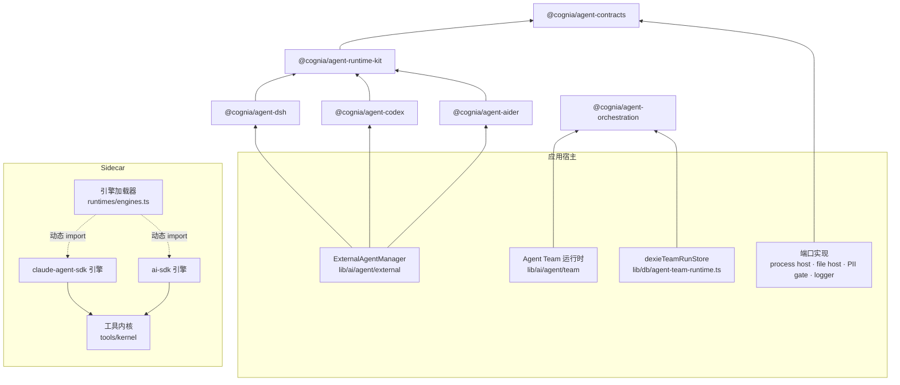

# Agent 包

# ADR-0217 · 工作区包位于 `packages/agent-*` · sidecar 引擎位于 `sidecar/src/runtimes/`

过去 agent 代码是应用私有的：集成与运行它们的管理器放在一起，直接导入 Tauri 封装、
日志器、PII 闸门和任务工作区存储；持久化 Agent Team 协调器直接写 Dexie；AI SDK
引擎离开 Claude Agent SDK 就无法加载。第二个宿主想复用其中任何部分，只能复制代码，
或在打包时替换模块。

ADR-0217 把这些代码移到契约之后：包拥有协议、格式和编排规则；宿主拥有机器、策略与持久化。

## 包结构与依赖方向

```
@cognia/agent-contracts        types and tiny pure helpers; no runtime dependency
        ▲                      (the ACP SDK is a type-only dependency, pinned exactly)
@cognia/agent-runtime-kit      BaseProtocolAdapter, JSON-RPC peer, LF frame decoder,
        ▲                      spawn reclaim, content blocks, history builders
@cognia/agent-<integration>    ./manifest, the runtime client(s), ./history when the
        ▲                      runtime keeps its own session store
        │                      (today: agent-dsh, agent-codex, agent-aider)
host (app, CLI, headless)      registers integrations, implements the ports, owns policy,
                               PII, sandbox, persistence and the mapping into its own rows

@cognia/agent-orchestration    durable team run records, the TeamRunStore port, the
                               coordinator behind host ports, decision and evidence
                               ledgers, replay safety, fair scheduling; zero dependencies

sidecar engines                claude-agent-sdk and ai-sdk under sidecar/src/runtimes/,
                               loaded per host; engine-neutral tool kernel in
                               sidecar/src/tools/kernel/
```



| 包 | 入口 | 依赖 |
| --- | --- | --- |
| `@cognia/agent-contracts` | `./ecosystem`、`./adapter`、`./adapter-extension`、`./semantics`、`./host`、`./history`、`./external-agent`、`./canonical-event`、… | 仅类型依赖 `@agentclientprotocol/sdk` |
| `@cognia/agent-runtime-kit` | `./base-adapter`、`./json-rpc-peer`、`./history`、`./prompt-gate`、`./plugin-compat`、… | contracts |
| `@cognia/agent-dsh` | `./manifest`、`./sdk-client`、`./transport`、`./managed-launch`、… | contracts、runtime kit |
| `@cognia/agent-aider` | `./manifest`、`./cli-client`、`./history` | contracts、runtime kit |
| `@cognia/agent-codex` | `./manifest`、`./app-server-client`、`./history`、`./mcp-config`、… | contracts、runtime kit |
| `@cognia/agent-orchestration` | `./coordinator`、`./store`、`./memory-store`、`./store-contract`、`./decision-ledger`、`./evidence`、… | 无 |

每个包都遵守的规则：

1. **不导入宿主。** 从不导入 `@/…`、React、Tauri、Dexie 或 zustand。每个包的
   `tsconfig.json` 在 `paths` 中只列出它可依赖的包，越界导入会编译失败。
2. **集成只依赖 contracts 和 runtime kit**，集成之间互不依赖。
3. **`./manifest` 与 `./history` 不加载任何运行时、进程或传输模块。** pack 测试通过
   已安装 tarball 的 CommonJS 模块缓存来证明这一点。
4. **可作为制品安装。** 每个包都是 `private`、AGPL-3.0-only、只发布 dist
   （`types` / `import` / `require` / `default`）。`pnpm agent:packages:pack-test`
   把它连同 `@cognia` 依赖一起打包，在工作区外从 tarball 安装，通过 ESM 和 CJS 加载
   每个入口，运行冒烟程序，并对严格 NodeNext 消费方做类型检查。
5. **声明能力不等于授予能力。** manifest 只说明集成需要什么；宿主的 spawn 白名单、
   沙箱、放置策略、权限守卫与审计决定它实际得到什么。

## 谁拥有什么

| 关注点 | 拥有者 |
| --- | --- |
| Agent 身份 | 复用现有来源：`lib/agent-ecosystem`（行由集成 manifest 导出）、`protocol/external-agent-runtimes.json`（运行时与预设）、`ExternalAgentConfig.id`（实例）。没有新增注册表。 |
| 协议、会话存储格式、执行语义 | 集成包 |
| 进程平面、工作区文件、凭证、审批策略、PII 闸门、诊断脱敏、日志 | 宿主，通过 `@cognia/agent-contracts/host` 中的端口 |
| 把中立转录映射为存储消息 | 宿主（`lib/session-import/history-to-stored.ts`） |
| 团队运行状态 | 宿主的 `TeamRunStore`（应用中为 Dexie）；协调器不持有任何跨重启保留的状态 |
| 引擎选择 | 宿主进程（`COGNIA_SIDECAR_ENGINES`） |

## 迁移状态

| 范围 | 状态 |
| --- | --- |
| Contracts、runtime kit | 完成：`@cognia/agent-contracts`、`@cognia/agent-runtime-kit` |
| DeepSeek Harness | 完成：`@cognia/agent-dsh`；管理器与团队协调器都遵守进程级取消 |
| Codex | 完成：`@cognia/agent-codex`（app-server 适配器、历史读取器）；原生恢复绑定其配置 |
| 插件适配器 | 完成：创建时即按适配器核心检查（`./plugin-compat`） |
| Aider | 完成：`@cognia/agent-aider`（基于进程与文件端口的 CLI 适配器、历史读取器）；声明了每回合一个进程的语义，因此取消后的 Aider 会话会被保留而不是被退役 |
| ACP、Pi、OpenCode、Claude Code、A2A、Devin、Kimi 以及 ACP 行生态 | 尚未迁移（阶段 3 进行中） |
| 由 manifest 生成目录行、CLI 端口注入、移除管理器 `instanceof` | 尚未完成（阶段 3） |
| 引擎与工具 | 完成：AI SDK 引擎与宿主无需 Claude Agent SDK 即可运行；wire 与共享运行时模块不再引用它，连类型也不引用 |
| 编排 | 运行状态、账本、协调器、调度与恢复已完成；团队闸门、队友池、波次运行器与合成工作流仍留在应用中（它们以应用的 `AgentTeam` 模型为类型） |

按生态与卫星注册表逐行列出的完整矩阵见
`docs/plans/2026-10-05-agent-package-architecture.md`。

## 兼容性

- **旧导入路径重导出其新位置**：`types/agent/external-agent.ts`、
  `types/agent/external-agent-lifecycle.ts`、`lib/agent-ecosystem/types.ts`、
  `lib/ai/agent/external/protocol-adapter.ts`，以及
  `@cognia/agent-config-types/{agent-execution,canonical-session,ref-safety,external-agent-capability}`。
  `AgentPermissionMode` 与 `AGENT_PERMISSION_MODES` 仍从 `@cognia/agent-config-types`
  根导出；它们声明在 `./agent-modes` 中。
- **存储数据不变。** 配置、会话、导入绑定与团队运行表保持原有结构；
  `runtimeBinding.agentConfigId` 可选，没有它的绑定按原方式解析。
- **插件适配器**仍通过同一 overlay 注册；缺少核心成员的适配器在创建时就会被报告，
  而不是等到管理器第一次调用它。
- **未做任何设置的宿主**仍会加载两个 sidecar 引擎，与以前一致。
- **升级包不等于原生更新。** 集成包只改变协议处理；进程平面、安全策略、沙箱和 Tauri
  命令仍由宿主发布。

## 闸门

| 闸门 | 保证 |
| --- | --- |
| `pnpm agent:packages:pack-test`（在 `check-all` 中） | 每个包都能从 tarball 安装，并通过 ESM、CJS 与 NodeNext 消费方加载；manifest 与 history 入口不加载运行时代码 |
| `pnpm audit:sidecar-architecture` | sidecar 分层；厂商隔离：宿主、AI SDK 引擎与中立工具从不加载 Claude Agent SDK，且只有 Claude 引擎、它的 MCP 适配器和原生 hook 执行器会引用它 |
| `pnpm sidecar:typecheck`、`pnpm sidecar:test` | 严格的 sidecar 类型；在 SDK 无法解析时启动的宿主能跑完一次 AI SDK 回合，并拒绝仅限 Claude 的工作 |
| `pnpm audit:external-agent-runtimes` | 运行时与预设目录 |
| `lib/workflow/nodes/teams/team-runtime-port.test.ts` | `lib/workflow` 不从 Agent Team 导入任何内容 |
| `pnpm test` | 包测试套件以就近方式在 Jest 的 `node` 项目中运行；`audit:colocated-tests` 不扫描 `packages/`，因此这条约定靠评审而非闸门维持 |
