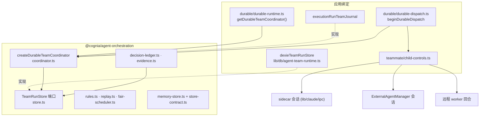

# 编排

`@cognia/agent-orchestration` 是持久化 Agent Team 与宿主无关的核心，没有任何依赖。它拥有
运行记录、持久化规则、协调器（准入、公平调度、工作区租约、转向、暂停、接管与恢复）、决策
与证据账本以及重放安全规则。数据库、日志、PII 脱敏、路径语义以及 agent 本身由应用提供。

## 谁持有状态

**存储是唯一的权威。** `TeamRunStore`（`packages/agent-orchestration/src/store.ts`）保存运行、
子运行、派发租约与尝试隔离（attempt fencing）、单调递增的轨迹、检查点、转向队列、证据、
决策与已校验内容。

- **原子变更。** `atomically(operation)` 把相关写入作为一个单元执行。应用的
  `dexieTeamRunStore`（`lib/db/agent-team-runtime.ts:607`）把它映射为覆盖所有团队表的
  Dexie 读写事务。
- **比较并设置写入。** `updateRunIfCurrent` 与 `updateChildIfCurrent` 只在行仍是调用方读到的
  状态时写入。租约操作（`claimDispatchLease`、`renewDispatchLease`、`settleDispatchLease`）
  隔离每次派发尝试，过期的执行方无法覆盖更新的执行方。
- **一致性。** `store-contract.ts` 是一致性测试套件；参考实现 `createMemoryTeamRunStore` 与
  Dexie 存储都通过它，新的宿主存储也必须通过。

**协调器只持有进程内、可重建的状态**（`coordinator.ts:239`–`250`）：活动子控制、每个子运行的
写入队列、进行中的文件所有权、调度队列、准入等待者以及已暂停运行的集合。这些都不会跨重启
保留，也无需保留：`recover()`（`coordinator.ts:664`）从存储重建。对
`listRecoveryCandidates()` 中的每个运行，它读取每个未完成子运行的最新检查点与运行轨迹，然后：

- 只有当所有子运行都可安全重放时才重放该运行（`recovering`）；
- 否则以 `uncertain_side_effect` 将其停放为 `needs_input`。

它从不重跑可能已经产生副作用的步骤。

## 宿主实现的端口

`createDurableTeamCoordinator(options)`（`coordinator.ts:87`）：

| 选项 | 契约 | 应用绑定（`lib/ai/agent/team/durable/durable-runtime.ts`） |
| --- | --- | --- |
| `store` | `TeamRunStore` | `dexieTeamRunStore` |
| `journal` | `TeamRunJournal.runPrepared`——记录运行开始或恢复 | `executionRunTeamJournal`，以 `agentTeamExecutionRunId` 为键，使桥接层与协调器汇聚到同一执行行 |
| `redactForPersistence` | **必需**；返回脱敏文本，或返回 `undefined` 拒绝写入 | `redactTeamTextForPersistence`（`@cognia/redact`） |
| `paths` | `TeamPathPolicy`——规范化、是否位于根目录内 | `appTeamPathPolicy`（`lib/files/permissions`） |
| `remoteSessions` | 远程子运行终止后调用 `TeamRemoteSessions.release` | `fleetTeamRemoteSessions` |
| `now`、`globalConcurrency`、`agingIntervalMs` | 时钟与调度调优 | 默认值 |

协调器的输入是 `DurableTeamSpec`，而不是应用的 `AgentTeam`。`durableTeamSpec(team)` 是唯一的
映射，因此不存在需要同步的第二个团队模型。

## 编排如何调用 agent

协调器从不启动 agent。应用的 Agent Team 运行时挑选下一个任务，`beginDurableDispatch`
（`lib/ai/agent/team/durable/durable-dispatch.ts:66`）包裹一次队友回合：

1. **登记。** 通过协调器的存储原子地写入准入与子运行行（尝试、租约、所有权）。
2. **启动。** 启动后端：sidecar 中的内置引擎会话、经 `ExternalAgentManager` 的外部 agent
   会话，或远程 worker 上的一个回合。
3. **挂接控制。** `attachControl(control, sessionId)` 把 `teammate/child-controls.ts` 为该后端
   构建的 `DurableChildControl`（`steer`、`pause`、`resume`、`terminate`）交给协调器。
4. **捕获、检查点、结算。** 回合流式输出时捕获轨迹事件、记录检查点，回合结束时结算租约。

来自 UI 或 lead 的控制都经过协调器：

- **转向（steer）** 在调用活动控制之前先持久化一条脱敏回执和一条轨迹记录。没有活动会话的
  子运行，或投递失败的情况，回执会保持排队，留待其下一回合。
- **暂停（pause）** 先以比较并设置把子运行记录为 `pausing` 并停止新的准入。暂停是协作式的，
  从不终止进行中的工具调用；随后调用控制，并把子运行定为 `paused` 或 `needs_input`。
- **终止（terminate）** 中止准入、调用控制、记录 `terminated`，并通过 `TeamRemoteSessions`
  释放远程会话。

## 执行语义：暂停并不总是暂停

每个后端的控制都如实反映其停止操作实际影响的范围：

| 构建器 | 暂停 |
| --- | --- |
| `sidecarSessionControl`（`child-controls.ts:61`） | 中断；会话保留，子运行为 `paused` |
| `externalSessionControl`（`child-controls.ts:32`） | 在取消**之前**询问 `manager.cancelRetiresSession`。若运行时的取消会终结会话（需要重连的 `process` 或 `session` 级取消，例如 DeepSeek Harness），则释放该会话，暂停结果交由检查点决定 |
| `remoteTurnControl`（`child-controls.ts:86`） | 结束远程回合，结果交由检查点决定；命令 id 由派发租约派生，因此能识别重放的命令 |

"交由检查点决定"是指：

- 只有可安全重放时，子运行才被停放为 `paused`；
- 若存在未完成的工具调用，则停放为 `needs_input`，并清除其会话 id。

已不存在的会话从不会被报告为干净地暂停。一个在同一持久化运行上混合内置与外部队友的团队测试
（`child-controls.test.ts`）固定了这一行为。

## 工作流组合

`lib/workflow` 注册团队节点类型，但通过一个可安装端口运行它们
（`lib/workflow/nodes/teams/team-runtime-port.ts`）。实现位于
`lib/ai/agent/team/workflow-nodes`，由桌面工作流 provider、headless brain 与团队生命周期安装。
边界测试（`team-runtime-port.test.ts`）保证 `lib/workflow` 不导入 Agent Team，从而让
Team↔Workflow 导入环保持断开。

## 仍留在应用中的部分

下列模块以应用的 `AgentTeam` 模型为类型（`types/agent/agent-team.ts`，2,165 行，导入了 twin、
编辑器、外部预设与 PR 观察等类型）：

- 团队闸门，含预算守卫（`lib/ai/agent/team/gates/`）；
- 队友池；
- 波次运行器；
- 合成工作流。

其中若干模块还会访问 Dexie、store 或审批总线。迁移它们需要先拆分这个类型族；而为它再建一份
中立副本会形成需要人工同步的第二个模型，因此没有这样做。启动队友同样仍是应用代码
（`dispatch-teammate.ts`）：包只通过 `DurableChildControl` 看到运行中的队友，而不是通过
`TeammateExecutor` 端口。
