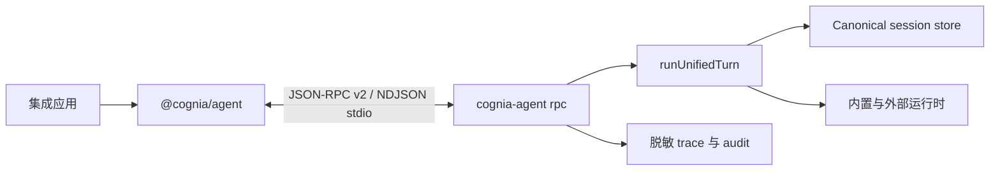

# 外部 Agent SDK

`@cognia/agent` 是面向 Node.js 应用的强类型客户端，使集成方无需嵌入 Cognia 应用依赖图即可运行 Agent。Provider 凭据、模型适配器、持久化、权限、插件、MCP、sandbox policy 与审计数据都留在本机 `cognia-agent rpc` host 内。



该包不包含模型运行时，也不接受 provider key。它先查找与 SDK 版本一致的 macOS arm64、Linux x64 或 Windows x64 optional host package，再回退到 `PATH` 中的 `cognia-agent`。托管部署和测试还可指定可执行文件路径或注入已连接的 streams。安装或启动期间不会下载可执行代码。

```ts
import { createCogniaClient } from "@cognia/agent"

await using client = await createCogniaClient()
await using session = await client.sessions.create({ name: "release-fix" })

const events = session.events()
const outcome = await session.run("诊断并修复失败的构建")
```

host 会在初始化时声明真实实现的方法。未声明的方法返回 `unsupported_capability`，不会伪造成功结果。

## 实现索引

| 职责 | 权威实现 |
| --- | --- |
| 公开客户端与反向 callback | `packages/agent/src/client.ts` |
| 协议 schema 与 method map | `packages/agent/src/rpc/protocol.ts` |
| Host 发现 | `packages/agent/src/host.ts` |
| RPC framing、协商与限制 | `cli/src/agent/rpc/server.ts` |
| Session 与运行时编排 | `cli/src/agent/rpc/runtime-service.ts` |
| Canonical 持久化与分支 | `cli/src/agent/session-store/store.ts` |
| 持久 action 与 receipt | `cli/src/agent/rpc/durable-state.ts` |

它与插件专用的 `ctx.agent` API 不同。外部 SDK 跨越进程边界，因此负责重连、重放、host 发现和协议兼容性。
