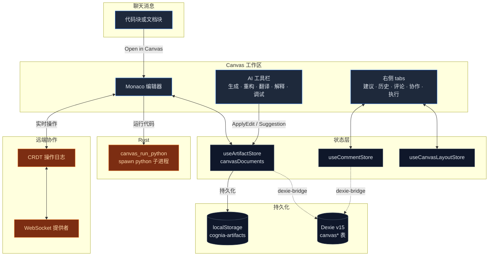
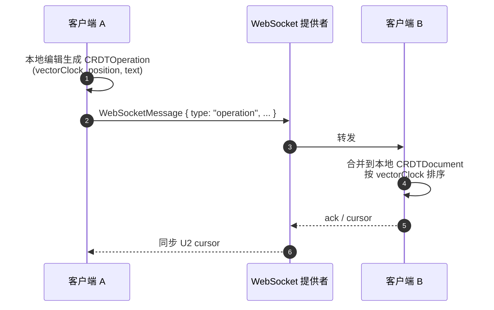

# Canvas

## 它是什么

Canvas 是 Cognia 风格的「Workspace」体验：用户从聊天发起一段代码 / 文档生成，点
「Open in Canvas」就在右侧打开一个真正的 Monaco 编辑器。在这里：

- AI 可以**继续改写**当前文档（生成新版本、给出建议、批量重构）。
- 文档有**版本历史**——任何 AI 改动或手动保存都生成一个 `CanvasDocumentVersion`
  快照。
- 多个客户端可以**协同编辑**（通过 WebSocket + CRDT）。
- 内嵌的 **Python 执行面板**让用户在编辑器旁立刻跑代码看结果。
- **评论 + 反应**像 Google Docs——在某一行 / 选区上评论。

Canvas 与 [Artifacts](./artifacts-sandbox) 是两条路径：

- **Artifact** —— 一次性生成的内容产物，沙箱化 iframe 渲染。
- **Canvas** —— 可持续编辑的文档，Monaco 直接挂主 React 树。

实战中两者衔接得很紧：用户经常 `从 Artifact "升级"到 Canvas`，把模型的初稿拿来
迭代。

## 代码位置

<Files>
  <Folder name="lib/canvas/" defaultOpen>
    <File name="index.ts — 桶导出" />
    <File name="dexie-bridge.ts — Zustand ↔ Dexie 写穿桥" />
    <File name="monaco-loader.ts — 离线 Monaco 资源配置（Tauri）" />
    <File name="large-file-optimizer.ts — 大文件分块策略" />
    <File name="feature-flags.ts — aiWorkbench / collaboration 开关" />
    <File name="utils.ts — 通用工具" />
    <Folder name="ai/">
      <File name="context-analyzer.ts — 给 AI 拼上下文（symbol、imports、cursor）" />
    </Folder>
    <Folder name="collaboration/">
      <File name="crdt-store.ts — 简化版 CRDT，向量时钟" />
      <File name="websocket-provider.ts — WS 客户端 + 重连 + 心跳" />
    </Folder>
    <Folder name="snippets/">
      <File name="snippet-registry.ts — 代码片段注册" />
    </Folder>
    <Folder name="symbols/">
      <File name="symbol-parser.ts — 按语言抽取 symbol（function/class/...）" />
    </Folder>
    <Folder name="themes/">
      <File name="theme-registry.ts — Monaco 主题注册" />
    </Folder>
    <Folder name="plugins/">
      <File name="plugin-manager.ts — Canvas 内 Monaco 插件挂载" />
    </Folder>
  </Folder>
  <Folder name="components/canvas/">
    <File name="canvas-panel.tsx — 编辑器主体（Monaco + AI 工具栏）" />
    <File name="canvas-shell.tsx — 路由进入点 + 文档 tabs + side panels 编排" />
    <File name="canvas-workspace.tsx — 跨平台 layout（移动 / 桌面）" />
    <File name="canvas-side-panels.tsx — 五个 tab 的右侧栏" />
    <File name="canvas-document-list.tsx — 左侧文档列表 / rail" />
    <File name="canvas-document-tabs.tsx — 顶部文档 tabs" />
    <File name="canvas-empty-state.tsx" />
    <File name="canvas-error-boundary.tsx" />
    <File name="code-execution-panel.tsx — Python 执行 + 终端输出" />
    <File name="comment-panel.tsx — 评论 thread + reactions" />
    <File name="collaboration-panel.tsx — 多人状态 + 邀请链接" />
    <File name="suggestions-panel.tsx — AI 建议接受 / 拒绝" />
    <File name="version-history-panel.tsx + version-diff-view.tsx — 版本快照 + diff" />
    <File name="suggestion-item.tsx · rename-dialog.tsx · keybinding-settings.tsx" />
  </Folder>
  <Folder name="src-tauri/src/canvas/">
    <File name="mod.rs — 模块入口" />
    <File name="python_exec.rs — 子进程 spawn + timeout，canvas_run_python 命令" />
  </Folder>
  <Folder name="app/canvas/">
    <File name="join/page.tsx — /canvas/join?session=... 接受协作邀请链接" />
  </Folder>
  <Folder name="lib/db/">
    <File name="canvas-types.ts — 行类型" />
    <File name="canvas-documents.ts · canvas-versions.ts · canvas-comments.ts · canvas-sessions.ts — CRUD" />
  </Folder>
  <Folder name="stores/">
    <File name="artifact/artifact-store.ts — canvasDocuments + versions（CanvasDocument 嵌套 versions[]）" />
    <File name="canvas/comment-store.ts — 评论" />
    <File name="canvas/canvas-layout-store.ts — 右侧 tab 状态" />
    <File name="canvas/canvas-settings-store.ts — 用户偏好（自动保存、协作 url）" />
    <File name="canvas/chunked-document-store.ts — 大文件分块" />
    <File name="canvas/keybinding-store.ts — 自定义快捷键" />
  </Folder>
</Files>

## 工作流



## 编辑器内核

`components/canvas/canvas-panel.tsx` 包裹 `@monaco-editor/react`：

- **Lazy load** —— Monaco 是个大包，通过 `next/dynamic` 在客户端按需加载。
- **离线 Monaco（Tauri）** —— `lib/canvas/monaco-loader.ts:configureMonacoLoader()`
  把 loader 指到 `public/monaco/vs/`，避开 CDN（Tauri 严格 CSP 不允许跨源脚本）。
  build 前的 `prebuild` 脚本会把 `node_modules/monaco-editor/min/vs` 拷过去。
- **主题** —— `useTheme()` 把 `vs` / `vs-dark` 同步给 Monaco；自定义主题通过
  `lib/canvas/themes/theme-registry.ts` 注册。
- **快捷键** —— `useCanvasKeyboardShortcuts()` 接管 `Cmd+S`、`Cmd+K`（AI 调用）
  等；`stores/canvas/keybinding-store.ts` 允许用户自定义。
- **大文件** —— `lib/canvas/large-file-optimizer.ts` 在 100KB 以上分块加载，避免
  锁住主线程。

## AI 操作

工具栏暴露的动作（`useCanvasActions`）映射到 `lib/ai/generation/canvas-actions.ts`
的 `CanvasActionType`：

| 动作        | 输入         | 产物                                 |
| ----------- | ------------ | ------------------------------------ |
| `generate`  | 自然语言提示 | 整篇生成或替换选区                   |
| `refactor`  | 选区 + 提示  | 替换选区                             |
| `translate` | 目标语言     | 替换为另一编程语言                   |
| `explain`   | 选区         | 写到右侧 Suggestions（不直接改文档） |
| `debug`     | 选区或全文   | 列出潜在问题 + 修复建议              |
| `apply`     | 选中一条建议 | 把建议落到编辑器                     |

每个动作都通过 `lib/canvas/ai/context-analyzer.ts:analyzeContext()` 先拼上下文：

- 抽出 symbol（function / class / interface / type / enum / import）。
- 当前 cursor 位置所属的 function / class / block。
- 文件的 imports / exports / 依赖。
- 复杂度估计（low / medium / high）。

这些信息塞进 prompt，模型才能给出"在 X 函数体内"这种局部建议。

## 版本历史

`CanvasDocument.versions: CanvasDocumentVersion[]` 是文档的纵向时间线：

- 每次 AI 改动 → 新建 version，描述 `"AI refactor"`、`"Generate function"`…
- 每次手动保存 → 新建 version，`isAutoSave: false`。
- 自动保存触发器（设置可控） → `isAutoSave: true`。

存储有两处：

1. 主存：`useArtifactStore` 里的 `canvasDocuments[id].versions[]`，跟随 Zustand
   持久化到 localStorage（key `cognia-artifacts`）。
2. 镜像：`lib/canvas/dexie-bridge.ts` 把 versions **拍平**到 `canvasVersions` 表，
   按 documentId 索引。原因是 v3 备份格式读 Dexie——拍平后，跨设备恢复时拿到完整
   历史。

`version-diff-view.tsx` 用 Monaco 的 `DiffEditor` 渲染逐版本 diff。

## 评论

`useCommentStore` 把评论按 documentId 分桶：

```ts title="types/canvas/collaboration.ts (摘要)"
interface CanvasComment {
  id: string
  documentId: string
  parentId?: string  // 回复另一条评论
  authorId: string
  body: string
  range?: { startLine, endLine, ...}  // 选区锚定
  reactions?: Record<string, string[]>  // emoji → user ids
  resolvedAt?: Date
}
```

- 选区评论锚定在行号上——编辑后如果选区不再合法，UI 会标记为「过时」。
- 评论是平铺存的，回复用 `parentId` 链接；UI 在渲染时按 thread 折叠。
- `dexie-bridge.ts` 同样镜像评论到 `canvasComments` 表，供备份导出。

## 协作（CRDT + WebSocket）

`lib/canvas/collaboration/` 提供可选的实时多人协作：



- **CRDT 实现** —— `lib/canvas/collaboration/crdt-store.ts`，一个简化版 RGA：操作
  带 `vectorClock`，按时间戳 + 原点排序，保证最终一致。
- **WS 客户端** —— `websocket-provider.ts` 处理重连（指数退避）、心跳、消息队
  列、presence。
- **会话** —— 元数据落 `canvasSessions` 表（owner、permissions、share link）。
  `/canvas/join?session=<base64-payload>` 是邀请进入的入口。
- **Feature flag** —— `canvas.collaboration.v1` 控制总开关；默认开，但只有在用户
  显式配置了 WebSocket 服务器 URL 后才真正去连——避免误打到陌生服务器。

更广义的远程控制 / 投屏看 [./remote-control](./remote-control)，Canvas 这条只覆
盖**多人共编同一份文档**。

## Python 沙箱执行

`src-tauri/src/canvas/python_exec.rs:canvas_run_python` 是桌面端的代码执行通道：

```rust title="src-tauri/src/canvas/python_exec.rs (核心)"
let mut child = Command::new(bin)            // "python" on Windows, "python3" 其他
    .arg("-")
    .stdin(Stdio::piped())
    .stdout(Stdio::piped())
    .stderr(Stdio::piped())
    .kill_on_drop(true)
    .spawn()?;

// 写代码到 stdin → close → 等待
match tokio::time::timeout(limit, child.wait_with_output()).await {
    Ok(Ok(out)) => Ok(PythonExecResult { stdout, stderr, exit_code, ... }),
    Err(_)      => Ok(PythonExecResult { exit_code: 124, stderr: "timeout: ..." })
}
```

- **超时** —— 默认 30 秒（`DEFAULT_TIMEOUT_MS = 30_000`），到点 SIGKILL。
- **隔离** —— 仅 spawn 子进程；不开 networking，不挂额外文件系统。生产部署若要
  更强隔离应当配 firejail / sandboxd / Docker——目前 cognia-next 假设是本机可信。
- **Web 模式** —— 没有 Tauri 就没有 Python 执行；`lib/sandbox/web/` 是占位 stub。
  详见 [./artifacts-sandbox](./artifacts-sandbox)。
- 其他语言（JS、TS）走 iframe-based artifact preview，不经 Rust。

## Dexie 模式（v15）

```ts title="lib/db/schema.ts (摘录)"
canvasDocuments: "id, title, language, type, updatedAt, createdAt"
canvasVersions: "id, documentId, [documentId+createdAt], isAutoSave"
canvasComments: "id, documentId, [documentId+createdAt], parentId, resolvedAt"
canvasSessions: "id, documentId, ownerId, createdAt"
```

`lib/canvas/dexie-bridge.ts:startCanvasDexieBridge()` 在 app 启动时跑一次：

1. **Hydrate** —— 读 Dexie 里有但内存里没的文档，注入回 Zustand store。这条路径
   主要服务于"从 v3 备份恢复"——刚导入备份的设备 Dexie 里有数据，但
   localStorage 还是空。
2. **订阅** —— hook 上 `useArtifactStore.subscribe`，每次内存变化 diff 一下，写
   入 Dexie（documents → upsert，versions 拍平 → bulkPut，evicted 行 → delete）。
3. **错误降级** —— 任何 Dexie 写失败只 warn，不阻塞 UI；本地编辑继续走 Zustand。

## 设置 & feature flags

`lib/canvas/feature-flags.ts` 暴露两个 flag：

- `canvas.aiWorkbench.v1` —— AI 工具栏 + 建议功能。
- `canvas.collaboration.v1` —— 协作面板与 WebSocket 客户端。

读取顺序：默认值 → `NEXT_PUBLIC_CANVAS_*` 环境变量 → localStorage（用户在
Settings 里关掉的覆盖）。

`stores/canvas/canvas-settings-store.ts` 存用户偏好：自动保存间隔、缩进、字体、
协作服务器 URL、是否启用 vim 模式等。

## 模型如何驱动 Canvas

模型不直接调 Canvas——它通过下面任一路径间接驱动：

1. **聊天消息里嵌代码块** —— 用户在消息上点 `Open in Canvas`，
   `lib/artifacts/reveal.ts:revealArtifactInWorkspace()` 把 artifact 升级成
   canvas 文档（type 映射、language 填充、initial version 写入）。
2. **`apply` 类 AI 动作** —— 当 Canvas 已经打开时，模型走
   `lib/ai/generation/canvas-actions.ts` 里的 prompt 模板，生成编辑器指令
   （insert / replace / delete），渲染器把它们应用到 Monaco。
3. **建议流** —— 模型把多个候选改动写到 `aiSuggestions[]`，用户在右侧 Panel 看
   到，点 accept 才落到文档。

## 测试

| 文件                                                  | 覆盖                                             |
| ----------------------------------------------------- | ------------------------------------------------ |
| `lib/canvas/dexie-bridge.test.ts`                     | hydration + 写穿一致性                           |
| `lib/canvas/large-file-optimizer.test.ts`             | 分块策略边界                                     |
| `lib/canvas/monaco-loader.test.ts`                    | 离线 / 在线 / override 三条路径                  |
| `lib/canvas/ai/context-analyzer.test.ts`              | symbol 抽取、cursor 上下文                       |
| `lib/canvas/collaboration/crdt-store.test.ts`         | 向量时钟合并、冲突解决                           |
| `lib/canvas/collaboration/websocket-provider.test.ts` | 重连、心跳、消息队列                             |
| `lib/canvas/snippets/snippet-registry.test.ts`        | 注册 + 检索                                      |
| `lib/canvas/symbols/symbol-parser.test.ts`            | 各语言 symbol 抽取                               |
| `components/canvas/*.test.tsx`                        | 每个面板组件的渲染 + 交互                        |
| `src-tauri/src/canvas/python_exec.rs`                 | rejects_empty_input / timeout_returns_124 / 实跑 |

## 在哪里入手

| 目标                       | 文件                                                                                     |
| -------------------------- | ---------------------------------------------------------------------------------------- |
| 加新语言支持               | `lib/artifacts/constants.ts:MONACO_LANGUAGE_MAP` + `lib/canvas/symbols/symbol-parser.ts` |
| 调整 AI 上下文             | `lib/canvas/ai/context-analyzer.ts`                                                      |
| 加新 AI 动作               | `lib/ai/generation/canvas-actions.ts` + `hooks/canvas/use-canvas-actions.ts`             |
| 改协作协议                 | `lib/canvas/collaboration/`                                                              |
| 加 Monaco 主题             | `lib/canvas/themes/theme-registry.ts`                                                    |
| 用真正的 sandbox 跑 Python | 替换 `src-tauri/src/canvas/python_exec.rs` 的 spawn 实现                                 |
| 调试 Dexie 写穿            | `lib/canvas/dexie-bridge.ts`（loggers.canvas）                                           |

## 下一篇

<Cards>
  <Card
    title="Artifacts / Sandbox"
    href="./artifacts-sandbox"
    description="一次性 UI 产物：iframe 隔离 + DOMPurify"
  />
  <Card title="聊天 & 技能" href="../chat/chat-and-skills" description="把代码升级到 Canvas 的入口" />
  <Card title="远程控制" href="./remote-control" description="跨设备共享会话与文档" />
</Cards>
