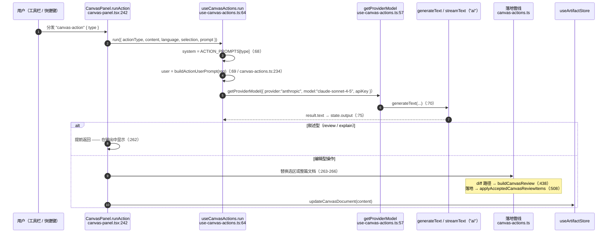
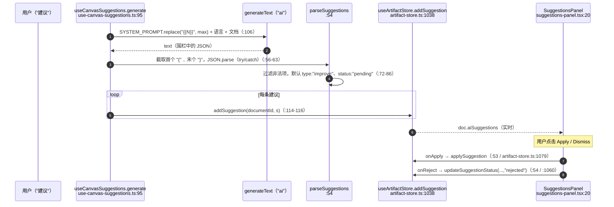

# AI 操作与建议

<Status variant="stable" />

<TLDR>
  两个独立的 AI 界面驱动 Canvas。**操作**（`useCanvasActions`，`hooks/canvas/use-canvas-actions.ts:52`）
  运行 `ACTION_PROMPTS`（`lib/ai/generation/canvas-actions.ts:47`）中的十个 prompt 之一，并把结果作为
  可审阅的 diff 写回（`buildCanvasReview:438` → `applyAcceptedCanvasReviewItems:508`）。**建议**
  （`useCanvasSuggestions`，`hooks/canvas/use-canvas-suggestions.ts:89`）向模型请求一个 JSON 列表，并把
  每条推入 `useArtifactStore.addSuggestion`，在侧栏接受/拒绝。内置的 `ContextAnalyzer` 已存在，但当前
  **未接入**任一 hook。
</TLDR>

## 十个操作

`ACTION_PROMPTS`（`canvas-actions.ts:47`）把每个 `CanvasActionType` 映射到一个系统 prompt：

| 操作 | 行号 | 行为 |
| --- | --- | --- |
| `custom` | `:48` | 自由指令 |
| `review` | `:52` | 叙述型 —— 写到输出，**不**替换内容 |
| `fix` | `:60` | 修复选区/文档中的 bug |
| `improve` | `:68` | 提升质量/可读性 |
| `explain` | `:76` | 叙述型 —— 仅解释 |
| `simplify` | `:84` | 降低复杂度 |
| `expand` | `:92` | 补充细节/完整性 |
| `translate` | `:100` | 翻译到目标语言 |
| `format` | `:106` | 重新格式化（温度 0.3，同 `fix`） |
| `run` | `:114` | 面向执行的 prompt |

`review` 与 `explain` 是叙述型操作 —— `CanvasPanel.runAction` 对它们提前返回，使其填充输出面板而不改动文档
（`canvas-panel.tsx:262`）。

## 操作管线

编辑器写回在 `canvas-actions.ts` 中有两种实现：

- **`applyCanvasActionResult`（`:256`）** —— 无选区 → 整体替换；有选区 → 把结果拼接进定位到的区间。
- **`buildCanvasReview`（`:438`）+ `applyAcceptedCanvasReviewItems`（`:508`）** —— diff 审阅路径。
  `generateDiffPreview`（`:345`）产出行级 `added`/`removed`/`unchanged` 行；`buildCanvasReview` 将它们
  分组为打上 `insert` / `delete` / `replace` 标签的审阅项；被接受的项**自底向上**应用（按起始行降序排序，
  `:515`），经 `lines.splice(...)`（`:522`）落地，使靠前的编辑不会移动靠后的行号。

## 建议流

`useCanvasSuggestions.generate`（`use-canvas-suggestions.ts:95`）向模型请求严格的 JSON 负载，并防御式解析：

`CanvasSuggestion` 类型（`types/artifact/artifact.ts:324`）携带 `{ id, type, range, originalText,
suggestedText, explanation, status }`。接受（`applySuggestion`，`artifact-store.ts:1079`）把
`suggestedText` 拼接进 `doc.content` 的 `[range.startLine .. range.endLine+1]`；拒绝把 `status` 设为
`"rejected"`。

## 五标签侧栏

`CanvasSidePanels`（`canvas-side-panels.tsx:49`）是一个 Radix `Tabs`，其值绑定到
`useCanvasLayoutStore.activeRightTab`。一个 `ResizeObserver` 在低于
`CANVAS_SIDE_PANELS_ICON_ONLY_BREAKPOINT = 280` px（`:47`）时把标签文字收为纯图标。每个标签显示实时角标：

| 标签 | Host | 渲染 | 角标 |
| --- | --- | --- | --- |
| 建议 | `SuggestionsHost`（`:279`） | `SuggestionsPanel`（`:299`） | 待处理建议（`:80`） |
| 历史 | `HistoryHost`（`:308`） | 最近 3 条 + `VersionHistoryPanel` sheet（`:359`） | 版本数（`:81`） |
| 评论 | `CommentsHost`（`:382`） | `CommentPanel` sheet（`:406`） | 未解决评论（`:82`） |
| 协作 | `CollaborationHost`（`:423`） | `CollaborationPanel`（`:436`） | `0`（`:83`） |
| 执行 | `ExecutionHost`（`:456`） | `CodeExecutionPanel`（`:460`） | `0`（`:84`） |

`SuggestionsHost` 直接读 `doc.aiSuggestions`（`:283`），即 `addSuggestion` 的实时连接；`SuggestionsPanel`
（`suggestions-panel.tsx:20`）过滤到 `status === "pending"`，并为每条建议渲染一个 `SuggestionItem`
（`suggestion-item.tsx:32`），带可折叠的原文-对-建议 diff。

## 独立的 Context-Analyzer

`ContextAnalyzer`（`lib/canvas/ai/context-analyzer.ts:61`，单例 `:340`）是一个完整实现、基于正则的代码分析器：
`analyzeContext`（`:79`）提取符号、imports、exports、光标作用域（`inFunction` / `inClass` / `inBlock`）、
模式（react-component、async-await、try-catch、…）、裸依赖，以及 `low`/`medium`/`high` 复杂度估计。
`generateContextualPrompt`（`:299`）把它格式化为 prompt 摘要。

> **实现说明。** 当前 `useCanvasActions` 与 `useCanvasSuggestions` 都未调用该分析器 —— 两者都把原始文档文本
> 发给模型。该分析器是一个可随时接入 prompt 构建器的独立工具；把它视为潜在能力，而非当前活动路径。

## 下一步

<Cards>
  <Card title="编辑器内核" href="./editor-core" description="工具栏宿主与快捷键分发" />
  <Card title="协作" href="./collaboration" description="下一个侧栏标签：实时协同编辑" />
</Cards>
