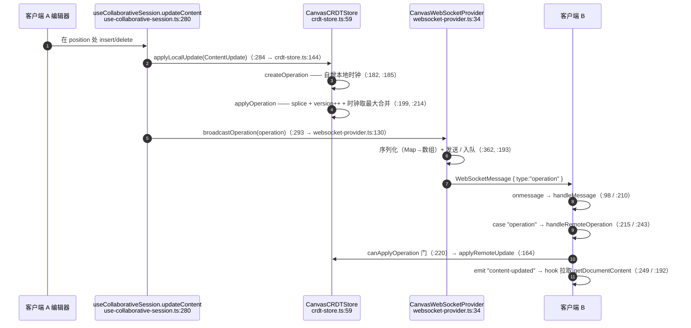
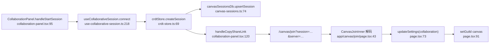

# 协作

<Status variant="experimental" />

<TLDR>
  `lib/canvas/collaboration/` 增加可选的实时协同编辑。`CanvasCRDTStore`（`crdt-store.ts:59`）把每个文档
  保存为 `content` + 一个 `vectorClock: Map` + 一个只追加的操作日志；远端操作通过因果投递门
  （`canApplyOperation:220`）准入，并以逐元素时钟取最大值合并（`applyOperation:214`）。
  `CanvasWebSocketProvider`（`websocket-provider.ts:34`）是传输层 —— 固定间隔重连（默认 1000 ms，**无
  退避**，上限 5 次）、30 秒心跳、消息队列。`useCollaborativeSession`（`use-collaborative-session.ts:83`）
  把 store ⇄ provider ⇄ React 状态接好。它从不自动连接：WebSocket 仅在协作启用且配置了服务器 URL 时打开。
</TLDR>

<StatGrid>
  <Stat label="线协议消息类型" value="6" hint="operation · cursor · selection · presence · sync · error" />
  <Stat label="重连" value="固定 1000ms" hint="上限 5 次 —— 无指数退避" />
  <Stat label="心跳" value="30000ms" hint="presence 帧；入站不消费" />
  <Stat label="冲突模型" value="向量时钟" hint="仅因果门 —— 无 OT/索引重定基" />
</StatGrid>

## 编辑往返

### CRDT 细节

- **Operation**（`crdt-store.ts:42`）—— `{ id, type:"insert"|"delete", position, text?, length?, origin,
  timestamp, vectorClock: Map }`。在 `createOperation`（`:182`）中创建：克隆文档时钟，自增本地参与者条目
  （`:185`），id = `op-${Date.now()}-${random}`（`:188`）。注意 `"replace"` 内容更新会塌缩为 `"insert"`
  （`:189`）。
- **合并** —— `applyOperation`（`:199`）拼接 `content`、自增 `version`、追加到日志，并用逐元素 `Math.max`
  合并时钟（`:214-217`）。
- **因果门** —— `canApplyOperation`（`:220`）：对每个时钟条目（跳过操作自身的 origin），若
  `value > localValue + 1` 则拒绝，即拒绝会跳过因果前置更新的操作。被拒操作**静默丢弃** —— 没有缓冲/重试，
  也**没有操作变换（OT）**，因此该门是唯一的冲突机制。
- **持久化副作用** —— `createSession` / `joinSession` / `leaveSession` 把会话元数据持久化到 Dexie
  （`:98`、`:115`、`:135`）；`restoreRecentSessions`（`:293`）重载元数据，但明确**不**重开 socket。

### WebSocket provider 细节

| 关注点 | 行为 | 行号 |
| --- | --- | --- |
| 配置默认 | `reconnectAttempts: 5`、`reconnectInterval: 1000`、`heartbeatInterval: 30000` | `:47-55` |
| 连接 | `onopen` → 重置次数、启动心跳、冲刷队列、发送 `presence/join` | `:57-82` |
| 重连 | `handleDisconnect` —— 固定 `reconnectInterval` 延迟，**无退避**，到上限即停 | `:306-330`、`:326` |
| 心跳 | `setInterval(heartbeatInterval)` 发送 `presence/heartbeat` | `:332-344` |
| 消息队列 | 非 OPEN 时 `send` 入队；`flushMessageQueue` 在连接打开时 FIFO 冲刷 | `:193-208` |
| 入站路由 | `handleMessage` switch → operation / cursor / selection / presence / sync / error | `:210-241` |
| 同步 | `requestSync` ⇄ `handleSync` → `crdtStore.deserializeState` | `:166`、`:298`、`crdt-store.ts:326` |

本地事件总线（`on` `:178`、`emitEvent` `:353`）与线协议不同 —— 它把 `participant-joined` /
`cursor-moved` / `content-updated` / `connected` 等扇出给 hook。

## 会话 Hook

`useCollaborativeSession`（`use-collaborative-session.ts:83`）持有单例 `crdtStore` 与每会话的 provider，
并把全部八个 provider 事件经一个处理器映射（`handleCollaborationEvent:123`）。生命周期：

- `connect(documentId, content)`（`:218`）—— 创建会话，作为本地参与者加入，设置本地参与者 id，构造并连接
  provider。
- `updateContent`（`:280`）/ `updateCursor`（`:299`）/ `updateSelection`（`:312`）—— 本地应用 + 广播。
- `disconnect`（`:261`）—— 关闭 provider，离开 + 关闭会话，清空状态。卸载 effect 调用 `disconnect()`
  （`:431-435`）。
- `shareSession`（`:322`）返回 `crdtStore.serializeState`；`importSharedSession`（`:377`）从序列化负载注水，
  不走传输。

`DEFAULT_CONFIG`（`:75-81`）把 URL 默认为 `ws://localhost:8080/canvas`，`autoReconnect:true` 与 5 次重试。

## 邀请 / 加入流程

- **创建** —— `connect` → `createSession` 生成 `session-${Date.now()}-${random}`（`crdt-store.ts:70`）
  并持久化元数据。
- **分享** —— `handleCopyShareLink`（`collaboration-panel.tsx:120`）构建
  `${origin}/canvas/join?session=${encodeURIComponent(serializeState)}`（`:128`）。
- **加入** —— `app/canvas/join/page.tsx` 读取 `?session` / `?server`（`:37-38`），解码 base64url 负载
  （`:43`），若存在服务器则写入协作设置（`:73-84`），把 shell 切到 canvas guild（`:91`），并显示成功。该页
  **刻意不**自己调用 `joinSession` —— 实时同步只有在设置里启用协作后才恢复。

> **实现说明（格式不对称）。** 面板发出 `encodeURIComponent(serializeState)`，其 JSON 形态为
> `{ session, document }`（`collaboration-panel.tsx:128`），而加入页解码的是 base64url 负载
> `{ sessionId, documentId, ownerId, shareUrl, permissions }`（`app/canvas/join/page.tsx:46`）。在当前代码
> 中这两种编码不能往返 —— 加入路由依赖设置 + 应用内 `joinSession` 来恢复会话，而非重新注水分享负载。

## 连接状态

provider 的 `ConnectionState`（5 个值：disconnected / connecting / connected / reconnecting / error，
`websocket-provider.ts:32`）是 UI 层 `CollaborationConnectionState`（8 个值，含 `degraded-local`、
`ended`，`types/canvas/collaboration.ts:117`）的子集。恢复状态 `live` / `local-copy` / `snapshot-only` /
`degraded-local`（`:126`）在 hook 的状态变化 effect 中推导（`use-collaborative-session.ts:409-429`）。

## 下一步

<Cards>
  <Card title="AI 操作与建议" href="./ai-actions" description="同级侧栏标签" />
  <Card title="执行与评论" href="./execution-comments" description="Python 沙箱 + 评论线程" />
</Cards>
