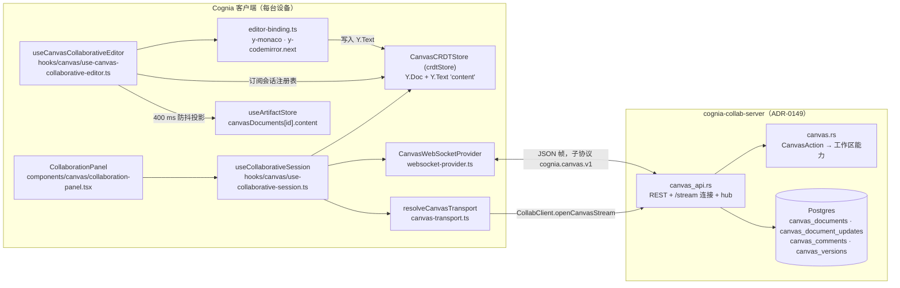
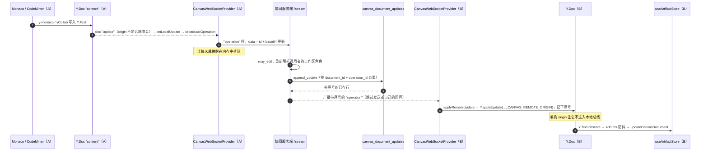

# 协作

<Status variant="experimental" />

<TLDR>
  `lib/canvas/collaboration/` 基于 **Yjs** 提供可选的实时协同编辑。每个文档是一个 `Y.Doc`；Monaco 和
  CodeMirror 写入它的 `Y.Text`（`editor-binding.ts`），一条文档级更新总线把每次本地改动发出去，包括 AI 应用、
  模型工具写入和插件写入。绑定生效期间，artifact store 的 `content` 是 `Y.Text` 的防抖投影。传输走协同服务端
  （ADR-0149，`crates/cognia-collab-server/src/canvas_api.rs`）：按序存储不透明更新，按
  `(document_id, operation_id)` 去重，从不解码，并在每个入站编辑帧上重新解析调用者的工作区角色。加入的客户端在编辑器绑定之前先取得协同平面的状态，只有文档为空时才用本地内容做种子；光标以 y-protocols awareness 传递。成员关系沿用
  工作区的角色阶梯：viewer 只读，member 编辑和评论，maintainer 压缩和删除。默认关闭，由
  `COLLAB_CANVAS_ENABLED` 与 `canvas.collaboration.enabled` 控制。
</TLDR>

<StatGrid>
  <Stat label="CRDT" value="Yjs" hint="每个文档一个 Y.Doc；光标与在线状态走 awareness" />
  <Stat label="服务端" value="协同平面" hint="按序存储不透明更新；不链接 yrs（ADR-0158）" />
  <Stat label="鉴权" value="逐帧" hint="每次写入都重新解析工作区角色" />
  <Stat label="默认" value="关闭" hint="COLLAB_CANVAS_ENABLED + canvas.collaboration.enabled" />
</StatGrid>

## 架构

```mermaid
flowchart LR
  subgraph Client["Cognia 客户端（每台设备）"]
    direction TB
    Panel["CollaborationPanel<br/>components/canvas/collaboration-panel.tsx"]
    Session["useCollaborativeSession<br/>hooks/canvas/use-collaborative-session.ts"]
    Store["CanvasCRDTStore (crdtStore)<br/>Y.Doc + Y.Text 'content'"]
    EditorHook["useCanvasCollaborativeEditor<br/>hooks/canvas/use-canvas-collaborative-editor.ts"]
    Binding["editor-binding.ts<br/>y-monaco · y-codemirror.next"]
    Provider["CanvasWebSocketProvider<br/>websocket-provider.ts"]
    Transport["resolveCanvasTransport<br/>canvas-transport.ts"]
    Artifact["useArtifactStore<br/>canvasDocuments[id].content"]
  end

  subgraph Plane["cognia-collab-server（ADR-0149）"]
    direction TB
    Api["canvas_api.rs<br/>REST + /stream 连接 + hub"]
    Caps["canvas.rs<br/>CanvasAction → 工作区能力"]
    PG[("Postgres<br/>canvas_documents · canvas_document_updates<br/>canvas_comments · canvas_versions")]
  end

  Panel --> Session
  Session --> Store
  Session --> Provider
  Session --> Transport
  EditorHook -- "订阅会话注册表" --> Store
  EditorHook --> Binding
  Binding -- "写入 Y.Text" --> Store
  EditorHook -- "400 ms 防抖投影" --> Artifact
  Transport -- "CollabClient.openCanvasStream" --> Api
  Provider <-- "JSON 帧，子协议 cognia.canvas.v1" --> Api
  Api --> Caps
  Api --> PG
```

会话归协作面板所有（通过 `useCollaborativeSession`）；编辑器通过订阅 store 的注册表找到它，而不是自己持有。这一划分记录在
[ADR-0158](../../adr/0158-artifacts-and-canvas) 的 2026-09-05 各修订中。

## 模块

| 文件 | 职责 |
| --- | --- |
| `lib/canvas/collaboration/crdt-store.ts` | `CanvasCRDTStore` 与 `crdtStore` 单例：每个文档一个 `Y.Doc` 和一个 `Awareness`、会话注册表（含待定会话）、本地更新与本地 awareness 两条总线、远端应用、快照、`encodeSeedUpdate` |
| `lib/canvas/collaboration/editor-binding.ts` | `bindMonacoEditor`（y-monaco）、`codeMirrorCollabExtensions`（y-codemirror.next）、awareness 用户、在线状态样式表 |
| `lib/canvas/collaboration/websocket-provider.ts` | `CanvasWebSocketProvider`：连接工厂、重连与追赶、心跳、内存队列、帧路由、最后应用的序号 |
| `lib/canvas/collaboration/canvas-transport.ts` | `resolveCanvasTransport`、`publishCanvasDocument`、`resolveCanvasShareTarget`，以及协同平面侧的同步：`catchUpCanvasDocument`（分页）与 `hydrateCanvasSession`（加入或做种子） |
| `lib/canvas/collaboration/relative-anchor.ts` | `encodeCrdtAnchor` / `resolveCrdtAnchor`：以 Yjs 相对位置表示的评论锚点 |
| `lib/canvas/collaboration/share-link.ts` | `buildCanvasSharePath` / `parseCanvasShareLink`：只含 id 的加入链接 |
| `hooks/canvas/use-canvas-collaborative-editor.ts` | 把当前编辑器绑定到实时会话，并把 `Y.Text` 投影回 artifact store |
| `hooks/canvas/use-collaborative-session.ts` | 为面板创建、水合、连接和拆除会话 |
| `hooks/canvas/use-canvas-comment-anchors.ts` | 针对实时文档编码和解析评论锚点 |
| `lib/collab/client.ts` | `CollabClient`：Canvas 的 REST 方法和 `openCanvasStream` |
| `crates/cognia-collab-server/src/canvas_api.rs` | 路由、流票据、按文档的 hub、帧处理 |
| `crates/cognia-collab-server/src/canvas.rs` | `CanvasAction`、它的能力映射和审计名称 |
| `crates/cognia-collab-server/src/canvas_store.rs` | `CanvasStore` trait、`InMemoryCanvasStore`、Postgres 实现 |
| `crates/cognia-collab-server/migrations/0010_canvas.sql` | 四张 Canvas 表及其行级安全策略 |

客户端依赖：`yjs`、`y-monaco`、`y-codemirror.next`、`y-protocols`（awareness）和 `lib0`。服务端不链接任何 Yjs crate。

## 编辑往返

```mermaid
sequenceDiagram
  autonumber
  participant Ed as Monaco / CodeMirror（A）
  participant YA as Y.Doc "content"（A）
  participant PA as CanvasWebSocketProvider（A）
  participant S as 协同服务端 /stream
  participant DB as canvas_document_updates
  participant PB as CanvasWebSocketProvider（B）
  participant YB as Y.Doc（B）
  participant AS as useArtifactStore（B）

  Ed->>YA: y-monaco / yCollab 写入 Y.Text
  YA-->>PA: doc "update"（origin 不是远端哨兵）→ onLocalUpdate → broadcastOperation
  PA->>S: "operation" 帧，data = id + base64 更新
  Note over PA: 连接未就绪时在内存中排队
  S->>S: may_edit：重新解析调用者的工作区角色
  S->>DB: append_update（按 document_id + operation_id 去重）
  DB-->>S: 带序号的已存行
  S-->>PB: 广播带序号的 "operation"（跳过发送者自己的回声）
  PB->>YB: applyRemoteUpdate → Y.applyUpdate(..., CANVAS_REMOTE_ORIGIN)；记下序号
  Note over YB: 哨兵 origin 让它不进入本地总线
  YB->>AS: Y.Text observe → 400 ms 防抖 → updateCanvasDocument
```

## 文档与会话

`CanvasCRDTStore.ensureDocument` 为每个文档 id 创建一个 `Y.Doc`，并以 `doc.getText(CANVAS_TEXT_KEY)` 读取文本，其中
`CANVAS_TEXT_KEY = "content"`。一个 `text.observe` 让记录的 `content` 与 `version` 保持同步。

- **会话。** `createSession(documentId, content, { pending })` 生成 `session-<timestamp>-<random>`，标记创建者的权限，并通过
  `lib/db/canvas-sessions.ts` 把会话元数据持久化到 Dexie 的 `canvasSessions` 表。那里只存元数据；Yjs 状态不在本地持久化，由协同平面保存。
  `joinSession`、`leaveSession`、`adoptSession` 和 `closeSession` 构成完整生命周期，`closeSession` 会销毁 awareness 和 `Y.Doc`。
- **待定会话。** 使用 `pending: true`（`connect` 就这样用）时，文档从空开始，在 `markSessionReady` 之前 `sessionIdForDocument` 不会返回它。
  编辑器绑定到它返回的会话，因此在协同平面应答之前绑定，会显示一个空缓冲区并把它投影覆盖存储的文档。不带 `pending` 时，内容在本设备插入，
  文档被标记为 `seededLocally`；`seedLocally` 对保持本地的待定会话做同样的事。本地做种子的文档永远不会加入协同平面，因为它的 Yjs 条目在别处都不存在，
  与协同平面的状态合并会把文本插入两遍。
- **注册表。** `onSessionsChanged(listener)` 和 `sessionIdForDocument(documentId)` 是编辑器 hook 交给
  `useSyncExternalStore` 的两样东西。`sessionIdForDocument` 刻意返回字符串，因为快照比较能比较的正是它。
- **Awareness。** `getAwareness(sessionId)` 返回该文档唯一的 `y-protocols` `Awareness`，首次使用时才创建（它为空闲截止运行一个定时器）。
  `onLocalAwarenessUpdate` 只在本客户端自身状态变化时触发，并已编码为线上格式；远端状态以远端哨兵经 `applyRemoteAwareness` 应用，
  `removeRemoteAwareness(participantId)` 移除离开的对端（通过绑定发布的 `user.participantId` 匹配），`encodeLocalAwareness` 是发给新加入者的内容。
- **本地更新总线。** store 对每个文档监听一次 `doc.on("update")`。origin 不是 `CANVAS_REMOTE_ORIGIN`
  （`"cognia:canvas:remote"`）的任何事务都算本地：它被包装成 `CRDTOperation`（`id`、base64 `update`、`origin`、`timestamp`），交给
  `onLocalUpdate` 的订阅者。按唯一的远端哨兵过滤，而不是按一份本地来源清单过滤，正是 AI 应用、模型工具写入和插件写入能与打字以同样方式发出的原因。
- **远端应用。** `applyRemoteUpdate` 解码 base64 更新，并在远端哨兵下调用 `Y.applyUpdate`。格式错误的更新会被记录
  （`crdt remote update rejected`）并丢弃，而不是抛出异常。
- **快照。** `encodeSnapshot` 以 base64 返回 `Y.encodeStateAsUpdate(doc)`；`applySnapshot` 在远端哨兵下合并一份快照。状态只以不透明字节的形式到达，
  且只能合并进客户端已经加入的会话。旧的 `deserializeState` JSON 入口已被删除，并有测试确保它不会回来。

## 编辑器绑定

`useCanvasCollaborativeEditor({ documentId, enabled })` 由 `components/canvas/canvas-panel.tsx` 使用，返回 `active`、
`bindMonaco(editor)` 和 `codeMirrorExtensions`。

1. `useSessionId` 订阅注册表，给出该文档的实时会话；前提是 hook 的 `enabled`（`canvas.collaboration.v1` 功能开关）和
   `CanvasSettings.collaboration.enabled` 都已开启。
2. 针对该会话，它读取 store 的 `Awareness`（从不自己创建：第二个实例就是一个连接不会承载的客户端），把本地用户发布为 awareness 的
   `user` 字段（`name`、`color`、`participantId`），应用在线超时，并构建 CodeMirror 扩展。编辑器离开文档时清空自己的本地状态，
   这会告诉对端这个光标已经消失；awareness 随会话一起由 store 销毁。
3. **Monaco**（桌面）：`bindMonacoEditor` 在 Monaco 的 `onMount` 中创建 `MonacoBinding(ytext, model, editors, awareness)`；
   当前文档切换或编辑器卸载时执行拆除。**CodeMirror**（移动端 `LightCodeEditor`）：`codeMirrorCollabExtensions` 返回
   `yCollab(ytext, awareness)`。
4. **投影。** 一个以 `CANVAS_PROJECTION_DEBOUNCE_MS = 400` 防抖的 `text.observe` 通过 `updateCanvasDocument` 把文本写回，内容相同则跳过，
   清理时会刷出待写内容。绑定生效期间，面板自己的 `handleEditorChange` 提交会提前返回，两个写入方不会竞争。预览、导出、AI 操作、大纲和版本历史继续读 `content`。

### 在线状态设置

| 设置 | 读取方 | 作用 |
| --- | --- | --- |
| `enabled` | `useCanvasCollaborativeEditor` | 控制编辑器绑定 |
| `showCursors` | `presenceStylesheet` | 隐藏远端光标（`.yRemoteSelectionHead`、`.cm-ySelectionCaret`） |
| `showSelections` | `presenceStylesheet` | 让远端选区背景透明 |
| `cursorSmoothing` | `presenceStylesheet` | 给远端光标加 90 ms 的 `left` / `top` 过渡 |
| `presenceTimeout` | `applyPresenceTimeout` | 设置 `awareness.outdatedTimeout`，限制在 5 秒到 600 秒之间 |
| `showAvatars` | `CollaborationPanel` | 在参与者列表中显示头像 |

默认值（`types/canvas/settings.ts`）：`enabled: false`，四个布尔值为 `true`，`presenceTimeout: 60000`。样式表以
`#cognia-canvas-presence` 注入一次；用 CSS 隐藏而不是扣下 awareness，意味着重新打开设置时显示的是对端当前的位置。`serverUrl` 和
`syncInterval` 已被移除：协同平面的地址由 `lib/collab/connection.ts` 决定，而 Yjs 每个事务都会推送，没有轮询间隔可调。

## 传输

### 打开连接

`resolveCanvasTransport(documentId)` 在两种情况下返回 `null`：文档不属于任何工作区（`getCanvasDocumentForWorkspace(...).projectId`），
或者不存在协同上下文（`resolveCurrentCollabContext`：来自 `lib/collab/connection.ts` 的按账户协同平面地址、登录后的组织与用户绑定，以及访问令牌）。
否则它返回这些 id、`CollabClient`，以及一个基于 `client.openCanvasStream(orgId, documentId, handlers)` 的 `openSocket` 工厂。

`openCanvasStream` 先申请票据（`POST .../stream-tickets`），再以子协议 `["cognia.canvas.v1", ticket]` 打开
`wss://<plane>/v1/orgs/<org>/canvas-documents/<doc>/stream`。连接来自 `createPlatformWebSocket`，在 Tauri 上走 Rust 代理路径，
因此遵循桌面端的代理设置。连接之前，`publishCanvasDocument` 在协同平面上获取文档，遇到 404 就以操作 id `canvas-create:<documentId>`
创建它；创建时遇到 403 或 404 表示没有写权限。

### 加入文档

`useCollaborativeSession.connect(documentId, content)` 打开一个待定会话，`attachTransport` 按固定顺序把它带上协同平面：

1. 解析传输并发布文档行。没有协同平面，或没有创建该行的写权限时，会话在本设备落定（`seedLocally`，然后 `markSessionReady`），
   用的是此刻的文本，而不是调用 `connect` 时的文本。已经在本设备做过种子的文档永远不会加入协同平面。
2. 创建 provider，并在连接打开**之前**把它订阅到本地更新与本地 awareness 两条总线，这样本设备在连接期间做的任何事都不会漏发。
3. 打开连接，使追赶期间写入的更新实时到达，而不是落进两者之间的空隙。
4. `hydrateCanvasSession` 用 `catchUpCanvasDocument` 分页取回协同平面的状态。如果协同平面什么都没有，就把本地副本作为种子发布。
   本地副本此时才从 artifact store 读取，且先由 `flushPendingCanvasEdits`（`lib/canvas/pending-edits.ts`）让编辑器提交仍在防抖中等待的按键，
   因此包含连接期间输入的文字。种子由 `encodeSeedUpdate` 在一个临时 `Y.Doc` 中构建，并以操作 id
   `canvas-seed:<documentId>` 提交。两台设备竞争做种子时会在这个 id 上冲突，服务端把第一份种子返回给第二台，于是两者收敛到同一个基线，
   而不是两份文本。发现协同平面为空的 viewer 会得到 `CanvasSeedForbiddenError`。
5. `adoptPlaneContent` 比较共享文本与 artifact store。两者不同且本地副本非空时，先把本地副本保存为一个版本（「加入共享文档前本设备上的副本」），
   再用共享文本替换它。然后会话被标记为就绪，编辑器开始绑定。

每次 await 之后，`attachTransport` 都会确认会话仍是 hook 持有的那个：会话一存在就提供「结束会话」，关闭面板标签页也会卸载它，所以用户随时可能结束会话。
若已结束，这次调用只拆除自己建立的东西（订阅和 provider），既不碰 artifact store，也不碰协同平面。`adoptPlaneContent` 也会拒绝已经没有文档的会话，
而不是把它当作空文本。会话仍有效时某一步失败，同样执行拆除、关闭会话并进入 `error`；会话从未对编辑器可见，所以本地文档保持原样。
绑定生效时，canvas 面板会取消仍在等待的按键批次，因为它属于刚被共享文档替换掉的文本。对没有活动 provider 的会话调用 `joinSession`，
会关闭它并重新运行 `connect`，而不是原地接入。

### `CanvasWebSocketProvider`

| 关注点 | 行为 |
| --- | --- |
| 构造 | 接收一个 `openSocket` 工厂，从不接收 URL 或令牌。没有工厂时，`connect` 抛出 `CanvasTransportUnavailableError`（`CANVAS_REMOTE_AUTH_REQUIRED`）：传输层以关闭的方式失败 |
| 连接 | 调用工厂，置为 `connected`，启动心跳，以真实参与者发送 `presence` `join`，然后刷出队列。在 `disconnect()` 之后才打开完成的连接会被关闭，而不是保留 |
| 重连 | `handleDisconnect` 在固定的 `reconnectInterval`（1000 ms）后重试，最多 `reconnectAttempts`（5）次，每次都重新调用工厂，从而申请新的一次性票据。它以已保存的参与者身份重新加入，然后从最后应用的序号运行 `catchUp` 回调（分页的 HTTP 追赶）；追赶失败时退回到从该序号发起的连接 `sync` 请求。没有指数退避 |
| 序号 | 每个转发的 `operation` 和每个 `sync` 响应都带有服务端序号。provider 维护一个水位：不超过它的每个序号都已应用。`noteSequence` 记录单条更新，只在连续序列上推进水位，因为服务端从写入它的请求中转发每条更新，6 可能先于 5 到达；`noteCaughtUpTo` 覆盖一次追赶或一个快照帧（`snapshot: true`）之下的全部序号。客户端自己的更新从不回传，所以水位停在它的第一次编辑处，恢复时会重取少量已有的更新，Yjs 会忽略它们 |
| 心跳 | 连接期间每 30 000 ms 发送一次 `presence` `heartbeat` |
| 队列 | 连接未就绪或发送失败时，`dispatch` 把帧排队；`flushMessageQueue` 在 join 帧之后按顺序排空。`cursor`、`selection` 和 `awareness` 是易失帧，从不排队。队列在内存中，重新加载后不保留 |
| Awareness | 加入后以新的时钟续发本客户端的 awareness（`renewLocalAwareness`），因为丢弃过它的对端会忽略旧时钟下的重发；每当有其他参与者加入时再发一次；收到 `presence` `leave` 时移除离开者的 awareness |
| 错误 | 连接错误、工厂抛错或服务端 `error` 帧都报告 `error`；只有主动 `disconnect()` 或重试耗尽才报告 `disconnected` |

### 帧

每一帧都是 JSON 文本，形如 `type`、`sessionId`（在服务端即文档 id）、`participantId`、`data`、`timestamp`。

| `type` | 客户端发送 | 服务端处理 |
| --- | --- | --- |
| `operation` | `data` 为 `CRDTOperation` | 重新检查编辑权限，追加，在写入持久化之后广播，并附上该行的 `sequence` |
| `presence` | `join`、`heartbeat`、`leave` | `join` 以票据中的用户 id 记录在线状态，并向加入者重放成员列表；`heartbeat` 刷新；`leave` 关闭连接 |
| `sync` | `action: "request"`、`since`（水位） | 回复快照（调用者落后于快照时，标记 `snapshot: true`）和其后的每条更新，每个载荷一帧带 `sequence` 的 `sync` `response`，发送者为 `"server"`，一直分页到日志末尾（最多 64 页、每页 512 条） |
| `awareness` | `update`：base64 的 y-protocols awareness 更新 | 以连接加入时的参与者 id（而不是帧里声称的 id）转发给房间，不存储，不逐帧检查角色；加入之前、为空或超过 64 KiB 时丢弃 |
| `cursor`、`selection` | 光标 / 行范围 | 转发给房间，不存储，不逐帧检查角色。客户端已不再发送它们，光标改由 awareness 传递 |
| `error` | 无 | provider 以 `error` 上报 |

## 服务端

只有服务端以 `COLLAB_CANVAS_ENABLED` 运行时（CLI 默认 `false`）才会合并这些路由；此时 `/health` 的 features 中会列出 `canvas`。下表中 `D` 指
`/v1/orgs/{org_id}/canvas-documents/{document_id}`。

| 路由 | 动作 | 说明 |
| --- | --- | --- |
| `GET` / `POST /v1/orgs/{org_id}/workspaces/{workspace_id}/canvas-documents` | Read / Create | 创建需要 `id` 和 `operationId` |
| `GET` / `PATCH` / `DELETE D` | Read / Rename / Delete | `PATCH` 携带 `baseRevision`；过期返回 409 |
| `GET D/updates?since=` | Read | 追赶分页：快照、更新、`latestSequence`、`hasMore` |
| `POST D/updates` | Edit | HTTP 写入路径，与连接路径一样去重 |
| `POST D/snapshots` | Compact | `snapshot` + `coversSequence` |
| `GET` / `POST D/comments`，`PATCH` / `DELETE D/comments/{comment_id}` | Read / Comment | 锚点为空返回 422 |
| `GET` / `POST D/versions` | Read / Edit | 命名版本 |
| `GET D/presence` | Read | hub 的内存成员列表 |
| `POST D/stream-tickets`，`GET D/stream` | Read | 先申请票据，再升级为 WebSocket |

### 成员关系与鉴权

没有按文档的成员表。`CanvasAction` 在 `canvas.rs` 中映射到工作区的角色阶梯：`Read` 需要工作区读权限（viewer）；`Create`、`Edit`、
`Comment` 和 `Rename` 需要写权限（member）；`Compact` 和 `Delete` 需要管理权限（maintainer）。组织的 owner 或 admin 通过
`resolve_workspace_access` 以维护者身份进入。

- **404 而不是 403。** 文档不存在，**或**调用者读不了它所在的工作区时，`document_caller` 都回答 404，因此无法用 id 试探。只有能读、但缺少该动作能力的调用者才会看到 403。
- **票据。** 流票据（`ct_<uuid>`）在内存中存活 30 秒，第一次使用时无论是否仍有效都会被消耗，并绑定组织、文档、工作区和用户。升级要求 `cognia.canvas.v1`
  子协议和票据；过期或未知的票据返回 410。
- **逐帧鉴权。** 每个 `operation` 帧都会调用 `may_edit`，重新解析调用者的工作区角色；角色被撤销后，连接会在下一次按键时关闭。读取和在线状态只在申请票据时鉴权一次。

### 排序、去重、压缩

- **不透明、有序的更新。** `append_update` 锁定文档行（`FOR UPDATE`），分配 `next_sequence`，不解码地存储载荷。`UNIQUE (document_id, operation_id)`
  让重发返回已存的行，而不是把编辑记录两遍，这正是重放队列安全的原因。载荷大小为 1 字节到 1 MiB。
- **Hub。** 每个文档一个容量 512 的 `tokio::sync::broadcast` 通道。写出任务跳过连接自己的帧。落后的接收方会结束写出任务，写出任务关闭连接，读取循环也随之停止，
  于是客户端重连并追赶，而不是保持连接却什么都收不到。
- **追赶。** `catch_up(since, 512)` 在 `since` 落后于快照时把下限提到快照序号，并附上快照。HTTP 路由会报告 `hasMore`，客户端的
  `catchUpCanvasDocument` 会一直跟到末尾；连接上的 `sync` 回复自己逐页发送。
- **压缩。** 维护者的客户端发送 `Y.encodeStateAsUpdate` 以及 `coversSequence`。存储拒绝回退或越过 `latest_sequence` 的标记（403
  `snapshot does not cover a stored range`），保存快照，并删除它覆盖的更新。
- **表。** `canvas_documents`（title、language、revision、`snapshot`、`snapshot_sequence`、`next_sequence`）、`canvas_document_updates`、
  `canvas_comments`（`anchor`、`head`、`body`、`resolved`）和 `canvas_versions`，每张表都在 `app.tenant_id` 上强制启用行级安全。

## 评论锚定到字符

针对文本范围的 canvas 评论会存储它的绝对偏移量；存在实时会话时，还会存储一个 `crdt` 锚点（`CanvasCrdtAnchor`：base64 的 `anchor` 和 `head`，
`types/canvas/collaboration.ts`）。

- `encodeCrdtAnchor(text, start, end)` 创建两个 Yjs 相对位置。起点使用关联值 `0`，终点使用 `-1`，所以两端都向外粘附：贴着任一边界输入的文字都落在评论之外。越界输入返回 `null`。
- `resolveCrdtAnchor(doc, anchor)` 返回绝对偏移量；任一端无法再解析时返回 `null`。
- `useCanvasCommentAnchors`（在 `canvas-side-panels.tsx` 中）在创建评论时编码，并把 `resolve` 作为 `resolveAnchor` prop 传给
  `ContextCommentsPanel`。一个原本覆盖文字、如今塌缩的范围被解读为已删除：保留存储的偏移量并照常按修订号判断陈旧，而不是把评论钉到塌缩落点上。
- 没有实时文档时，每台设备读取的都是存储的偏移量。

评论仍然住在本地的 `contextComments` 表里。协同平面的评论路由已经存在，并存储同样的 `anchor` / `head` 对，但客户端还没有调用它们。

## 分享链接与加入页

`buildCanvasSharePath` 生成 `/canvas/join?org=<org>&workspace=<workspace>&document=<document>`；面板会在前面加上
`window.location.origin`。`parseCanvasShareLink` 要求三个 id 都匹配 `^[A-Za-z0-9_-]{1,128}$`，否则回答 `missing` 或 `malformed`。
链接不携带内容、参与者、权限或服务器 URL。

`app/canvas/join/page.tsx` 把旧链接（携带 `session` 或 `server` 的）视为 `expired`。对于有效链接，它通过 `getCanvasDocumentForWorkspace`
在**本地**解析文档；如果这台设备上有，「打开 Canvas」会选中它并切换到 canvas 视图，否则页面报告 `not-found`。页面不调用协同平面，也不启动会话。
它的代码注释说服务端路由「还不存在」，那是在 `canvas_api.rs` 出现之前写的。

## 开关

| 开关 | 位置 | 默认 |
| --- | --- | --- |
| `COLLAB_CANVAS_ENABLED` | `cognia-collab-server` 的 CLI / 环境变量；路由在 `api.rs` 中合并 | `false` |
| `canvas.collaboration.v1` 功能开关 | `lib/canvas/feature-flags.ts`；可被 `NEXT_PUBLIC_CANVAS_COLLABORATION_V1` 和 localStorage 覆盖 | `true` |
| `CanvasSettings.collaboration.enabled` | 设置 → Canvas；只有 `useCanvasCollaborativeEditor` 读取 | `false` |

功能开关决定 `CollaborationHost` 是否渲染面板，以及编辑器 hook 是否启用。设置只控制编辑器绑定：关闭时，面板仍能启动会话并打开连接，但编辑器不会绑定到它。

## 连接状态

provider 的 `ConnectionState` 有五个值（`disconnected`、`connecting`、`connected`、`reconnecting`、`error`）。UI 类型
`CollaborationConnectionState` 另加了 `degraded-local` 和 `ended`，`CanvasCollaborationRecoveryState` 取值为 `live`、`local-copy`、
`snapshot-only` 或 `degraded-local`。实际上 hook 只会到达 `connecting`、`connected`、`disconnected` 和 `error`；恢复状态在一个无人消费的
`onStateChange` 回调里被推导为 `live` 或 `local-copy`，而 `CollaborationHost` 不传 `collaborationState`，所以面板的恢复徽标不会出现。

## 已知缺口

以下内容读自代码，并未在两台机器上实际运行观察。[ADR-0158](../../adr/0158-artifacts-and-canvas) 2026-09-30 的提议修订列出了默认值翻转之前必须落地的内容。

- **重放队列在内存中**，覆盖短暂断线，但覆盖不了重新加载。
- **压缩、评论和版本不在协同平面上。** `pushCanvasSnapshot`、`createCanvasComment`、`createCanvasVersion`、`readCanvasPresence`、
  重命名和删除都没有调用者，所以没有任何东西执行压缩，评论也仍然留在本地的 `contextComments` 表里。
- **接收者只能打开本设备已有的文档。** 加入页在本地解析文档，不会根据协同平面创建本地副本。
- **会话之外的本地编辑会输给协同平面。** 协同平面已有该文档而本设备的副本不同时，以协同平面的文本为准，本地副本只作为一个版本保留。
  没有对离线编辑的三方合并。
- **遗留的光标帧。** `useCollaborativeSession` 仍然暴露 `updateCursor` / `updateSelection`，以及由 `cursor` / `selection` 帧填充的
  `remoteCursors` 列表。没有任何东西调用或渲染它们；光标由 awareness 绘制。

## 下一步

<Cards>
  <Card title="AI 操作与建议" href="./ai-actions" description="同级侧栏标签" />
  <Card title="执行与评论" href="./execution-comments" description="Python 沙箱 + 评论线程" />
</Cards>
