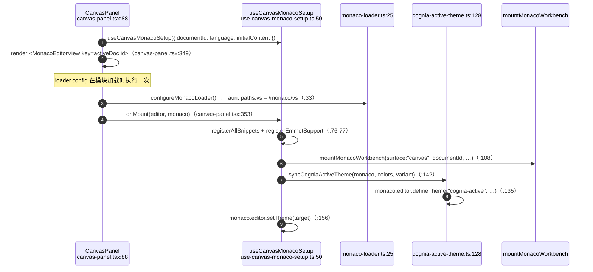

# 编辑器内核

<Status variant="stable" />

<TLDR>
  `CanvasPanel`（`components/canvas/canvas-panel.tsx:88`）通过惰性 `next/dynamic` 导入挂载 Monaco
  （`:69`，`ssr: false`），并用 `useCanvasMonacoSetup`（`hooks/canvas/use-canvas-monaco-setup.ts:50`）
  配置它。在 Tauri 下由 `configureMonacoLoader`（`lib/canvas/monaco-loader.ts:25`）将 loader 指向离线
  资源。编辑器主题通过 `syncCogniaActiveTheme`（`lib/canvas/themes/cognia-active-theme.ts:128`）把应用
  调色板同步进单一 Monaco 主题。布局是可调整的三栏 `CanvasShell`（`canvas-shell.tsx:41`），持久化到
  `useCanvasLayoutStore`。
</TLDR>

## 挂载 Monaco

Monaco 包体很大，因此从不参与服务端渲染。`CanvasPanel` 惰性导入编辑器，加载完成前显示 spinner：

```ts title="components/canvas/canvas-panel.tsx:69"
const MonacoEditorView = dynamic(
  () => import("@monaco-editor/react").then((mod) => mod.default),
  { ssr: false, loading: () => <EditorLoading /> },
)
```

渲染路径按文档 id 给编辑器加 key，使其在切换文档时干净地重挂载，并把 `onMount` 回调接好以捕获编辑器句柄、
交给 setup hook：



面板里有两个不显眼的修正：

- **布局抖动** —— 一个去抖 **60 ms** 的 `ResizeObserver` 调用 `editor.layout()`，规避 Monaco 的
  flex-shrink bug（`canvas-panel.tsx:177-193`）。
- **首帧主题** —— `resolvedMonacoTheme` 在自定义主题注册前先解析出具体的 `vs` / `vs-dark` id，避免未知
  id 闪烁（`canvas-panel.tsx:122-126`）。

## 离线 Loader（Tauri）

Tauri 严格的 CSP 禁止从 CDN 加载 Monaco，因此 `configureMonacoLoader` 是幂等的，并按平台分支：

| 模式 | 行为 | 行号 |
| --- | --- | --- |
| Tauri（`isTauri()`） | `loader.config({ paths: { vs: "/monaco/vs" } })` —— 由 `prebuild` 步骤复制的内置资源 | `monaco-loader.ts:33-36` |
| Web + override | 读取 `NEXT_PUBLIC_MONACO_VS_PATH`，配置该路径 | `monaco-loader.ts:40-44` |
| Web 默认 | 保留默认的 jsdelivr CDN | （无操作） |

## 主题同步

编辑器有一个规范主题 id `cognia-active`（`cognia-active-theme.ts:27`），每次变化时都从实时应用外观重建：

- `buildCogniaActiveEditorTheme`（`cognia-active-theme.ts:62`）把 27 字段的外观调色板映射为 20 字段的
  编辑器 `ThemeColors`，通过提亮/压暗推导行高亮与缩进参考线，并将 `tokenColors` 留空以继承基础主题的语法
  高亮。
- `syncCogniaActiveTheme`（`cognia-active-theme.ts:128`）将其注册进 `ThemeRegistry`
  （`theme-registry.ts:203`）并调用 `monaco.editor.defineTheme`。
- setup hook 在已解析主题或外观变化时重跑同步（`use-canvas-monaco-setup.ts:130-146`），并应用用户的显式
  偏好，或在偏好为 `"auto"` 时应用 `cognia-active`（`:151-160`）。

`BUILTIN_THEMES`（`theme-registry.ts:93`）内置五个主题：`vs-dark`、`vs`、`monokai`、`github-dark`、
`one-dark-pro`。`toMonacoTheme`（`:256`）把 `ThemeColors` 记录转换为 Monaco 的 `colors` 映射加 token
规则，`inherit: true`。

## 布局 Shell

`CanvasShell`（`canvas-shell.tsx:41`）选择 `CanvasDesktopShell`（`:48`）或 `CanvasMobileShell`
（`:138`）。桌面 shell 是按 `layoutVersion` 加 key 的 `ResizablePanelGroup`，因此布局重置会强制重挂载；
尺寸被夹紧并按比例缩放到总和 100%，再经 `useCanvasLayoutStore.setSizes` 持久化：

| 面板 | 最小 | 最大 | 内容 |
| --- | --- | --- | --- |
| 左（`canvas-left`） | 12 | 32 | `CanvasDocumentRail`（`:99`） |
| 中（`canvas-center`） | 46 | — | `CanvasWorkspace`（`:110`） |
| 右（`canvas-right`） | 16 | 28 | `CanvasSidePanels`（`:130`） |

夹紧常量从该文件导出（`CANVAS_SHELL_LEFT_MIN = 12` … `CANVAS_SHELL_RIGHT_MAX = 28`，
`canvas-shell.tsx:34-39`）。移动 shell 把轨道和侧栏渲染在左右 `Sheet` 里，编辑器全宽。

### 布局快捷键

`useCanvasLayoutShortcuts`（`use-canvas-layout-shortcuts.ts:17`）绑定 `Cmd/Ctrl+B`（切换左轨道）与
`Cmd/Ctrl+J`（切换右轨道）—— 但**当焦点位于 `.monaco-editor` 内时直接放弃**（`:31-37`），让 Monaco
自带的 `Cmd+B` / `Cmd+J` 继续生效。

## 文档轨道

`CanvasDocumentRail`（`canvas-document-rail.tsx:104`）直接读 store，并通过 `groupByTime`（`:65`）按时间
分组为 置顶 / 今天 / 昨天 / 本周 / 更早（24 小时 = `86400000` ms，`:78`）。置顶由
`useCanvasLayoutStore.pinnedDocIds` 支撑。逐行右键菜单覆盖 重命名 / 复制 / 导出（Blob → `${title}.md`，
`:170-180`）/ 置顶 / 删除。

列表里刻意省略了 `AnimatePresence`（`:308-319`），因为其退出动画破坏了 jsdom 的搜索过滤测试 —— 只用
`STAGGER_CONTAINER` 入场动效。

## 符号、片段、插件

这些注册表在 `onMount` 里挂载（`use-canvas-monaco-setup.ts:76-99`，每次调用都用 try/catch →
`loggers.canvas.warn` 包裹）：

- **符号** —— `SymbolParser`（`symbol-parser.ts:45`）是面向 JS/TS/Python 的正则驱动解析器。
  `parseSymbols`（`:52`）通过括号计数计算行/块区间（`findBlockEnd`，`:149`，失败时上限为
  `startLine + 20`），递归子符号，并暴露查找（`findSymbolAtLine` `:190`、`getSymbolBreadcrumb` `:246`）。
- **片段** —— `SnippetProvider`（`snippet-registry.ts:252`）按语言从 `SNIPPET_REGISTRY`（`:244`）合并内置
  + 自定义片段；`applySnippet`（`:299`）剥离 `${n:default}` 占位符。
- **插件** —— `CanvasPluginManager`（`plugin-manager.ts:112`）是 canvas 本地的插件层，通过
  `syncWithMainManager`（`:183`）把启用/禁用桥接进主插件管理器，并分发类型化钩子
  （`collectCompletions` `:295`、`collectDiagnostics` `:313`、`collectActions` `:331`）。

## 大文件分块

对超大文档，内容会被分块，使主线程永不阻塞：

- `LargeFileOptimizer`（`large-file-optimizer.ts:30`）—— `DEFAULT_CHUNK_SIZE = 10000` 字符（`:27`），
  `LARGE_FILE_THRESHOLD = 50000` 字符（`:28`）。`chunkContent`（`:47`）构建行偏移并切片；
  `getVisibleContent`（`:182`）返回带 50 行缓冲的窗口。
- `useChunkLoader`（`use-chunk-loader.ts:28`）读取 `useChunkedDocumentStore`（不是 artifact store），
  `BUFFER_LINES = 100`（`:25`）、`LOAD_THRESHOLD = 50`（`:26`）；首次加载经 `queueMicrotask` 取前 200 行
  （`:119-126`）。
- `getCanvasPerformanceProfile`（`utils.ts:151`）在 `standard` / `large` / `very-large` 模式间选择，逐模式
  设置符号解析去抖（500 / 900 / 1500 ms）与分块开关（`CANVAS_LARGE_DOCUMENT_THRESHOLDS`，`utils.ts:133`）。

## 操作快捷键

`useCanvasKeyboardShortcuts`（`use-canvas-keyboard-shortcuts.ts:17`）是快捷键 store 的运行时消费者。在
Cmd/Ctrl 按下时，它通过 `useKeybindingStore.getActionByKeybinding`（`:22`）解析绑定的操作，并分发一个
`canvas-action` `CustomEvent`（`:41-50`），由 `CanvasPanel` 监听（`canvas-panel.tsx:141-149`）。回退：
`Ctrl+K` → 内联命令，以及 `DEFAULT_KEY_ACTION_MAP[e.key]`（`constants.ts:83`）。绑定在
`KeybindingSettings` 中编辑（见 [执行与评论](./execution-comments#快捷键)）。

## 下一步

<Cards>
  <Card title="状态与持久化" href="./state-persistence" description="编辑器内容到底存在哪里" />
  <Card title="AI 操作与建议" href="./ai-actions" description="包裹编辑器的工具栏" />
</Cards>
