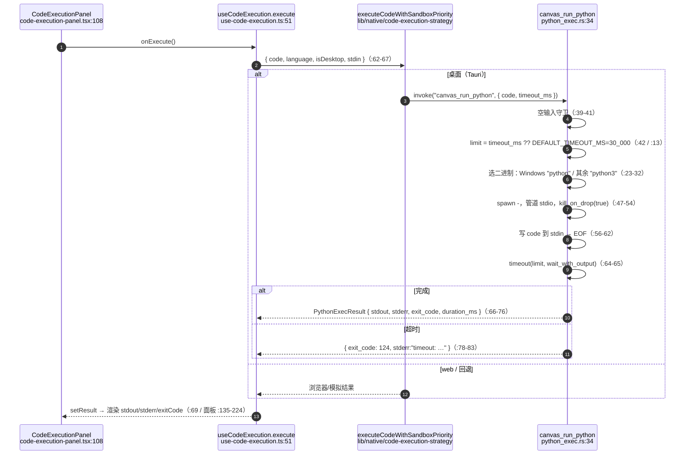
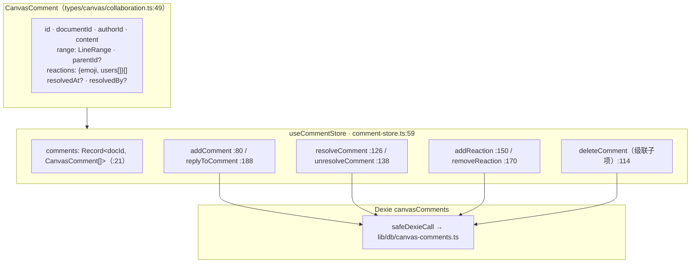
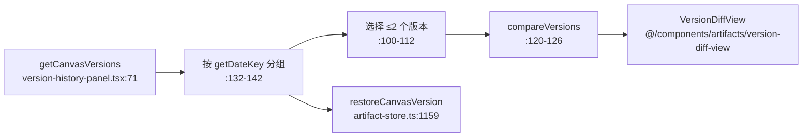

# 执行与评论

<Status variant="stable" />

<TLDR>
  三个侧栏功能共享本页。**执行**通过在 Rust 侧拉起真实解释器运行 Python —— `canvas_run_python`
  （`src-tauri/src/canvas/python_exec.rs:34`），30 秒超时，超时返回 `exit_code: 124` —— 经一个沙箱优先级
  策略而非直接 `invoke` 到达。**评论**是扁平的 `CanvasComment` 行，按 `parentId` 成线程，锚定到一个
  `LineRange`，带 emoji 表情与解决态，镜像到 Dexie（`comment-store.ts:59`）。**版本**列出按日期分组的
  `CanvasDocumentVersion` 快照，并渲染位置式行 diff（不是 Monaco `DiffEditor`）。
</TLDR>

## Python 沙箱

关键事实：

- hook **不**直接调用 `invoke("canvas_run_python")` —— 它委托给 `lib/native/code-execution-strategy` 里的
  `executeCodeWithSandboxPriority`（`use-code-execution.ts:62`），该处持有桌面优先 / 浏览器 / 模拟阶梯；
  `isDesktop` 来自 `useNativeStore`。
- Rust 结果结构体 `PythonExecResult`（`python_exec.rs:15`）含 `stdout`、`stderr`、`exit_code`、
  `duration_ms` —— 没有 `success` 字段；调用方由 `exit_code` 推断成功与否。
- **隔离**极简：仅由 30 秒超时和 `kill_on_drop(true)`（`:52`）约束的子进程。无 firejail/Docker；Canvas
  假设运行在可信本地机器上。
- `cancel()`（`use-code-execution.ts:104`）是一个协作式 UI 标志 —— 它阻止 hook 上报结果，但不主动杀掉
  Rust 子进程；子进程由超时 + drop 约束。
- Rust 测试：`rejects_empty_input`（`:93`）与 `timeout_returns_124`（`:99`，断言 `exit_code == 124`）。

`CodeExecutionPanel`（`code-execution-panel.tsx:46`）是表现型组件 —— 把 stdout+stderr 合并为终端视图
（`:57`），给 `exitCode` 上绿/红色（`:135-144`），当结果来自回退时显示 `simulated` 角标（`:95-99`），并提供
Run/Stop 切换（`:102-112`）。

## 评论

评论按文档扁平存储，仅以 `parentId` 成线程：

- **线程** —— `replyToComment`（`comment-store.ts:188`）创建一条普通评论，继承父项的 `range` 并设置
  `parentId`（`:198-199`）。UI 在渲染时拆分根与回复（`comment-panel.tsx:79`，`getReplies` `:86`）。
  `deleteComment` 级联一层（`:114-124`）。
- **锚定** —— 评论携带一个 `LineRange`；`getCommentsInRange`（`:215`）按 `startLine`/`endLine` 重叠判断
  （`:219`）。
- **表情** —— `{ emoji, users[] }`；`addReaction` 推入用户（`:150`），`removeReaction` 裁掉空组（`:170`）。
  emoji 集来自 `REACTION_EMOJIS`（`lib/canvas/constants.ts:95`）。
- **解决** —— 设置/清除 `resolvedAt` + `resolvedBy`（`:126` / `:138`）；`getUnresolvedComments`（`:223`）
  只返回未解决的根 —— 侧栏角标计数的来源。
- **持久化** —— 每次变更先写内存，再经 `safeDexieCall`（`:53`）fire-and-forget 写 Dexie；
  `loadCommentsForDocument`（`:64`）幂等。一个一次性的 localStorage→Dexie 迁移在导入时运行
  （`hydrateLegacyLocalStorage`，`:248`）。

`CommentPanel`（`comment-panel.tsx:44`）是右侧 Sheet：一个文本域 + 选中行区间角标、一个显隐已解决的开关，
以及每个根一个 `CommentThread`（`:266`），含作者头像、相对时间、`L{startLine}` 区间角标、解决切换、表情行、
内联回复表单与嵌套 `ReplyItem`（`:460`）。

## 版本时间线

`VersionHistoryPanel`（`version-history-panel.tsx:52`）从 `useArtifactStore`（不是 canvas 专用 store）读
版本：`getCanvasVersions`（`:71`）→ 按日期键分组（`:132-142`）→ 每个快照一个 `VersionItem`（`:379`），带
当前 / 自动保存角标与行数。

- **Diff** —— 面板导入的是 **artifacts** 版的 `VersionDiffView`（`:45`）。`components/canvas/version-diff-view.tsx`
  存在一个平行的 canvas 本地副本；两者都实现**位置式**行遍历（`computeLineDiff`，`version-diff-view.tsx:37`），
  产出 `added`/`removed`/`unchanged`/成对 行 —— 既不是 Monaco `DiffEditor`，也不是真正的 LCS。
- **恢复** —— `handleRestoreVersion`（`:79`）→ `restoreCanvasVersion(documentId, versionId)`，它会先自动
  保存当前内容（`artifact-store.ts:1159`）。
- **保存 / 删除** —— `saveCanvasVersion(documentId, desc, false)` 创建手动快照（`:73`）；删除走
  `AlertDialog` 确认（`:83-88`）。

## 快捷键

`KeybindingSettings`（`keybinding-settings.tsx:48`）编辑 `useKeybindingStore`。一个按键捕获 `Input` 经
`parseKeyEvent` 记录组合键（`handleKeyDown` `:76`，Enter 提交 `setKeybinding` `:89`，Escape 取消）。冲突被
检测并打角标（`:151-153`）；绑定可导出为 `canvas-keybindings.json`（`:104`）并导回（`:117`）。同一个
`parseKeyEvent` + store 驱动运行时分发器 `useCanvasKeyboardShortcuts`（见
[编辑器内核](./editor-core#操作快捷键)），因此设置与运行时永不脱节。

## 测试

| 文件 | 覆盖 |
| --- | --- |
| `src-tauri/src/canvas/python_exec.rs` | `rejects_empty_input`、`timeout_returns_124` |
| `hooks/canvas/use-code-execution.test.ts` | 策略委托、中止、错误结果 |
| `stores/canvas/comment-store.test.ts` | 线程、表情、解决、遗留迁移 |
| `components/canvas/comment-panel.test.tsx` | 线程渲染、回复、表情切换 |
| `components/canvas/version-history-panel.test.tsx` | 分组、比较、恢复、删除 |
| `components/canvas/version-diff-view.test.tsx` | 位置式行 diff |

## 下一步

<Cards>
  <Card title="协作" href="./collaboration" description="实时协同编辑标签" />
  <Card title="状态与持久化" href="./state-persistence" description="版本与评论存放在哪里" />
</Cards>
