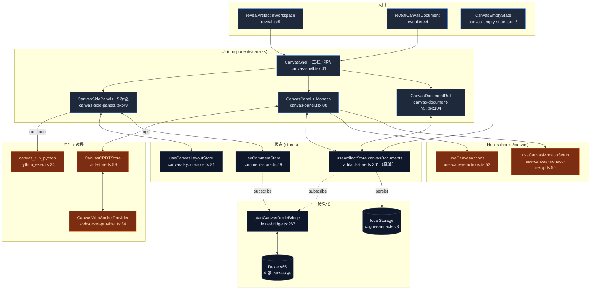
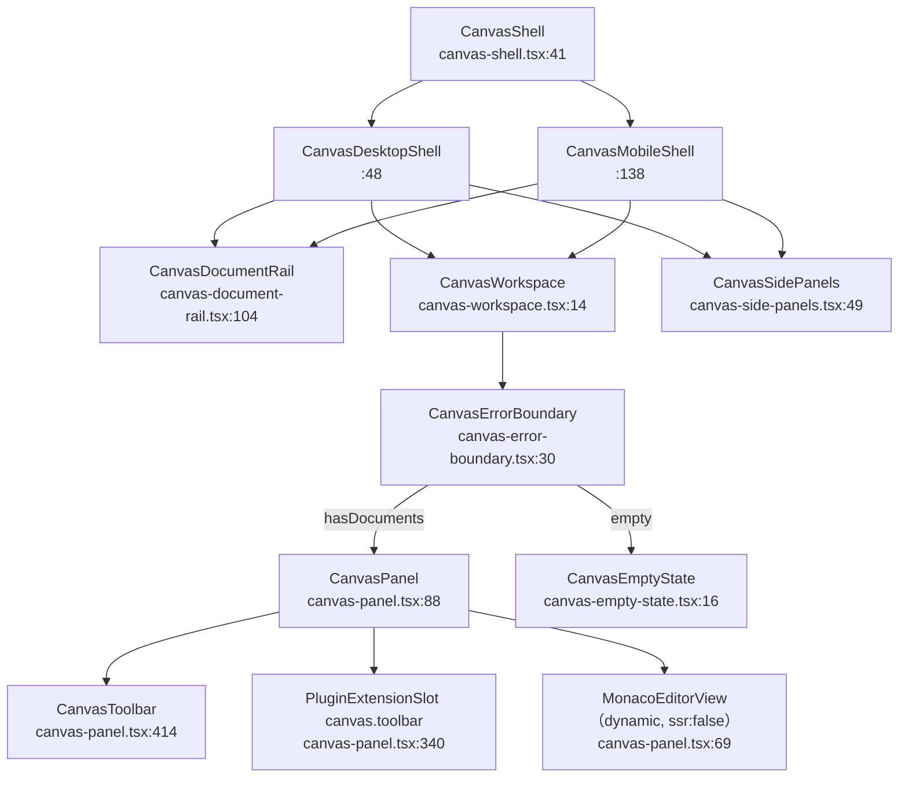

# Canvas

<Status variant="stable" />

<TLDR>
  Canvas 是 cognia-next 中可编辑的「工作区」界面：一个直接挂载在 React 树里的真实 Monaco 编辑器，外面
  包裹 AI 操作工具栏（review / fix / improve / explain / simplify / expand / translate / format）和
  右侧五标签面板（建议 · 历史 · 评论 · 协作 · 执行）。文档由**单一 store** 拥有 ——
  `useArtifactStore.canvasDocuments`（`stores/artifact/artifact-store.ts:361`），持久化到
  `localStorage["cognia-artifacts"]`，并由 `startCanvasDexieBridge`（`lib/canvas/dexie-bridge.ts:267`）
  **写穿镜像**到四张 Dexie 表。实时协同是可选的 CRDT + WebSocket 层；Python 通过在 Rust 侧拉起真实
  解释器执行（`canvas_run_python`，`src-tauri/src/canvas/python_exec.rs:34`）。
</TLDR>

<StatGrid>
  <Stat label="源文件" value="约 50" hint="lib/components/hooks/stores/types + 2 个 Rust" />
  <Stat label="Dexie 表" value="4" hint="documents · versions · comments · sessions（v11 引入，schema 现为 v65）" />
  <Stat label="侧栏标签" value="5" hint="建议 · 历史 · 评论 · 协作 · 执行" />
  <Stat label="AI 操作" value="10" hint="canvas-actions.ts:47 的 ACTION_PROMPTS" />
  <Stat label="Zustand store" value="5" hint="1 个唯一真源 + 4 个 canvas 专用" />
  <Stat label="特性开关" value="2" hint="aiWorkbench.v1 · collaboration.v1（默认均开启）" />
</StatGrid>

## 它是什么

Canvas 是 Cognia 对「工作区」体验的实现。用户在聊天中生成一段代码或文档块，点击 **Open in Canvas**，
工作区面板里就会打开一个 Monaco 编辑器。从这里开始：

- AI 可以**持续改写**文档 —— 每个操作落地前都会产出可审阅的 diff。
- 文档拥有**版本历史** —— 任何 AI 改动、手动保存或自动保存都会生成一个 `CanvasDocumentVersion` 快照。
- 多个客户端可以基于 WebSocket + 向量时钟 CRDT **协同编辑**同一文档。
- 内嵌的 **Python 执行面板**在编辑器旁运行代码（仅桌面端）。
- **评论 + 表情**像 Google Docs 一样锚定到行区间。

Canvas 与 [Artifacts](../artifacts-sandbox) 是两条共享存储的不同路径：

- **Artifact** —— 一次性生成内容，渲染在沙箱化的 iframe 中。
- **Canvas** —— 面向持续编辑的文档，Monaco 直接挂载在主 React 树里。

将 artifact「升级」进工作区的入口是 `revealArtifactInWorkspace`（`lib/artifacts/reveal.ts:5`），由聊天
artifact 部件上的 `handleOpenInCanvas` 触发（`components/chat/message-parts/artifact-part.tsx:48`）。
它的孪生函数 `revealCanvasDocument`（`reveal.ts:44`）对已存在的 canvas 文档做同一件事——激活文档并把
外壳切到 Canvas guild。**不存在 `/canvas/<id>` 路由**：本应用是静态导出、没有任何动态段，所以行内
canvas 卡片过去渲染的那个锚点每次点击都是 404。

## 模块地图

每个方块都是一个文档页面。逐模块页面给出行级精确的内部细节。

<Cards>
  <Card title="编辑器内核" href="./editor-core" description="Monaco 挂载 + 离线 loader、三栏 shell、文档轨道/标签、主题同步、符号、片段、插件、大文件分块、快捷键" />
  <Card title="状态与持久化" href="./state-persistence" description="唯一真源（useArtifactStore）、5 个 canvas store、Dexie 写穿桥、四张表、特性开关" />
  <Card title="AI 操作与建议" href="./ai-actions" description="10 个操作 prompt、diff 审阅落地管线、结构化建议流、独立的 context-analyzer" />
  <Card title="协作" href="./collaboration" description="向量时钟 CRDT、WebSocket provider（固定间隔重连 + 心跳）、会话、/canvas/join 流程" />
  <Card title="执行与评论" href="./execution-comments" description="Rust 的 canvas_run_python 沙箱、执行面板、行级评论线程、版本时间线 + diff" />
</Cards>

## 分层架构

## 组件组合树

`CanvasShell` 选择桌面端（可调整的三栏）或移动端（Sheet）布局，再挂载三个界面。编辑器本身包裹在错误边界
里，并根据是否存在文档做门控。

`CanvasDocumentList`（`canvas-document-list.tsx:83`）和 `CanvasDocumentTabs`
（`canvas-document-tabs.tsx:37`）是独立的、由 props 驱动的界面 —— 不在上面的 shell 树内，shell 用的是
`CanvasDocumentRail` 加 `CanvasToolbar` 里内联的标签条。

## 相对旧文档的变化

本节取代的单页文档已与实现脱节。具体修正：

| 旧文档的说法 | 实际情况 | 来源 |
| --- | --- | --- |
| 「Dexie v15」 | canvas 表在 **v11** 引入；schema 现为 **v65**（自 v11 未变） | `lib/db/schema.ts:487`、`:1692` |
| AI 操作 `generate / refactor / debug` | 实际操作集为 **review · fix · improve · explain · simplify · expand · translate · format**（外加 `custom`、`run`） | `lib/ai/generation/canvas-actions.ts:47` |
| 「指数退避」重连 | 重连用**固定间隔**（默认 1000 ms），上限 5 次 —— 无退避 | `websocket-provider.ts:310`、`:326` |
| `useCanvasStore` 归属含糊 | **不存在** `useCanvasStore`；文档与版本都在 `useArtifactStore` | `stores/artifact/artifact-store.ts:361` |
| （暗示）context-analyzer 喂给 prompt | `ContextAnalyzer` 已完整实现但**未接线** —— 两个 AI hook 都直接发原始文档文本 | `lib/canvas/ai/context-analyzer.ts:79` |
| Python 结果字段 | 结果结构体为 `{ stdout, stderr, exit_code, duration_ms }`；超时返回 `exit_code: 124` | `src-tauri/src/canvas/python_exec.rs:15`、`:81` |

## 沙箱与信任边界

- **Python 执行**会拉起真实的操作系统解释器（Windows 上为 `python`，其余为 `python3`），使用管道 stdio
  与 `kill_on_drop(true)` —— **没有** firejail/Docker 隔离。Canvas 假设运行在可信的本地机器上，唯一硬边界
  是 30 秒超时。见 [执行与评论](./execution-comments)。
- **协作**从不自动连接：即便 `canvas.collaboration.v1` 开启（默认），WebSocket 客户端也只在用户已在设置中
  配置了服务器 URL 时才连接。
- **Web 模式**（无 Tauri）没有 Python 通道 —— 执行会经 `lib/native/code-execution-strategy` 回退到
  浏览器/模拟路径。

## 下一步

<Cards>
  <Card title="编辑器内核" href="./editor-core" description="Monaco 挂载、shell 布局、主题、符号" />
  <Card title="状态与持久化" href="./state-persistence" description="useArtifactStore + Dexie 桥" />
  <Card title="Artifacts / 沙箱" href="../artifacts-sandbox" description="另一条 UI 路径：iframe 隔离的一次性内容" />
  <Card title="聊天与技能" href="../../chat/chat-and-skills" description="代码块升级进 Canvas 的入口" />
</Cards>
