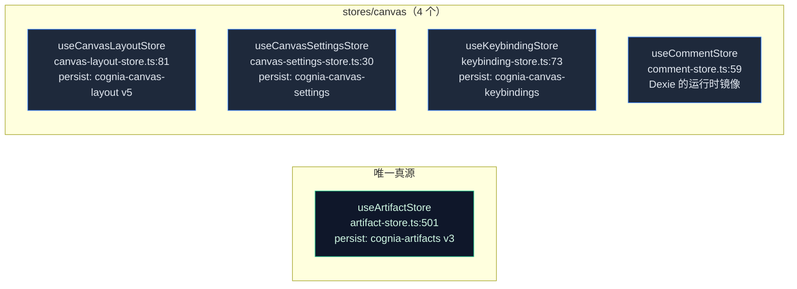
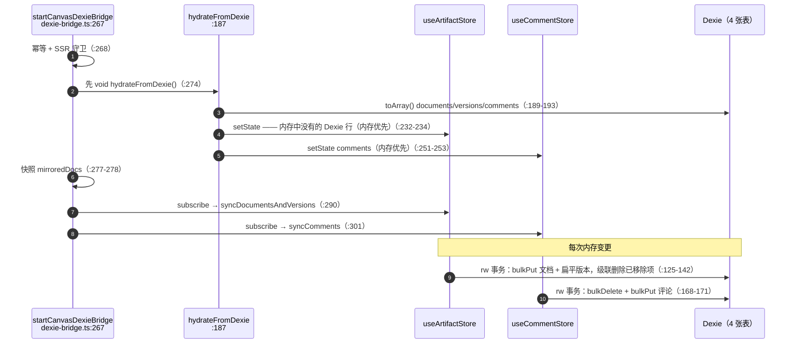

# 状态与持久化

<Status variant="stable" />

<TLDR>
  Canvas 文档及其嵌套版本存放在 **`useArtifactStore`**（`stores/artifact/artifact-store.ts:501`），
  持久化到 `localStorage["cognia-artifacts"]`（v3）。**不存在** `useCanvasStore`。另有五个较小的 store
  分别拥有布局、设置、运行时分块、评论与快捷键。`startCanvasDexieBridge`（`lib/canvas/dexie-bridge.ts:267`）
  把文档 + 扁平化版本 + 评论镜像进四张 Dexie 表（v11 引入，schema 现为 v65）—— **先注水，再订阅**，
  冲突时内存恒优先，任何 Dexie 写失败都只告警。
</TLDR>

<StatGrid>
  <Stat label="唯一真源" value="useArtifactStore" hint="canvasDocuments（artifact-store.ts:361）" />
  <Stat label="持久化键" value="4" hint="cognia-artifacts · -canvas-layout · -canvas-settings · -canvas-keybindings" />
  <Stat label="Dexie 表" value="4" hint="documents · versions · comments · sessions" />
  <Stat label="仅运行时 store" value="1" hint="comment-store（Dexie 的镜像）" />
</StatGrid>

## 唯一真源

`useArtifactStore` 持有 canvas 文档映射；版本嵌套在每个文档内（canvas 文档没有独立的版本映射）：

| 字段 / 动作 | 行号 | 说明 |
| --- | --- | --- |
| `canvasDocuments: Record<string, CanvasDocument>` | `artifact-store.ts:361` | 文档映射 |
| `activeCanvasId` / `canvasOpen` | `:362` / `:363` | 活动选择 + 面板开启 |
| `createCanvasDocument` | `:879` | 返回新 id，打开面板，触发插件 create/switch |
| `updateCanvasDocument` | `:922` | 合并内容/编辑上下文，标记 `saveState:"dirty"` |
| `deleteCanvasDocument` | `:1002` | —— |
| `saveCanvasVersion` | `:1125` | 快照一个版本；应用自动保存保留策略 |
| `restoreCanvasVersion` | `:1159` | 先自动保存当前，再恢复 |
| `addSuggestion` / `applySuggestion` / `updateSuggestionStatus` | `:1038` / `:1079` / `:1060` | AI 建议生命周期 |

持久化：**Dexie**，自 persist v7 起。此前 `partialize` 会在每次状态变更时把 `canvasDocuments` 整体写进
`localStorage["cognia-artifacts"]` —— 而 `editorContext.selection` 每次移动光标都会变，所以在一份大文档里
移动光标就意味着把用户所有的 canvas 文档重新序列化一遍。v6（schema v206）先把一次性 artifact 挪进
`artifacts` / `artifactVersions`，v7 再把这些挪进 `canvasDocuments` / `canvasVersions`；blob 里只剩 dock
的偏好。自动保存版本保留至多 `MAX_CANVAS_AUTOSAVE_VERSIONS = 30`（`:51`），裁剪最旧的自动保存而保留手动版本
（`applyCanvasVersionRetention`，`:254`）。

组件直接读这个 store。曾有一个 `useCanvasDocuments` 外观（排序列表、create/open/rename/duplicate/search）
覆在它上面，零消费者；它被删除了，而不是留作"问同一个问题的第二种方式"。

## 四个 Canvas Store



- **`useCanvasLayoutStore`**（`canvas-layout-store.ts:81`）—— 面板尺寸、折叠标志、活动右标签、
  `pinnedDocIds: Set`（经 `partialize`/`merge` 序列化为数组，`:150-167`）。`setSizes`（`:88`）夹紧并去抖
  （`CANVAS_LAYOUT_PERSIST_DEBOUNCE_MS = 150`，`:65`）。
- **`useCanvasSettingsStore`**（`canvas-settings-store.ts:30`）—— 编辑器/AI/版本/协作/执行/无障碍的设置树。
  `updateSettings`（`:62`）在应用前用 `validateSettings` 校验；`getEditorOptions`（`:84`）把设置映射为
  Monaco options。
- **`useKeybindingStore`**（`keybinding-store.ts:73`）—— `DEFAULT_KEYBINDINGS` 是一个 40 项操作映射
  （`:15`）；冲突检测经 `checkConflicts`（`:151`）。
- **`useCommentStore`**（`comment-store.ts:59`）—— `canvasComments` 表的内存镜像；每次变更先同步写内存，再
  经 `safeDexieCall`（`:53`）fire-and-forget 写 Dexie。详见 [执行与评论](./execution-comments#评论)。
## Dexie 写穿桥

`startCanvasDexieBridge` 在应用启动时运行一次并返回 disposer。顺序是关键：**先注水再订阅**，使备份恢复写入
的 Dexie 行不被空白内存 store 覆盖。



写穿路径细节：

1. UI 编辑调用 `useArtifactStore.updateCanvasDocument`（`artifact-store.ts:922`）—— 内存映射改变。
   不再写 localStorage：自 persist v7 起，Dexie 才是权威副本。
2. 桥的 `subscribe` 回调触发（`dexie-bridge.ts:290`）→ `syncDocumentsAndVersions(docs)`（`:87`）。
3. 它与 `mirroredDocs` 快照做 diff，扁平化每个文档的 `versions[]`，并在四张表上跑单个 `rw` 事务：级联删除
   已移除文档的版本/评论/会话，再 `bulkPut` 文档 + 版本 upsert 并 `bulkDelete` 已移除版本（`:125-142`）。
4. 镜像集合（`mirroredDocs`、`mirroredVersionIds`）更新，使下次 diff 最小化（`:294`、`:144`）。

评论以两条写路径进入同一张 `canvasComments` 表 —— store 自己的 `safeDexieCall` 与桥的 `syncComments` ——
两者都以评论 `id` 为键，因此 `bulkPut` 幂等。优雅降级：每次 Dexie 写都被包裹，失败仅记录日志；本地编辑通过
Zustand 继续。

## 四张 Dexie 表

在 `this.version(11)`（`schema.ts:487`）引入，并逐字重声明到 v18；schema 现为 `this.version(65)`
（`schema.ts:1692`），canvas 索引未变：

```ts title="lib/db/schema.ts:501-504（v11，至 v65 未变）"
canvasDocuments: "id, title, language, type, updatedAt, createdAt"
canvasVersions:  "id, documentId, [documentId+createdAt], isAutoSave"
canvasComments:  "id, documentId, [documentId+createdAt], parentId, resolvedAt"
canvasSessions:  "id, documentId, ownerId, createdAt"
```

CRUD 归属：

- **`canvasDocuments` / `canvasVersions`** —— 无专用 CRUD 模块；桥直接拥有这些写入。行类型在
  `lib/db/canvas-types.ts`（`CanvasDocumentRow:16`、`CanvasVersionRow:30`）。
- **`canvasComments`** —— `lib/db/canvas-comments.ts` 暴露完整 CRUD（`listForDocument:44`、
  `addComment:64`、`replyToComment:133`、`resolveComment:93`、`addReaction:109`、`bulkImport:162`、…）。
- **`canvasSessions`** —— `lib/db/canvas-sessions.ts` **只**持久化协作会话元数据（`upsertSession:74`、
  `getActiveSessionForDocument:90`、`closeSession:102`、`listRecent:111`）；逐操作的 CRDT 流刻意不持久化。

## 特性开关

`lib/canvas/feature-flags.ts` 解析两个开关，**后者覆盖前者**：默认 → 环境变量 → localStorage
（`getCanvasFeatureFlags`，`:55-60`）。

| 开关 | 默认 | 环境变量 | 控制 |
| --- | --- | --- | --- |
| `canvas.aiWorkbench.v1` | `true`（`:6`） | `NEXT_PUBLIC_CANVAS_AI_WORKBENCH_V1`（`:37`） | AI 工具栏 + 建议 |
| `canvas.collaboration.v1` | `true`（`:7`） | `NEXT_PUBLIC_CANVAS_COLLABORATION_V1`（`:38`） | 协作面板 + WS 客户端 |

localStorage 键 `"cognia-canvas-feature-flags-v1"`（`:3`）；环境字符串 `"0"`/`"false"` → 关，
`"1"`/`"true"` → 开（`:40-50`）。由于 localStorage 最后生效，设置 UI 的覆盖会胜过环境与默认。

## 自动保存

`CanvasPanel` 自己内联持有自动保存：一个下限 10 秒的间隔（`canvas-panel.tsx:242-259`）读取 Monaco 的实时
缓冲，经 `updateCanvasDocument` 写回，并用 `saveCanvasVersion(id, "auto-save")` 打一个版本快照。切换活动
文档时该间隔会重建——挂起的那一 tick 也随之清除。

另有一个 `useCanvasAutoSave` hook 实现了另一套模型（自带 `localContent` 状态 + 静默去抖计时器），从未被
使用。它不能直接替换面板那版：面板把 `editorRef.current.getValue()` 当作权威缓冲，而 hook 的镜像状态会与
之打架。该 hook 已删除。

## 下一步

<Cards>
  <Card title="编辑器内核" href="./editor-core" description="谁在写入这个状态" />
  <Card title="执行与评论" href="./execution-comments" description="评论 store + 版本时间线深入" />
</Cards>
