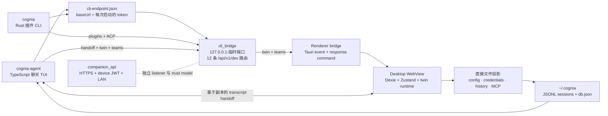

# CLI ↔ App 桥接

<Status variant="stable">12 条经认证的回环路由 · 两个 CLI 消费者 · 双向 transcript handoff</Status>

<TLDR>
  Cognia 有两个不同的本地 CLI。`cognia-agent` 是 TypeScript 聊天 TUI；`cognia` 是 Rust
  插件作者 CLI。两者都通过 `cli-endpoint.json` 发现运行中的 Tauri 应用，但消费同一个
  12 路由回环服务的不同部分。桌面端还会把 config、credentials、history 和用户选中的 MCP
  server 直接投影到独立 Agent 的 home。会话可以双向交接，但它是基于副本的：两个 shell
  保持分离的 store，也不会共享一个仍在运行的 sidecar session。
</TLDR>

## 边界

| 层 | 位置 | 职责 |
| --- | --- | --- |
| 原生服务 | `src-tauri/src/cli_bridge/` | listener 生命周期、endpoint 发布、认证、路由、插件操作与 renderer pending request |
| Renderer bridge | `lib/cli-bridge/` | 直接文件投影、二进制检测、renderer-backed twin/team dispatch 与 CLI-home helper |
| Agent CLI client | `cli/src/handoff/`、`cli/src/team/`、`cli/src/twin/` | 桌面发现、session handoff 与 renderer-backed request |
| 插件 CLI client | `crates/cognia-cli/` | 插件生命周期与 ACP token broker |
| 用户控制 | `components/settings/cli-bridge/` | 手动同步与选择性 auto-sync |

该服务不是 Companion API。`cli_bridge` 在 IPv4 loopback 上使用普通 HTTP 和每次启动随机生成的
bearer token。`companion_api` 是另一个面向已配对设备的 HTTPS listener，并使用 device JWT。
两套路由 catalog 不会挂载到彼此。

## 设计不变量

- **两个 CLI 不可互换。** `cognia-agent` 消费 6 条 path，`cognia` 消费 7 条；经认证的
  health 是唯一交集。
- **Store 分叉、实现共享。** GUI 持有 browser IndexedDB 和 keyring state。CLI 通过 fake
  IndexedDB 使用同一个 `CogniaDB` schema，将快照写入 `~/.cognia/db.json`，并把 transcript
  以 JSONL 存在 `~/.cognia/sessions/`。
- **同步是投影，不是共享持久化。** 桌面拥有的值被复制到 CLI 文件；桌面关闭后 CLI 仍可独立运行。
- **Handoff 创建 continuation 副本。** 两个方向都不转移活跃 SDK session id；历史 turn 在接收
  shell 中作为 transcript context 重新注入。
- **Renderer state 需要活跃 WebView。** Twin context 与三项 team 操作使用 request/response
  bridge，因为权威状态位于 Dexie、vector storage 或 Zustand。

> 实现说明：当前原生 Tauri startup block 调用 `cli_bridge::init` 时没有显式的移动端编译门控。
> Renderer listener 与同步 UI 受 desktop/Tauri gate 保护，但在代码真正强制这一边界前，文档不应
> 声称原生 listener 一定不会在移动端启动。

## 继续阅读

<Cards>
  <Card title="传输与安全" href="./transport-and-security" description="Endpoint 发现、全部 12 条路由、认证、消费者归属，以及 renderer request/response 流程。" />
  <Card title="同步与 Handoff" href="./sync-and-handoff" description="直接文件投影、credential 与 MCP 范围、两个 transcript 方向，以及 forked-store 模型。" />
</Cards>

## 相关决策

- [ADR-0050 — CLI TUI 操作体验](../../adr/0050-cli-tui-operation-experience)
- [ADR-0077 — TUI external-agent hosting](../../adr/0077-tui-external-agent-hosting)
- [ADR-0078 — CLI ↔ App bridge](../../adr/0078-cli-app-bridge)
