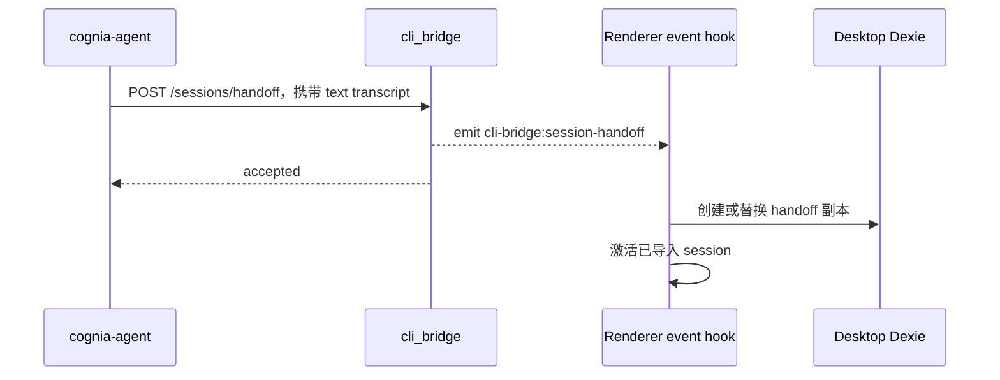

# 同步与 Handoff

## Desktop → CLI 投影

这条路径不使用 HTTP server。Renderer 解析原生宿主使用的同一个 CLI home，并通过 Tauri command
写入受限的 bare filename。

| 表面 | 目标 | 触发与行为 |
| --- | --- | --- |
| Agent 默认值 | `~/.cognia/config.json` | 保留桌面端不拥有的 key；只投影 CLI strict schema 接受的 field |
| Provider secret | `~/.cognia/credentials.json` | Owner-only 文件；provider API key 与受支持的 subscription credential |
| Composer history | `~/.cognia/history.json` | 把近期 Dexie history 规范化为 CLI oldest-first 格式 |
| MCP server | `~/.cognia/mcp.json` | 仅手动同步；复用 per-agent MCP projection 与用户选择 |

手动 **Sync now** 推送全部四个表面。Auto-sync 是 opt-in，在桌面启动或启用时运行；它推送
config、credentials 与 history，但保留显式 MCP 选择。每项失败彼此隔离，一个不可用的 credential
来源不会阻塞其他文件。

## GUI → CLI transcript

桌面端按顺序把 message part 序列化到 `<CLI_HOME>/handoff/<sessionId>.jsonl`。Text 与
markdown 保持可读，code 保留 fence；reasoning、tool 与 result、attachment、image、A2UI 和未知的
未来 part 会变成有长度上限的 marker，而不会静默消失。CLI 读取 drop，并为新的 Agent process
把早先对话作为文本 preamble 注入。

这是 snapshot continuation。它不会传递 desktop SDK session id、keyring handle 或实时 stream。

## CLI → GUI transcript

独立 Agent 通过 `cognia-agent handoff`、`run --handoff` 或交互式 `/handoff` 命令显式请求交接：

Importer 通过生成新 id 防止 incoming id 覆盖 native session；同一个 CLI 副本的重复 handoff
保持幂等。由于 CLI sidecar 无法在桌面中恢复，它会种入 transcript continuation。HTTP acceptance
早于 renderer persistence。

## Live renderer-backed 操作

Twin 与 team call 是 `cognia-agent` 唯一的实时协同平面：

- Twin context 在 renderer 中计算、脱敏，并以 prompt segment 和 source metadata 返回；raw chunk
  留在桌面 runtime 内。
- Team definition 与 run state 位于 renderer store。CLI 可以列出 team、启动 run 并轮询 status
  delta；CLI watcher 退出后 run 仍在桌面继续。

这些操作要求 WebView 正在运行。除此之外，builtin Agent 与 external-agent hosting path 不依赖桌面进程。

## Forked store，共享代码

CLI 安装 fake IndexedDB，打开共享的 `CogniaDB` schema，并把自己的数据库快照写入
`~/.cognia/db.json`。Transcript 位于 `~/.cognia/sessions/`。GUI 继续使用 browser IndexedDB 与
OS keyring state。共享 database type 和 Agent assembly 会减少行为漂移，但没有 file watcher 或
双向数据库复制让它们成为同一个数据库。

这种分离是刻意的：同步与 handoff 都是显式 copy operation，桌面关闭后独立 Agent 仍可使用。
