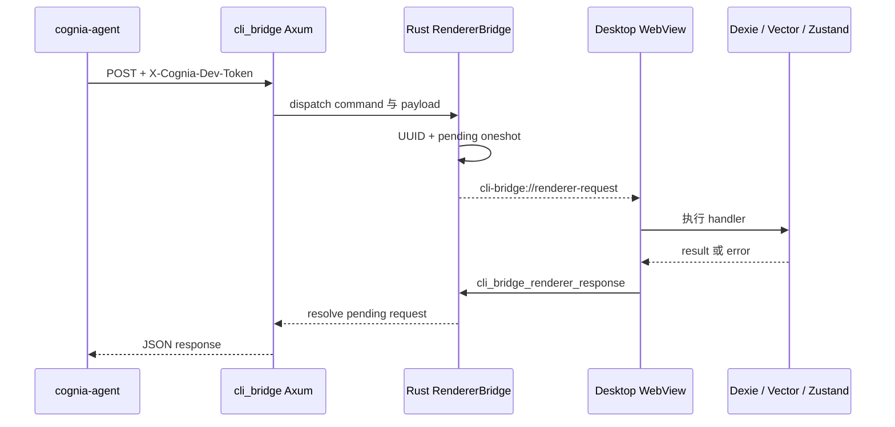

# 传输与安全

## 发现生命周期

Tauri 启动时，`cli_bridge::init` 绑定 `127.0.0.1:0`，生成 32 个随机字节，将其编码为
64 字符 hex token，并在 OS config 目录下写入 `cognia/cli-endpoint.json`：

```json
{
  "baseUrl": "http://127.0.0.1:<ephemeral-port>",
  "devToken": "<64-character hex token>"
}
```

Unix 会在写入后 best-effort 改为 `0600`；Windows 依赖用户 profile ACL。文件可在退出后残留，
因此 client 把它视为发现提示，而不是存活证明：`cognia-agent` 会执行经认证的 health probe，
`cognia` 则把 connection refusal 转为 stale-endpoint 诊断。每次成功重启都会覆盖文件并轮换 token。

## 请求边界

- Listener 只绑定 IPv4 loopback；即使未来 socket 配置变化，middleware 仍会以 403 拒绝非
  loopback 的 `ConnectInfo`。
- 包括 health 在内的每条路由都要求 `X-Cognia-Dev-Token`。
- 等长 token 逐字节比较且不提前退出；长度不同直接失败。
- 整个 router 受 4 MiB request-body 上限保护。
- 该通道可阻止读不到 endpoint file 的无关本地 caller，但无法隔离已作为同一个 OS user 运行的
  恶意进程。

## 路由 catalog

实际注册 path 严格为 **12** 条。`src-tauri/src/cli_bridge/server.rs` 内的 Rust
characterization test 锁定了列表与 router 路由数。

| Method 与 path | 消费者 | 执行方式 |
| --- | --- | --- |
| `GET /api/v1/dev/health` | 两个 CLI | Rust 存活响应 |
| `GET /api/v1/dev/plugins/installed` | `cognia` | 脱敏插件快照 |
| `POST /api/v1/dev/plugins/install` | `cognia` | 安装 bundle |
| `POST /api/v1/dev/plugins/install-directory` | `cognia` | 安装 unpacked 目录 |
| `POST /api/v1/dev/plugins/uninstall` | `cognia` | 移除插件 |
| `POST /api/v1/dev/plugins/reload` | `cognia` | reload 或重新安装 artifact |
| `POST /api/v1/dev/acp/token` | `cognia` | 为 ACP 签发 device-scope companion JWT |
| `POST /api/v1/dev/sessions/handoff` | `cognia-agent` | 发出异步 renderer import event |
| `POST /api/v1/dev/twin/context` | `cognia-agent` | Renderer round-trip |
| `POST /api/v1/dev/teams/list` | `cognia-agent` | Renderer round-trip |
| `POST /api/v1/dev/teams/run` | `cognia-agent` | Renderer round-trip |
| `POST /api/v1/dev/teams/run-status` | `cognia-agent` | Renderer round-trip |

`cognia-agent` 使用 6 条 path，`cognia` 使用 7 条。Health 是唯一共享项，所以并集为 12。
Installed-plugin projection 刻意排除 `runtime_state`；twin context 只返回脱敏 prompt segment，
不会返回 raw source chunk。

## Renderer request/response

Twin 与 team route 的权威数据在 WebView 内，无法只由 Rust 回答。它们使用真正的 pending-request
protocol，而不是 fire-and-forget event：



Rust 在 30 秒后清理 pending request。Agent CLI 在 10 秒后 abort fetch，因此 client 会先返回，
Rust 仍保证 pending map 最终清理。相比之下，`sessions/handoff` 在 Rust emit renderer event 后
立即确认；HTTP success 并不表示 Dexie import 已完成。

## 为什么 Companion API 保持独立

| 属性 | CLI bridge | Companion API |
| --- | --- | --- |
| 受众 | 同一用户的本地 CLI | 已配对移动设备 |
| Bind | `127.0.0.1:0` | 可配置 LAN listener，默认端口 27890 |
| Transport | HTTP | HTTPS、WebSocket、WebRTC tier |
| 认证 | 每次启动 dev token | Pairing flow 与 device JWT |
| 发现 | 本地 endpoint file | Health、mDNS、tunnel、signaling |

设备侧服务见 [External API](../companion-api)。
