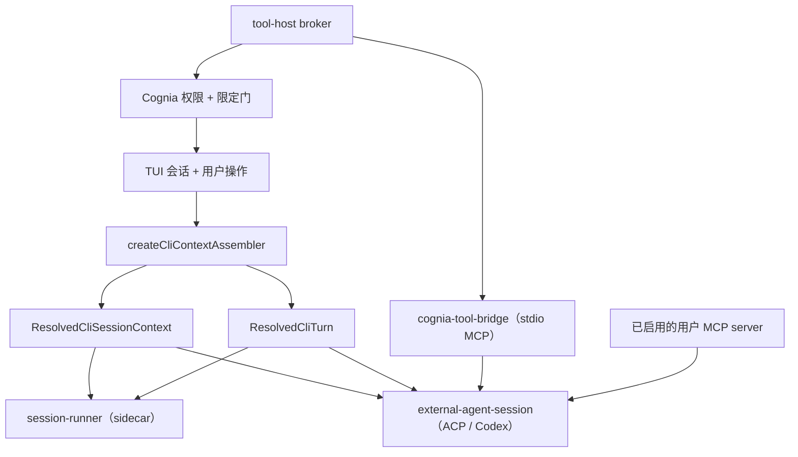

# Cognia 对等

<Status variant="stable">共享上下文装配器 · 带鉴权的工具桥 · 上下文版本化会话</Status>

<TLDR>
  托管 Codex 或 Claude Code 过去改变的是会话的**语义**，而不只是传输方式：外部路径只转发
  `config.systemPrompt` 加四个原始 config 字段，而内置路径会解析项目指令、输出风格、agent mode、
  skills、工具策略、附件与 twin grounding。现在两个后端消费同一个 resolver；Cognia 自有工具通过一条
  带鉴权的 MCP 桥抵达外部 Agent，且由 Cognia——而非 Agent——决定是否放行。已解析上下文发生变化的会话
  会被重启，而不是静默沿用。
</TLDR>

## 对等契约

```text
effectiveExternalCogniaTools(session) == effectiveBuiltinCogniaTools(session)

externalVisibleTools = externalNativeTools + effectiveCogniaTools + enabledUserMcpTools
```

对等指的是**有效**对等。在应用类别开关、agent-mode 过滤、`allowedTools` / 禁用工具覆盖、工作区限定、
plan/acceptEdits/bypass 语义以及运行时可用性之后，外部 Agent 拿到的 Cognia 工具集与内置后端在同一会话
下拿到的完全一致。它绝不意味着强行打开用户关掉的类别。

## 一个 resolver，两种传输



`cli/src/agent/session-context.ts` 拥有会话语义；其背后仍以 `toBuildContext` → `resolveSendOptions`
为唯一真相源。每个后端只负责翻译结果：内置 mapper 喂 sidecar `SendOptions`，外部 mapper 喂 `session/new`
元数据与 prompt 内容。

对外部后端而言，有两个字段刻意仍取自原始 config：

| 字段 | 原因 |
| --- | --- |
| `model` | 该字段的契约是「用户为这个**后端**显式要求的模型」——一个由 Agent 拥有的 id。`sendOptions.model` 说的是 Cognia 的 provider catalog，替换它会改写 Codex 实际运行的模型。 |
| `allowedTools` | ACP 的这个字段预批准的是 Agent **自己**的工具，使用它的原生词汇。Cognia 解析出的策略用的是 Agent 无法调用的 `mcp__cognia-*__` 名称，改由 broker 对投射出的工具执行。 |

## 工具宿主

Cognia 的工具是被**托管**而非被复制的。涉及两个进程：

- **broker**（`cli/src/agent/tool-host/broker.ts`）运行在 CLI 进程内，拥有会话身份、有效清单、工作区
  限定、审批 overlay、host 工具执行与取消。它监听一个仅属主可访问的本地 socket，并为每次连接尝试签发
  一枚 token。
- **bridge**（`sidecar/cognia-tool-bridge.mjs`）由外部 Agent 作为普通 stdio MCP server 拉起。它位于
  sidecar bundle，因为真正的工具定义与 handler 就在那里；在 CLI 侧重做一份意味着第二个 schema 源。

挂载的是两个 MCP server 而不是一个，这样 `mcp__cognia-tools__*` 与 `mcp__cognia-plugin-tools__*`
前缀与内置后端完全一致。

| 平面 | 执行方 | 原因 |
| --- | --- | --- |
| `cognia-tools` 内建工具 | bridge，在 Cognia 放行之后 | 其 handler 需要进程本地状态（read tracker、后台 shell、任务图、LSP 与 code-graph resolver） |
| `cognia-plugin-tools`（插件、web、`ask_user`、`load_skill`、`dispatch_agent`） | broker | 其 handler 就在 CLI 进程里——插件运行时、TUI elicitation overlay、skill 存储、subagent 分发器 |
| 用户 MCP server | Agent 自己 | 不变；叠加式且可独立开关 |

### 授权

1. 模型调用 `mcp__cognia-tools__<name>` 或 `mcp__cognia-plugin-tools__<name>`。
2. 外部 Agent 可能发出它自己的权限请求。Cognia **仅**对这两个命名空间自动确认——该确认不是执行批准，
   它的存在是为了让一次 Cognia 调用不产生两次提示。
3. bridge 请求 broker 授权这次调用。
4. broker 重新校验可见性、重新检查路径限定（包含凭据路径，且即便 Agent 已被沙箱约束也照查），必要时
   通过 Cognia 自己的 overlay 提示用户。
5. 到这一步 handler 才执行；结果被回报，因此该调用渲染在与内置调用完全相同的工具单元里。

Agent 的原生工具仍照常走 ACP 权限请求。

endpoint 与 token 通过**环境变量**传递，**绝不进 argv**——argv 可被 `ps` 全局读取，而该 token 授权的是
针对一个活跃 Cognia 会话的工具执行。

## 上下文版本与重启

ACP 与 Codex app-server 在 `session/new` 时一次性消费指令、根目录、模型、权限模式与 MCP/工具面。
`cli/src/agent/context-version.ts` 只对这些字段做指纹（排除凭据与每轮传输旋钮），每轮都会比对。

| 字段 | 生效层 |
| --- | --- |
| Twin 上下文、附件 | 每轮 |
| 权限模式、模型 | adapter 支持时在活跃会话上原地生效 |
| 系统提示、agent mode、skills、输出风格、MCP server、Cognia 工具、插件工具、工作根目录 | 重建会话 |
| 思考等级、外部 skill 根目录 | 重连（Codex 在注册进程时读取） |

会话层变更会重建外部协议会话，并给出一条提示：transcript 保留，但 Agent 从这一轮重新开始。曾考虑过
向活跃会话追加第二份系统提示，但那会让 Agent 同时持有两套冲突指令，并使 resume 变得不确定。

记录下来的 resume 链接会带上创建时的上下文版本，因此 `/resume` 绝不会把设置已变更的会话交还给 Agent。
版本机制出现之前写入的链接没有该字段——未知不等于匹配。

## 兼容性

在默认对等契约下，无法在 `session/new` 接受 MCP server 的 Agent 属于**不兼容**，而不是「少几个工具但可
用」——`/tools` 里能看到的每个 Cognia 工具都调不动。因此连接流程在 composer 打开**之前**就失败，而不是
让用户靠一次次静默失败的工具调用去发现。

`/status` 与 `/doctor` 报告的是实际达成的状态：当前上下文版本、当前策略下的 Cognia 内建/host 工具数量、
用户 MCP 数量、桥健康度，以及哪些设置会重启 Agent 上下文。

## 真机 agent 验证

`pnpm smoke:external-parity` 驱动的是**真实 agent**（非 stub），穿过真实的 manager、
真实的沙箱 launcher、真实的 broker 与真实的桥，并以「agent 确实调用了一个只读工具和一个
变更工具、且磁盘上有可验证的副作用」作为通过条件。

| 后端 | 结果 | 说明 |
| --- | --- | --- |
| `codex-app-server` | PASS | 投射 46 个内建 + 4 个 host 工具；`read` 与 `write` 均经桥执行 |
| `codex`（ACP shim） | PASS | 同一工具面，走 `@zed-industries/codex-acp` 传输 |
| `claude-code` | 本机未能验证 | `claude-agent-acp` 在 `session/new` 报 `spawn Unknown system error -88`，**即使一个 MCP server 都不挂**也一样，故失败发生在该 agent 自身拉起 Claude 的环节，与工具投射无关 |

smoke 暴露出两个问题，二者都是在工具真正被投射之后才可能被发现的：

- **Codex 忽略了挂载的 MCP server。** Codex 没有 per-session 的 `mcpServers` 参数——它从
  配置读取——因此 adapter 静默丢弃了调用方挂载的全部 server。现在它们随
  `thread/start` 的 per-thread `config` 覆盖下发
  （`lib/ai/agent/external/codex-mcp-config.ts`）。在此之前，桥报告一切健康，而 Codex
  回答 `mcp__cognia-tools__*` 不可用。
- **`git` 工具类别在严格 launcher 沙箱下经桥调用不可用。** git 子进程确实执行了，但对一个
  在非沙箱下 `git` 能正常读取的工作区报「not a git repository」。这是 launcher 沙箱与 git
  工具的交互问题，与桥无关，smoke 对其只报告、不作为通过条件。

## 文件

| 关注点 | 位置 |
| --- | --- |
| 共享会话/轮次解析 | `cli/src/agent/session-context.ts`、`cli/src/agent/turn-dispatch.ts` |
| 上下文指纹 | `cli/src/agent/context-version.ts` |
| 工具宿主 broker、策略、拉起配置 | `cli/src/agent/tool-host/` |
| MCP 桥 | `sidecar/cognia-tool-bridge.mjs` |
| 外部传输映射 | `cli/src/agent/external-agent-session.ts` |
| 能力与诊断真相 | `cli/src/tui/runtime/backend-capabilities.ts`、`cognia-parity-report.ts` |
| 字段生效层表 | `cli/src/tui/runtime/context-lifecycle.ts` |
| 后端生命周期所有者 | `cli/src/tui/runtime/backend-lifecycle.ts` |
