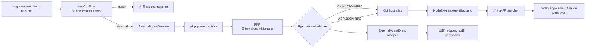

# Agent CLI 外部托管

<Status variant="stable">Codex 与 Claude Code 已验证 · macOS 与 Linux · 强制严格沙箱</Status>

<TLDR>
  `cognia-agent chat --backend codex` 和 `--backend claude-code` 只替换 turn session factory。
  preset、ACP/Codex adapter、`ExternalAgentManager`、凭据覆盖和协议事件全部复用桌面端实现。
  CLI 专属 build alias 把这些共享模块连接到 Node 进程 backend；它在通过原生 Seatbelt 或
  bubblewrap 沙箱启动子进程前验证 command、cwd 与 environment。外部事件随后进入现有 TUI
  reducer、权限 overlay、usage 展示和 transcript store。整个流程不要求桌面应用运行。
</TLDR>



## 复用了什么

| 层 | 实现 | CLI 处理方式 |
| --- | --- | --- |
| preset 与可执行选择 | `lib/ai/agent/external/presets.ts` | 原样复用 |
| ACP 与 Codex 协议 client | `acp-client.ts`、`codex-app-server-client.ts` | 原样复用 |
| 生命周期与执行 | `ExternalAgentManager` | 复用；短生命周期 CLI 关闭 health interval |
| 凭据覆盖 | `env-builder.ts` | 复用；CLI 凭据作为显式 base environment |
| 进程/事件宿主 | 桌面端使用 Tauri | 替换为 CLI build alias 与 `NodeExternalAgentBackend` |
| 展示 | 桌面 chat reducer | 适配到现有 Agent CLI TUI reducer |

`scripts/build/cli-external-agent-aliases.mjs` 只重定向三个宿主相关 import：原生外部进程
API、宿主 capability branch 和 agent hook。`cli/` 下不存在第二套 ACP 或 Codex 实现。

## 支持的入口

```bash
# 现有行为
cognia-agent chat --backend builtin

# 优先原生 `codex app-server`，否则回退到 Codex ACP shim
cognia-agent chat --backend codex

# 通过 ACP registry adapter 运行 Claude Code
cognia-agent chat --backend claude-code

# 持久化到 ~/.cognia/config.json
cognia-agent config set agentBackend codex
```

`codex` alias 会检查官方 `codex` 可执行文件；若存在则实例化原生 `codex-app-server`
preset，否则使用 `npx -y @zed-industries/codex-acp`。Claude Code 使用
`npx -y @agentclientprotocol/claude-agent-acp`。虽然 flag 接受 preset id，CLI process host 还会
应用 executable/package allowlist。Runner image 现在包含完整的内置 preset 集合：Claude Code、
Codex、Gemini CLI、GitHub Copilot CLI、Qwen Code、Kiro CLI、Factory Droid、Pi 与 `pi-acp`、
OpenCode、Cline，以及可选安装的 Cursor Agent。支持 ACP 的 preset 使用当前原生 ACP mode 或
registry adapter，不再依赖历史兼容 flag。

## 阅读顺序

<Cards>
  <Card title="运行时与事件" href="./runtime-and-events" description="Session 选择、共享 manager 生命周期、事件映射、权限与 transcript 行为。" />
  <Card title="安全、认证与运维" href="./security-auth-and-operations" description="严格沙箱边界、凭据优先级、原生登录回退、doctor 检查与平台限制。" />
  <Card title="ADR-0077" href="../../adr/0077-tui-external-agent-hosting" description="混合宿主决策及 D1–D4 结论。" />
</Cards>

## 验证状态

2026-07-16，两条路径都完成了真实严格沙箱 turn：

Claude preset 后续已迁移到 ACP registry package；下方条目有意保留当时 smoke run
实际使用的旧 package。

- `codex-cli 0.144.4 app-server` 使用 Codex 原生登录回退，流式输出 `PHASE4_CODEX_OK`。
- `@zed-industries/claude-code-acp@0.16.2` 流式输出 `PHASE4_CLAUDE_OK` 并干净退出。

实现记录保留在 `docs/plans/2026-07-16-tui-external-agent-hosting.md`，便于未来升级 adapter
时重复相同 smoke protocol。
