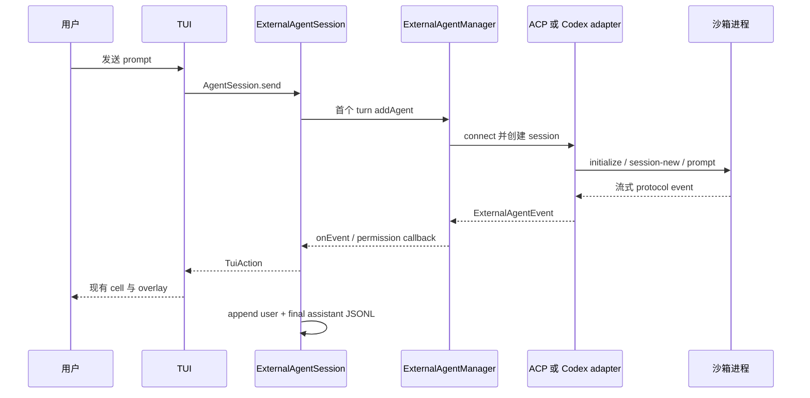

# 运行时与事件

## Session 选择

`chatCommand` 先解析全部常规配置层。`selectSessionFactory` 对 `builtin` 保留
`createAgentSession`，对任意外部 preset 选择 `createExternalAgentSession`。富 Ink TUI 和
piped/readline fallback 都接收同一个选择，因此 non-TTY smoke run 也会走真实托管路径。

外部 session 是惰性创建的：第一个 turn 解析 preset、创建单个 agent id、覆盖 cwd 与凭据，
然后把它加入共享 manager。后续 turn 将返回的 external session id 再传给
`manager.execute`，在 TUI session 存活期间保留模型上下文。关闭时会 cancel 活跃外部
session、remove agent，并等待进程退出。

ACP `session/new` 始终收到明确的空 `mcpServers` 列表。CLI 不会把内置 sidecar 无关的 MCP
配置泄露给外部子进程。

## 事件投影

| 外部事件 | TUI 投影 |
| --- | --- |
| message text | 流式 assistant text |
| thinking | 现有 thinking 区域 |
| tool start/result | 现有 tool card |
| plan update | 合成 `TodoWrite` card |
| diff | 合成 `Edit` call 与 result |
| token usage | 现有 usage reducer |
| recoverable error | warning notice |
| fatal error | turn error |
| permission request | 不产生 transcript cell；直接进入 permission gate |

mapper 直接 dispatch `TuiAction`。这是有意设计：plan 和 diff 无法装入内置
`CaptureStreamEvent` union，而 TUI reducer 已具有更丰富的 cell vocabulary。hook start/end
event 会成为 status notice，而不是协议专属 UI。

## 权限

adapter 把 ACP permission request 转成现有 CLI `PermissionRequestEvent`，再把用户选择转回
外部 Agent 声明的 option id：

- Allow once → `allow_once`
- Allow always → `allow_always`
- Deny → `reject_once`

并发请求使用现有 FIFO gate，因此一个 overlay 不会覆盖另一个。若 adapter 支持，修改 TUI
permission mode 会通过 `setSessionMode` 更新 live external session。

## Transcript 行为

外部与内置 session 共用 `~/.cognia/sessions/<sessionId>.jsonl`。每个外部 turn 写入 user
prompt 和最终 assistant response；assistant metadata 包含 backend、可选 model 与 usage。tool、
diff、plan cell 会保留在当前 live turn 的界面中，但不会由 external session adapter 单独序列化。

`/resume` 会恢复本地 transcript 显示和 id，但会启动新的外部 process/session；它不会把历史
message 回放进外部模型上下文。多轮上下文只在原 external session 仍存活时保留。

## Capability 边界

CLI host 声明 external-agent 与 filesystem callback 可用，但明确关闭 ACP terminal support。
文件读写使用 Node。terminal RPC method 会显式失败，adapter 无法静默逃逸到桌面专属 Tauri
terminal 实现。
