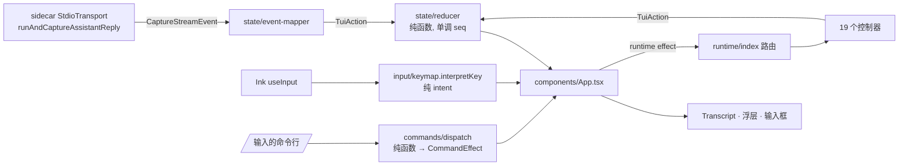

# Agent CLI 终端界面

<Status variant="stable" />

<Callout type="warn" title="不是插件作者 CLI">
  本页文档描述的是 **`cognia-agent`** 这个 TypeScript 编码智能体及其交互式终端 UI（`cli/src/tui/`）。
  它与 [Cognia CLI](./cognia-cli) 文档中那个用于脚手架 / 校验 / 构建 / 签名的 Rust **`cognia`**
  插件作者 CLI 是两个不同的程序，既不共用二进制，也不共用代码路径。
</Callout>

<TLDR>
  `cognia-agent` 运行与桌面端**完全相同**的智能体循环（`resolveSendOptions` +
  `runAndCaptureAssistantReply`，经 `StdioTransport` 接 Node sidecar），只是把界面渲染到终端，
  用的是 **Ink/React**。UI 是一个纯 **reducer**（`state/reducer.ts`，不用 `Date.now`/`Math.random`），
  由流式 **event-mapper** 馈送；之上是**斜杠命令**层（registry → dispatcher → 纯 handler → effect，
  由 App 解释执行）；命令背后是约 19 个**运行时控制器**（goal / workflow / team / mcp / memory /
  plugins / skills / permissions / plan / limits / doctor / …）；一组**浮层**（帮助、设置、权限、
  计划审批、分页器、选择器）；以及一个带历史、`/` 命令面板、`@` 提及、大段粘贴折叠和可改键 readline
  式编辑快捷键的**输入框**。配置来自 `~/.cognia/` + 环境变量 + 命令行参数——绝不读桌面端的 IndexedDB
  或系统钥匙串。
</TLDR>

<StatGrid>
  <Stat label="TUI 源文件" value="~175" hint="cli/src/tui/**/*.ts(x)，不含测试" />
  <Stat label="顶层斜杠命令" value="45+" hint="commands/registry.ts + 各功能簇" />
  <Stat label="运行时控制器" value="19" hint="runtime/*-controller.ts" />
  <Stat label="浮层" value="13" hint="components/overlays/*.tsx" />
  <Stat label="内置主题" value="6" hint="classic · dark · light · 2× 色盲友好 · mono" />
  <Stat label="可改键编辑快捷键" value="13" hint="input/keybindings.ts KEYBINDABLE_ACTIONS" />
</StatGrid>

## 代码位置

```
cli/src/tui/
  mount.tsx · render/context.tsx        # Ink 渲染根 + 启用 bracketed paste
  components/
    App.tsx                             # 根组件：组合浮层/模式，掌管全局按键
    Input.tsx · Transcript.tsx · …      # 输入框 + 回滚区 + 页脚/横幅/指示器
    overlays/                           # 帮助、设置、权限、计划审批、分页器、选择器
  state/                                # 纯 store：reducer · types · initial · selectors · event-mapper
  commands/                             # registry · dispatch · matcher · 各功能命令簇
  runtime/                              # 命令背后的 19 个控制器 + 其 doc/timeline 辅助
  input/                                # buffer · keymap · keybindings · 历史 · bracketed/折叠粘贴
  format/                               # transcript · tools · status-bar · usage · charts · export · …
  markdown/ · mention/ · theme/         # markdown 渲染（CJK 宽度感知）· @ 提及 · 调色板
  hooks/                                # turn-engine · useAgentSession · useTerminalSize
```

## 架构 —— 一条流式循环，四个纯层



1. **State** —— `state/reducer.ts` 是唯一真相源。流式 sidecar 发出 `CaptureStreamEvent`；
   `event-mapper.ts` 把每个事件翻译成 `TuiAction`；reducer 累积 inflight 文本/推理，并在工具边界处
   提交为不可变 cell。ID 来自单调的 `seq`，绝不用 `Date.now`/`Math.random`，因此整个 store 在测试中
   可确定性重放。
2. **Commands** —— 一行 `/命令` 经 `registry.getCommand` → `dispatch.dispatchCommand`（纯函数）→
   产出一个 `CommandEffect`。App 是唯一解释 effect 的地方（副作用只发生在这里）。裸命令 → 执行 /
   开表单 / 列子命令；首 token 是子命令 → 对应 handler；声明了但缺失的参数 → `FormOverlay`。
3. **Runtime** —— `runtime` 类 effect 经 `runtime/index.ts` 路由到 19 个控制器之一。控制器很薄：
   读 `~/.cognia` 状态、调用共享库、再把 `TuiAction` dispatch 回 reducer。多数桌面子系统在这里都有一个
   只读或可操作的 CLI 控制器；少数操作刻意保持桌面专属（如 `/team run`、语义记忆召回）并如实说明。
4. **Input** —— `input/keymap.interpretKey` 是从原始 Ink 按键事件到高层编辑*意图*的纯函数；
   `input/buffer.ts` 把意图应用到不可变多行缓冲区。两者都无需渲染 Ink 即可单测。输入框在其上叠加
   `/` 面板、`@` 提及、历史与大段粘贴折叠。

## 输入框与编辑模型

输入框（`components/Input.tsx`）以反显光标格渲染多行缓冲区，并在其上方最多显示一个弹窗
（`/` 斜杠面板**或** `@` 提及面板——绝不同时）。所有决策逻辑都是纯函数：

- **Keymap**（`input/keymap.ts`）把每个按键映射到意图：`insert`、`backspace`、`delete-word`、
  `kill-to-start` / `kill-to-end`、`move`（含 `home`/`end`/`word-left`/`word-right`）、`history`、
  `popup-*`。语义键（回车、Esc、Tab、方向键、退格）是硬编码的；Ctrl 系编辑动作**可改键**。
- **Buffer**（`input/buffer.ts`）—— 纯多行操作：插入/退格、按词的 `deleteWordLeft`、
  `moveWordLeft`/`moveWordRight`，以及行删除 `deleteToLineStart`（Ctrl+U）/ `deleteToLineEnd`（Ctrl+K）。
- **撤销/重做** —— reducer 在 `input` state 里维护撤销/重做栈，仅在**文本**变化时快照缓冲区
  （纯光标移动不快照）。`Ctrl+Z` / `Ctrl+Y`（可改键）逐步回退/前进；任何新编辑清空重做栈。
  用于挽回误触的 Ctrl+U / 粘贴 / 历史调取。
- **Markdown 宽度**（`markdown/width.ts`）—— 完整的东亚宽度表，CJK / 全角字符计为 2 列；表格与回滚区
  正确对齐。

### 编辑按键

| 按键 | 动作 | 备注 |
| --- | --- | --- |
| `Ctrl+A` / `Ctrl+E` | 移到行首 / 行尾 | 可改键 `lineHome` / `lineEnd` |
| `Ctrl+←` / `Ctrl+→` | 按词移动 | 终端若不带修饰键，则优雅退化为单列移动 |
| `Ctrl+W` | 向左删词 | 可改键 `deleteWord` |
| `Ctrl+U` / `Ctrl+K` | 删到行首 / 行尾 | 可改键 `lineKillToStart` / `lineKillToEnd` |
| `Ctrl+Z` / `Ctrl+Y` | 撤销 / 重做一次文本编辑 | 可改键 `undo` / `redo`；仅在文本变化时快照 |
| `Backspace` / `Del` | 删除前一个字符 | 刻意合并——许多终端把退格键报成 `key.delete`（0x7F） |
| `↑` / `↓` | 在首/末行时翻历史，否则移动光标 | |
| `Shift`/`Alt`+`Enter` | 换行 | 裸 `Enter` 提交 |

<Callout type="info" title="改键">
  `/keybind` 列出 13 个可改键动作及当前按键；`/keybind <动作> <键>` 改一个
  （如 `/keybind inspect ctrl+j`），`/keybind <动作> default` 重置。若改键会与另一动作的键冲突，
  则会**拒绝**并给出冲突提示——这样命令表里靠前的动作就不会悄悄抢走共享键。
</Callout>

## 斜杠命令

`commands/registry.ts` 持有约 45 个顶层描述符，按类别分组；各功能簇
（`cognia-commands`、`mcp-commands`、`plugin-commands`、`skill-commands`、`parity-commands`…）
声明各自的子命令与纯 handler。发现机制是 `matcher.ts` 里的三级模糊匹配（前缀 → 模糊 → 描述关键词），
由 `/` 面板呈现；半输入的命令会根据每个子命令的 `argumentHint`，由 `command-hint.ts` 给出行内用法提示。

代表性命令面：`/goal`、`/workflow`、`/agents`、`/team`、`/memory`、`/plan`、`/loop`、`/tasks`、
`/status`、`/limits`；`/mcp …`、`/plugin …`、`/skill …`；`/permissions list|remove|clear`、`/doctor`、
`/init`、`/export`、`/hooks`、`/view`；以及配置命令 `/model`、`/provider`、`/mode`、`/think`、`/theme`、
`/output-style`、`/statusbar`、`/mascot`、`/keybind`。

## 浮层与页脚

当 `/goal`、`/loop` 或 `/workflow run` 运行时，页脚显示一个实时**活动 pill**：驱动器
（`runtime/driven-turns.ts`）填充 `ActivityState.max`（loop `--n` / goal `maxTurns`）以渲染确定性进度条，
并用 `note` 携带本次运行累计 token 消耗（间隔 loop 还带"next in 30s"），让长任务一眼看到预算。

浮层是单个活跃的 `state.overlay`，由 `App.tsx` 渲染；浮层打开时它独占按键。纯函数 `overlayLength()`
报告列表浮层的行数，供 `OVERLAY_MOVE` 环绕选择。页脚（`format/status-bar.ts`）渲染一个有序、可定制的
段列表——`model`、`provider`、`mode`（`bypassPermissions` 时显示醒目的 `⚠`）、`tokens`、`ctx`、
`cache`、`cost`、`cwd`、`git`、`thinking`、以及 `ratelimit`（`🚦` 最紧的 API 剩余额度，需手动开启）
——每段在无内容时自动隐藏。

### 用量、限额与上下文

- **`/usage`** 渲染每轮 / 会话行，外加三段火花线：**token 趋势**、**成本趋势**（每轮 USD，来自
  `costHistory`），以及提示**构成** + top-tools 条。
- **`/limits`** 展示订阅/账户窗口，**以及**实时 **API 限额**块：sidecar 的 `fetch-interceptor` 把每个
  `anthropic-ratelimit-*` 响应头作为 `usage_headers` 消息发出，`format/rate-limits.ts` 折叠为各窗口剩余 +
  重置倒计时（`ratelimit` 页脚段汇总最紧的一项）。
- **`/context`** 先按目录估算窗口，再经 runtime 通过 `getContextUsage` 控制往返追加 SDK 的**权威**实时分解
  （系统提示 / 工具 / MCP / 记忆 / 子代理），非 Anthropic 路径则回落到估算。
- **内联图片** —— 工具结果中的 base64 图片块，在支持图形的终端（iTerm2 / kitty / WezTerm，
  `format/terminal-graphics.ts`）渲染为真实内联图片，其他终端显示紧凑的 `🖼 image (类型, 大小)` 占位
  ——绝不再倾倒 base64 长串（`format/result-images.ts`）。

## 与桌面端的关系

TUI 原样复用桌面端的选项装配与智能体循环，只在某功能确实需要 Tauri 运行时处才分叉。CLI 如实呈现的
已知桌面专属缺口：`/team run`（执行器需要 Tauri）、语义记忆召回（`/memory list` 仅显示已存记忆）、
任务执行（`/tasks` 是增删改 + 暂停/恢复，不含运行）。其余一切——goal 运行、workflow 运行/查看/回放、
MCP/插件/技能管理、计划捕获、limits、doctor——都有可用的 CLI 路径。

## 测试

`input/`、`state/`、`commands/`、`runtime/`、`format/`、`markdown/`、`mention/` 下的每个纯模块都有
同目录 `*.test.ts`；Ink 组件用 `ink-testing-library` 测试。用 `pnpm cli:test` 运行整套。
