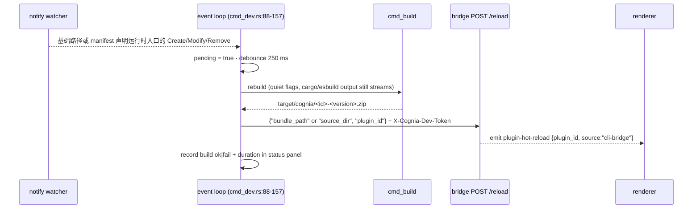

# Bridge 客户端 —— `status` / `install` / `uninstall` / `list` / `reload` / `dev`

<TLDR>
  六个插件作者命令与运行中的 cognia 对话。发现机制读取
  `<config_dir>/cognia/cli-endpoint.json` —— `{"baseUrl": "http://127.0.0.1:<port>", "devToken":
  "<64-hex>"}` —— 由桌面端在每次启动时写入（`http_client.rs:55-87`；文件缺失会给出一条
  指向性的「启动桌面应用」错误，绝不挂起）。所有请求都是同步的 `ureq`，
  带上 `X-Cognia-Dev-Token` 头（`http_client.rs:94-190`）。`status` 会探测
  `/api/v1/dev/health` 并输出不含 token 的 JSON；`list` 会把已安装插件快照输出成表格或
  `schemaVersion: 1` JSON；`reload` 会按插件 id、重建后的 bundle 或 unpacked 目录发送 hot-reload 请求；`install`
  接受构建好的 `.zip` 或包含 `plugin.json` 的本地目录，会预检一次已安装插件的 GET，并在替换已有 id 前提示确认；`uninstall --purge-data`
  会展示一个不可逆性警告框；`dev` 用 `notify` 监视基础源码/构建路径，并额外加入 manifest 声明的运行时入口
  （`main`、`pythonMain`、`vscodeMain`、`styles`、`bundle_include[]`），防抖 250 ms，经 `cmd_build` 重建，并
  POST `/api/v1/dev/plugins/reload` —— 当没有应用在运行时优雅降级为只重建。
</TLDR>

## 端点发现

```rust
// crates/cognia-cli/src/http_client.rs:55-62
pub fn endpoint_file_path() -> Result<PathBuf> {
    if let Ok(p) = std::env::var("COGNIA_CLI_ENDPOINT_FILE") { return Ok(p.into()); } // tests
    let dirs = directories::BaseDirs::new().ok_or(…)?;
    Ok(dirs.config_dir().join("cognia").join("cli-endpoint.json"))
}
```

| OS | 路径 |
| --- | --- |
| Windows | `%APPDATA%\cognia\cli-endpoint.json` |
| macOS | `~/Library/Application Support/cognia/cli-endpoint.json` |
| Linux | `~/.config/cognia/cli-endpoint.json` (XDG-aware) |

`load_endpoint()`（`http_client.rs:67-87`）在三种情况下退出并给出确切指引：

```text
no running cognia detected: expected <path> to exist.
 Start the cognia desktop app (it writes this file on launch),
 or enable the CLI bridge in Settings → Plugins → Developer.
```

外加 JSON 解析失败、以及字段存在但为空的情况（`… missing baseUrl / devToken —
re-launch cognia to refresh.`）。发现之后的传输层失败会走
`unreachable_bridge_error()`（`http_client.rs:131-144`），它会补上一条陈旧文件提示 —— 该文件
可能比已崩溃的应用存活更久。

## HTTP 客户端

选用 `ureq` 而非 reqwest，是为了让 CLI 保持无 tokio（`http_client.rs:4-5`）。`get_json` /
`post_json`（`http_client.rs:94-176`）在每次调用上设置 `X-Cognia-Dev-Token`，把路径拼到
一个去掉尾部斜杠的 base 上，反序列化 2xx JSON，并把非 2xx 暴露为
`POST <url> → HTTP <code>` 外加 body 的前 20 行。端点表与
[服务端路由](./bridge-server)一一对应：

| 方法 · 路径 | Body | 响应 |
| --- | --- | --- |
| `GET /api/v1/dev/health` | — | `{"ok": true}` |
| `GET /api/v1/dev/plugins/installed` | — | `{"ok", "plugins": [{pluginId, version, status, installPath}]}` |
| `POST /api/v1/dev/plugins/install` | `{"bundle_path"}` | `{"ok", "pluginId", "warnings"[]}` |
| `POST /api/v1/dev/plugins/install-directory` | `{"source_dir"}` | `{"ok", "pluginId", "warnings"[]}` |
| `POST /api/v1/dev/plugins/uninstall` | `{"plugin_id", "purge_data"}` | `{"ok", "pluginId"}` |
| `POST /api/v1/dev/plugins/reload` | `{"plugin_id"}` 或 `{"bundle_path"}` 或 `{"source_dir"}` | `{"ok", "pluginId", "warnings"[]}` |
| `POST /api/v1/dev/sessions/handoff` | `{"sessionId", "title"?, "messages", "meta"?}` | `{"ok", "sessionId"}` —— 归 `cognia-agent` 所有，不属于插件作者 CLI |

<Callout type="info" title="安装输入以路径传递，而非上传">
  Bundle 安装发送 `{"bundle_path": "<absolute path>"}`；本地目录安装发送
  `{"source_dir": "<absolute path>"}`。桌面端自己从磁盘读取文件或目录树 —— 没有 multipart，
  没有 base64 body。这就是为什么服务端的 4 MiB body 上限从不约束 bundle 大小，也是为什么
  这个 bridge 本质上只能本地用：远程调用方的路径毫无意义。
</Callout>

## install

`cmd_install.rs`：

1. 规范化输入路径，并把它分类为 bundle 文件或包含 `plugin.json` 的插件目录
2. 尽力读取 `plugin.json` 取得 `{id, version}` —— bundle 走 zip 解压，目录走直接读取
   （格式错误 → 继续，由服务端再校验）
3. **冲突预检** —— `GET /plugins/installed`；若 id 已存在：
   `⚠ <id> is already installed (v<old> → v<new>).` 然后
   `Replace existing <id> v<old> with v<new>?`（默认 No；`--yes` 跳过；拒绝则退出并打印
   `install aborted: <id> v<old> kept (no changes made)`）
4. bundle 走 `POST /plugins/install`，目录走 `POST /plugins/install-directory`；成功打印
   `✓ installed <id> from <path>` 外加任何服务端返回的警告（缩进为 `⚠ …`）；失败打印
   `install rejected by cognia: <error>`

在 `--json` 模式下，install/reload/uninstall 会把 endpoint 发现失败、bridge envelope
（`{"ok": false, "error": "..."}`）以及 `post_json` 暴露的原始 HTTP/传输失败都保持为结构化
stdout。payload 使用 `schemaVersion: 1`、`ok: false`、命令 `action`、`stage: "endpoint"` 或
`"bridge"`、命令输入以及可执行的错误字符串；stderr 保持为空，因为 `JsonFailureExit` 会压制通用错误渲染器。

## uninstall

`cmd_uninstall.rs:50-138`。普通模式直接 POST。带 `--purge-data` 时，先
渲染一个警告框（版本与安装路径尽力从列表端点获取）：

```text
⚠ <id> will be uninstalled and its data PERMANENTLY DELETED.
  version:      <v>
  install dir:  <path>
  data scope:   plugin Dexie tables + plugin keyring entries
  reversible:   no — Dexie wipe is one-way
```

然后 `Permanently delete <id>'s data?`（默认 No）。真正的 Dexie 擦除发生在
渲染端收到带 `purge_data: true` 的 `cli-bridge:plugin-uninstalled` 事件时 ——
Rust handler 只移除安装目录和运行时注册
（`handlers.rs:510-531`）。

## list

`cmd_list.rs` 封装同一个 `GET /api/v1/dev/plugins/installed` bridge 路由。人类输出是包含
插件 id、版本、状态和安装路径的紧凑表格；`--json` 输出带版本号的结构：

```json
{
  "schemaVersion": 1,
  "ok": true,
  "action": "list",
  "plugins": [
    {
      "pluginId": "demo",
      "version": "1.2.3",
      "status": "installed",
      "installPath": "/path/to/plugin"
    }
  ]
}
```

如果 endpoint 发现或 bridge 请求本身在 JSON 模式下失败（例如 endpoint 文件缺失/陈旧、认证失败，
或 bridge 返回非 2xx），stdout 仍保持机器可读，命令以非零状态退出。`stage` 在尚未发出 HTTP
请求时为 `"endpoint"`，进入 HTTP 客户端后为 `"bridge"`：

```json
{
  "schemaVersion": 1,
  "ok": false,
  "action": "list",
  "stage": "bridge",
  "error": "GET http://127.0.0.1:4567/api/v1/dev/plugins/installed -> HTTP 500\nresponse: ..."
}
```

bridge 只返回这组隐私安全的快照字段；`runtime_state` 和插件自有 secret 不会离开桌面进程。

## status

`cmd_status.rs` 通过 `http_client::probe_health()` 封装 `GET /api/v1/dev/health`。
人类输出会显示 bridge 是否运行，以及已知的端点文件路径和 base URL。`--json` 输出适合脚本消费的报告，
当 `running` 为 `false` 时命令返回非零：

```json
{
  "schemaVersion": 1,
  "ok": true,
  "action": "status",
  "running": true,
  "endpointFile": "C:/Users/dev/AppData/Roaming/cognia/cli-endpoint.json",
  "baseUrl": "http://127.0.0.1:4567",
  "error": null
}
```

bridge 不可用时仍使用同一 envelope，并保持 stderr 为空：

```json
{
  "schemaVersion": 1,
  "ok": false,
  "action": "status",
  "running": false,
  "endpointFile": "C:/Users/dev/AppData/Roaming/cognia/cli-endpoint.json",
  "baseUrl": null,
  "error": "no running cognia detected: expected C:/Users/dev/AppData/Roaming/cognia/cli-endpoint.json to exist"
}
```

报告会刻意排除 `devToken`；测试会断言即使加载到的 endpoint 含有 secret token，也不会被序列化到
status payload。

## reload

`cmd_reload.rs` 封装 `POST /api/v1/dev/plugins/reload`，用于脚本在不启动文件 watcher 的情况下触发
hot-reload。它接受 `--plugin-id <id>`、`--bundle <zip-or-directory>`，或两者同时提供。路径输入会在发送给
bridge 之前规范化并分类：文件发送 `bundle_path`，目录发送 `source_dir`。

```bash
cognia plugin reload --plugin-id hello
cognia plugin reload --path target/cognia/hello-0.1.0.zip
cognia plugin reload --path .
```

响应沿用 install 的 envelope：`{ok, pluginId, warnings[]}`。在人类模式下，非 2xx
传输失败仍使用 `http_client::post_json` 的通用诊断；在 `--json` 模式下，reload 会把这些错误包装成
与 bridge-level rejection 一致的 `ok: false`、`stage: "bridge"` payload。

## dev —— watch 循环

`cognia plugin dev --once` 复用同一条 build + 可选 reload 管线，但不会启动文件 watcher。
它适合 CI、编辑器任务，以及“这个插件现在是否还能构建并热重载”的 smoke check。
`--json` 只允许和 `--once` 一起使用，因此 stdout 始终是一份完整 JSON：

```json
{
  "schemaVersion": 1,
  "ok": true,
  "action": "dev",
  "mode": "once",
  "pluginId": "hello-python",
  "version": "0.1.0",
  "pluginType": "python",
  "bundle": "target/cognia/hello-python-0.1.0.zip",
  "reload": {
    "attempted": false,
    "skippedReason": "no-endpoint"
  }
}
```

如果 bridge 返回 `{ "ok": false, "error": "..." }`，命令会以非零退出，并在失败 payload
里保留构建元数据，同时使用 `stage: "reload"` 和
`"reload": { "attempted": true, "ok": false }` 标明 reload 被拒绝。



机理（`cmd_dev.rs`）：

- **watcher** —— `notify::recommended_watcher()`（inotify / FSEvents / ReadDirectoryChangesW）；
  从 `src/`、`wit/`、`dist/`、`Cargo.toml`、`package.json`、`plugin.json` 开始，再加入来自
  `main`、`pythonMain`、`vscodeMain`、`styles`、`bundle_include[]` 的安全相对路径；只有
  Create/Modify/Remove 计数（`should_rebuild`，`:160-165`）；`DEBOUNCE = 250 ms`（`:37`）
- **端点解析**（`resolve_reload_endpoint`，`:200-213`）—— `--reload-url` 覆盖
  发现得到的 base（token 仍在端点文件存在时从中读取）；完全没有端点 →
  **只重建模式**，reload 被静默跳过
- **Ctrl-C** —— 经 `ctrlc` crate 实现的 `AtomicU8` 三态机（`:39-43`）：第一次按下
  打印 `⚠ Press Ctrl+C again to quit`，第二次按下退出循环 —— 防范那种
  会杀掉漫长 cargo 构建的下意识 Ctrl-C
- **状态面板**（`StatusPanel`，`:248-419`）—— 在 TTY 上，是一个常驻的 5 行 `MultiProgress` 块
  （标题、`Status`、`Endpoint`、`Last build <secs>s @HH:MM:SS ok|fail`、`Rebuilds n`）；在 CI 上，
  每次构建一行朴素的 `[HH:MM:SS] rebuild #n ok|FAILED in <secs>s`

失败的重建会在面板上方报告（`✗ rebuild failed: …`），循环继续
监视 —— dev 循环绝不会因一次编译错误而死掉。

## acp —— stdio 到 WebSocket bridge

`cognia acp` 是顶层工具命令，不属于 `cognia plugin` 子命令。会通过换行分隔 stdio
讲 Agent Client Protocol 的编辑器，可以配置
`{"command": "cognia", "args": ["acp"]}`；CLI 会解析 companion WebSocket 端点，然后把 stdin
中的 JSON-RPC 行转成 WebSocket text frame，并把服务端 frame 打回 stdout。

目标解析（`cmd_acp.rs`）刻意严格：

1. 只有当 `COGNIA_ACP_URL` + `COGNIA_ACP_TOKEN` 两者都非空时才覆盖自动发现。
   只提供其中一个会立即失败，并在错误消息里点名缺失的变量。
2. 没有 override 时，命令读取普通的 `cli-endpoint.json`，再 POST
   `/api/v1/dev/acp/token` 以铸造 scoped token 并取得 `ws://` / `wss://` URL。
3. broker 返回的 URL 必须是 loopback（`localhost`、`127.0.0.1` 或 `::1`）。非 loopback URL
   只在显式 env override 下接受。

状态文本写入 stderr，因此 stdout 始终保持为干净的 ACP JSON-RPC 流；`--quiet`
会压制这条状态线，方便把 stderr 当信号处理的编辑器集成。

该 bridge 提供采用 v1.21 schema 的稳定 ACP v1。只有对应 Cognia 服务端开关和当前 host
runtime 同时支持时才会出现预览能力；不会通告 ACP v2。

### 可选的真实 agent smoke

`pnpm smoke:acp-live` 使用官方 TypeScript SDK client 检查本机已安装的 agent command；没有
配置目标时会安全跳过。用 JSON argv array 提供一个或多个命令，避免 shell 解析：

```bash
ACP_GEMINI_COMMAND='["gemini", "<ACP args>"]' pnpm smoke:acp-live
ACP_CODEX_COMMAND='["codex", "<ACP args>"]' pnpm smoke:acp-live
ACP_CLAUDE_COMMAND='["claude", "<ACP args>"]' pnpm smoke:acp-live
```

请填写本机 agent 版本实际支持的 ACP invocation。Smoke 会完成 initialize、创建受限 session、
发送禁止使用工具的 prompt、记录 update 与权威 stop reason、拒绝意外 permission request，最后
终止子进程。
子进程只接收最小化的 process environment。如认证依赖环境变量，请通过对应的
`ACP_GEMINI_ENV`、`ACP_CODEX_ENV` 或 `ACP_CLAUDE_ENV` JSON object 显式选择；不会转发无关的
环境密钥。

### 编辑器手工互操作检查

每个发布候选版本都应在两个编辑器中使用同一套受限 workspace fixture：

1. 启动 Cognia desktop，确认 Companion endpoint 正常，并把编辑器 agent command 配置为
   `cognia acp --quiet`。
2. 在 Zed 中新建 session、发送文本 prompt、分别允许和拒绝一次 tool call、取消一个活动
   turn，然后依次 close、resume、load、delete。确认 load 会回放历史，而 resume 不会。
3. 在支持 ACP 的 JetBrains IDE 中重复生命周期，并验证带名称的 resource link、base64 image、
   additional root、model config 变更、usage 与 session title/activity update。
4. 在两个编辑器中验证 stdio MCP 透传；当 Cognia 未通告 HTTP/SSE MCP 时应明确拒绝。
   provider、dynamic MCP、compaction、NES 的预览开关关闭时，对应控制项必须完全不可见。
5. 检查 stderr/log：provider header、MCP environment value、transport ticket 和 terminal-auth
   environment value 都不得输出。
