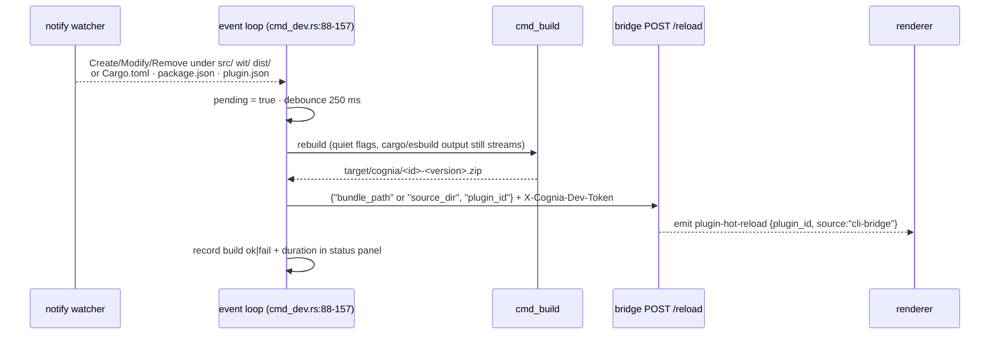

# Bridge 客户端 —— `status` / `install` / `uninstall` / `list` / `reload` / `dev`

<TLDR>
  六个插件作者命令与运行中的 cognia 对话。发现机制读取
  `<config_dir>/cognia/cli-endpoint.json` —— `{"baseUrl": "http://127.0.0.1:<port>", "devToken":
  "<64-hex>"}` —— 由桌面端在每次启动时写入（`http_client.rs:55-87`；文件缺失会给出一条
  指向性的「启动桌面应用」错误，绝不挂起）。所有请求都是同步的 `ureq`，
  带上 `X-Cognia-Dev-Token` 头（`http_client.rs:94-190`）。`status` 会探测
  `/api/v1/dev/health` 并输出不含 token 的 JSON；`list` 会把已安装插件快照输出成表格或
  `schemaVersion: 1` JSON；`reload` 会按插件 id、重建后的 bundle 或 unpacked 目录发送 hot-reload 请求；`install`
  接受构建好的 `.zip` 或包含 `plugin.json` 的本地目录，会预检一次已安装插件的 GET，并在替换已有 id 前提示确认；`uninstall --purge-data`
  会展示一个不可逆性警告框；`dev` 用 `notify` 监视 `src/ · wit/ · dist/ · Cargo.toml ·
  package.json · plugin.json`，防抖 250 ms，经 `cmd_build` 重建，并
  POST `/api/v1/dev/plugins/reload` —— 当没有应用在运行时优雅降级为只重建。
</TLDR>

## 端点发现

```rust
// crates/cognia-cli/src/http_client.rs:55-62
pub fn endpoint_file_path() -> Result<PathBuf> {
    if let Ok(p) = std::env::var("COGNIA_CLI_ENDPOINT_FILE") { return Ok(p.into()); } // tests
    let dirs = directories::BaseDirs::new().ok_or(…)?;
    Ok(dirs.config_dir().join("cognia").join("cli-endpoint.json"))
}
```

| OS | 路径 |
| --- | --- |
| Windows | `%APPDATA%\cognia\cli-endpoint.json` |
| macOS | `~/Library/Application Support/cognia/cli-endpoint.json` |
| Linux | `~/.config/cognia/cli-endpoint.json` (XDG-aware) |

`load_endpoint()`（`http_client.rs:67-87`）在三种情况下退出并给出确切指引：

```text
no running cognia detected: expected <path> to exist.
 Start the cognia desktop app (it writes this file on launch),
 or enable the CLI bridge in Settings → Plugins → Developer.
```

外加 JSON 解析失败、以及字段存在但为空的情况（`… missing baseUrl / devToken —
re-launch cognia to refresh.`）。发现之后的传输层失败会走
`unreachable_bridge_error()`（`http_client.rs:131-144`），它会补上一条陈旧文件提示 —— 该文件
可能比已崩溃的应用存活更久。

## HTTP 客户端

选用 `ureq` 而非 reqwest，是为了让 CLI 保持无 tokio（`http_client.rs:4-5`）。`get_json` /
`post_json`（`http_client.rs:94-176`）在每次调用上设置 `X-Cognia-Dev-Token`，把路径拼到
一个去掉尾部斜杠的 base 上，反序列化 2xx JSON，并把非 2xx 暴露为
`POST <url> → HTTP <code>` 外加 body 的前 20 行。端点表与
[服务端路由](./bridge-server)一一对应：

| 方法 · 路径 | Body | 响应 |
| --- | --- | --- |
| `GET /api/v1/dev/health` | — | `{"ok": true}` |
| `GET /api/v1/dev/plugins/installed` | — | `{"ok", "plugins": [{pluginId, version, status, installPath}]}` |
| `POST /api/v1/dev/plugins/install` | `{"bundle_path"}` | `{"ok", "pluginId", "warnings"[]}` |
| `POST /api/v1/dev/plugins/install-directory` | `{"source_dir"}` | `{"ok", "pluginId", "warnings"[]}` |
| `POST /api/v1/dev/plugins/uninstall` | `{"plugin_id", "purge_data"}` | `{"ok", "pluginId"}` |
| `POST /api/v1/dev/plugins/reload` | `{"plugin_id"}` 或 `{"bundle_path"}` 或 `{"source_dir"}` | `{"ok", "pluginId", "warnings"[]}` |
| `POST /api/v1/dev/sessions/handoff` | `{"sessionId", "title"?, "messages", "meta"?}` | `{"ok", "sessionId"}` —— 归 `cognia-agent` 所有，不属于插件作者 CLI |

<Callout type="info" title="安装输入以路径传递，而非上传">
  Bundle 安装发送 `{"bundle_path": "<absolute path>"}`；本地目录安装发送
  `{"source_dir": "<absolute path>"}`。桌面端自己从磁盘读取文件或目录树 —— 没有 multipart，
  没有 base64 body。这就是为什么服务端的 4 MiB body 上限从不约束 bundle 大小，也是为什么
  这个 bridge 本质上只能本地用：远程调用方的路径毫无意义。
</Callout>

## install

`cmd_install.rs`：

1. 规范化输入路径，并把它分类为 bundle 文件或包含 `plugin.json` 的插件目录
2. 尽力读取 `plugin.json` 取得 `{id, version}` —— bundle 走 zip 解压，目录走直接读取
   （格式错误 → 继续，由服务端再校验）
3. **冲突预检** —— `GET /plugins/installed`；若 id 已存在：
   `⚠ <id> is already installed (v<old> → v<new>).` 然后
   `Replace existing <id> v<old> with v<new>?`（默认 No；`--yes` 跳过；拒绝则退出并打印
   `install aborted: <id> v<old> kept (no changes made)`）
4. bundle 走 `POST /plugins/install`，目录走 `POST /plugins/install-directory`；成功打印
   `✓ installed <id> from <path>` 外加任何服务端返回的警告（缩进为 `⚠ …`）；失败打印
   `install rejected by cognia: <error>`

## uninstall

`cmd_uninstall.rs:50-138`。普通模式直接 POST。带 `--purge-data` 时，先
渲染一个警告框（版本与安装路径尽力从列表端点获取）：

```text
⚠ <id> will be uninstalled and its data PERMANENTLY DELETED.
  version:      <v>
  install dir:  <path>
  data scope:   plugin Dexie tables + plugin keyring entries
  reversible:   no — Dexie wipe is one-way
```

然后 `Permanently delete <id>'s data?`（默认 No）。真正的 Dexie 擦除发生在
渲染端收到带 `purge_data: true` 的 `cli-bridge:plugin-uninstalled` 事件时 ——
Rust handler 只移除安装目录和运行时注册
（`handlers.rs:510-531`）。

## list

`cmd_list.rs` 封装同一个 `GET /api/v1/dev/plugins/installed` bridge 路由。人类输出是包含
插件 id、版本、状态和安装路径的紧凑表格；`--json` 输出带版本号的结构：

```json
{
  "schemaVersion": 1,
  "plugins": [
    {
      "pluginId": "demo",
      "version": "1.2.3",
      "status": "installed",
      "installPath": "/path/to/plugin"
    }
  ]
}
```

bridge 只返回这组隐私安全的快照字段；`runtime_state` 和插件自有 secret 不会离开桌面进程。

## status

`cmd_status.rs` 通过 `http_client::probe_health()` 封装 `GET /api/v1/dev/health`。
人类输出会显示 bridge 是否运行，以及已知的端点文件路径和 base URL。`--json` 输出适合脚本消费的报告，
当 `running` 为 `false` 时命令返回非零：

```json
{
  "schemaVersion": 1,
  "running": true,
  "endpointFile": "C:/Users/dev/AppData/Roaming/cognia/cli-endpoint.json",
  "baseUrl": "http://127.0.0.1:4567",
  "error": null
}
```

报告会刻意排除 `devToken`；测试会断言即使加载到的 endpoint 含有 secret token，也不会被序列化到
status payload。

## reload

`cmd_reload.rs` 封装 `POST /api/v1/dev/plugins/reload`，用于脚本在不启动文件 watcher 的情况下触发
hot-reload。它接受 `--plugin-id <id>`、`--bundle <zip-or-directory>`，或两者同时提供。路径输入会在发送给
bridge 之前规范化并分类：文件发送 `bundle_path`，目录发送 `source_dir`。

```bash
cognia plugin reload --plugin-id hello
cognia plugin reload --path target/cognia/hello-0.1.0.zip
cognia plugin reload --path .
```

响应沿用 install 的 envelope：`{ok, pluginId, warnings[]}`。非 2xx、陈旧 endpoint 文件和 token
错误仍由 `http_client::post_json` 统一转换成可执行的诊断。

## dev —— watch 循环



机理（`cmd_dev.rs`）：

- **watcher** —— `notify::recommended_watcher()`（inotify / FSEvents / ReadDirectoryChangesW）；
  对 `src/`、`wit/`、`dist/` 递归监视，对三个 manifest 非递归（`:71-86`）；只有
  Create/Modify/Remove 计数（`should_rebuild`，`:160-165`）；`DEBOUNCE = 250 ms`（`:37`）
- **端点解析**（`resolve_reload_endpoint`，`:200-213`）—— `--reload-url` 覆盖
  发现得到的 base（token 仍在端点文件存在时从中读取）；完全没有端点 →
  **只重建模式**，reload 被静默跳过
- **Ctrl-C** —— 经 `ctrlc` crate 实现的 `AtomicU8` 三态机（`:39-43`）：第一次按下
  打印 `⚠ Press Ctrl+C again to quit`，第二次按下退出循环 —— 防范那种
  会杀掉漫长 cargo 构建的下意识 Ctrl-C
- **状态面板**（`StatusPanel`，`:248-419`）—— 在 TTY 上，是一个常驻的 5 行 `MultiProgress` 块
  （标题、`Status`、`Endpoint`、`Last build <secs>s @HH:MM:SS ok|fail`、`Rebuilds n`）；在 CI 上，
  每次构建一行朴素的 `[HH:MM:SS] rebuild #n ok|FAILED in <secs>s`

失败的重建会在面板上方报告（`✗ rebuild failed: …`），循环继续
监视 —— dev 循环绝不会因一次编译错误而死掉。
