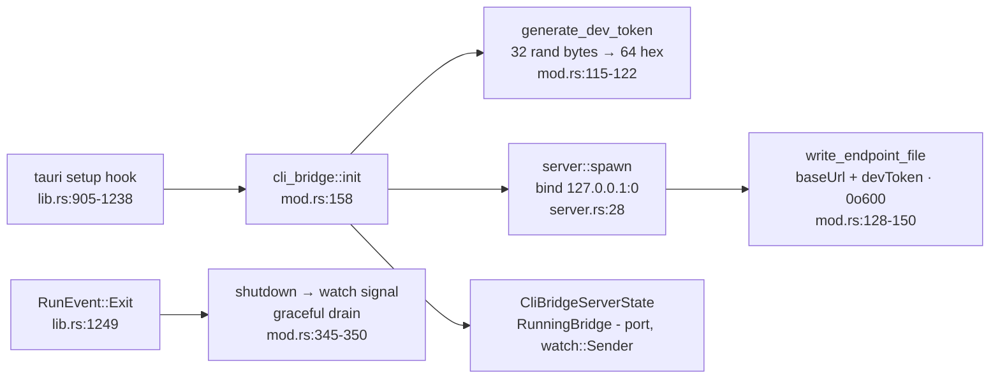

# Bridge 服务端 —— `src-tauri/src/cli_bridge`

<TLDR>
  `cli_bridge::init()`（`mod.rs:158-183`）在 Tauri `setup()` 钩子内的一个 spawned task 里运行：
  生成一个 32 字节 / 64-hex 的 dev token，`server::spawn()` 一个绑定到
  **`127.0.0.1:0`**（OS 分配的临时端口）的 axum router，写入 `cli-endpoint.json`（Unix 上 `0o600`），
  并把 `RunningBridge {bound_port, shutdown}` 存进 managed state，以便应用退出时
  优雅关闭（`lib.rs:1249-1251`）。每个请求都经过一个 middleware（`server.rs:88-115`）：
  非回环对端得到 403 `remote_blocked`；错误/缺失的 `X-Cognia-Dev-Token` 在一次常量时间比较后
  得到 401 `bad_dev_token`。插件 handler 直接改动 `PluginRuntimeState`；
  插件和会话 handler 都通过 fire-and-forget 的 Tauri 事件通知渲染端。
</TLDR>

## 生命周期



启动是 **best-effort** 的：端点文件写入失败只记日志、不致命，而一次 bridge
启动失败会记下 `cli_bridge auto-start failed` 而不阻塞应用。token 每次启动轮换；
文件每次启动重写，因此一个来自崩溃会话的陈旧文件只是
带着一个失效的端口 + token。这个 bridge 仅桌面端可用 —— 在移动端它从不 spawn，
`cli_bridge_status` 报告 `running: false`。

## 认证 middleware

```rust
// src-tauri/src/cli_bridge/server.rs:88-115 (abridged)
async fn auth_middleware(State(state), ConnectInfo(addr), request, next) -> Response {
    if !is_loopback(&addr) {                       // mod.rs:189 — 127.0.0.1 or ::1
        return error_response(StatusCode::FORBIDDEN, "remote_blocked",
            "the cli bridge accepts loopback (127.0.0.1) connections only");
    }
    let header = request.headers().get("X-Cognia-Dev-Token")…;
    if !constant_time_eq(header.as_bytes(), state.dev_token.as_bytes()) {  // server.rs:127
        return error_response(StatusCode::UNAUTHORIZED, "bad_dev_token",
            "X-Cognia-Dev-Token header missing or incorrect");
    }
    next.run(request).await
}
```

`constant_time_eq`（`server.rs:127-136`）对所有字节做 XOR 累加 —— 没有提前退出，没有
时序旁路。该 middleware 经 `from_fn_with_state`（`server.rs:80`）包裹 **所有** 路由，
包括 `health`，并位于一个 4 MiB 的 `RequestBodyLimitLayer`（`server.rs:81`）之下。

## 路由

```rust
// src-tauri/src/cli_bridge/server.rs:57-80
Router::new()
    .route("/api/v1/dev/health",            get(handlers::health))
    .route("/api/v1/dev/plugins/installed", get(handlers::list_installed))
    .route("/api/v1/dev/plugins/install",   post(handlers::install))
    .route("/api/v1/dev/plugins/install-directory", post(handlers::install_directory))
    .route("/api/v1/dev/plugins/uninstall", post(handlers::uninstall))
    .route("/api/v1/dev/plugins/reload",    post(handlers::reload))
    .route("/api/v1/dev/sessions/handoff",  post(handlers::handoff))
```

所有响应共用信封 `{"ok": true, "pluginId"?, "warnings"?: []}` /
`{"ok": false, "error", "code"?}`。handler 的失败为 422；`reload` 中缺失的必填字段
为 400。

| Handler | 核心逻辑 | 行号 |
| --- | --- | --- |
| `health` | `{"ok": true}` 存活探针 | `handlers.rs:107` |
| `list_installed` | 对 `PluginRuntimeState.plugins` 加读锁的快照，仅投影到 `pluginId / version / status / installPath` —— 从不含 `runtime_state`，因此机密无法经 bridge 泄漏 | `handlers.rs:136-155` |
| `install` | `install_inner` → emit `cli-bridge:plugin-installed` | `handlers.rs:157-190` |
| `install_directory` | `install_from_directory_inner` → 复制 unpacked 插件目录并 emit `cli-bridge:plugin-installed` | `handlers.rs:192-221` |
| `uninstall` | `uninstall_inner` → emit `cli-bridge:plugin-uninstalled` | `handlers.rs:223-252` |
| `reload` | 三种模式（见下）→ emit hot-reload 事件 | `handlers.rs:254-364` |
| `handoff` | 校验 `sessionId`，构建 transcript payload，然后 emit `cli-bridge:session-handoff` 供渲染端导入并打开 | `handlers.rs:380-397` |

### install_inner（`handlers.rs:403-429`）

校验 bundle 路径（必须为绝对路径且存在）→ 读取 zip → 提取 manifest 取得
`plugin_id` → 擦除该插件目录的任何旧版本 → 解压 → `register_installed_plugin`
进 `PluginRuntimeState`。解压会防范 **zip-slip**：解析到目标目录之外的
条目会被跳过（测试 `extract_zip_into_skips_path_traversal_entries`，
`handlers.rs:741-766`）。

### install_from_directory_inner

校验 source 路径（必须为绝对路径、必须存在、必须是含 `plugin.json` 的目录）→
读取 manifest 得到 `plugin_id` → 擦除该插件目录的任何旧版本 → 递归复制文件到宿主插件目录 →
`register_installed_plugin`。Symlink 会被刻意跳过，避免 load-unpacked 工作流把所选目录外的
内容复制进插件安装目录。

### reload 的三种模式

| 模式 | 触发条件 | 行为 |
| --- | --- | --- |
| A —— 重装 | body 含 `bundle_path` | 完整 `install_inner`，随后 hot-reload 事件带 `via: "install"` —— 这正是 `cognia plugin dev` 所用 |
| B —— 重装 unpacked 目录 | body 含 `source_dir` | 完整 `install_from_directory_inner`，随后 hot-reload 事件带 `via: "install-directory"` |
| C —— 仅热重载 | body 仅含 `plugin_id` | 不做文件操作；事件带 `via: "reload"`，请渲染端重新读取已在磁盘上的 artifact |

每次成功 emit **两个** 事件：每插件通道 `plugin-hot-reload:<plugin_id>` 带
`{"source": "cli-bridge"}`（已知道自己 id 的旧订阅者），以及全局
`plugin-hot-reload` 带 `{"plugin_id", "source": "cli-bridge", "via"}`（集中式的
热重载历史 store）。

## 状态与并发

```rust
// src-tauri/src/cli_bridge/mod.rs:62-71
pub struct CliBridgeState { dev_token: String, app_handle: AppHandle }   // Arc<…> = SharedState
```

token 每次启动不可变 —— 无锁。服务端生命周期位于
`CliBridgeServerState { inner: parking_lot::Mutex<Option<RunningBridge>> }`（`mod.rs:75-110`），
仅在 insert/take 时持有。插件改动走 `PluginRuntimeState` 的逐字段
`Arc<RwLock<HashMap<…>>>`（`plugin_api/mod.rs:91-108`）—— 请求彼此独立；没有
single-flight 守卫，与单开发者-回环的威胁模型相称。

## 渲染端往返

事件是 **fire-and-forget** 的 —— 没有 pending-request 映射，没有响应事件，没有超时。
渲染端的 `use-cli-bridge-events` hook 订阅一次并作出反应：

| 事件 | Payload | 渲染端动作 |
| --- | --- | --- |
| `cli-bridge:plugin-installed` | `{plugin_id}` | 刷新插件管理器列表 |
| `cli-bridge:plugin-uninstalled` | `{plugin_id, purge_data}` | 从列表移除；`purge_data: true` 触发 Dexie 擦除（TS 拥有插件表） |
| `plugin-hot-reload`（+ 每 id 通道） | `{plugin_id, source, via}` | 卸载并重载插件 artifact |
| `cli-bridge:session-handoff` | `{sessionId, title, messages, meta}` | 导入独立 agent transcript 并在渲染端打开 |

## 相邻的 Tauri 命令

与 HTTP bridge 一同注册（`lib.rs:435-439`）：`cli_bridge_status`（渲染端状态
探针）、`plugin_install_from_directory` + `preview_local_manifest`（DevTools 的「load unpacked」
路径，现在与 standalone CLI bridge 暴露的目录安装路由共用同一套 helper —— `copy_dir_recursive` 位于
`handlers.rs:569-588`，并在 `handlers.rs:719-738` 受测）、`detect::detect_binary`、以及 `download::download_cognia_cli`
（[下一页](./detection-and-managed-install)）。

42 个聚焦 in-file 测试覆盖 token 形状/唯一性（`mod.rs:355-367`）、回环检测
（`:369-377`）、端点文件往返（`:379-420`）、`constant_time_eq`（`server.rs:143-150`）、
从 zip 提取 manifest 与各拒绝路径，以及 zip-slip 防御
（`handlers.rs:638-766`）。
