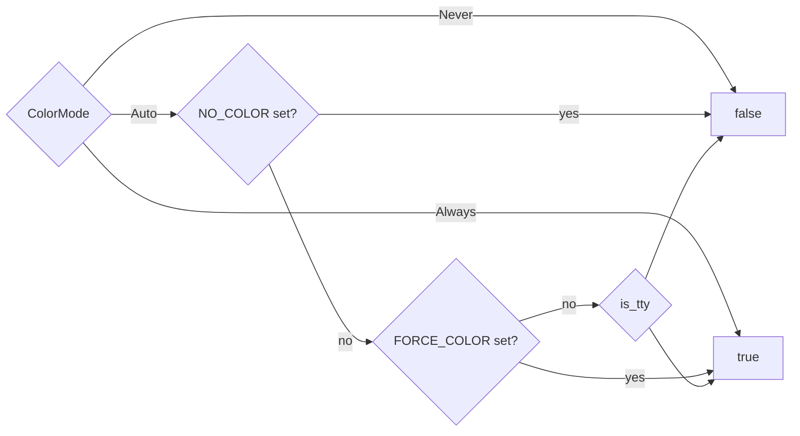

# CLI core & terminal UI

<TLDR>
  `main.rs`（`crates/cognia-cli/src/main.rs`，527 行）解析一棵嵌套的 clap-derive 树 ——
  `Cli` → `TopCommand::Plugin` → 一个 14 变体的 `PluginCommand` enum —— 解析出一个 `ColorMode`，
  构建一个 `RuntimeUi`（`ui/runtime.rs:60`），并通过 `dispatch_plugin()`
  （`main.rs:326`）路由。每个交互触点都经过 **`Prompter` trait**
  （`ui/prompter.rs:82`），它有三个实现：TTY 上的 `DialoguerPrompter`、以可执行的 flag 提示
  拒绝的 `NoninteractivePrompter`，以及用于确定性测试的 `MockPrompter`。错误从 `anyhow` 流向
  `eyre`（`anyhow_to_eyre`，`main.rs:315`），让 color-eyre 渲染完整的成因链；exit code 为
  0 / 1 / 2（clap）/ 101（panic）。
</TLDR>

## Crate 标识

`crates/cognia-cli/Cargo.toml` —— crate `cognia-cli` 0.1.0，**二进制名 `cognia`**，edition 2021，
`rust-version = "1.82"`。关键依赖：

| Dep | 作用 |
| --- | --- |
| `clap 4`（`derive`、`wrap_help`） | 命令树 |
| `eyre` + `color-eyre 0.6` | 带成因链的彩色错误报告 |
| `dialoguer 0.11` | Confirm / Input / Select prompt（`ColorfulTheme`） |
| `indicatif 0.17` | spinner（dev 面板用 `MultiProgress`） |
| `owo-colors 4`（`supports-colors`） | 带全局覆写的调色板 |
| `is-terminal 0.4` | 启动时 TTY 探测 |
| `ed25519-dalek`、`sha2`、`base64`、`hex` | 签名表面 |
| `zip 2`、`wasmparser 0.221` | bundle 打包 + 自定义段解析 |
| `ureq 2`（`json`） | 到 bridge 的同步 HTTP —— CLI 里没有 tokio |
| `notify 6`、`ctrlc 3` | dev 循环的 watcher + 双 Ctrl-C 退出 |
| `directories` | 跨平台的 `config_dir()`，用于 endpoint 发现 |

## 命令树

```rust
// crates/cognia-cli/src/main.rs:98-126
struct Cli {
    --color <auto|always|never>   // default auto          (main.rs:100)
    --no-color                    // wins over --color     (main.rs:103)
    -q, --quiet                   // suppress non-error    (main.rs:106)
    -v, --verbose                 // repeatable, max -vv   (main.rs:109)
    -y, --yes                     // pre-confirm; CI mode  (main.rs:113)
    command: TopCommand,
}

enum TopCommand {
    Plugin { #[command(subcommand)] command: PluginCommand },   // main.rs:121-126
}
```

14 个 `PluginCommand` 变体（`main.rs:132-279`）及其在
`dispatch_plugin()`（`main.rs:326-392`）中的分发点：

| 变体 | Flags | 分发 |
| --- | --- | --- |
| `New` | `--dir` `--kind` `--author` `--author-email` `--description` `--with-keygen` | `main.rs:328` |
| `Lint` | `--path .` `--json` | `main.rs:346`（先设置 `ui.flags.json`） |
| `Build` | `--path .` `--out` `--skip-build` | `main.rs:350` |
| `Info` | `--json` `--detailed` | `main.rs:355` |
| `Sign` | `--key`（必需） `--out` | `main.rs:363` |
| `Verify` | `--public-key` `--signature` `--json` | `main.rs:364` |
| `Keygen` | `--out-dir .cognia` | `main.rs:373` |
| `Install` | `<path>` bundle 或目录 | `main.rs:374` |
| `Uninstall` | `--purge-data` | `main.rs:375` |
| `List` | `--json` | `main.rs:379` |
| `Reload` | `--path`（`--bundle` 的可见 alias）`--plugin-id` | `main.rs:383` |
| `Status` | `--json` | `main.rs:384`（先设置 `ui.flags.json`） |
| `Dev` | `--path .` `--reload-url` | `main.rs:388` |
| `EmbedVersion` | `--out` | `main.rs:389` → `cmd_embed_version`（`main.rs:395`） |

### 九行看懂 main()

```rust
// crates/cognia-cli/src/main.rs:279-308 (abridged)
let cli = Cli::parse();
let color_mode = if cli.no_color { ColorMode::Never }
                 else { ColorMode::parse(&cli.color)? };
let flags = UiFlags { color: color_mode, quiet: cli.quiet,
                      verbose: cli.verbose, yes: cli.yes, json: false };
let mut ui = RuntimeUi::new(flags);
ui.apply_color_override();          // owo_colors::set_override
ui::error::install()?;              // idempotent color-eyre hook
let result = match cli.command {
    TopCommand::Plugin { command } => dispatch_plugin(command, &mut ui),
};
result.map_err(anyhow_to_eyre)?;
```

命令返回 `anyhow::Result`；`anyhow_to_eyre()`（`main.rs:315-323`）将链反向重新包装，
使 color-eyre 带完整上下文按 innermost-first 顺序打印。

## RuntimeUi —— 每次调用的状态

```rust
// crates/cognia-cli/src/ui/runtime.rs:60-169
pub struct RuntimeUi {
    pub is_tty: bool,                 // stdout.is_terminal() at construction
    pub color: bool,                  // resolved from ColorMode + env
    pub flags: UiFlags,
    prompter: Box<dyn Prompter>,      // Dialoguer on TTY, Noninteractive otherwise
}
```

颜色解析（`compute_color`，`runtime.rs:171-185`）遵循业界惯例：



命令依赖的 helper 方法：`prompter()`（`runtime.rs:124`）、`show_progress()` =
`!quiet`（`runtime.rs:129`），以及 `confirm_overwrite(path, flag_hint)`（`runtime.rs:155-168`）——
当路径不存在或设置了 `--yes` 时立即返回 `true`，否则以默认 **No** 提示。`keygen`、`sign` 和 `new`
都通过它来门控破坏性写入。

## Prompter trait —— 三个实现

```rust
// crates/cognia-cli/src/ui/prompter.rs:82-131
pub trait Prompter: Send {
    fn confirm(&mut self, message: &str, default: bool, flag_hint: &str) -> Result<bool, PromptError>;
    fn input(&mut self, message: &str, default: Option<&str>, flag_hint: &str) -> Result<String, PromptError>;
    fn input_optional(&mut self, message: &str, flag_hint: &str) -> Result<Option<String>, PromptError>;
    fn select(&mut self, message: &str, items: &[&str], default_index: usize, flag_hint: &str) -> Result<usize, PromptError>;
    fn multi_select(&mut self, message: &str, items: &[&str], defaults: &[bool], flag_hint: &str) -> Result<Vec<usize>, PromptError>;
}
```

| 实现 | 行为 | 行号 |
| --- | --- | --- |
| `DialoguerPrompter` | 用 `ColorfulTheme` 封装 `dialoguer` 的 `Confirm`/`Input`/`Select`/`MultiSelect`；裁剪输入 | `prompter.rs:137-232` |
| `NoninteractivePrompter` | `confirm`/`input`/`select` → `PromptError::Noninteractive`；`input_optional` → `Ok(None)`，`multi_select` → 静默返回 `Ok(vec![])` | `prompter.rs:238-299` |
| `MockPrompter` | `VecDeque<Answer>` 队列 + `recorded_prompts` 记录；类型不匹配和空队列都是硬错误 | `prompter.rs:305-444` |

非交互错误特意做得可执行 —— 每个调用点都提供一个 `flag_hint`：

```text
non-interactive shell: prompt `<prompt>` requires input — pass `<flag_hint>` to skip
```

（`prompter.rs:38-47`）。这就是为什么帮助文本里把 `--yes` 描述为 "required for CI"：CI
运行是非 TTY，因此任何本会阻塞的 prompt 都会快速失败，并给出要添加的确切 flag。

## Progress、调色板、错误渲染

- **`make_spinner(ui, msg)`**（`ui/progress.rs:22-38`）—— 非 TTY 或 `--quiet` 时隐藏；
  可见时模板为 `"{spinner:.cyan} {msg}"`，以 80 ms 节奏的 Braille 计时点。
  `make_spinner_in_multi` / `make_multi_progress`（`progress.rs:46-73`）用于嵌套流程 ——
  `dev` 状态面板直接构建在 `MultiProgress` 之上。
- **调色板**（`ui/style.rs:15-74`）—— `ok` 加粗绿、`error` 加粗红、`warn` 加粗黄、
  `hint` 加粗青、`dim`、`bold`；前缀 helper `success_prefix()` "✓ "、`error_prefix()` "✗ "、
  `warn_prefix()` "⚠ "、`hint_prefix()` "→ try: "。每个 helper 都经过
  `owo_colors::if_supports_color(Stream::Stdout, …)`，因此 `main()` 里设置的那个全局覆写
  统辖所有输出。
- **`ui::error::install()`**（`ui/error.rs:21-33`）—— 幂等的 color-eyre panic + error hook；
  吞掉 "already installed" 错误，以便测试可反复调用。

## Exit code

| Code | 含义 |
| --- | --- |
| 0 | 命令返回 `Ok(())` |
| 1 | 任何 `Err` —— 由 color-eyre 带完整成因链渲染 |
| 2 | clap 解析/用法错误 |
| 101 | panic（color-eyre panic hook） |

`lint` 是唯一一个在报告含有错误时通过显式 `std::process::exit(1)` 退出 1 的命令
（`cmd_lint.rs:282-303`）—— 仅有 warning 则保持 exit 0。

## 集成测试

`crates/cognia-cli/tests/integration.rs` 以 `NO_COLOR=1`、`CI=true` 并清空 stdin，通过
`CARGO_BIN_EXE_cognia` 启动已编译的二进制。这 16 个测试钉住公开契约：`--help` /
`--version` 的形态、对干净 vs 损坏 manifest 的 lint exit code、`lint --json` 携带
`schemaVersion: 1`、`info --json` 以 bundle 与目录输入往返、
`new` 在非 TTY 且无名称时失败（带可执行提示）并在有显式参数时成功、未知子命令错误，以及
`NO_COLOR` 从输出中剥离每一个 ANSI 转义。
新增的 bridge-client smoke 检查会确保 `plugin install --help`、`plugin info --help`、
`plugin list --help`、`plugin reload --help` 和 `plugin status --help`
持续通过 clap 暴露，避免这些非 TUI bridge 表面静默消失。
