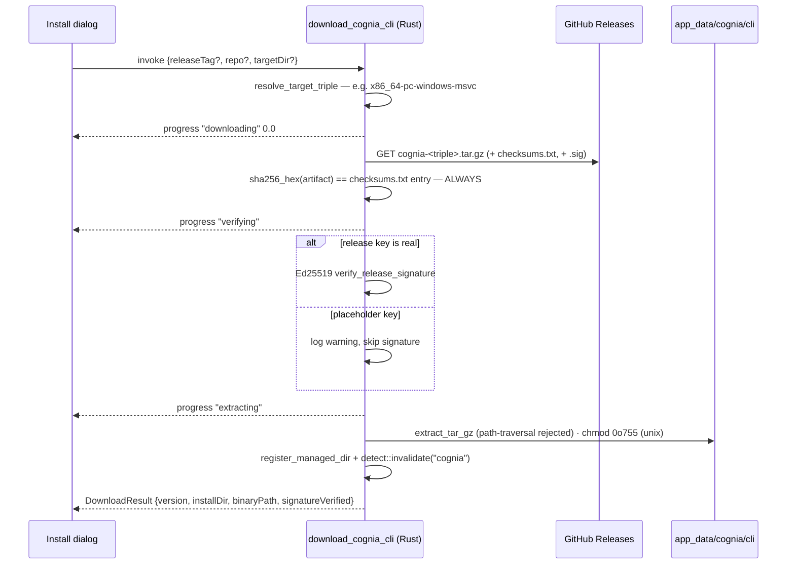

# 探测与托管安装

<TLDR>
  `detectCli("cognia")`（`lib/cli-bridge/detect-cli.ts:37-56`）会调用 Tauri 命令
  `detect_binary`，后者先查 300 秒缓存，优先 **应用托管目录**（应用自己下载的
  二进制），再通过运行 `cognia --version` 探测 `PATH`
  （`src-tauri/src/cli_bridge/detect.rs:186-216`）。托管下载
  （`download_cognia_cli`，`download.rs:197-310`）解析平台三元组，从 GitHub Releases
  拉取 `cognia-<triple>.tar.gz`（+ `.sig` + `checksums.txt`），**始终强制
  SHA-256**，并对嵌入的发布密钥做 Ed25519 校验——除非它仍是占位符，
  随后做防穿越解压到 `<app_data>/cognia/cli/<version>`，在 Unix 上 chmod，注册
  该目录，并使探测缓存失效，让 UI 立即翻转为「已安装」。在 web
  和移动端，每个入口都短路为「不支持」。
</TLDR>

## 探测

```ts
// lib/cli-bridge/detect-cli.ts:18-23
export interface BinaryDetectionResult {
  available: boolean
  version: string | null   // first stdout line of `cognia --version`
  path: string | null      // best-effort `which` / `where`
  error: string | null     // "web" outside Tauri; IPC errors degrade, never throw
}
```

Rust 这一侧（`detect.rs:186-216`）：

1. 以 `(name, version_arg)` 为键的缓存查找，TTL 300 s（`detect.rs:21`）
2. `find_in_managed_dirs(name)` —— 在过往下载注册的目录上做 LIFO
   （`register_managed_dir`，`detect.rs:61-66`；该快照同时为
   [终端启动](./devtools-ui) 喂入 PATH 注入）
3. 回退：从 `PATH` 启动 `name --version`；version = 去空白后的首行 stdout
   （`:118-122`）；path 经 `which`/`where` 解析（`:168-182`）
4. 缓存结果；下载后 `invalidate("cognia")` 将其丢弃（`download.rs:301`）

`getCliBridgeStatus()`（`lib/cli-bridge/status.ts:26-49`）是
[bridge](./bridge-server) 的姊妹探测：`{running, boundPort, endpointFile}`，在 web
或 IPC 失败时返回一个安全的 `NOT_AVAILABLE` 快照 —— `status.test.ts` 钉住的契约是
**永不抛出**。

## 托管下载



关键机制（`src-tauri/src/cli_bridge/download.rs`）：

- **URL 构造**（`:224-231`）—— 规范仓库 `MaxQian888/cognia-next`（`:29`），
  `releases/latest/download/<artifact>` 或 `releases/download/<tag>/<artifact>`；产物
  `cognia-<triple>.tar.gz`，三元组 `{x86_64,aarch64}-{pc-windows-msvc,apple-darwin,unknown-linux-gnu}`
  （`resolve_target_triple`，`:65-78`）
- **checksums.txt**（`checksum_for`，`:107`）—— `<sha256hex>  <filename>`（接受
  星号前缀的文件名）；不匹配是硬错误，消息里带上两个摘要
- **签名**（`:256-275`）—— `.sig` 接受原始 64 字节或 base64
  （`normalize_signature`，`:313-324`）；占位符密钥 ⇒ 跳过并报
  `release signing key is a placeholder; skipping Ed25519 verification (SHA-256 enforced)`；
  真实密钥 ⇒ 失败即中止安装
- **安装目录**（`:282-291`）—— `<app_data>/cognia/cli/<version_label>`（Roaming AppData /
  Application Support / `~/.config`），可按调用经 `targetDir` 覆盖
- **解压**（`extract_tar_gz`，`:154-189`）—— gzip + tar 遍历，**拒绝路径穿越
  条目**，创建中间目录，对 Unix 二进制 `chmod 0o755`；二进制名
  `cognia` / `cognia.exe`（`:88-92`）

TS 封装（`lib/cli-bridge/download-release.ts:46-77`）在调用期间订阅
`download_cognia_cli_progress`，并把
`{stage: "downloading" | "verifying" | "extracting" | "done", progress: number | null, message}`
转发给调用方的 `onProgress`；监听器在 `finally` 中拆除。在 Tauri 之外它会抛出
`requires the desktop app`。

## 渲染端的发布密钥镜像

`lib/cli-bridge/embedded-pubkey.ts:13-14` 导出 `EMBEDDED_COGNIA_RELEASE_PUBKEY` 与
`isPlaceholderReleaseKey()` —— 这是
[发布密钥同步故事](./signing-and-keys#the-release-key--three-copies-one-source) 中的第三份拷贝。UI
用它来诚实地措辞：安装对话框页脚写着「Downloads are SHA-256 verified.
Signature verification when key is configured.」

<Callout type="warn" title="占位符密钥仍在分发时的信任模型">
  在真实发布密钥发布之前，真实性依赖于 GitHub Releases TLS + 从同源拉取的 SHA-256
  清单 —— 这是对损坏的完整性保护，而非对受损发布流水线的保护。Ed25519 路径已
  完整构建，并在 `RELEASE_PUBLIC_KEY_BASE64` 不再全零的那一刻自行武装；
  `scripts/release-sync-keys.mjs --check` 在 CI 中让三份拷贝保持同步。
</Callout>

## 行为契约（测试）

- `detect-cli.test.ts` —— `detect_binary` 以 `versionArg: null` 调用；非 Tauri 返回
  `{available: false, error: "web"}`；IPC 失败退化为不可用；
  `satisfiesMinVersion()` 对无法解析的版本宽容
- `download-release.test.ts` —— 命令名、进度转发、非 Tauri 抛出、出错时监听器拆除
- Rust：三元组解析、校验和解析、tar 穿越拒绝在 `download.rs` 中做单元测试；
  探测缓存 TTL 与托管目录优先在 `detect.rs` 中测试
