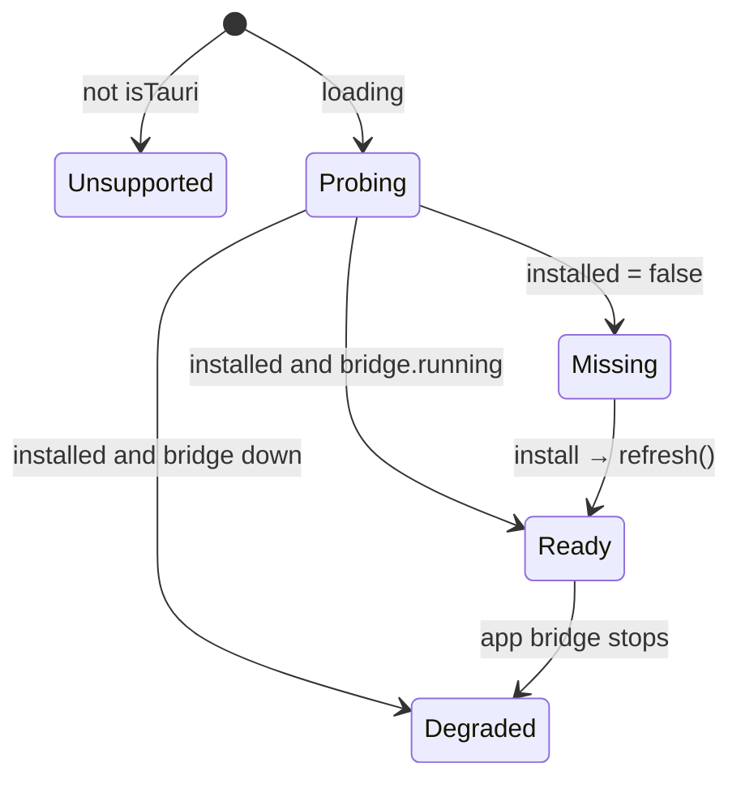
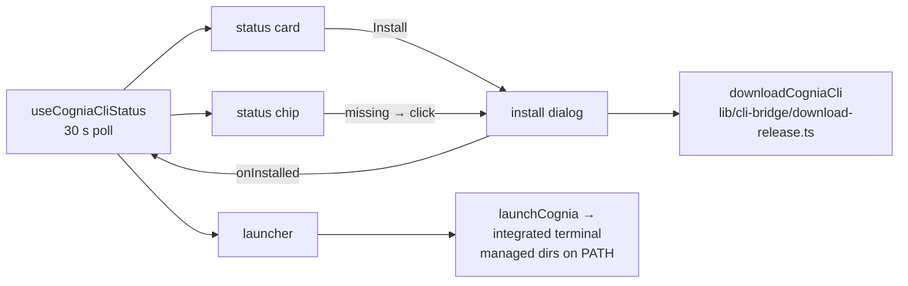

# DevTools UI

<TLDR>
  一个 hook 喂入四个组件。`useCogniaCliStatus()`
  （`hooks/plugins/use-cognia-cli-status.ts:40-81`）在挂载期间每 **30 s** 并行探测
  `detectCli("cognia")` 与 `getCliBridgeStatus()`，并暴露
  `{loading, installed, version, path, detection, bridge, supported, refresh}`。**状态
  卡片**（DevTools 面板中的首张卡片）渲染探测中 / 已安装 / 缺失状态，并打开
  **安装对话框** —— Download（托管，带进度）· Build from source（可复制的 cargo 命令）· Release tarball 三个 tab。**启动器** 把
  `cognia plugin build/dev/lint/new/install` 跑在真实终端 tab 里，并将托管目录注入 PATH，
  而 **状态徽标** 把一切浓缩成一个绿 / 琥珀 / 灰的圆点。
</TLDR>

## Dev Session 权威状态

`PluginDevSessionWorkbench` 是 DevTools 主流程。启动器先生成 UUID，再运行
`cognia plugin dev --session-id <uuid>`，并在内存 `PluginDevSessionStore` 中关联返回的终端
session。只有 App 启动的 session 提供终端操作；外部 CLI 的事件可观察，但不会出现伪造的控制按钮。

工作台不会根据安装或发现事件推断 reload 成功。只有 renderer bridge 记录的
`activationProof` 同时证明 lifecycle 为 active、generation 已递增且 artifact revision 对应 Rust
实际安装的 artifact 时，才展示成功。Activity、attempt diagnostics 与结构化 runtime 日志共用同一
session/attempt 身份。Advanced diagnostics 只包含已实现的 lifecycle、trigger audit 与
extension-point 诊断；旧 Hook/Profiler/Bus tab 不再属于 Dev Session 主流程。

## 状态 hook

```ts
// hooks/plugins/use-cognia-cli-status.ts:24-38
export interface CogniaCliStatus {
  loading: boolean                          // first probe in flight
  installed: boolean                        // detection.available
  version: string | null
  path: string | null
  detection: BinaryDetectionResult | null   // carries the error string
  bridge: CliBridgeStatus | null            // running ⇒ install/dev reload work
  supported: boolean                        // isTauri() — false on web/Capacitor
  refresh: () => void                       // immediate re-probe (post-download)
}
```

内部实现（`:47-65`）：`probe()` = `Promise.all([detectCli("cognia"), getCliBridgeStatus()])`，
由一个 mounted-ref 守护，使迟到的 resolve 无法在卸载后 set state；`POLL_INTERVAL_MS =
30_000`（`:22`）；该 interval 仅在有消费者挂载时存在。派生的 UI 状态
机：



## 状态卡片 —— `cognia-cli-status-card.tsx`

在 `plugin-devtools-pane.tsx:25` 中挂载的首张卡片。四种渲染：仅桌面提示
（`!supported`）、spinner + `probing`（`loading`）、`InstalledState`（`:78-119`）—— 带版本的绿色
对勾徽章、一个 bridge 徽章（绿 `bridgeRunning` / 红 `bridgeDown`）、可选中的等宽
二进制路径，以及 **Reveal** / **Docs** 按钮 —— 或 `MissingState`
（`:121-139`），带安装 CTA。i18n 命名空间：`plugins.cliStatus`。

## 安装对话框 —— `cognia-cli-install-dialog.tsx`

Props `{open, onOpenChange, onInstalled?}` —— 父级把 `status.refresh` 作为
`onInstalled` 传入，因此一次成功下载会立即重新探测。

| Tab | 内容 |
| --- | --- |
| Download（仅 Tauri，`:104-132`） | 由 `onProgress` 阶段驱动的进度条、内联错误文本、区分 `Downloaded. Signature verified.` 与 `Downloaded. SHA-256 verified.` 的成功 toast |
| Build from source（`:135-151`） | 复制按钮命令：`cargo install --locked --git https://github.com/MaxQian888/cognia-next cognia-cli` |
| Release tarball（`:153-163`） | 指向 GitHub Releases 的深链 |

页脚（`:166-169`）携带诚实的校验说明，与
[占位符发布密钥](./detection-and-managed-install#the-release-key-mirror-renderer-side) 挂钩。
i18n 命名空间：`plugins.cliInstall`。

## 启动器 —— `cognia-cli-launcher.tsx`

经 `launchCognia()`（`lib/terminal/run-cognia`）在集成终端 tab 里运行真实的 CLI 命令，
它把 `cwd` 设为所选项目，并将托管 CLI 目录注入 PATH —— 因此即便 `cognia` 不在
用户自己的 PATH 上，按钮也照常工作。

| 按钮 | argv | 需要 bridge？ |
| --- | --- | --- |
| `build` | `plugin build` | 否 |
| `dev` | `plugin dev --session-id <uuid>` | **是** —— 关闭时先警告 |
| `lint` | `plugin lint` | 否 |
| `new` | `plugin new` | 否 |
| `install` | `plugin install "<picked .zip>"` | **是** |

门控（`:142-219`）：仅桌面检查、一个项目选择器（命令相对于项目）、二进制缺失时的
`needsCli` 提示、一条琥珀色的 bridge 关闭警告，以及一个 `busyKey` 闩锁，
使同一时刻只跑一条命令。i18n 命名空间：`plugins.cliLauncher`。

## 状态徽标 —— `cli-status-chip.tsx`

工具栏尺寸的浓缩（`data-testid="cli-status-chip"`，`data-tone` 属性）：

```ts
tone = !status.installed ? "missing"
     : status.bridge?.running ? "ready"      // emerald dot
     : "degraded"                            // amber dot — installed, bridge down
```

已安装 → 带版本的被动 tooltip；缺失 → 点击打开安装对话框。i18n 键
`chipReady` / `chipBridgeDown` / `chipMissing`，位于 `plugins.cliStatus` 下。

## 组件接线



<Callout type="info" title="为何用轮询而非事件？">
  二进制是否存在与 bridge 是否存活都是外部事实（用户随时可以 `cargo install` 或退出
  应用），且没有原生变更源，因此 hook 以一个刻意慵懒的 30 s 轮询，并暴露
  `refresh()`，用于应用自身导致变更的那些时刻 —— 就在一次托管下载之后。下载路径
  还会使 Rust 侧的探测缓存失效，从而让 refresh 看到新鲜的真相，而非那 300 s 的
  缓存未命中。
</Callout>
