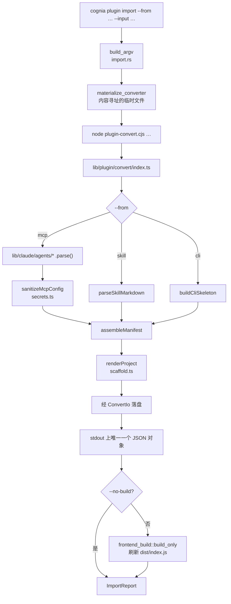

# 导入转换 —— `cognia plugin import`

<TLDR>
  `commands/import.rs` 调用一份内嵌的 Node 转换器（源码在 `lib/plugin/convert/**`，经
  `include_str!` 从 `crates/cognia-cli/assets/plugin-convert.cjs` 嵌入二进制），把一个 MCP
  服务器条目、一个 SKILL.md 目录或一个 CLI 二进制名变成完整的插件工程 —— manifest、空壳入口、
  **预生成的 `dist/index.js`**、README 与构建配置。源产物不会被执行，源里的值一个都不会被复制：
  每个凭据和机器相关路径都变成待用户填写的 preset 字段。
</TLDR>

## 为什么 Rust CLI 里放一个 Node 转换器

三种源格式的解析器仓里都已经有了：

| 源      | 现成解析器                                                     |
| ------- | -------------------------------------------------------------- |
| MCP     | `lib/claude/agents/*` 下 13 个 agent 适配器（各自的 `parse()`） |
| Skill   | `lib/claude/skills-io.ts` 的 `parseSkillMarkdown`               |
| CLI     | ——（无需解析，见[CLI 骨架](#cli-骨架)）                        |

每个 MCP 适配器都编码了一种编辑器的怪癖：VS Code 把服务器放在 `servers` 而非 `mcpServers`；
Windsurf 用 `serverUrl`；Gemini 把 SSE 与 HTTP 拆到 `url` 和 `httpUrl`；Roo Code 把 streamable
HTTP 叫 `streamable-http`。在 Rust 里重新推导这些，就是又造一个需要同步的面 —— 正是这个缺陷类
让 `cmd_lint.rs` 攒下四份手抄的 parity 列表，其中一份静默漂移了数月。

所以转换器用 TypeScript 写，打包成单个自包含的 CommonJS 文件嵌进二进制。`cognia` 仍是单文件，
无 Node 的 `cargo test -p cognia-cli` CI job 照常工作，而 `pnpm plugin-convert:check` 会在
checked-in 产物与源码漂移时让构建变红。



## 用法

```bash
# 先看输入里有什么
cognia plugin import --from mcp --input ~/.cursor/mcp.json --list

# 转换其中一条
cognia plugin import --from mcp --input ~/.cursor/mcp.json --pick github

# skill 目录（或直接给 SKILL.md）
cognia plugin import --from skill --input ~/.claude/skills/code-review

# CLI 二进制 —— 产出骨架，不是成品工具
cognia plugin import --from cli --input rg

# 往已有插件里再加一条贡献
cognia plugin import --from mcp --input ~/.cursor/mcp.json --pick playwright --into ./my-plugin
```

只有当输入含多个候选时才需要 `--pick`；skill 目录和 CLI 二进制各只有一个候选，可省略。

## 不执行任何东西

不 spawn MCP 服务器，不跑 `--help`，不联网。转换就是读文本、写文本。

这是刻意划的边界，不是缺失。spawn 服务器确实能让转换器枚举出真实工具清单 —— 同时也意味着
`cognia plugin import` 会执行一行来自用户未必亲手写过的配置文件里的任意 `npx -y <package>`。
生成的描述只陈述配置本身陈述了的内容。

## 源里的值一个都不复制

真实的 `mcp.json` 里常有活的 token 和某一台机器上的绝对路径。生成的工程是要被提交和分享的，
所以 `sanitizeMcpConfig`（`lib/plugin/convert/secrets.ts`）把每个用户相关的值替换成一个声明式
字段，遵循 `MCP_PRESETS` 精选表已有的约定：

| 源配置里                     | 生成的 preset 里                                                  |
| ---------------------------- | ----------------------------------------------------------------- |
| `env: { GITHUB_TOKEN: "…" }` | `config.env.GITHUB_TOKEN = ""` + `placement: "env", secret: true`  |
| `args: ["/Users/me/Docs"]`   | `args: ["<DOCS>"]` + `placement: "arg-replace", token: "<DOCS>"`   |
| `headers: { Authorization }` | header 字段；`config` 里的 headers 整个删掉                       |
| 带凭据的 URL                 | `placement: "url"` 字段；URL 从 config 移除                        |
| 普通远端 URL                 | 保留 —— 它标识的是服务器，不是用户                                 |

不作为值、不作为默认值、也不作为 placeholder。"复制值 + 打印一条警告"和当年脚手架把自己的
Ed25519 私钥暂存进 git 是同一类错误。

描述同样基于**净化后**的 config 生成：原始调用串里嵌着刚刚被 token 化的那些路径，而描述会被
拷进 `plugin.json`、`package.json` 和 `README.md`。

## 生成了什么

```
<plugin-id>/
├── plugin.json       —— manifest；声明贡献的唯一位置
├── src/index.ts      —— 空壳；import plugin.json，什么都不注册
├── dist/index.js     —— 构建产物，直接生成（见下）
├── package.json      —— esbuild + SDK 类型，无运行时依赖
├── tsconfig.json
├── .gitignore        —— **不**忽略 dist/
└── README.md         —— 分源的字段说明与后续步骤
```

### 入口是空壳

三种被转换的能力都由宿主从 manifest 派发 —— `mcp-server-preset` 与 `skills` 走
`OVERLAY_REGISTRY_CAPABILITIES`（`lib/plugin/contracts/capability-bridge-map.ts`），`cliTools`
在 `PluginManager` 里物化 —— 所以不需要任何命令式注册。类型上 `PluginDefinition.manifest` 仍是
必填，入口通过 **import `plugin.json`** 来满足它，而不是把 manifest 再抄一份进源码。这样
`plugin.json` 始终是声明贡献的唯一位置 —— 而那正是作者要手改的文件。

入口里的每个 import 要么是 type-only、要么是 manifest JSON，因此工程**没有运行时依赖**，
esbuild 在一个刚建好、什么都没装的目录里也能打包。

### `dist/index.js` 直接生成，并且提交

`manifest.main` 指向 `dist/index.js`，缺了它工程就装不了。如果靠末尾那步 esbuild 来产出它，
整条命令就得指望 `npx --no-install esbuild` 能在一个刚创建、没有 `node_modules` 的目录里解析
成功 —— 而它永远不会。所以转换器直接产出构建结果。这之所以安全，恰恰因为入口是我们自己的且
无运行时依赖：esbuild 对它做的只有擦除一个 type-only import 和内联 `plugin.json`。
`scaffold.test.ts` 用真实的 esbuild 跑一遍生成入口、再对比两个加载后的模块，把这个等价性钉住。

`.gitignore` 特意不含 `dist/`：应用内的 GitHub 安装器（`lib/plugin/package/github-source.ts`）
执行的是**免构建**安装，仓里没有构建产物就会克隆出一个装不了的插件。基于 git 的 wasm 安装器确实
会构建，但 frontend 插件没有那条路径。

toolchain 可用时末尾那步 esbuild 仍会跑，所以生成的文件是下限而非替代。esbuild 不可用时命令会
如实报告并保留生成的文件。

## 运行时兼容性是推导出来的，不是猜的

| 贡献                   | browser | tauri | mobile |
| ---------------------- | ------- | ----- | ------ |
| stdio MCP preset       | blocked | ok    | blocked |
| http / sse MCP preset  | ok      | ok    | ok      |
| inline skill           | ok      | ok    | ok      |
| `local-bundle` skill   | blocked | ok    | blocked |
| cli tools              | blocked | ok    | blocked |

被 block 的行都是事实：stdio 服务器要作为宿主进程被 spawn；`resolveSkillMarkdown` 通过
`@tauri-apps/plugin-fs` 读 bundle skill；`cliTools` 执行宿主二进制。

## Skills：inline 还是 bundle

由内容决定，不由 flag 决定。

- **没有同级资源** → `inline`。正文存在 manifest 里，在三端都能解析，因为
  `resolveSkillMarkdown` 返回 inline markdown 时完全不碰文件系统。
- **有同级 `scripts/` / `references/` / `assets/`** → `local-bundle`，整个目录拷进插件的
  `skills/<id>/` 下。

bundle 路径写的是**相对插件目录**的（`skills/code-review`）。宿主在注册时把它锚定到插件安装
目录（`lib/plugin/utils/rebase-skill-source.ts`），与 `main`、`wasmMain`、
`cliTools[].binary.relPath` 已有的语义一致。会逃出插件目录的路径会被拒绝，且 overlay 派发循环
会把失败隔离到那一个 skill。

## CLI 骨架

`--from cli` 产出 `capabilities: ["cli-tools"]`、`permissions: ["cli:execute"]`、
`requires.binaries`，以及一个**空的** `cliTools` 数组。

到此为止是刻意的。一条可用的 `cliTools` 需要逐个 flag 知道：它是否带值、是否可重复、退出码
含义、输出该怎么解析。二进制的 `--help` 几乎都不讲这些 —— 没有任何 help 文本会告诉你 ripgrep
的退出码 1 表示"无匹配，属于成功" —— 而转换器不执行任何东西。猜出来的参数表会 lint 全绿然后
行为错误，那比一个明显没写完的骨架更糟。

空表本来就会被宿主校验器报成 `manifest.capability.field_missing`，所以 `cognia plugin lint`
无需新规则就能标出未完成，`cognia plugin lint -W` 则在 CI 里对它设门禁。生成的 `README.md`
带完整 argv DSL 说明并指向 `plugins/ripgrep-tools`。

## `--into`：并入已有插件

合并刻意做得很窄：把能力并进 `capabilities[]`、把贡献 append 进对应的 manifest 数组、补上该贡献
确实需要的权限。它不动 `version`、不动 `src/`，除 JSON 往返隐含的变化外不重排不重格式化
（key 插入顺序保留，缩进变成两空格）。

id 冲突是错误 —— 既不静默覆盖也不自动改名。此模式下 `--id` 重命名的是*被导入的那条贡献*
（插件 id 由目标目录固定），冲突就是这样解开的。

运行时兼容性是**报告而非改写**：往一个声称支持浏览器的插件里加 stdio preset，会让那个声称变成
错的；但静默收窄宿主插件已声明的可达范围，可能连带禁掉它本来就在提供的其他贡献。命令会明确告诉
作者该改什么。

`--from cli` 不支持 `--into`，因为它的骨架不贡献任何条目。

## 身份与签名

不签名，也不生成密钥。签名属于分发关心的事，需要的作者会自己去跑 `cognia plugin keygen` ——
"不问自取地生成密钥"的默认脚手架，正是当年私钥在第一次 `git add -A` 就被暂存的原因。

其余全部推导且可覆盖：

| 字段            | 默认值                                        | 覆盖参数             |
| --------------- | --------------------------------------------- | -------------------- |
| `id`            | `<条目名 slug 化>-<mcp\|skill\|tools>`        | `--id`               |
| `name`          | 源条目的名字                                  | `--name`             |
| `description`   | 由净化后的 config 推导                        | `--description`      |
| `version`       | `0.1.0`                                       | `--plugin-version`   |
| `author.name`   | `git config user.name`                        | `--author`           |
| `license`       | `MIT`                                         | `--license`          |
| `minAppVersion` | `0.1.0`                                       | `--min-app-version`  |

id 后缀不会重复：一个本就叫 `playwright-mcp` 的 MCP 条目仍然是 `playwright-mcp`。

## 线上契约

Node 侧只往 stdout 打印**一个** JSON 对象，绝不打印任何散文，所以 locale 或颜色设置都无法污染
协议。失败用同一形状加非零退出码：

```json
{ "ok": false, "error": "--pick is required: this input holds more than one MCP server" }
```

`cognia plugin import --json` 把它包进命令报告：

```json
{
  "schemaVersion": 1,
  "ok": true,
  "action": "import",
  "mode": "create",
  "pluginId": "github-mcp",
  "dir": "/home/u/github-mcp",
  "files": ["plugin.json", "src/index.ts", "dist/index.js", "..."],
  "candidates": [],
  "todos": ["env GITHUB_TOKEN is a credential — its value was NOT copied; …"],
  "warnings": [],
  "build": "built"
}
```

`build` 取 `built`、`skipped`（`--no-build`，或 list / merge 模式）、`unavailable`
（esbuild 跑不了；生成的 `dist/index.js` 被保留）。

## 边界

- **TOML 后端的 agent 不在范围内。** Codex 把 MCP 服务器存在 TOML 里，其适配器消费的是已解码的
  树；为了一个 agent 把 TOML 解析器拉进 bundle 不划算。错误信息会点明这个限制，而不是静默返回空。
- **`--list` 不写任何文件**，对任意文件运行都安全。
- **非空目标目录会被拒绝。** `--into` 是触碰已有插件的那条显式且狭窄的路径。

## 维护这份 bundle

```bash
pnpm plugin-convert:bundle       # 重建 crates/cognia-cli/assets/plugin-convert.cjs
pnpm plugin-convert:check        # checked-in 产物过期则失败
pnpm plugin-convert:check:test   # 同一检查的 node --test 形态
```

bundle 构建会拒绝把 `@tauri-apps/*` 或 `dexie` 打进来：它们在转换器触及但从不执行的 import 路径
上，打进去会把一个浏览器数据库和 Tauri IPC 层拖进一个纯 Node 脚本。它们被替换成对 CLI 而言陈述
事实的 stub（在那里 `isTauri()` 确实是 `false`）。新增一个会触达它们的宿主 import，会让 bundle
构建失败并点名是哪个模块引入的。
