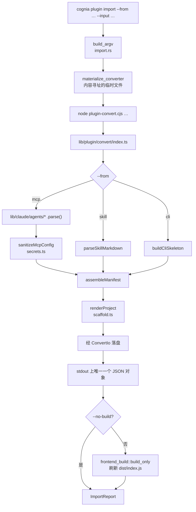

# 导入转换 —— `cognia plugin import`

<TLDR>
  `commands/import.rs` 调用一份内嵌的 Node 转换器（源码在 `lib/plugin/convert/**`，经
  `include_str!` 从 `crates/cognia-cli/assets/plugin-convert.cjs` 嵌入二进制），把一个 MCP
  服务器条目、一个 SKILL.md 目录或一个 CLI 二进制名变成完整的插件项目 —— manifest、空壳入口、
  **预生成的 `dist/index.js`**、README 与构建配置。源产物不会被执行，不会复制源产物中的任何值：
  每个凭据和机器相关路径都变成待用户填写的 preset 字段。
</TLDR>

## 为什么 Rust CLI 里放一个 Node 转换器

三种源格式的解析器仓里都已经有了：

| 源      | 现成解析器                                                     |
| ------- | -------------------------------------------------------------- |
| MCP     | `lib/claude/agents/*` 下 13 个 agent 适配器（各自的 `parse()`） |
| Skill   | `lib/claude/skills-io.ts` 的 `parseSkillMarkdown`               |
| CLI     | ——（无需解析，见[CLI 骨架](#cli-骨架)）                        |

每个 MCP 适配器都编码了一种编辑器的怪癖：VS Code 把服务器放在 `servers` 而非 `mcpServers`；Windsurf 用 `serverUrl`；Gemini 把 SSE 与 HTTP 拆到 `url` 和 `httpUrl`；Roo Code 把 streamable HTTP 叫 `streamable-http`。在 Rust 里重新推导这些，就是又造一个需要同步的面 —— 正是这个缺陷类让 `cmd_lint.rs` 攒下四份手抄的 parity 列表，其中一份静默漂移了数月。

所以转换器用 TypeScript 写，打包成单个自包含的 CommonJS 文件嵌进二进制。`cognia` 仍是单文件，无 Node 的 `cargo test -p cognia-cli` CI job 照常工作，而 `pnpm plugin-convert:check` 会在 checked-in 产物与源码漂移时让构建变红。


```mermaid
flowchart TD
  CMD["cognia plugin import --from … --input …"] --> ARGV[build_argv<br/>import.rs]
  ARGV --> MAT[materialize_converter<br/>内容寻址的临时文件]
  MAT --> NODE["node plugin-convert.cjs …"]
  NODE --> CORE[lib/plugin/convert/index.ts]
  CORE --> SRC{--from}
  SRC -- mcp --> A["lib/claude/agents/* .parse()"]
  SRC -- skill --> B["parseSkillMarkdown"]
  SRC -- cli --> C[buildCliSkeleton]
  A --> SAN[sanitizeMcpConfig<br/>secrets.ts]
  SAN --> MAN[assembleManifest]
  B --> MAN
  C --> MAN
  MAN --> FILES[renderProject<br/>scaffold.ts]
  FILES --> IO[经 ConvertIo 落盘]
  IO --> JSON["stdout 上唯一一个 JSON 对象"]
  JSON --> BUILD{--no-build?}
  BUILD -- 否 --> ESB[frontend_build::build_only<br/>刷新 dist/index.js]
  BUILD -- 是 --> RPT[ImportReport]
  ESB --> RPT
```

## 用法

```bash
# 先看输入里有什么
cognia plugin import --from mcp --input ~/.cursor/mcp.json --list

# 转换其中一条
cognia plugin import --from mcp --input ~/.cursor/mcp.json --pick github

# skill 目录（或直接给 SKILL.md）
cognia plugin import --from skill --input ~/.claude/skills/code-review

# CLI 二进制 —— 产出骨架，不是成品工具
cognia plugin import --from cli --input rg

# 往已有插件里再加一条贡献
cognia plugin import --from mcp --input ~/.cursor/mcp.json --pick playwright --into ./my-plugin
```

只有当输入含多个候选时才需要 `--pick`；skill 目录和 CLI 二进制各只有一个候选，可省略。

## 完整插件包

整插件转换使用 `lib/plugin/convert/ecosystem.ts`，与应用内 GitHub 预览及 Agent 转换技能共用同一个规范转换器：

```bash
# 受支持的 Agent 插件 → Cognia
cognia plugin import --from plugin --input ./foreign-plugin --dir ./cognia-plugin

# 只检查原生导出，不写文件
cognia plugin export --input ./cognia-plugin --to codex --dry-run --surface cli --json

# 写入导出（只有审阅并接受警告后才添加 --accept-warnings）
cognia plugin export --input ./cognia-plugin --to codex --dir ./codex-plugin
```

目标包括 `cognia`、`claude-code`、`codex`、`gemini-cli`、`agent-plugins`、`cursor`、`copilot`、`kimi`、`devin`、`opencode`、`pi`、`factory-droid`、`qoder`、`codebuddy`、`auggie`、`open-plugins`。转换器识别受支持的清单，保留 Skill 资源树与二进制文件，返回保真度及逐能力处理报告。外部生态之间也通过同一规范表示进行转换。

### 支持的生态（格式更新于 2026-10-02）

| 生态 | 转换器读取的清单 | 导入到 Cognia | 从 Cognia 导出 |
| --- | --- | --- | --- |
| Claude Code | `.claude-plugin/plugin.json`（可选，必填仅 `name`） | skills（声明路径在 `skills/` 之外追加）、commands（文件或内联命令映射）、agents、hooks（33 个事件）、MCP（声明与 `.mcp.json` 合并） | skills、agents、hooks、MCP；保留名前缀会阻断 |
| Codex | `.codex-plugin/plugin.json`（根目录 Agent Plugins 清单优先） | skills、声明的 `commands`（像 Codex 一样迁移为 skill）、hooks（Codex 事件子集，仅 `command` 与 `mcp_tool`）、MCP、`interface` 元数据 | skills、hooks、MCP |
| Gemini CLI | `gemini-extension.json` | skills、TOML 命令（近似）、上下文文件（`contextFileName` 支持字符串或列表）、hooks（`BeforeTool`↔`PreToolUse`、`AfterTool`↔`PostToolUse`、`PreCompress`↔`PreCompact`、会话与通知事件；超时 ms↔s）、`agents/*.md`、清单内 MCP 与 settings | skills、hooks、agents（`max_turns`）、带安装设置的 MCP |
| Agent Plugins | 根目录 `plugin.json`，`$schema` 为 1.0.0（已发布）或 1.1.0（工作草案） | `skills/<dir>/SKILL.md`、同版本 schema 的 `mcp.json`，以及 `dev.openhands/` 与 `com.github.copilot/` 客户端命名空间（agents、commands、OpenHands hooks） | 1.0.0 清单、skills、`mcp.json`，agents 与 hooks 写入 `dev.openhands/` |
| GitHub Copilot CLI | Agent Plugins 根清单，否则读取旧版 `plugin.json` / `.github/plugin/plugin.json` | skills、`*.agent.md` agents、声明的 commands、MCP（`.mcp.json` 或 `.github/mcp.json`） | Agent Plugins 布局加 `com.github.copilot/agents/<id>.agent.md` |
| Cursor | `.cursor-plugin/plugin.json` | skills、agents、commands、hooks（camelCase 事件映射）、MCP（路径、内联或数组）、`variables` 映射为预设字段、`logo` | skills、agents、扁平 hooks、MCP，预设字段导出为 `variables` |
| Kimi CLI | 含 `tools`、`inject` 或 `config_file` 的根目录 `plugin.json` | 根 `SKILL.md`，整个目录作为其资源 | 单个 skill 写为根 `SKILL.md`，`tools: []` |
| Devin | `.devin-plugin/plugin.json` | skills（`skills: []` 表示禁用）、MCP（遵循 `{paths, exclusive}`）、调用 triggers | skills、MCP |
| OpenCode | `opencode.json` / `opencode.jsonc` | `.opencode/skills`、`.opencode/commands`、`mode: subagent` 的 agents、带 `cwd` 与 `{env:VAR}` 的本地 MCP | skills、`mode: subagent` agents、本地 MCP |
| Pi | 含 `pi` 字段或 `pi-package` 关键字的 `package.json` | 整个包作为一个 `piPackages` 条目，另外 skills 与 prompts（显式调用 skill） | 原样写回保留的包根目录，Cognia skills 合并进 `pi.skills` |
| Factory Droid | `.factory-plugin/plugin.json`（仅元数据，Droid 按约定发现） | skills、commands、`droids/` agents、hooks、`mcp.json` | 同一布局，使用 `DROID_PLUGIN_ROOT` |
| Qoder CLI | `.qoder-plugin/plugin.json` | skills、commands、agents、hooks、`.mcp.json` | 同一布局，使用 `QODER_PLUGIN_ROOT` |
| CodeBuddy | `.codebuddy-plugin/` 或 `.workbuddy-plugin/plugin.json` | skills、commands、agents（`effort`、`maxTurns`）、hooks、`.mcp.json` | 同一布局 |
| Auggie | `.augment-plugin/plugin.json` | skills、commands、agents、hooks（脚本文件，毫秒超时）、`.mcp.json` | 同一布局，使用 `AUGMENT_PLUGIN_ROOT` |
| Open Plugins | `.plugin/plugin.json` 或 `.goose-plugin/plugin.json`（旧版 OpenPlugin 布局） | skills、commands、agents（`*.agent.md` 命名）、OpenHands 风格 hooks、`.mcp.json` | skills、hooks；各宿主对 agent 文件约定不一致，agents 会阻断 |

Claude 系布局（Claude Code、Factory Droid、Qoder、CodeBuddy、Auggie、Open Plugins）共用一个读取器和一个投影器，差异由 `lib/plugin/convert/claude-family.ts` 中每个宿主的 profile 描述：清单目录、agents 目录、MCP 文件名、插件根变量、宿主实际读取的清单字段，以及 `lib/plugin/convert/hook-dialects.ts` 中的 hook 方言。Hook 只能通过显式事件映射转换；使用自有工具名的宿主（Gemini、Cursor、Droid、Auggie、OpenHands）无法携带非通配 matcher，来自负载或决策格式不同的宿主的 hook 会作为需要复核的警告报告。

一个插件包同时带有多个清单时，最具体的厂商清单胜出（`.factory-plugin/` 优先于 `.claude-plugin/`，厂商目录优先于根目录 Agent Plugins 清单），其他清单作为警告报告；两个不同厂商专属清单同时存在会因歧义被拒绝。优先级表位于 `lib/plugin/convert/bundle-detection.ts`。

### Pi 包与 `piPackages`

Pi 包会导入为一个 `piPackages` 条目（能力 `pi-package`），其 `path` 就是插件根目录：extensions、themes、prompts、skills、`package.json` 与锁文件逐字节保留在原位，因为 GitHub 与“加载未打包插件”两种安装器只允许覆盖 `plugin.json` 和 `dist/index.js`。Skills 同时转换为 Cognia skill；prompt 模板转换为显式调用的 skill，其中 `$1` / `$@` 占位符保持字面量（报告为近似）。存在运行时 `dependencies` 时会添加固定的 `prepare` 步骤（`npm install --omit=dev --omit=peer --ignore-scripts --no-audit --no-fund`），生命周期脚本永不执行。Extensions 仅为 Pi 保留：其中注册的工具、MCP 服务器和事件处理不会被翻译，也不会生成 `hostedSession`，因为在 Cognia 托管的 Pi 会话中加载插件包需要作者编写并审阅过的 `extensions` 与 `tools` 声明。已经使用 `dist/index.js`，或被 Pi 的忽略文件过滤的包会被阻断。

导出到 Pi 时，唯一的 `piPackages` 根目录会原样写回，`pi-package` 关键字追加到已有关键字中，并把包中尚未提供的 Cognia skills 合并进 `pi.skills`。多个 Pi 包、MCP 预设（Pi 核心需要扩展）、hooks、subagents，以及写在 `dependencies` 里的 Pi 宿主包都会阻断。其他所有目标都会把 Pi 包保留在 Cognia 中，并在报告里标为保留能力。

调用控制、Hook、Agent、命令式运行时行为、权限或配置字段，如果没有实现对应的目标映射，会阻止输出。存在警告时，写入前必须明确接受。Gemini Skill 保留原生 Skill 形态，不降级为命令提示。已识别的凭证配置会被清理，需要补充的设置在报告中说明。

`--surface cli|desktop|cloud` 指定预期运行端。生成插件包不代表已经验证安装、认证或真实运行。
云端导出在交付路径确认前会被阻止。无法原生导出的运行时工具可能提供 Cognia 托管选项：在受支持的 Cognia 外部 Agent 会话中启用插件；其界面、存储、Hook 和生命周期仍由 Cognia 承载。

### Cognia 中由 Agent 驱动转换

种子 `plugin-conversion` 提示技能会在桌面工作区聊天中向 Cognia Agent 暴露 `plugin_conversion_inspect` 与 `plugin_conversion_apply`。检查阶段只读，并返回绑定源快照的限时计划；应用阶段会重新校验快照、拒绝非空或重叠输出目录、要求桌面审批，并且只写确定性转换产物。这些工具不会暴露给 IM、Web 或移动端会话。桌面插件工具栏也提供转换对话框，共用检查报告、警告确认和绑定源快照的应用计划。

## 不执行任何东西

不 spawn MCP 服务器，不跑 `--help`，不联网。转换就是读文本、写文本。

这是刻意划的边界，不是缺失。spawn 服务器确实能让转换器枚举出真实工具清单 —— 同时也意味着 `cognia plugin import` 会执行一行来自用户未必亲手写过的配置文件里的任意 `npx -y <package>`。生成的描述只陈述配置本身陈述了的内容。

## 源里的值一个都不复制

真实的 `mcp.json` 里常有活的 token 和某一台机器上的绝对路径。生成的工程是要被提交和分享的，所以 `sanitizeMcpConfig`（`lib/plugin/convert/secrets.ts`）把每个用户相关的值替换成一个声明式字段，遵循 `MCP_PRESETS` 精选表已有的约定：

| 源配置里                     | 生成的 preset 里                                                  |
| ---------------------------- | ----------------------------------------------------------------- |
| `env: { GITHUB_TOKEN: "…" }` | `config.env.GITHUB_TOKEN = ""` + `placement: "env", secret: true`  |
| `args: ["/Users/me/Docs"]`   | `args: ["<DOCS>"]` + `placement: "arg-replace", token: "<DOCS>"`   |
| `headers: { Authorization }` | header 字段；`config` 里的 headers 整个删掉                       |
| 带凭据的 URL                 | `placement: "url"` 字段；URL 从 config 移除                        |
| 普通远端 URL                 | 保留 —— 它标识的是服务器，不是用户                                 |

不作为值、不作为默认值、也不作为 placeholder。"复制值 + 打印一条警告"和当年脚手架把自己的 Ed25519 私钥暂存进 git 是同一类错误。

描述同样基于**净化后**的 config 生成：原始调用串里嵌着刚刚被 token 化的那些路径，而描述会被拷进 `plugin.json`、`package.json` 和 `README.md`。

## 生成了什么

```
<plugin-id>/
├── plugin.json       —— manifest；声明贡献的唯一位置
├── src/index.ts      —— 空壳；import plugin.json，什么都不注册
├── dist/index.js     —— 构建产物，直接生成（见下）
├── package.json      —— esbuild + SDK 类型，无运行时依赖
├── tsconfig.json
├── .gitignore        —— **不**忽略 dist/
└── README.md         —— 分源的字段说明与后续步骤
```

### 入口是空壳

三种被转换的能力都由宿主从 manifest 派发 —— `mcp-server-preset` 与 `skills` 走 `OVERLAY_REGISTRY_CAPABILITIES`（`lib/plugin/contracts/capability-bridge-map.ts`），`cliTools` 在 `PluginManager` 里物化 —— 所以不需要任何命令式注册。类型上 `PluginDefinition.manifest` 仍是必填，入口通过 **import `plugin.json`** 来满足它，而不是把 manifest 再抄一份进源码。这样 `plugin.json` 始终是声明贡献的唯一位置 —— 而那正是作者要手改的文件。

入口里的每个 import 要么是 type-only、要么是 manifest JSON，因此工程**没有运行时依赖**，esbuild 在一个刚建好、什么都没装的目录里也能打包。

### `dist/index.js` 直接生成，并且提交

`manifest.main` 指向 `dist/index.js`，缺了它工程就装不了。如果靠末尾那步 esbuild 来产出它，整条命令就得指望 `npx --no-install esbuild` 能在一个刚创建、没有 `node_modules` 的目录里解析成功 —— 而它永远不会。所以转换器直接产出构建结果。这之所以安全，恰恰因为入口是我们自己的且无运行时依赖：esbuild 对它做的只有擦除一个 type-only import 和内联 `plugin.json`。`scaffold.test.ts` 用真实的 esbuild 跑一遍生成入口、再对比两个加载后的模块，把这个等价性钉住。

`.gitignore` 特意不含 `dist/`：应用内的 GitHub 安装器（`lib/plugin/package/github-source.ts`）执行的是**免构建**安装，仓里没有构建产物就会克隆出一个装不了的插件。基于 git 的 wasm 安装器确实会构建，但 frontend 插件没有那条路径。

toolchain 可用时末尾那步 esbuild 仍会跑，所以生成的文件是下限而非替代。esbuild 不可用时命令会如实报告并保留生成的文件。

## 运行时兼容性是推导出来的，不是猜的

| 贡献                   | browser | tauri | mobile |
| ---------------------- | ------- | ----- | ------ |
| stdio MCP preset       | blocked | ok    | blocked |
| http / sse MCP preset  | ok      | ok    | ok      |
| inline skill           | ok      | ok    | ok      |
| `local-bundle` skill   | blocked | ok    | blocked |
| cli tools              | blocked | ok    | blocked |

被 block 的行都是事实：stdio 服务器要作为宿主进程被 spawn；`resolveSkillMarkdown` 通过 `@tauri-apps/plugin-fs` 读 bundle skill；`cliTools` 执行宿主二进制。

## Skills：inline 还是 bundle

由内容决定，不由 flag 决定。

- **没有同级资源** → `inline`。正文存在 manifest 里，在三端都能解析，因为 `resolveSkillMarkdown` 返回 inline markdown 时完全不碰文件系统。
- **有同级 `scripts/` / `references/` / `assets/`** → `local-bundle`，整个目录拷进插件的 `skills/<id>/` 下。

bundle 路径写的是**相对插件目录**的（`skills/code-review`）。宿主在注册时把它锚定到插件安装目录（`lib/plugin/utils/rebase-skill-source.ts`），与 `main`、`wasmMain`、`cliTools[].binary.relPath` 已有的语义一致。会逃出插件目录的路径会被拒绝，且 overlay 派发循环会把失败隔离到那一个 skill。

## CLI 骨架

`--from cli` 产出 `capabilities: ["cli-tools"]`、`permissions: ["cli:execute"]`、`requires.binaries`，以及一个**空的** `cliTools` 数组。

到此为止是刻意的。一条可用的 `cliTools` 需要逐个 flag 知道：它是否带值、是否可重复、退出码含义、输出该怎么解析。二进制的 `--help` 几乎都不讲这些 —— 没有任何 help 文本会告诉你 ripgrep 的退出码 1 表示"无匹配，属于成功" —— 而转换器不执行任何东西。猜出来的参数表会 lint 全绿然后行为错误，那比一个明显没写完的骨架更糟。

空表本来就会被宿主校验器报成 `manifest.capability.field_missing`，所以 `cognia plugin lint` 无需新规则就能标出未完成，`cognia plugin lint -W` 则在 CI 里对它设门禁。生成的 `README.md` 带完整 argv DSL 说明并指向 `plugins/ripgrep-tools`。

## `--into`：并入已有插件

合并刻意做得很窄：把能力并进 `capabilities[]`、把贡献 append 进对应的 manifest 数组、补上该贡献确实需要的权限。它不动 `version`、不动 `src/`，除 JSON 往返隐含的变化外不重排不重格式化（key 插入顺序保留，缩进变成两空格）。

id 冲突是错误 —— 既不静默覆盖也不自动改名。此模式下 `--id` 重命名的是*被导入的那条贡献*（插件 id 由目标目录固定），冲突就是这样解开的。

运行时兼容性是**报告而非改写**：往一个声称支持浏览器的插件里加 stdio preset，会让那个声称变成错的；但静默收窄宿主插件已声明的可达范围，可能连带禁掉它本来就在提供的其他贡献。命令会明确告诉作者该改什么。

`--from cli` 不支持 `--into`，因为它的骨架不贡献任何条目。

## 身份与签名

不签名，也不生成密钥。签名属于分发关心的事，需要的作者会自己去跑 `cognia plugin keygen` ——"不问自取地生成密钥"的默认脚手架，正是当年私钥在第一次 `git add -A` 就被暂存的原因。

其余全部推导且可覆盖：

| 字段            | 默认值                                        | 覆盖参数             |
| --------------- | --------------------------------------------- | -------------------- |
| `id`            | `<条目名 slug 化>-<mcp\|skill\|tools>`        | `--id`               |
| `name`          | 源条目的名字                                  | `--name`             |
| `description`   | 由净化后的 config 推导                        | `--description`      |
| `version`       | `0.1.0`                                       | `--plugin-version`   |
| `author.name`   | `git config user.name`                        | `--author`           |
| `license`       | `MIT`                                         | `--license`          |
| `minAppVersion` | `0.1.0`                                       | `--min-app-version`  |

id 后缀不会重复：一个本就叫 `playwright-mcp` 的 MCP 条目仍然是 `playwright-mcp`。

## 线上契约

Node 侧只往 stdout 打印**一个** JSON 对象，绝不打印任何散文，所以 locale 或颜色设置都无法污染协议。失败用同一形状加非零退出码：

```json
{ "ok": false, "error": "--pick is required: this input holds more than one MCP server" }
```

`cognia plugin import --json` 把它包进命令报告：

```json
{
  "schemaVersion": 1,
  "ok": true,
  "action": "import",
  "mode": "create",
  "pluginId": "github-mcp",
  "dir": "/home/u/github-mcp",
  "files": ["plugin.json", "src/index.ts", "dist/index.js", "..."],
  "candidates": [],
  "todos": ["env GITHUB_TOKEN is a credential — its value was NOT copied; …"],
  "warnings": [],
  "build": "built"
}
```

`build` 取 `built`、`skipped`（`--no-build`，或 list / merge 模式）、`unavailable`（esbuild 跑不了；生成的 `dist/index.js` 被保留）。

## 边界

- **单条 MCP 导入与整插件转换的输入不同。** `--from mcp` 仍消费受支持的 Agent 配置格式；Codex 插件 TOML 属于整插件路径（`--from plugin`）。
- **`--list` 不写任何文件**，对任意文件运行都安全。
- **非空目标目录会被拒绝。** `--into` 是触碰已有插件的那条显式且狭窄的路径。

## 维护这份 bundle

```bash
pnpm plugin-convert:bundle       # 重建 crates/cognia-cli/assets/plugin-convert.cjs
pnpm plugin-convert:check        # checked-in 产物过期则失败
pnpm plugin-convert:check:test   # 同一检查的 node --test 形态
```

bundle 构建会拒绝把 `@tauri-apps/*` 或 `dexie` 打进来：它们在转换器触及但从不执行的 import 路径上，打进去会把一个浏览器数据库和 Tauri IPC 层拖进一个纯 Node 脚本。它们被替换成对 CLI 而言陈述事实的 stub（在那里 `isTauri()` 确实是 `false`）。新增一个会触达它们的宿主 import，会让 bundle 构建失败并点名是哪个模块引入的。
