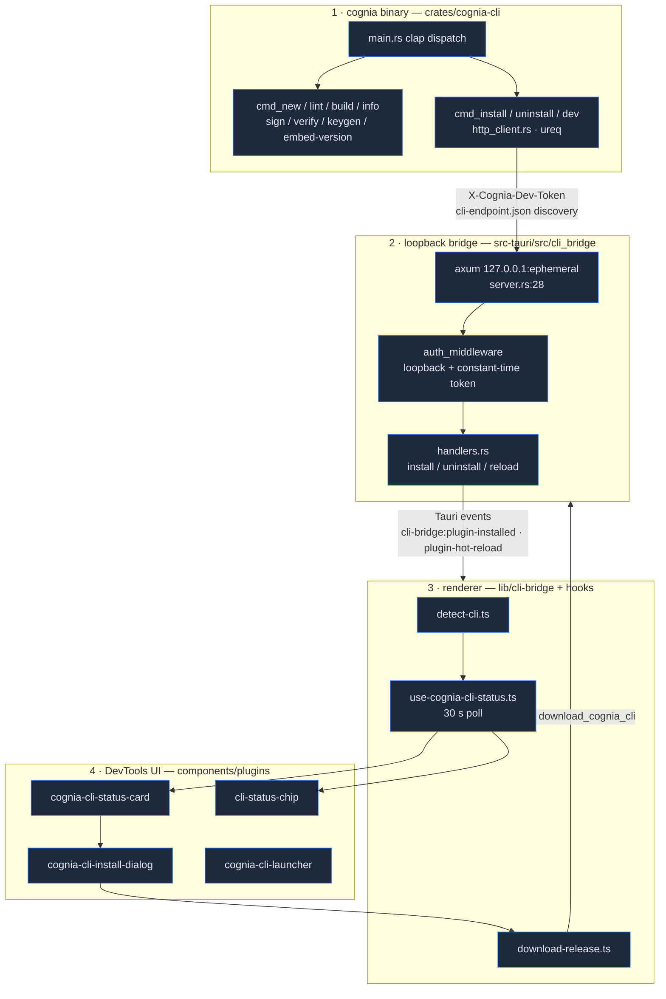
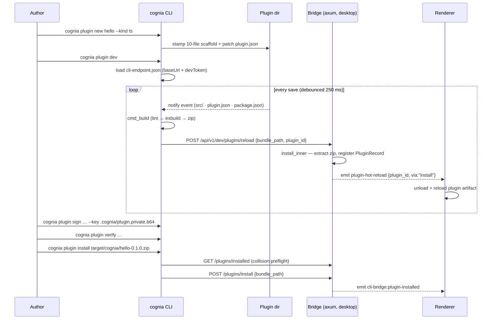

# Cognia CLI

<Status variant="stable">cognia-cli 0.1.0 · 二进制 `cognia` · MSRV 1.82</Status>

<TLDR>
  `cognia` 是一个独立的 Rust crate（`crates/cognia-cli/`，约 4.5k 行 + UI 层），在 `cognia plugin …`
  下提供 **11 个子命令** —— scaffold（`new`）、validate（`lint`，37 条规则）、build（`build` ——
  WASM 走 cargo-component，TypeScript 走 esbuild）、sign（`keygen`/`sign`/`verify`，对原始 bundle
  字节做 Ed25519）、inspect（`info`）以及 live-develop（`dev`，250 ms 去抖的 watch → rebuild →
  hot-reload）。`install`/`uninstall`/`dev` 命令通过一个 **仅 loopback 的 axum bridge**
  （`src-tauri/src/cli_bridge/server.rs:28`）触达运行中的桌面端 —— 该 bridge 绑定到临时的
  `127.0.0.1` 端口，经由 `<config_dir>/cognia/cli-endpoint.json` 发现，并由一个每次启动生成、以
  常量时间比对的 64-hex dev token 门控。渲染端从 Plugin DevTools 完成检测、下载（SHA-256 + 可选的
  Ed25519 验证）和启动 CLI。
</TLDR>

<StatGrid>
  <Stat label="子命令" value="11" hint="PluginCommand enum — crates/cognia-cli/src/main.rs:117-241" />
  <Stat label="Lint 规则" value="37" hint="distinct diagnostic codes — cmd_lint.rs:289-679" />
  <Stat label="权限 / 能力" value="45 / 34" hint="hard-coded whitelists, parity-tested against TS — cmd_lint.rs:26-116" />
  <Stat label="Bridge 路由" value="5" hint="health · installed · install · uninstall · reload — server.rs:55-75" />
  <Stat label="Rust 源码" value="~7.8k 行" hint="crates/cognia-cli/src (23 files) + src-tauri/src/cli_bridge (6 files)" />
  <Stat label="渲染端表面" value="4 + 4" hint="lib/cli-bridge (4 modules) + DevTools status card / install dialog / launcher / status chip" />
</StatGrid>

CLI 的存在是为了让插件作者能在 GUI **之外** 工作：拓印一个起步项目，用文件监听的 dev 循环迭代并对运行中的
cognia 做 hot-reload，最终产出一个已签名、可验证的 `.zip` bundle。它可以独立于应用安装
（`cargo install --locked --path crates/cognia-cli`），并独立于宿主进行版本管理。本节逐模块记录
**当前实现**；面向用户的安装指南见 [CLI Prerequisites](../../dev/cli-prerequisites)。

## 四个层次



## 代码位置

```
crates/cognia-cli/                  # the standalone binary (Cargo.toml: bin name `cognia`)
  src/main.rs                       # clap derive CLI + dispatch_plugin() router
  src/cmd_new.rs · template.rs      # scaffolding (templates embedded via include_str!)
  src/cmd_lint.rs                   # 37-rule manifest linter (largest module, 1 279 lines)
  src/cmd_build.rs · build_ts.rs · packaging.rs   # wasm/frontend builds + zip bundles
  src/cmd_sign.rs · cmd_verify.rs · cmd_keygen.rs · signing.rs   # Ed25519 author signing
  src/cmd_info.rs                   # bundle inspection (manifest, files, signature, api-version)
  src/cmd_install.rs · cmd_uninstall.rs · cmd_dev.rs · http_client.rs   # bridge client
  src/release_key.rs                # embedded release public key (canonical copy)
  src/ui/                           # RuntimeUi, Prompter trait, spinners, palette, color-eyre
  tests/integration.rs              # spawns the compiled binary (10 tests)

crates/cognia-plugin-template/      # WASM scaffold source (include_str! into the binary)
crates/cognia-plugin-template-ts/   # TypeScript scaffold source

src-tauri/src/cli_bridge/           # desktop side
  mod.rs                            # init() / shutdown(), dev-token gen, endpoint-file write
  server.rs                         # axum router + auth middleware + 4 MiB body limit
  handlers.rs                       # install/uninstall/reload + Tauri event emission
  detect.rs · download.rs · release_key.rs   # binary detection + managed download + key mirror

lib/cli-bridge/                     # renderer TS
  detect-cli.ts · status.ts         # invoke detect_binary / cli_bridge_status
  download-release.ts               # invoke download_cognia_cli + progress events
  embedded-pubkey.ts                # release-key TS mirror

hooks/plugins/use-cognia-cli-status.ts   # polling status hook (30 s)
components/plugins/devtools/cognia-cli-{status-card,install-dialog,launcher}.tsx
components/plugins/cli-status-chip.tsx
scripts/release-sync-keys.mjs       # 3-copy release-key sync (--check in CI)
```

## 命令表面

所有命令都嵌套在一个顶层组下：`cognia plugin <cmd>`
（`TopCommand::Plugin` —— `crates/cognia-cli/src/main.rs:108`）。全局 flag 处处生效：
`--color auto|always|never`、`--no-color`、`-q/--quiet`、`-v/--verbose`（最多 `-vv`）、
`-y/--yes`（预确认每个 prompt；CI 必需）—— `main.rs:83-106`。

| 命令 | 作用 | 模块 | 是否与应用通信？ |
| --- | --- | --- | --- |
| `new <name> [--kind wasm\|ts]` | 拓印一个起步项目（TTY 上为交互式 wizard） | `cmd_new.rs` + `template.rs` | 否 |
| `lint [--path .] [--json]` | 37 条规则的 manifest 校验；出错时 exit 1 | `cmd_lint.rs` | 否 |
| `build [--path .] [--out] [--skip-build]` | Lint → 工具链预检 → cargo-component / esbuild → zip | `cmd_build.rs` / `build_ts.rs` | 否 |
| `info <bundle.zip> [--json] [--detailed]` | Manifest、文件表、签名状态、`cognia:api-version` | `cmd_info.rs` | 否 |
| `keygen [--out-dir .cognia]` | Ed25519 密钥对 → `.cognia/plugin.{private,public}.b64` | `cmd_keygen.rs` | 否 |
| `sign <bundle> --key <priv> [--out]` | 对原始 zip 字节签名 → `<bundle>.sig` | `cmd_sign.rs` | 否 |
| `verify <bundle> [--public-key] [--signature] [--json]` | 用 `author.publicKey` 验证 `.sig` | `cmd_verify.rs` | 否 |
| `install <bundle.zip>` | 预检冲突 → POST install | `cmd_install.rs` | **是** |
| `uninstall <id> [--purge-data]` | 确认后移除（purge 会警告：单向 Dexie 抹除） | `cmd_uninstall.rs` | **是** |
| `dev [--path .] [--reload-url URL]` | Watch → 去抖 250 ms → rebuild → POST reload | `cmd_dev.rs` | **是**（无连接时优雅降级） |
| `embed-version <wasm> <ver> [--out]` | 重新注入 `cognia:api-version` 自定义段 | `main.rs:348` + `packaging.rs` | 否 |

## 一次端到端的作者会话



## 一张表看清安全态势

| 关注点 | 机制 | 位置 |
| --- | --- | --- |
| 对 bridge 的远程访问 | 在任何处理之前硬性 `is_loopback(addr)` 拒绝（403 `remote_blocked`） | `src-tauri/src/cli_bridge/server.rs:86`、`mod.rs:183` |
| Token 窃取 / 重放 | 32 个随机字节 → 64-hex `X-Cognia-Dev-Token`，每次启动应用轮换，常量时间比对 | `mod.rs:113`、`server.rs:119` |
| Endpoint 文件暴露 | `cli-endpoint.json` 在 Unix 上以 `0o600` 写入 | `mod.rs:126-147` |
| 超大负载 | 4 MiB `RequestBodyLimitLayer` | `server.rs:26` |
| 安装时的 zip-slip | 解压时拒绝路径穿越条目（已测试） | `handlers.rs:590-616` |
| Bundle 真实性 | 对原始 zip 字节做 Ed25519，作者密钥位于 `plugin.json author.publicKey` | `signing.rs:61-82` |
| CLI 二进制真实性 | 始终 SHA-256；一旦替换占位密钥即进行 Ed25519 release-key 校验 | `download.rs:244-275`、`release_key.rs:25` |

<Callout type="info" title="bridge 不是 companion API">
  CLI bridge（临时 loopback 端口、每次启动的 dev token）是一个独立于移动配对 companion API（端口 7890，
  JWT 鉴权）的监听器。按设计，两者都不为插件 endpoint 提供 LAN/WAN 触达 —— 见
  [Companion API](../companion-api)。
</Callout>

## 阅读顺序

| 页面 | 涵盖内容 |
| --- | --- |
| [CLI core & terminal UI](./cli-core) | clap 结构、`RuntimeUi`、`Prompter` trait、color/TTY 模型、exit code |
| [Scaffolding](./scaffolding) | `new` wizard、内嵌模板、两套 scaffold 树、替换 |
| [Manifest linter](./lint) | 37 条规则目录、白名单、JSON 报告、Rust↔TS parity 测试 |
| [Build pipeline](./build-pipeline) | 类型分发、工具链预检、自定义段内嵌、zip 布局 |
| [Signing & keys](./signing-and-keys) | Ed25519 方案、keygen/sign/verify、`info`、release-key 三副本同步 |
| [Bridge client](./bridge-client) | endpoint 发现、ureq 客户端、install/uninstall 流程、dev watch 循环 |
| [Bridge server](./bridge-server) | axum spawn、auth middleware、5 条路由、Tauri 事件扇出 |
| [Detection & managed install](./detection-and-managed-install) | `detect_binary`、GitHub Releases 下载、校验和 + 签名验证 |
| [DevTools UI](./devtools-ui) | status hook、status card、install dialog、launcher、status chip |
