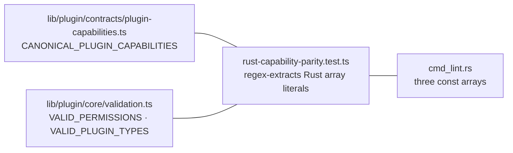

# Manifest linter —— `cognia plugin lint`

<TLDR>
  `cmd_lint.rs`（1 926 行 —— CLI 中最大的模块）针对 `plugin.json` 运行 **60 个独立诊断码**，
  并输出经过样式化的散文或一份 `schemaVersion: 1` 的 JSON 报告。严重度分两级：**errors**
  会让运行失败（`exit 1`，并阻断 `build` —— `cmd_build.rs:44-71`），**warnings**
  则不会。三份白名单硬编码在 Rust 里 —— 45 个权限
  （`cmd_lint.rs:28-92`）、45 个能力（`:100-172`）、5 种插件类型（`:174`）—— 而一个 Jest 测试
  （`lib/plugin/contracts/rust-capability-parity.test.ts`）用正则从 Rust
  源码里提取它们，并断言与 host 规范化的 TS 列表集合相等，于是 CLI 永远不会
  与桌面端实际接受的内容悄然漂移。
</TLDR>

## 调用方式与报告形态

`cognia plugin lint [--path .] [--json]`。manifest 由 `read_plugin_manifest`
（`main.rs:472-488`）定位 —— 根目录下的 `plugin.json`，回退到 `manifest/plugin.json`。

```rust
// crates/cognia-cli/src/cmd_lint.rs:229-277
pub enum Severity { Error, Warning }            // serialized lowercase

pub struct Diagnostic {
    pub severity: Severity,
    pub field: String,        // e.g. "id", "tools[0].name", "wasm.apiVersion"
    pub code: String,         // e.g. "manifest.id.invalid_format"
    pub message: String,
    pub hint: Option<String>, // omitted from JSON when None
}

pub struct LintReport {
    pub schema_version: u32,  // "schemaVersion": 1 — version-pin for consumers
    pub manifest_path: PathBuf,
    pub valid: bool,          // no Error-severity diagnostics
    pub diagnostics: Vec<Diagnostic>,
}
```

`valid` 计算为 `!diagnostics.iter().any(|d| d.severity == Severity::Error)`
（`cmd_lint.rs:277`）。两种消费模式：

- **CLI**（`run`，`cmd_lint.rs:282-303`）：经 `print_human`（`:320-352`）输出人类可读内容 ——
  `[ERROR] field: message`、以 `→ try:` 为前缀的 hint、汇总行 `N error(s), M warning(s)` ——
  若 invalid 则 `exit(1)`。
- **Library**（`validate_at`，`cmd_lint.rs:309-318`）：返回报告；这正是 `build`
  在做任何事之前所调用的。

## 规则目录

所有规则都在一趟 `validate_manifest()`（`cmd_lint.rs:362-767`）中执行，外加针对
`wasm`、`dexie` 与 `cliTools[]` 块的专门子校验器。

### 身份标识与必填字段

| Code | 严重度 | 约束 |
| --- | --- | --- |
| `manifest.invalid_type` | error | 根必须是 JSON 对象（`:362-373`） |
| `manifest.id.missing` / `.invalid_format` | error | 非空；`^[a-z0-9]([a-z0-9-_.]*[a-z0-9])?$`（`:379-389`） |
| `manifest.name.missing` / `.long` | error / warning | 非空；超过 50 字符告警（`:394-402`） |
| `manifest.version.missing` / `.invalid_format` | error | semver `MAJOR.MINOR.PATCH[-prerelease]`（`:407-417`） |
| `manifest.description.missing` / `.long` | error / warning | 非空；超过 500 字符告警（`:422-430`） |
| `manifest.minAppVersion.invalid` | error | 存在时须为 semver（`:744-761`） |

### 类型与入口点

`type` 必须是 `frontend · python · hybrid · wasm · vscode-extension` 之一
（`manifest.type.invalid`，`:435-449`），且每种类型都要求其入口字段（`:571-596`）：

| Type | 必填字段 | 附加 |
| --- | --- | --- |
| `frontend` | `main` | |
| `python` | `pythonMain` | |
| `wasm` | `wasmMain` | 须以 `.wasm` 结尾（`manifest.wasmMain.invalid_extension`，`:581-588`）；`wasm` 块被校验 |
| `vscode-extension` | `vscodeMain` | |

### `wasm` 块（`validate_wasm_block`，`:777-831`）

| Code | 约束 |
| --- | --- |
| `manifest.wasm.required` | wasm 插件必须声明该块，且至少包含 `apiVersion` |
| `manifest.wasm.apiVersion.invalid` | 严格的 `^\d+\.\d+\.\d+$` —— **不含 prerelease**（`is_wasm_api_version`，`:1406`） |
| `manifest.wasm.memoryLimitMb.invalid` | (0, 4096] 范围内的数字 |
| `manifest.wasm.callTimeoutMs.invalid` | (0, 600000] 范围内的数字 |

### 能力 ↔ 贡献对等

除了须在 45 项白名单中（`manifest.capabilities.invalid`，error），linter 还会用 41 项
`CAPABILITY_FIELDS` 映射（`cmd_lint.rs:181-223`）将声明与内容交叉核对 ——
例如 `"a2ui" → ["a2uiComponents", "a2uiTemplates"]`、
`"scheduler" → ["scheduledTasks"]`、`"workflow-trigger" → ["workflows"]`，以及
`"cli-tools" → ["cliTools"]`：

```rust
// cmd_lint.rs:522-537 — declared but empty → warning
for (cap, fields) in CAPABILITY_FIELDS {
    if declared.contains(cap) && !fields.iter().any(|f| is_populated_array(f)) {
        out.push(Diagnostic { severity: Warning, code: "manifest.capability.field_missing", … });
    }
}
```

反向（`manifest.capability.field_undeclared`，`:542-566`）则在某个贡献数组有条目、
但其映射的能力一个都没声明时告警。两个方向都是 warning —— host 仍会加载这类插件，
只是该贡献成了多余负担或被悄然忽略。

### 贡献数组、权限、杂项

| 区域 | Codes | 说明 |
| --- | --- | --- |
| `permissions` | `manifest.permissions.unknown` —— **warning**（`:600-617`） | 未知权限字符串不阻断；host 的授权流程只是从不提供它们 |
| `tools[]` | 每条目须有 `name` / `description`（`:659-686`） | |
| `cliTools[]` | 24 个 `manifest.cliTools.*` 诊断码（`lint_cli_tools`，`:938-1306`） | 要求 `cli:execute`，校验二进制来源、argv token、参数引用、cwd/stdin/env 策略、数字开关、输出解析、成功退出码与 version arg |
| `commands[]` | 须有 `id` / `name`（`:695-718`） | |
| `modes[]` | 须有 `id` / `name` / `icon`（`:723-737`） | |
| `activationEvents` / `activateOnStartup` | 字符串数组 / 布尔值（`:620-654`） | |
| `dexie` 块 | 8 条规则（`validate_dexie_block`，`:838-929`） | `tables` 为非空数组、≤ 20 张表、名称 `^[a-z][a-zA-Z0-9_]{0,30}$`、唯一、每张表带一个非空 `schema` 字符串 |

## 三份白名单与对等契约

```text
VALID_PERMISSIONS   45 entries   cmd_lint.rs:28-92
VALID_CAPABILITIES  45 entries   cmd_lint.rs:100-172
VALID_PLUGIN_TYPES   5 entries   cmd_lint.rs:174
```

权限列表横跨 17 个命名空间 —— `filesystem:* network:* clipboard:* shell process
database:* settings:* session:* agent:* python secrets:* terminal:* (5) git:* goal:*
subscription:read perf:read connectors:* (3) share:* backup:* automation:* (6) companion:* (3)`
外加裸的 `notification`。



`rust-capability-parity.test.ts:26-61` 以文本方式读取 `cmd_lint.rs`，用一个匹配引号字符串的
正则提取每个 `const NAME = [...]`，并断言其与 TS 规范化列表 **集合相等**。
在任一侧添加一个权限而不同步另一侧，`pnpm test` 就会失败 —— 这是唯一让一份位于
独立 crate 里的朴素字符串列表保持诚实的东西。

<Callout type="info" title="为什么未知权限只告警、而未知能力却报错？">
  一个能力标签会改变 host 接线插件的方式（registries、loaders、slots）—— 未知的能力
  意味着该 manifest 面向一个更新的 host，因此这是硬错误。而未知的权限只是从不可授予；
  插件去掉那个 API 后仍能运作，所以 linter 只是标记它而不阻断。
</Callout>

## 实例演练

```json
{
  "schemaVersion": 1,
  "manifest_path": "/work/my-plugin/plugin.json",
  "valid": false,
  "diagnostics": [
    { "severity": "error", "field": "id", "code": "manifest.id.missing",
      "message": "Missing or invalid \"id\" field" },
    { "severity": "warning", "field": "capabilities", "code": "manifest.capability.field_missing",
      "message": "Capability \"tools\" is declared but its contribution field(s) \"tools\" are empty.",
      "hint": "Add the contribution entries, or drop the capability tag." }
  ]
}
```

43 个在文件内的单元测试（`cmd_lint.rs:1510-1914`）钉住最小可用 manifest、每条格式规则、
两个对等方向、`cliTools[]`、dexie 约束以及 JSON 序列化。
