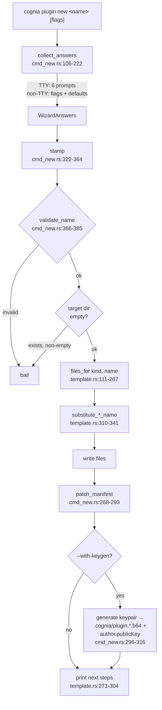

# 脚手架 —— `cognia plugin new`

<TLDR>
  `cmd_new::run()`（`crates/cognia-cli/src/cmd_new.rs:43-103`）收集答案（TTY 上走交互式
  向导，否则用 flags + 默认值），**stamp** 一个内嵌模板
  （`template.rs:111-267` —— 每个文件都通过 `include_str!` 从五个同级模板源码目录打包进二进制），
  把向导答案 **patch** 进生成的 `plugin.json`（`cmd_new.rs:268-293`），并可选地
  **内嵌一把全新的 Ed25519 公钥**（`cmd_new.rs:296-316`）。替换就是每个文件两次普通的
  `String::replace` —— 模板 id 与其人类化标题。
  目标目录若非空则被拒绝。
</TLDR>

## 流程



## 输入与默认值

| 输入 | Flag | TTY 向导 | 非 TTY 默认值 |
| --- | --- | --- | --- |
| name | 位置参数 | 提示（若 CWD basename 合法则作为建议） | **必填** —— 带提示退出（`cmd_new.rs:123`） |
| kind | `--kind wasm\|ts\|python\|hybrid\|vscode-extension`（接受 `vscode` 别名） | 选择，0 = wasm | `wasm`（`cmd_new.rs:134`） |
| dir | `--dir <path>` | — | `./<name>`（`cmd_new.rs:324`） |
| description | `--description` | 带建议的提示 | `"A cognia {kind} plugin"`（`cmd_new.rs:165`） |
| author | `--author` | 以 `git config user.name` 为默认（`cmd_new.rs:177-188`） | `"Anonymous"` |
| author email | `--author-email` | 可选提示 | `None` |
| keygen | `--with-keygen true\|false` | 确认，默认 **true** | `false`（`cmd_new.rs:208`） |

`TemplateKind::parse`（`template.rs:23-34`）也接受 `typescript` / `frontend` 作为
`ts` 的别名，接受 `py` 作为 `python` 的别名，并接受 `vscode` / `vs-code` 作为
`vscode-extension` 的别名。

### 名称校验

`validate_name`（`cmd_new.rs:366-385`）：≤ 64 字符，以小写 ASCII 字母或数字开头和结尾，
中间允许小写字母数字加 `-`、`_`、`.`。具体失败信息：

```text
plugin name is empty                                       (cmd_new.rs:368)
plugin name must be ≤ 64 characters                        (cmd_new.rs:371)
plugin name must be lowercase alphanumeric plus -_. (got `…`)  (cmd_new.rs:382)
```

`"0plugin"` 与 `"foo.bar_1"` 通过；`"has space"`、`"!banged"`、`"Uppercase"` 与
`"trailing-"` 失败（单元测试位于
`cmd_new.rs:393-404`）。

## 模板是同级源码目录，于编译期内嵌

模板源码以同级目录形式存在 —— `crates/cognia-plugin-template/`（WASM）、
`crates/cognia-plugin-template-ts/`（TypeScript）、`crates/cognia-plugin-template-python/`、
`crates/cognia-plugin-template-hybrid/` 与
`crates/cognia-plugin-template-vscode-extension/` —— 并通过 `include_str!`
（`template.rs:38-104`）拉进二进制。CLI 不附带任何模板目录；脚手架可离线工作。

替换刻意做得很笨（`template.rs:310-341`）：

```rust
fn substitute_wasm_name(content: &str, target_name: &str) -> String {
    content
        .replace("cognia-plugin-template", target_name)
        .replace("Cognia Plugin Template", &humanize(target_name))
}
// humanize: "my-cool-plugin" → "My Cool Plugin" (split -_ → Title Case)
```

Description / author / publicKey **不是** 模板占位符 —— 它们随后由 `patch_manifest`
（`cmd_new.rs:268-293`）补进生成的 `plugin.json`，该函数会重新读取、改写并美化打印 JSON。

## 每种 kind 生成什么

| Kind | 文件 |
| --- | --- |
| WASM（6 个文件 —— `template.rs:113-137`） | `Cargo.toml`、`src/lib.rs`、`wit/world.wit`、`plugin.json`、`README.md`、`.gitignore` |
| TypeScript（10 个文件 —— `template.rs:139-186`） | `package.json`、`tsconfig.json`、`jest.config.cjs`、`src/index.ts`、`src/index.test.ts`、shims、`plugin.json`、`README.md`、`.gitignore` |
| Python（4 个文件 —— `template.rs:188-204`） | `plugin.json`、`main.py`、`README.md`、`.gitignore` |
| Hybrid（6 个文件 —— `template.rs:206-230`） | `plugin.json`、`frontend/index.js`、`backend/main.py`、`styles.css`、`README.md`、`.gitignore` |
| VS Code extension（6 个文件 —— `template.rs:232-267`） | `plugin.json`、`package.json`、`extension/out/extension.js`、`styles.css`、`README.md`、`.gitignore` |

### WASM 脚手架要点

manifest 钉住 host 路由所依据的契约：

```json
{
  "type": "wasm",
  "wasmMain": "cognia_plugin_template.wasm",
  "wasm": { "apiVersion": "0.1.0", "memoryLimitMb": 16, "callTimeoutMs": 5000 },
  "permissions": ["notification"],
  "engines": { "cognia": ">=0.4.0" }
}
```

`src/lib.rs` 实现了来自 WIT world 的完整 `Guest` trait —— `init`、`on_event`、
`tool_execute`、`workflow_node_execute` —— 每个都通过 host 的 `logger` import 记录日志，
并把 payload 回显回去，因此一个全新的脚手架端到端可观测。`Cargo.toml` 携带
`[package.metadata.component]` 块（`package = "cognia:plugin"`、`world = "cognia-plugin"`）以及
一份按体积调优的 release profile（`opt-level = "s"`、`lto = true`、`codegen-units = 1`）。

### TypeScript 脚手架要点

`plugin.json` 声明 `type: "frontend"`、`capabilities: ["tools", "commands"]`、
`main: "dist/index.js"`、`engines.cognia: ">=0.1.0"`，外加一个已注册工具
（`template_echo`）和一个斜杠命令（`template-greet`）。`src/index.ts` 导出一个
`PluginDefinition`，其 `activate` 同时注册两者 —— 恰好是 manifest 所声明的两类贡献，
因此 `lint` 的能力对等检查开箱即过。

`package.json` 中的 build 脚本镜像了 `cognia plugin build` 所运行的内容：

```json
"build": "esbuild src/index.ts --bundle --format=cjs --platform=neutral --target=es2022
          --outfile=dist/index.js --external:@/types/plugin --external:@/lib/*"
```

Host 模块（`@/types/plugin`、`@/lib/chat/slash-command-registry`）在 `tsconfig.json` 的
`paths` 与 `jest.config.cjs` 的 `moduleNameMapper` 中都被映射到本地
`src/__shims__/` 副本，因此脚手架能通过类型检查、其 jest 测试也能在插件真正遇到运行中的
cognia 之前就通过。

### Python 脚手架要点

`plugin.json` 声明 `type: "python"`、`capabilities: ["tools", "python"]`、
`pythonMain: "main.py"`、`engines.cognia: ">=0.1.0"`，外加一个已注册工具
（`template_echo`）。`main.py` 通过 `from cognia import tool, log` 引入 Python SDK 表面，
装饰 `template_echo`，记录收到的文本，并返回 `{"ok": True, "echoed": text}`。

Python 脚手架没有构建步骤。`cognia plugin build` 会直接打包声明的 `pythonMain` 以及
任何 `bundle_include[]` 文件；`cognia plugin lint` 会在打包前校验 manifest 类型与入口文件一致。

### Hybrid 脚手架要点

`plugin.json` 声明 `type: "hybrid"`、`capabilities: ["tools", "python"]`、
`main: "frontend/index.js"`、`pythonMain: "backend/main.py"` 与 `styles: "styles.css"`。
前端入口是普通 CommonJS，可用 `node --check` 做语法检查，不需要 npm install 也能被 host 加载。
Python 后端注册 `template_echo`，因此新脚手架能覆盖 hybrid loader 的两半，同时保持 build-free。

### VS Code-extension 脚手架要点

`plugin.json` 声明 `type: "vscode-extension"`、`vscodeMain:
"extension/out/extension.js"`、可选 `styles`，以及 `bundle_include: ["package.json"]`。
入口导出 CommonJS `activate` / `deactivate`，并通过 `require("vscode")` 注册一个 VS Code 命令，
匹配 sidecar 的 extension-runner 契约。

## stamp 后的输出

打印的后续步骤（`template.rs:271-304`）：

```text
# wasm                                   # ts                                      # python
cd <dir>                                 cd <dir>                                  cd <dir>
rustup target add wasm32-wasip2          pnpm install                              python -m py_compile main.py
cargo install --locked cargo-component   pnpm test                                 cognia plugin lint
cognia plugin build                      cognia plugin lint                        cognia plugin build
                                         cognia plugin build

# hybrid                                 # vscode-extension
cd <dir>                                 cd <dir>
node --check frontend/index.js           node --check extension/out/extension.js
python -m py_compile backend/main.py     cognia plugin lint
cognia plugin lint                       cognia plugin build
cognia plugin build
```

带上 `--with-keygen` 时，密钥块（`cmd_new.rs:78-98`）会确认
`✓ embedded author.publicKey (…)` 并指向 `.cognia/plugin.private.b64` —— 与
[`keygen`](./signing-and-keys) 会创建的是同一批文件。

<Callout type="warn" title="已存在的目录绝不会被合并">
  `stamp()` 会以 `"<path> already exists and is not empty"`（`cmd_new.rs:331`）退出。没有
  --force；请另选一个新目录，或先清空目标目录。
</Callout>
