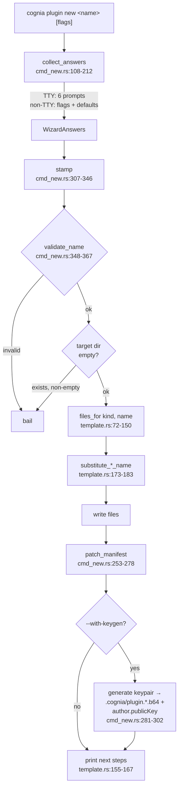

# 脚手架 —— `cognia plugin new`

<TLDR>
  `cmd_new::run()`（`crates/cognia-cli/src/cmd_new.rs:40-104`）收集答案（TTY 上走交互式
  向导，否则用 flags + 默认值），**stamp** 一个内嵌模板
  （`template.rs:72-150` —— 每个文件都通过 `include_str!` 从
  `crates/cognia-plugin-template{,-ts}/` 打包进二进制），把向导答案 **patch** 进生成的
  `plugin.json`（`cmd_new.rs:253-278`），并可选地 **内嵌一把全新的 Ed25519 公钥**
  （`cmd_new.rs:281-302`）。替换就是每个文件两次普通的 `String::replace` —— 模板 id 与其人类化标题。
  目标目录若非空则被拒绝。
</TLDR>

## 流程



## 输入与默认值

| 输入 | Flag | TTY 向导 | 非 TTY 默认值 |
| --- | --- | --- | --- |
| name | 位置参数 | 提示（若 CWD basename 合法则作为建议） | **必填** —— 带提示退出（`cmd_new.rs:123`） |
| kind | `--kind wasm\|ts` | 选择，0 = wasm | `wasm`（`cmd_new.rs:136`） |
| dir | `--dir <path>` | — | `./<name>`（`cmd_new.rs:309`） |
| description | `--description` | 带建议的提示 | `"A cognia {kind} plugin"`（`cmd_new.rs:153`） |
| author | `--author` | 以 `git config user.name` 为默认（`cmd_new.rs:165-177`） | `"Anonymous"` |
| author email | `--author-email` | 可选提示 | `None` |
| keygen | `--with-keygen true\|false` | 确认，默认 **true** | `false`（`cmd_new.rs:192`） |

`TemplateKind::parse`（`template.rs:19-25`）也接受 `typescript` / `frontend` 作为
`ts` 的别名。

### 名称校验

`validate_name`（`cmd_new.rs:348-367`）：≤ 64 字符，ASCII 字母数字开头，其后为字母数字
加 `-`、`_`、`.`。具体失败信息：

```text
plugin name is empty                                       (cmd_new.rs:350)
plugin name must be ≤ 64 characters                        (cmd_new.rs:353)
plugin name must be lowercase alphanumeric plus -_. (got `…`)  (cmd_new.rs:364)
```

`"0plugin"` 与 `"foo.bar_1"` 通过；`"has space"` 与 `"!banged"` 失败（单元测试位于
`cmd_new.rs:375-386`）。

## 模板是真实 crate，于编译期内嵌

模板源码以两个 **可构建的同级 crate** 形式存在 —— `crates/cognia-plugin-template/`
（WASM）与 `crates/cognia-plugin-template-ts/` —— 并通过
`include_str!`（`template.rs:28-60`）拉进二进制。CLI 不附带任何模板目录；脚手架可离线工作。

替换刻意做得很笨（`template.rs:173-197`）：

```rust
fn substitute_wasm_name(content: &str, target_name: &str) -> String {
    content
        .replace("cognia-plugin-template", target_name)
        .replace("Cognia Plugin Template", &humanize(target_name))
}
// humanize: "my-cool-plugin" → "My Cool Plugin" (split -_ → Title Case)
```

Description / author / publicKey **不是** 模板占位符 —— 它们随后由 `patch_manifest`
（`cmd_new.rs:253-278`）补进生成的 `plugin.json`，该函数会重新读取、改写并美化打印 JSON。

## 每种 kind 生成什么

| WASM（6 个文件 —— `template.rs:74-99`） | TypeScript（10 个文件 —— `template.rs:100-148`） |
| --- | --- |
| `Cargo.toml`（替换） | `package.json`（替换） |
| `src/lib.rs`（替换） | `tsconfig.json` · `jest.config.cjs` |
| `wit/world.wit` | `src/index.ts` · `src/index.test.ts`（替换） |
| `plugin.json`（替换） | `src/__shims__/types/plugin.ts` |
| `README.md` · `.gitignore` | `src/__shims__/lib/chat/slash-command-registry.ts` |
| | `plugin.json`（替换）· `README.md` · `.gitignore` |

### WASM 脚手架要点

manifest 钉住 host 路由所依据的契约：

```json
{
  "type": "wasm",
  "wasmMain": "cognia_plugin_template.wasm",
  "wasm": { "apiVersion": "0.1.0", "memoryLimitMb": 16, "callTimeoutMs": 5000 },
  "permissions": ["notification"],
  "engines": { "cognia": ">=0.4.0" }
}
```

`src/lib.rs` 实现了来自 WIT world 的完整 `Guest` trait —— `init`、`on_event`、
`tool_execute`、`workflow_node_execute` —— 每个都通过 host 的 `logger` import 记录日志，
并把 payload 回显回去，因此一个全新的脚手架端到端可观测。`Cargo.toml` 携带
`[package.metadata.component]` 块（`package = "cognia:plugin"`、`world = "cognia-plugin"`）以及
一份按体积调优的 release profile（`opt-level = "s"`、`lto = true`、`codegen-units = 1`）。

### TypeScript 脚手架要点

`plugin.json` 声明 `type: "frontend"`、`capabilities: ["tools", "commands"]`、
`main: "dist/index.js"`、`engines.cognia: ">=0.1.0"`，外加一个已注册工具
（`template_echo`）和一个斜杠命令（`template-greet`）。`src/index.ts` 导出一个
`PluginDefinition`，其 `activate` 同时注册两者 —— 恰好是 manifest 所声明的两类贡献，
因此 `lint` 的能力对等检查开箱即过。

`package.json` 中的 build 脚本镜像了 `cognia plugin build` 所运行的内容：

```json
"build": "esbuild src/index.ts --bundle --format=cjs --platform=neutral --target=es2022
          --outfile=dist/index.js --external:@/types/plugin --external:@/lib/*"
```

Host 模块（`@/types/plugin`、`@/lib/chat/slash-command-registry`）在 `tsconfig.json` 的
`paths` 与 `jest.config.cjs` 的 `moduleNameMapper` 中都被映射到本地
`src/__shims__/` 副本，因此脚手架能通过类型检查、其 jest 测试也能在插件真正遇到运行中的
cognia 之前就通过。

## stamp 后的输出

打印的后续步骤（`template.rs:155-167`）：

```text
# wasm                                   # ts
cd <dir>                                 cd <dir>
rustup target add wasm32-wasip2          pnpm install
cargo install --locked cargo-component   pnpm test
cognia plugin build                      cognia plugin lint
                                         cognia plugin build
```

带上 `--with-keygen` 时，密钥块（`cmd_new.rs:85-100`）会确认
`✓ embedded author.publicKey (…)` 并指向 `.cognia/plugin.private.b64` —— 与
[`keygen`](./signing-and-keys) 会创建的是同一批文件。

<Callout type="warn" title="已存在的目录绝不会被合并">
  `stamp()` 会以 `"<path> already exists and is not empty"`（`cmd_new.rs:316`）退出。没有
  --force；请另选一个新目录，或先清空目标目录。
</Callout>
