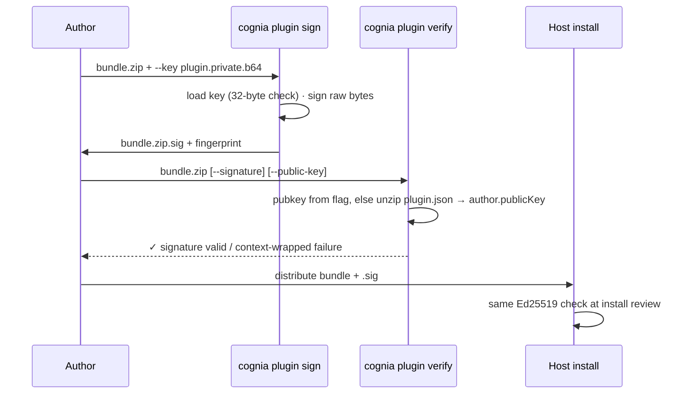
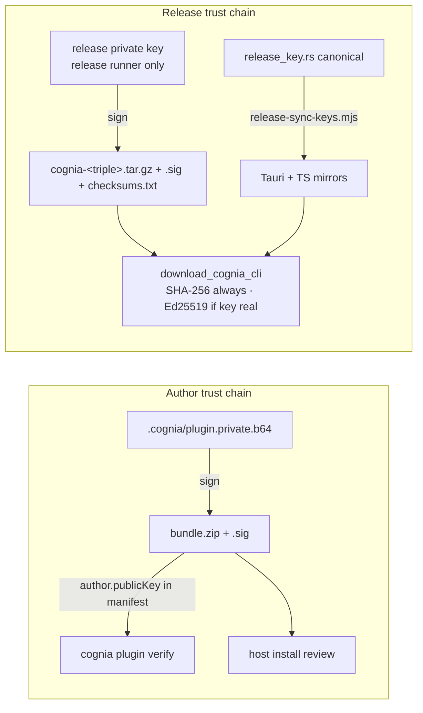

# 签名与密钥

<TLDR>
  两条独立的信任链共用同一个原语。**作者密钥**（每插件一份，由 `keygen` 生成到
  `.cognia/plugin.{private,public}.b64`）用 `ed25519-dalek` 对**原始 bundle zip 字节**
  签名（`signing.rs:61-63`）；分离的 base64 签名存放在 `<bundle>.zip.sig`，并对照
  `plugin.json author.publicKey` 验证。**release key**
  （`RELEASE_PUBLIC_KEY_BASE64`，权威源在 `crates/cognia-cli/src/release_key.rs:25`，当前
  是一个全零占位符）对 CLI release tarball 签名，并由 `scripts/release-sync-keys.mjs`
  镜像到 Tauri 下载器和一个 TS 模块（CI 运行 `--check`）。各处的身份标识都是
  原始 32 字节公钥的 SHA-256 十六进制 fingerprint（`signing.rs:55-59`）。
</TLDR>

## 原语

| 属性 | 取值 |
| --- | --- |
| 算法 | Ed25519（`ed25519-dalek` 2） |
| 密钥编码 | 原始 32 字节 → 标准 base64（44 字符） |
| 签名载荷 | **整个 zip 文件字节** —— 没有摘要间接层，与 host 的 `plugin_verify_detached_signature_command` 一致（`signing.rs:3-6`） |
| 签名文件 | `<bundle>.zip.sig`，64 字节签名的 base64 文本 |
| Fingerprint | `hex(sha256(pubkey_bytes))` —— 64 个小写十六进制字符（`signing.rs:55-59`） |

```rust
// crates/cognia-cli/src/signing.rs:61-63
pub fn sign_bundle(signing_key: &SigningKey, bundle: &[u8]) -> String {
    let sig: Signature = signing_key.sign(bundle);
    b64_encode(&sig.to_bytes())
}
```

`verify_bundle`（`signing.rs:66-82`）对两侧都做严格长度检查解码 —— `public key
must be 32 bytes (got N)`、`signature must be 64 bytes (got N)` —— 并把 dalek 的失败映射为
`signature verification failed: …`。

## keygen

`cognia plugin keygen [--out-dir .cognia]`（`cmd_keygen.rs`）：

- 写入 `plugin.private.b64` 和 `plugin.public.b64`（`cmd_keygen.rs:19-20`）；两个文件都会
  经过 `confirm_overwrite`（默认为 **No**，用 `--yes` 强制 —— `:24-37`）
- 打印 fingerprint、一段可直接复制粘贴进 `plugin.json` 的 `"author"` 块、确切的 `sign`
  命令，以及警告 `⚠ keep <path> safe — anyone with that file can sign as you.`
  （`:47-74`）
- 不设置任何特殊文件权限 —— 私钥的安全依赖于目录属于你自己
  （`.cognia/` 已在脚手架的 `.gitignore` 中）

`new --with-keygen` 产出相同的文件，并自动嵌入 `author.publicKey`
（`cmd_new.rs:281-302`）。

## sign / verify



`sign`（`cmd_sign.rs:17-59`）默认把输出定为 `<bundle>.sig`，会为自定义 `--out`
创建父目录，并对覆盖加门控。`verify`（`cmd_verify.rs`）按优先级顺序解析公钥
—— 显式的 `--public-key`，否则从 bundle 自己的 `plugin.json` 提取
（`extract_public_key_from_bundle`，`cmd_verify.rs:111-127`；空/缺失 →
`plugin.json has no author.publicKey; pass --public-key explicitly`）。失败会附带
补救提示 `re-sign the bundle with the matching private key, or pass --public-key
explicitly`。`--json` 输出 `{schemaVersion: 1, ok, bundle, signature, publicKey, fingerprint,
error?}`（`cmd_verify.rs:97-109`）。

<Callout type="warn" title="verify 默认信任 bundle 自带的密钥">
  在没有 `--public-key` 的情况下，验证证明的是*内部一致性* —— 即这个 bundle 是由
  掌握其内嵌密钥的人签署的 —— 而非由某个特定方所撰写。当来源出处至关重要时，请
  钉死预期的密钥（或带外比对 fingerprint）。
</Callout>

## info —— bundle 检视

`cognia plugin info <bundle.zip> [--json] [--detailed]`（`cmd_info.rs`，669 行）报告：

- manifest 摘要 —— id、name、version、type、description、capabilities、permissions
  （`cmd_info.rs:341-376`）
- 大小 + 排序后的文件表（zip 条目，跳过目录条目 —— `:163-178`）
- 内嵌的 `cognia:api-version` —— 通过一个容错的自定义段遍历从 `wasmMain` 条目读取，
  遇到损坏时返回 `None` 而非报错（`:251-296`）
- 签名状态，一个四态枚举（`cmd_info.rs:67-76`，决策逻辑 `:196-239`）：

| 状态 | 含义 |
| --- | --- |
| `no-sidecar` | 文件旁没有 `<bundle>.sig` |
| `no-public-key` | `.sig` 存在但 manifest 没有 `author.publicKey` |
| `valid` | Ed25519 验证通过 —— 连同公钥 + fingerprint 一并报告 |
| `invalid` | 验证失败 —— 包含原因字符串 |

`--json` 把全部内容镜像到 `{schemaVersion: 1, path, sizeBytes, manifest, files[],
signature{status, publicKey?, fingerprint?, reason?}, wasmApiVersion?}`（`cmd_info.rs:78-141`）。

## release key —— 三份副本，一个源

作者密钥认证的是*插件*；当桌面应用从 GitHub Releases 下载 CLI 二进制时，**release key**
认证的是 *CLI 二进制本身*
（[检测与托管安装](./detection-and-managed-install)）。

| 副本 | 文件 | 消费者 |
| --- | --- | --- |
| 权威源 | `crates/cognia-cli/src/release_key.rs:25` | CLI（未来的自更新表面） |
| Rust 镜像 | `src-tauri/src/cli_bridge/release_key.rs:11` | `download.rs` Ed25519 检查（`download.rs:256-275`） |
| TS 镜像 | `lib/cli-bridge/embedded-pubkey.ts:13` | 渲染端展示 / `isPlaceholderReleaseKey()` |

这三份当前都持有全零占位符
`"AAAAAAAAAAAAAAAAAAAAAAAAAAAAAAAAAAAAAAAAAAA="`；`is_placeholder_key()`
（`release_key.rs:27-30`）让下载器**跳过 Ed25519（并记录一条警告），但仍然
强制执行 SHA-256**。发布一个真实密钥即可把验证翻转为强制，无需改动任何代码。

`scripts/release-sync-keys.mjs` 让镜像保持诚实：它用正则从权威文件中提取该常量
（`release-sync-keys.mjs:31-39`），重写两个镜像（`:41-62`），并在
`--check` 模式下（`:68-75`）在出现漂移时以非零退出 —— 即 CI 守卫。release 私钥从不
进入仓库；它只存在于 release runner 上。


