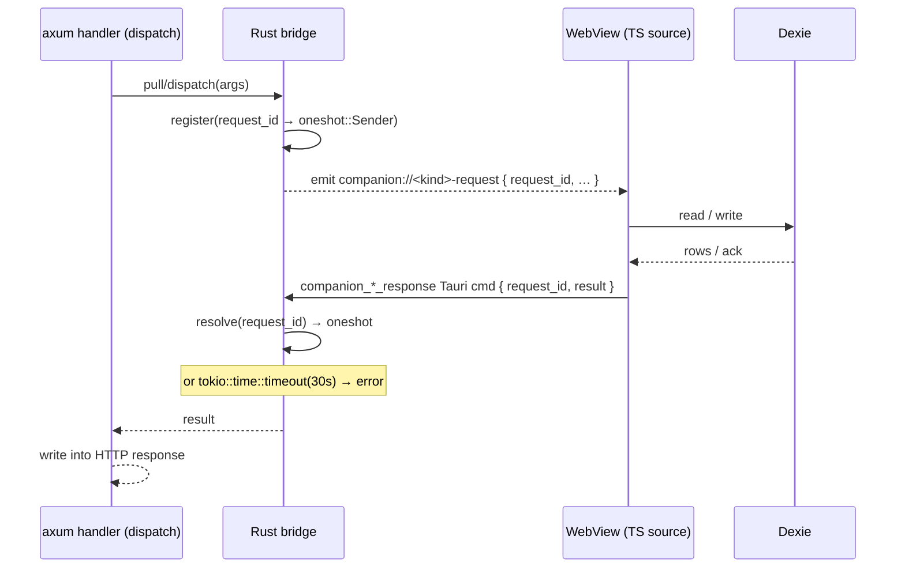

# 数据平面与 WebView Bridge

<Status variant="beta" />

<TLDR>
  Companion API handler 运行在 Rust 中，但手机所需的数据——角色、消息、会话、设置——存储在
  **WebView** 的 IndexedDB（Dexie）中，Rust 无法直接读取。三条 bridge 以相同的模式弥合这一差距：
  Rust 发出携带 `request_id` 的 `companion://<kind>-request` Tauri 事件，以该 id 为键注册
  `oneshot::Sender`，并等待最多 **30 秒**；TS 监听器处理请求后通过 `companion_*_response`
  Tauri 命令将结果回传；Rust 解析 oneshot 并将结果写入 HTTP 响应。Headless 模式下，同一 bridge
  协议通过 `/internal/bridge` 连接 Node Brain；直连 SQLite `AppStore` 只在 Brain 未连接时提供受限
  降级能力。
</TLDR>

<StatGrid>
  <Stat label="Bridge 数量" value="3" hint="sync · messages · writes" />
  <Stat label="Bridge 超时" value="30 s" hint="足以唤醒休眠中的桌面端" />
  <Stat label="Sync 表数量" value="22" hint="sync_registry allowlist" />
  <Stat label="写入命令数" value="~40" hint="统一走一条 writes bridge" />
</StatGrid>

## Bridge 模式

三条 bridge 共用同一套请求/响应流程。尽管数据存在于 TS 侧，Rust 仍是发起方——因为调用来自
Rust 持有的 HTTP 请求。



### 三条 bridge

| Bridge | 请求事件 | 响应命令 | 超时 | 使用方 |
| --- | --- | --- | --- | --- |
| `sync_bridge.rs` | `companion://sync-pull-request` (`:34`) | `companion_sync_pull_response` (`commands.rs:164`) | 30 s (`:35`) | `sync_pull` |
| `desktop_messages_bridge.rs` | 9 个消息/会话/transcript 事件 | `companion_message_response` | 30 s | 消息 CRUD、会话列表、transcript capability/timeline/detail/media 读取 |
| `desktop_writes_bridge.rs` | 统一的 `companion://desktop-write-request` `{ request_id, command, payload }` (`:35`) | `companion_desktop_write_response` (`commands.rs:231`) | 30 s (`:36`) | 全部约 40 条 Wave-2/4 变更命令 |

messages bridge 扇出九个不同的事件名，但共用同一个请求 registry 与响应 resolver。writes
bridge 则采取相反策略：通过
`dispatch()` (`:68`) 发送**单一**事件，并在其 payload 中携带命令名——这正是 RPC manifest
能将 40 条写入命令折叠为一条 OR 模式匹配分支的原因（`rpc.rs:1072`）。

## TS bridge 源文件

WebView 侧的实现位于 `lib/companion/`。每个 `install*` 函数在启动时订阅并响应对应事件：

| 文件 | 职责 | 入口 |
| --- | --- | --- |
| `desktop-message-source.ts` | 通过 `messageRepository` 从 Dexie 响应 5 条消息/会话事件 | `installDesktopMessageSource()` (`:91`)；`readSessionPage` (`:234`)，`readMessagesPage` (`:277`)，`persistIncomingMessage` (`:307`) |
| `desktop-write-source.ts` | `switch (command)` 覆盖约 40 条写入命令，通过 writes 响应命令回传结果 | `installDesktopWriteSource()` (`:88`)；内部 `dispatchCommand()` (`:129`) |
| `event-bridge.ts` | 订阅 `device-paired` / `device-seen` 并写入 `pairedDevices` Dexie 行 | `installCompanionEventBridge()` (`:59`) |
| `remote-attach-registry.ts` | 已附加远程 watcher 的内存映射 + 每会话审批兜底 | `attachSession` (`:37`)，`armApprovalBackstop` (`:82`)；`DEFAULT_APPROVAL_BACKSTOP_MS = 120_000` (`:34`) |
| `needs-input-notifier.ts` | 发出 `companion://needs-input`，由 Rust 扇出推送通知 | `notifyRemoteNeedsInput()` (`:28`) |

## Sync 表 allowlist

`sync_pull` 是批量读取路径——手机在启动时及收到失效通知时拉取表增量。允许拉取哪些表本身由
allowlist `SyncTableRegistry`（`sync_registry.rs:34`）控制，初始值由 `with_defaults()`
(`:45`) 填充。默认 **22** 张表：

```text
characters · skills · sessions · messages · workflows · workflowRuns · executionRuns
twinProfile · plugins · adapterInstances · settings · conversationOverrides · goals · memories
mcpServers · terminalHistory · agentTeamBoard · agentTasks · agentTaskAttempts
templateDefinitions · templatePackages · templateInstances
```

`contains()`（`sync_registry.rs:58`）在 `rpc.rs:993` 处对 `sync_pull` 进行门控；不在
allowlist 中的表名会被拒绝，而非静默返回空结果。客户端的 sync handler（[同步与离线](../../ui/mobile-architecture/sync-offline)）
与之镜像——每张允许的表对应一个 handler。

## 无头 DataPlane

Companion API 代码被无头的 `cognia-server` 二进制复用，后者**没有 WebView**。`DataPlane`
同时抽象 bridge transport 与降级存储：

```rust title="src-tauri/src/companion_api/data_plane.rs"
enum DataPlane {
    Bridge { bridge, transport },       // socket Brain 或 desktop WebView
    Direct(Arc<dyn AppStore>),          // 降级 SQLite fallback
}
```

`pick()` 严格按以下顺序选择：已连接的 socket Brain、desktop WebView、最后才是进程全局
`HEADLESS_STORE`。这就是 ADR-0059 D3 的实际实现：Brain Dexie 保持权威；SQLite 仅在 Brain
启动或重启时提供受限降级面，不能遮蔽已经在线的 Brain。桌面端存在 WebView 时仍优先走原有
transport，因此行为不变。

## 为何是 30 秒

bridge 超时（`tokio::time::timeout`，例如 `sync_bridge.rs:98`）故意设置得较为宽裕。当手机
请求到达时，桌面 WebView 可能处于后台或机器已休眠；30 秒足以让操作系统唤醒进程并完成一次
Dexie 扫描，同时也为卡住的请求设定了上限，使 HTTP handler 不会永久挂起。超时会以
`service_unavailable` 类错误返回给手机端，手机随后重试。

## 相关页面

<Cards>
  <Card title="RPC 命令 manifest" href="./rpc-manifest" description="驱动这些 bridge 的命令，以及将所有写入路由到同一条 bridge 的 OR 模式匹配分支。" />
  <Card title="移动端：同步与离线" href="../../ui/mobile-architecture/sync-offline" description="消费 sync_pull 的客户端每表 sync handler 与 cursor store。" />
  <Card title="事件、WebSocket 与推送" href="./events-ws-push" description="needs-input-notifier 触发的推送路径。" />
</Cards>
