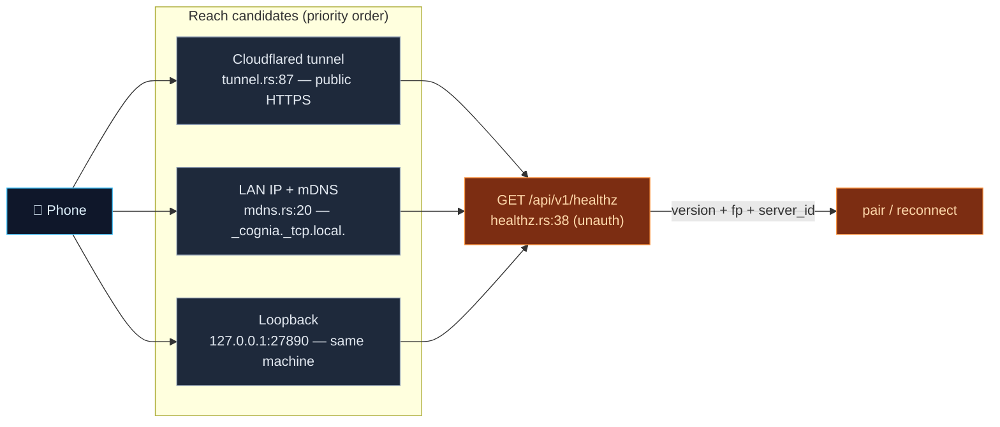

# 发现、Tunnel 与 TLS

<Status variant="beta" />

<TLDR>
  手机在能够配对之前，需要一个 `baseUrl` 和一个 TLS fingerprint。三个 Rust 模块负责提供这些信息：
  `mdns.rs` 通过 TXT 记录广播 `_cognia._tcp.local.`（包含版本号与 fingerprint），使同一局域网内的手机可以自动发现桌面端；`healthz.rs` 提供一个**未鉴权**的
  `GET /api/v1/healthz` 接口，返回版本号、fingerprint 与稳定的 `server_id`，供扫描中的手机确认"这是一台 Cognia 服务器"并固定 TLS；`tunnel.rs` 则在局域网不可达时，通过启动 cloudflared 子进程（快速模式或命名模式）为桌面端提供一个公网 HTTPS URL。将一切串联起来的 fingerprint，是那张 10 年有效期的 self-signed 证书公钥的 SHA-256 值。
</TLDR>

<StatGrid>
  <Stat label="mDNS 服务" value="_cognia._tcp.local." hint="mdns.rs:20" />
  <Stat label="发现路由" value="GET /api/v1/healthz" hint="未鉴权 — healthz.rs:38" />
  <Stat label="Tunnel" value="cloudflared" hint="快速模式 + 命名模式 — tunnel.rs" />
  <Stat label="server_id" value="SHA-256(secret)[..16]" hint="healthz.rs:54" />
</StatGrid>

## 连接可达性问题

同一套 `baseUrl` 解析逻辑同时服务于配对和重连两个场景。桌面端有三种可达路径，按优先级排列 —— `companion_issue_pair_jwt`（`commands.rs:510-520`）在生成 QR 码时会将该优先级固化其中：**tunnel > 命名 tunnel > 局域网 IP > 回环地址**。

## healthz —— 发现握手

`healthz_handler`（`healthz.rs:38`）是 Companion API 上**唯一**未鉴权的路由。其存在的目的是：让扫描局域网的手机在发送任何凭证之前，先确认候选 IP 是否为 Cognia 服务器；同时也让已配对的手机能以较低代价探测连接可达性。它返回以下信息：

- `version` —— 应用版本号，
- TLS SHA-256 `fingerprint`，
- `server_id` —— 以 32 位十六进制字符表示的 `SHA-256(secret)[..16]`（`healthz.rs:54-57`），这是一个从签名密钥派生而来的稳定标识符，让手机能够区分两台不同的桌面端，而无需暴露密钥本身。

该接口有意不返回任何可操作的敏感信息：没有会话数据，没有命令接口，仅提供足以固定 TLS 并识别服务器的最少内容。（客户端的局域网扫描器实际上会先探测 `GET /api/v1/whoami`，将 `401` 响应视为"这是 Cognia 服务器"的证明，然后再通过 `healthz` 获取 fingerprint —— 详见[发现与配对](../../ui/mobile-architecture/discovery-pairing)。）

## mDNS

`mdns.rs` 广播服务类型 `_cognia._tcp.local.`（`SERVICE_TYPE`，`mdns.rs:20`），附带如下 TXT 记录（`mdns.rs:67-69`）：

| 键 | 值 |
| --- | --- |
| `ver` | 应用版本号 |
| `fp` | TLS SHA-256 fingerprint |
| `path` | `/api/v1` |

`Broadcaster::start`（`mdns.rs:63`）注册一个 `ServiceInfo`（`:71`）；`start_auto`（`:122`）通过 `local-ip-address` 解析局域网 IP。该功能**默认关闭** —— 用户需在设置中手动启用 —— 原因是大多数企业网络会过滤多播流量，且服务会在 drop 时自动注销。对应的 Tauri 命令为 `companion_mdns_start`（`commands.rs:610`）、`companion_mdns_stop`（`commands.rs:636`）和 `companion_mdns_status`（`commands.rs:642`）。

## Cloudflared Tunnel

`tunnel.rs` 通过编排一个 `cloudflared` 子进程，为桌面端提供公网 HTTPS URL。该二进制文件**不随应用打包** —— 用户需自行安装（`brew` / `winget` / apt）。支持两种模式：

- **快速 tunnel**（`tunnel.rs:87-94`）—— 执行 `cloudflared tunnel --no-autoupdate --url <local>`，并加入 `--no-tls-verify`，因为 origin 是 self-signed 的 HTTPS 服务器。临时生成的 `https://<random>.trycloudflare.com` URL 通过正则表达式从 stderr 中解析（`(https://[a-z0-9-]+\.trycloudflare\.com)`，`:113-124`）。
- **命名 tunnel**（`tunnel.rs:151-156`）—— 执行 `cloudflared tunnel --no-autoupdate --token <token>`，用于稳定的自定义主机名；存活状态通过 `Registered tunnel connection` 日志行进行检测（`:175-186`）。

`TunnelError` 区分了 `NotInstalled`（ENOENT → 可操作的"请安装 cloudflared"提示）、`Io` 和 `Timeout`（`tunnel.rs:23-31`）。`TunnelState`（`:209`）最多等待 20 秒获取 URL。对应命令为 `companion_tunnel_start`（`commands.rs:656`）、`companion_tunnel_stop`（`:696`）、`companion_tunnel_current`（`:702`），以及下文的命名配置命令。

### 命名 Tunnel 持久化

`tunnel_config.rs` 以与凭证分离相同的方式持久化命名 tunnel 配置：**token** 写入 OS keyring（服务名 `"com.cognia.companion-tunnel/v1"`，账户名 `"token"`，`tunnel_config.rs:17-18`），而**模式与主机名**则写入 JSON 文件 `<data_dir>/cognia/tunnel-config.json`（`:19-20,59`）。`save_token` / `load_token` / `clear_token`（`:80-101`）；`summarize`（`:148`）在 Windows 上乐观地将 token 报告为"已存在"，以规避 Credential Manager 的读取延迟。对应命令为 `companion_tunnel_save_named_config`（`commands.rs:709`）、`companion_tunnel_get_config`（`:725`）、`companion_tunnel_set_mode`（`:734`）、`companion_tunnel_clear_named`（`:761`）。

## TLS 与 Fingerprint

所有这些机制所固定的证书，在[服务器与鉴权](./server-and-auth#tls-self-signed-pinned-stable)中有详细说明：这是一张 10 年有效期的 self-signed 证书（`tls.rs:30`），其 SPKI SHA-256 值即为 fingerprint。该 fingerprint 只计算一次（`mod.rs:160`），随后被嵌入 mDNS TXT 的 `fp` 记录，由 `healthz` 接口返回，并固化到 QR 配对载荷中 —— 同一个值通过三个传递通道分发，无论手机以何种方式连接桌面端，都能验证它正在与正确的服务器通信。手机随后在每次后续请求中执行证书 pinning（客户端的 `pinned-fetch`），这也正是 self-signed 证书在此场景下安全可用的原因，尽管桌面浏览器会拒绝它。

## 可达性诊断

`companion_test_local_reachability`（`commands.rs:879`）使用 5 秒超时（`commands.rs:895`）探测每个候选主机的 `…/api/v1/auth/pair/issue`，并返回 `Vec<CompanionReachability>`，供设置界面在用户生成 QR 码之前，展示当前各可达路径的状态。

## 相关页面

<Cards>
  <Card title="服务器与鉴权" href="./server-and-auth" description="证书、fingerprint，以及 QR 码如何将解析后的 baseUrl 固化其中。" />
  <Card title="移动端：发现与配对" href="../../ui/mobile-architecture/discovery-pairing" description="客户端侧 —— mDNS 订阅、局域网扫描、连接策略候选遍历、TLS pinning。" />
  <Card title="WebRTC 信令平面" href="./signaling-webrtc" description="在局域网和 tunnel 均不可用时的第四条可达路径。" />
</Cards>
