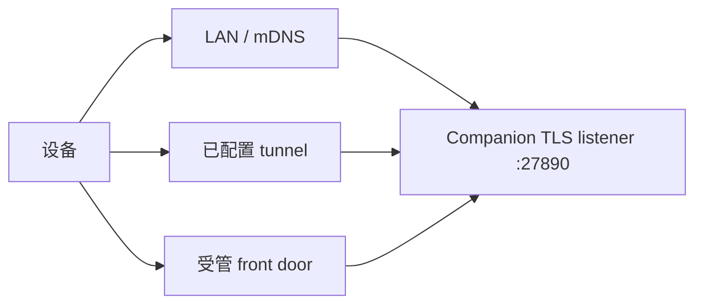

# 发现、Tunnel 与 TLS

<Status variant="beta" />

<TLDR>
  Companion listener 默认通过 TLS 监听 `27890`。LAN discovery 广播 listener 与证书身份；
  `GET /healthz` 确认服务进程，`/livez` 与 `/readyz` 分别表达存活和依赖就绪。Tunnel 或受管
  front door 仍保留规范 `/api/*` 与 `/ws/*` 路径，不提供版本化兼容别名。
</TLDR>

## Probe 接口

| 路由 | 鉴权 | 用途 |
| --- | --- | --- |
| `GET /healthz` | 无 | 基础服务器身份与健康发现 |
| `GET /livez` | 无 | 进程存活 |
| `GET /readyz` | 无 | 必需运行时依赖是否就绪 |
| `GET /.well-known/agent-card.json` | 无 | Agent capability 发现 |

Probe 不暴露 session 或命令数据。发现服务器后，设备仍必须完成设备注册与 DPoP token 流程。

## 可达路径

部署方式会改变 base URL，但契约路径不变。反向代理必须转发 WebSocket upgrade，并保留 DPoP 校验与
socket-ticket 绑定所使用的原始 request path。

## TLS 身份

原生运行时持有证书，并通过 discovery 元数据暴露 fingerprint。客户端在发送注册材料前，应按部署
策略 pin 或校验该身份。Tunnel 的公开证书不会自动授权另一台 Companion 实例。

## 浏览器 front door

主部署路径从同一个 HTTPS origin 提供静态 export、API、WebSocket 与 signaling。split-origin 必须
在 `COGNIA_ALLOWED_WEB_ORIGINS` 中显式列出精确 HTTPS Origin；PNA 还必须设置
`COGNIA_ALLOW_PRIVATE_NETWORK=true`。服务端不会启用通配 Origin 或 cookie credentials，浏览器
WebSocket upgrade 与 HTTP 使用同一套 Origin 判定。
