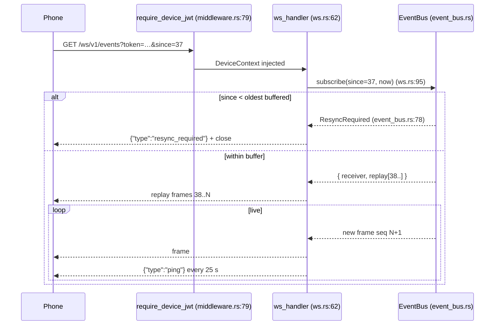

# 事件、WebSocket 与推送

<Status variant="beta" />

<TLDR>
  桌面端通过 `GET /ws/v1/events`（`ws.rs:62`）将状态实时推送到手机。`EventBus`（`event_bus.rs`）
  将 Tauri `app.emit` 事件桥接到一个 tokio `broadcast` channel 与一个带单调递增 `seq` 的
  **200 帧 ring buffer**；重新连接的手机发送 `?since=<seq>`，系统要么 replay 缺口帧，要么在其落后于
  buffer 时返回 `resync_required`。第二条 socket `GET /ws/v1/terminal`（`ws_terminal.rs:235`）以可恢复
  会话的方式桥接远程 PTY。当手机离线（无活跃 WS）时，`push.rs` 投递 FCM/APNs 通知——若目标设备已有
  WebSocket 在线，则**抑制**该推送。
</TLDR>

<StatGrid>
  <Stat label="Ring buffer" value="200 帧" hint="event_bus.rs:46" />
  <Stat label="保留时长" value="60 s" hint="event_bus.rs:49" />
  <Stat label="WS heartbeat" value="25 s" hint="ws.rs:34 — 空闲关闭 90 s" />
  <Stat label="Terminal resume TTL" value="5 min" hint="ws_terminal.rs:66" />
  <Stat label="Push 提供商" value="2" hint="FCM + APNs — dispatchers.rs" />
</StatGrid>

## EventBus

`EventBus`（`event_bus.rs`）承担两项职责：将 Tauri 事件扇出到每个已连接的 WebSocket，并保留一段短暂的
积压队列，使短暂离线的手机无需全量 resync 即可追上进度。

- **Ring buffer** — `BUFFER_CAPACITY = 200` 帧（`event_bus.rs:46`），在 `publish`（`:117-149`）中同时按容量
  与 `RETENTION_MS = 60_000`（`:49`）时间窗口裁剪。
- **Broadcast channel** — `BROADCAST_CAPACITY = 256`（`:53`）；活跃订阅者在帧发布时实时收到新帧。
- **seq 游标** — 一个 `AtomicU64`（`:99`），在首次 `publish`（`:118`）时从 1 开始递增。
- **Tauri bridge** — `register_tauri_event(app, bus, channel)`（`:227`）调用 `app.listen(channel, …)`，解析
  payload JSON 后重新发布到 bus，因此任何桌面子系统发出的 Tauri 事件都能免费到达手机端。

wire 格式 `EventFrame`（`:60-71`）将 `event_type` 字段序列化为 `"type"`：

```json
{ "type": "claude://session-event", "seq": 42, "payload": { … }, "ts_ms": 1700000000000 }
```

## /ws/v1/events — replay 与 resync

`ws_handler`（`ws.rs:62`）仅在 `require_device_jwt` 验证 `?token=` 查询参数（WebSocket 无法可靠携带自定义
请求头）并注入 `DeviceContext` 后方可到达；handler 本身只读取该 context（`ws.rs:69-73`）。随后
`handle_socket`（`ws.rs:83`）执行 replay 协议：

<Steps>
<Step>
**带游标订阅** — `event_bus.subscribe(since, now_ms)`（`ws.rs:95`）。`since = None` 锚定在当前最高水位
（仅接收未来帧）；`since = Some(0)` 重放所有仍在缓冲区中的帧；其他任意 `since` 则重放比它更新的帧。
</Step>
<Step>
**若落后则 resync** — 若 `since` 早于缓冲区中最旧的帧，`subscribe` 返回
`SubscribeResult::ResyncRequired`（`event_bus.rs:78`）；handler 发送 `{ "type": "resync_required" }` 后关闭
连接（`ws.rs:95-103`）。手机随后须通过 `sync_pull` 重新拉取完整的 Dexie 数据集。
</Step>
<Step>
**Replay 缺口** — 否则，比 `since` 更新的缓冲帧将按序序列化并发送（`ws.rs:106-117`）。
</Step>
<Step>
**实时流式传输 + heartbeat** — 新帧实时转发；服务器每 `HEARTBEAT_SECS = 25`（`ws.rs:34`）发送 ping，空闲
超过 `IDLE_TIMEOUT_SECS = 90`（`ws.rs:37`，检查点 `:187-199`）的连接将被关闭。`broadcast::error::RecvError::Lagged`
（订阅者过慢）同样会关闭 socket（`ws.rs:143-146`）。
</Step>
</Steps>



## /ws/v1/terminal — 远程 PTY

`ws_terminal_handler`（`ws_terminal.rs:235`）将手机桥接到桌面端的[集成终端](../../adr/0031-integrated-terminal)。它通过
`terminal::session::spawn_session_with_sink`（`ws_terminal.rs:274`）启动一个 PTY，该 PTY 的事件馈入一个
mpsc `(seq, TerminalEvent)` channel。启动请求（`build_spawn_request`，`:486`）强制设置
`origin = SessionOrigin::Remote`、`force_utf8 = true`，以及 `enable_shell_integration = false`。

- **Wire 帧** — 二进制帧承载原始 PTY stdin/stdout；文本控制帧（`ControlFrame`，`:518`）承载 `ready` /
  `integration` / `exit` / `resize` / `kill` / `error`（`handle_control_frame`，`:530`）。
- **可恢复（Wave 2）** — 携带 `?sessionId=&resumeFrom=` 重新连接（`:220-229`）；验证设备归属后，
  `session.replay().since(resume_from)` 重新流式传输错过的输出（`:346-364`）。进程级
  `WsTerminalRegistry`（`:73`，静态 `:179`）跟踪活跃会话；reaper（`:187`）回收空闲超过
  `RESUME_TTL = 5 min`（`:66`）的会话，硬性 `IDLE_TIMEOUT = 15 min`（`:71`）限制单次连接时长。
- **CLI PATH** — `build_remote_cli_path_injection`（`:561`）注入托管二进制目录 +
  `target/{release,debug}` + `~/.cargo/bin`，使远程 shell 能找到已打包的工具链。

## Push 投递

当手机无活跃 WebSocket 时，`push.rs` 投递通知。这是一个轻量级内置 dispatcher，不依赖
`fcm-rust` / `a2-rs`：

- **在线时抑制** — `dispatch_to_device`（`push.rs:244`）首先检查 `has_websocket(device_id)`；若 WS 已打开，
  则返回 `SuppressedWebsocketActive` 而非重复通知。每台设备的计数器由 `note_websocket_open/close`
  （`:209-235`）维护。
- **Token 注册表** — `PushTokenRegistry` 将 `device_id` 映射到 APNs/FCM token，持久化于
  `<data_dir>/cognia/companion/push-tokens.json`（`PUSH_TOKENS_FILE`，`push.rs:33`；路径 `:141-155`）。
- **Dispatcher 集合** — `DispatcherSet`（`:287`）持有 FCM 和 APNs 插槽；trait 为 `PushDispatcher`（`:82`），
  带有 `NoopDispatcher` 兜底。真实客户端位于 `dispatchers.rs`：`FcmDispatcher`（FCM HTTP v1）与
  `ApnsDispatcher`（APNs HTTP/2 token 认证）。
- **离线广播** — `broadcast_to_offline`（`:263`）遍历所有已注册 token，每个均经过 `dispatch_to_device`
  处理（已连接设备仍会被跳过）。

### 凭证

`push_creds.rs` 将提供商凭证持久化到 keyring 服务 `"com.cognia.companion-push/v1"`，账户分别为
`"fcm"` / `"apns"`（`push_creds.rs:24-26`），并提供文件后端兜底（`push-credentials.fcm.json` /
`.apns.json`，unix 下权限 `0o600`，`:27-28`）。`reinstall_persisted_dispatchers`（`:243-266`）在启动时加载
凭证并装配 dispatcher 集合。配置凭证的 Tauri 命令为 `companion_push_configure_fcm`（`commands.rs:777`）、
`companion_push_configure_apns`（`commands.rs:792`），以及对应的 `clear`/`status` 命令。

## 相关页面

<Cards>
  <Card title="数据平面与 WebView 桥接" href="./data-plane-bridges" description="needs-input-notifier 发出触发离线推送的事件。" />
  <Card title="WebRTC 信令平面" href="./signaling-webrtc" description="DataChannel 同样通过 RTC 层将 EventBus 帧泵送至手机。" />
  <Card title="集成终端" href="../../adr/0031-integrated-terminal" description="/ws/v1/terminal 所桥接的 PTY 子系统。" />
</Cards>
