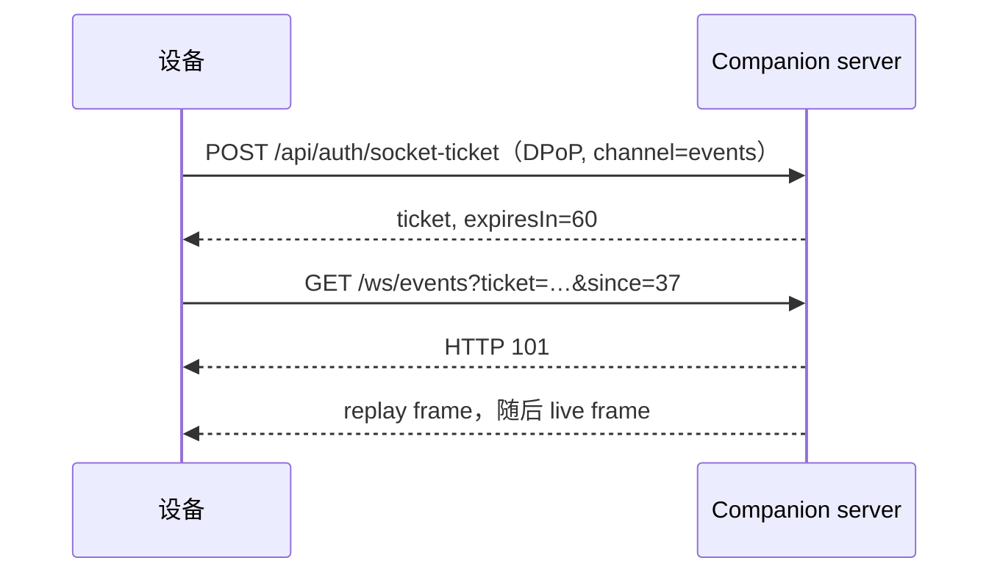

# 事件、WebSocket 与推送

<Status variant="beta" />

<TLDR>
  规范 WebSocket 不会把五分钟 DPoP token 放入 URL。设备先用 DPoP 调用
  `POST /api/auth/socket-ticket`，再把返回的 60 秒单次 ticket 用于指定的 event、terminal、
  browser 或 ACP 路径。事件连接可传 `since` 回放缺失序列。服务端不挂载任何 query-string
  bearer socket。
</TLDR>

## Ticket 流程

Ticket 只能使用一次且绑定路径。为 events 签发的 ticket 不能打开 terminal 或 browser channel。
如果建连在 ticket 被消费后失败，需要重新申请。

## 规范 channel

| Channel | 路由 | 说明 |
| --- | --- | --- |
| Events | `GET /ws/events?ticket=…&since=…` | 序列 replay；缺口超出保留窗口时返回 `resync_required` |
| 新建终端 | `GET /ws/terminal/new?ticket=…` | 创建可恢复的远程 PTY session |
| 恢复终端 | `GET /ws/terminal/{session_id}?ticket=…` | 重新连接存活终端 session |
| Browser | `GET /ws/browser/{session_id}?ticket=…` | 浏览器 session channel |
| ACP | `GET /ws/acp?ticket=…` | Agent Client Protocol bridge |

事件总线把单调递增序列 frame 存入有界 ring buffer，同时广播新 frame。重连时客户端传入最后收到的
序号；若 cursor 已过旧，服务器发送 `resync_required`，客户端必须先通过 RPC 刷新权威状态，再继续
增量处理。

## 推送

推送 token 的注册与撤销也是受命令 manifest 管理的 RPC。Push 是离线提示，不是权威状态 channel。
设备已有活动 event socket 时，服务器会抑制重复 push。

旧 `/ws/v1/*?token=…` socket 被明确移除。`cgnp3` 升级前的客户端必须重新配对，并改用单次
socket ticket。

## 高频性能 Frame

性能 frame 通过定向、临时的 `companion_perf_frame` 发送给持有 lease 的设备。它们明确不进入 durable replay，避免诊断 cadence 挤出业务事件。重连恢复读取绑定 lease 的性能 snapshot，按 host instance、sampling session 和 sequence 合并，并将无法恢复的 sequence 范围记录为 `PerfGap`。
