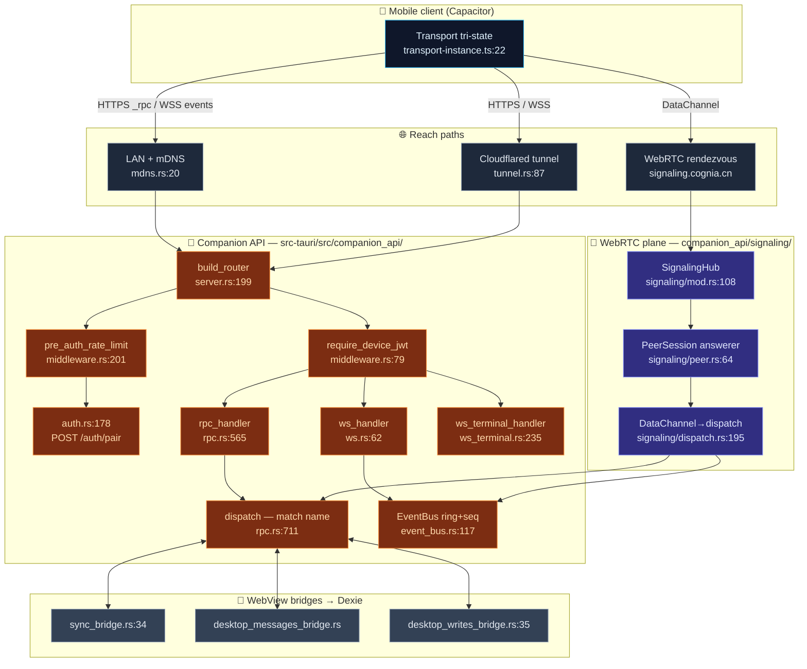

# 外部 API

<Status variant="beta">beta · companion M2 / WebRTC M-RTC complete</Status>

<TLDR>
  Cognia 的桌面端不只是一个应用——它同时也是一台**服务器**。Tauri shell 会启动最多
  **三个独立的 axum 监听器**，每个都是拥有独立认证模型的对外接口：
  **Companion API**（`companion_api/server.rs:199`）是一个 HTTPS + WebSocket 服务，配对的
  手机通过 `POST /api/v1/_rpc/<name>` 访问 **110** 条 allowlist 命令；**Remote
  Control**（`remote_control/server.rs:72`）是面向脚本的 loopback bearer-token webhook 接收器；
  **MCP / External Bridge**（`mcp_server/http_server.rs:67`）将 JSON-RPC 转发给 Node
  sidecar，把 Cognia 的知识库暴露给外部编程 agent。Companion API 是唯一绑定非 loopback
  地址的服务，也是唯一使用设备 JWT 的服务；它还内置了一个 **WebRTC
  DataChannel 传输层**（`companion_api/signaling/`），使 NAT 之后的手机能通过中介 peer
  连接在 LAN 和隧道均不可用时连接到桌面。
</TLDR>

<StatGrid>
  <Stat label="axum 监听器" value="3" hint="companion_api · remote_control · mcp_server — 各用独立端口" />
  <Stat label="RPC 命令数" value="110" hint="KNOWN_COMMANDS allowlist — rpc.rs:163" />
  <Stat label="HTTP/WS 路由数" value="8" hint="companion_api router — server.rs:199" />
  <Stat label="Transport 层级" value="4" hint="ws-lan · ws-tunnel · rtc-direct · rtc-relay" />
  <Stat label="默认 companion 端口" value="27890" hint="server.rs — DEFAULT_PORT，可调整" />
  <Stat label="设备 JWT 有效期" value="90 d" hint="jwt.rs:29 — pair JWT 为 5 分钟" />
</StatGrid>

## 是什么

Cognia 中的**外部 API** 是指由 Tauri Rust 后端向*进程外*调用方提供的任意 HTTP/WS/WebRTC
接口。由于 `next.config.ts` 强制使用 `output: "export"`，`app/api/` 在运行时不存在——所有
服务端 endpoint 均由 Rust（[axum](https://docs.rs/axum)）而非 Next.js 路由实现。三个监听器
分别服务三类受众：

| 服务 | 代码位置 | 绑定地址 | 端口 | 认证方式 | 受众 |
| --- | --- | --- | --- | --- | --- |
| **Companion API** | `src-tauri/src/companion_api/` | `127.0.0.1` **或** `0.0.0.0`（可切换）+ TLS | 默认 `27890` | **设备 JWT**（HS256） | 移动端 companion 应用 |
| **Remote Control** | `src-tauri/src/remote_control/` | 仅 `127.0.0.1` | 默认 `47821` | bearer token + IPv4 CIDR allowlist | 本地脚本 / CI |
| **MCP / External Bridge** | `src-tauri/src/mcp_server/` | 仅 `127.0.0.1` | 由 OS 分配 | bearer token | 外部编程 agent |

这是**三个运行在三个 socket 上的独立 axum 实例**——它们不共享 router。MCP 服务还会
额外开启第四个仅限内部的 loopback socket（`automation_proxy.rs:177`），供其 Node sidecar
回调桌面自动化，而不会与 JSON-RPC 管道产生竞争。

本节深入介绍 **Companion API**——它是三者中接口面最大、唯一支持多传输层的服务，也是
[移动端 Companion](../../ui/mobile-architecture) 客户端对应的服务端。Remote Control 和
MCP bridge 各有独立页面：[Remote Control](../remote-control) 和
[External Bridge](../external-bridge)。

## 为何存在

- **静态导出没有服务器。** 启动监听器、终止 TLS、签发 JWT、中介 WebRTC
  都需要真实进程；Tauri Rust 后端承担了这一角色。手机运行的是与桌面*相同*的 `out/`
  bundle，但连接的是这些 endpoint，而非调用 Tauri IPC。
- **Allowlist 即 API。** 桌面注册了 200+ 条 Tauri 命令；若将它们全部暴露给配对手机，
  会造成安全回退。`KNOWN_COMMANDS`（`rpc.rs:163`）是一份手工维护的列表，精确列出
  手机可调用的 ~110 条命令（[ADR-0013](../../adr/0013-command-manifest)）。
- **一套前端，三种 transport。** 客户端的 `Transport` 抽象
  （[ADR-0012](../../adr/0012-transport-abstraction)）让*同一个* `transport.call(name, args)`
  在桌面解析为 Tauri IPC、在 LAN 移动端解析为 HTTPS `_rpc`、在蜂窝网络下解析为 WebRTC
  DataChannel。服务端因此必须在 HTTP（`rpc.rs:565`）和 DataChannel
  （`signaling/dispatch.rs:195`）两条路径上响应相同的 RPC。

## 架构速览

配对的手机通过四种 transport 层级之一连接到桌面；每种层级都汇入同一个
`rpc::dispatch` 和同一个事件总线。每个方框标注了实际处理逻辑所在的文件与行号。

## Router

`build_router`（`server.rs:199`）合并了三个子 router，采用分层结构，使每条路由精确获得
所需的 middleware。body-limit 层（`RequestBodyLimitLayer`，64 KiB，位于 `server.rs:47`）和
`.with_state` 在 `server.rs:250-251` 处包裹整棵路由树。

| 子 router | 路由 | Handler | 位置 | 守卫 |
| --- | --- | --- | --- | --- |
| 有计量预认证（`server.rs:203`） | `POST /api/v1/auth/pair/issue` | `issue_handler` | `auth.rs:119` | 每 IP token bucket |
| | `POST /api/v1/auth/pair` | `pair_handler` | `auth.rs:178` | 每 IP token bucket |
| | `POST /api/v1/auth/pair/redeem-code` | `redeem_code_handler` | `auth.rs:211` | 每 IP token bucket |
| 无计量公开（`server.rs:220`） | `GET /api/v1/healthz` | `healthz_handler` | `healthz.rs:38` | 无（供发现使用） |
| 受保护（`server.rs:234`） | `GET /api/v1/whoami` | `whoami_handler` | `auth.rs:389` | 设备 JWT |
| | `POST /api/v1/_rpc/{name}` | `rpc_handler` | `rpc.rs:565` | 设备 JWT |
| | `ANY /ws/v1/events` | `ws_handler` | `ws.rs:62` | 设备 JWT（`?token=`） |
| | `ANY /ws/v1/terminal` | `ws_terminal_handler` | `ws_terminal.rs:235` | 设备 JWT（`?token=`） |

两个 middleware 层互不重叠：`pre_auth_rate_limit`（`middleware.rs:201`）仅守卫三条配对路由
（因为此时设备尚不存在，所以按 peer IP 计量），而 `require_device_jwt`（`middleware.rs:79`）
仅守卫 `whoami` / `_rpc` / 两个 WebSocket。`healthz` 故意不做认证，使扫描中的手机在
配对之前就能确认"这是一台 Cognia 服务器"。

## 模块地图

查看各模块的独立页面以获取精确到行的内部细节。每张卡片对应一个文档页面。

<Cards>
  <Card title="服务器与认证" href="./server-and-auth" description="axum 启动流程、TLS 自签名证书、middleware 栈，以及完整的配对流程：pair JWT 与设备 JWT、6 位数验证码路径、一次性兑换、拒绝列表与 remote-control allowlist。" />
  <Card title="RPC 命令清单" href="./rpc-manifest" description="rpc.rs：110 条命令的 KNOWN_COMMANDS allowlist、READ_ONLY 与 CONTROL 命令集、dispatch match、Tauri State 注入、幂等性、每设备限流器，以及 OpenAPI 一致性测试。" />
  <Card title="数据面与 WebView bridge" href="./data-plane-bridges" description="Rust handler 如何读写存储在 WebView Dexie 中的数据：三个 oneshot bridge、sync 表 allowlist，以及在无 WebView 时切换为 SQLite 存储的 headless DataPlane。" />
  <Card title="事件、WebSocket 与推送" href="./events-ws-push" description="事件总线环形缓冲区与 seq 游标、/ws/v1/events 重放与重同步协议、通过 /ws/v1/terminal 实现的可恢复远程终端，以及带 WebSocket 激活抑制的 FCM/APNs 推送。" />
  <Card title="WebRTC 信令面" href="./signaling-webrtc" description="仅 v2 的桌面/headless answerer：角色认证加密信令、受界 webrtc-rs peer、持久幂等、事件 replay/resync 与恢复 FSM（ADR-0021）。" />
  <Card title="发现、隧道与 TLS" href="./discovery-tunnel" description="mDNS 广播 _cognia._tcp.local.、cloudflared quick/named 隧道启动器、healthz 发现 endpoint、10 年期自签名证书，以及手机所 pin 的 SPKI 指纹。" />
</Cards>

## 兄弟服务

Companion API 是三个对外接口之一。另外两个共享相同的设计基因
（loopback axum + 常量时间 bearer auth + body limit），但服务不同的调用方：

<Cards>
  <Card title="Remote Control" href="../remote-control" description="仅限 loopback 的 webhook 接收器：通过脚本/CI 发送 POST 任务运行或事件，以及 HMAC 签名的出站 webhook。Bearer token + IPv4 CIDR allowlist + 固定窗口限流。" />
  <Card title="External Bridge (MCP)" href="../external-bridge" description="Bearer 认证的 HTTP 前门，将 JSON-RPC 转发给 Node sidecar，通过 MCP 将 Cognia 的 wiki/RAG/运行时/connectors/computer-use 能力暴露给外部编程 agent。" />
</Cards>

## 设计不变量

- **Allowlist 是全部写入面。** 除非命令名出现在 `KNOWN_COMMANDS`（`rpc.rs:163`）中，否则
  任何请求都不会触达 Tauri 命令；`CONTROL_COMMANDS`（`rpc.rs:408`）对会话控制类动词
  增加第二道门，在 `dispatch`（`rpc.rs:724`）顶部再次执行，使 WebRTC 路径与 HTTP 路径
  受到相同的门控。
- **一个 dispatch，覆盖所有 transport。** HTTP `rpc_handler`（`rpc.rs:565`）和 DataChannel
  泵（`signaling/dispatch.rs:195`）都调用同一个
  `dispatch(name, params, state, app, device_id)`（`rpc.rs:711`）。新命令只需编写一次。
- **签名密钥即身份。** OS keyring 中一个 32 字节的 HS256 密钥（`secret.rs:21`）签发所有
  pair JWT 和设备 JWT；WebRTC 使用独立的双方 P-256 角色 key；`healthz` 发布的 `server_id`
  为 `SHA-256(secret)[..16]`（`healthz.rs:54`）。
- **向发现失败，而非向暴露失败。** 只有 `healthz` 是无需认证的，且它故意只透露
  version + fingerprint + server_id，使手机能在发送任何凭证之前就完成 TLS pin。

## 相关 ADR

- [ADR-0012 — Transport Abstraction](../../adr/0012-transport-abstraction)
- [ADR-0013 — Companion API Command Manifest](../../adr/0013-command-manifest)
- [ADR-0014 — Capacitor Mobile Shell](../../adr/0014-capacitor-mobile-shell)
- [ADR-0015 — Mobile V2 Completion](../../adr/0015-mobile-v2-completion)
- [ADR-0021 — WebRTC DataChannel WAN Transport](../../adr/0021-webrtc-datachannel-wan-transport)
