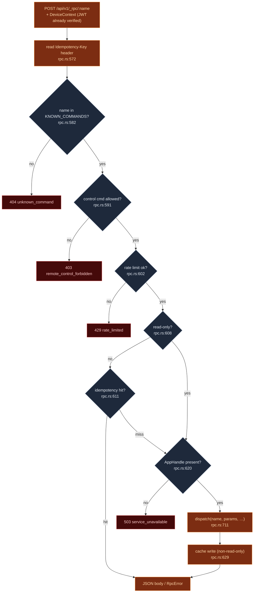

# RPC 命令清单

<Status variant="beta" />

<TLDR>
  每条手机命令均为 `POST /api/v1/_rpc/<name>`，由 `rpc_handler`（`rpc.rs:565`）处理。命令名必须存在于
  `KNOWN_COMMANDS`——一个手写的 `&[&str]`，共 **110** 条（`rpc.rs:163`）——否则请求返回 `404`。
  handler 随后依次执行控制能力门控、per-device token-bucket 限流（`rpc.rs:602`）和 idempotency
  缓存查找，才会进入唯一的大型 `dispatch` match（`rpc.rs:711`）。`dispatch` 与 WebRTC DataChannel
  路径逐字共享，因此一条命令只需编写一次，两种传输均可访问。IPC 能自动注入的 Tauri `State`/`AppHandle`
  ergonomics，在 HTTP 路径上需在每个 dispatch arm 中通过 `app.state()` 手动获取。
</TLDR>

<StatGrid>
  <Stat label="allowlist 命令数" value="110" hint="KNOWN_COMMANDS — rpc.rs:163" />
  <Stat label="只读（跳过缓存）" value="集合" hint="READ_ONLY_COMMANDS — rpc.rs:333" />
  <Stat label="控制门控" value="集合" hint="CONTROL_COMMANDS — rpc.rs:408" />
  <Stat label="限流阈值" value="60 次/分" hint="突发 10 次，per device — rate_limit.rs:51" />
  <Stat label="Idempotency TTL" value="60 秒" hint="上限 1000 条 — idempotency.rs:58" />
</StatGrid>

## 为何选择手写

[ADR-0013](../../adr/0013-command-manifest) 选择手写 allowlist 而非宏生成，理由有三，至今仍然成立：

1. **allowlist 即 API。** 手机可调用的每条命令都在同一份可检索的列表里；没有任何命令会被意外暴露。审阅者只需阅读约 110 行，而非 200 个命令体。
2. **per-command 形状控制。** 在 IPC 路径上，Tauri 能自动注入 `tauri::State` 和 `AppHandle`；而在 HTTP 路径上，这些必须手动绑定。每个 dispatch arm 自行调用 `app.state()`。
3. **经过验证，而非生成。** `spec_parity.rs` 断言 allowlist 与 OpenAPI spec 双向一一对应，但两者均不由对方生成——变更意味着需在两处刻意编辑，遗漏其一则测试报错。

## Handler 流水线

`rpc_handler`（`rpc.rs:565`）在进入任何 dispatch 之前执行一段固定流程：



顺序至关重要：限流器位于 JWT 中间件（确保 `device_id` 已存在）和控制门控**之后**，但位于 idempotency
查找**之前**——缓存命中不应消耗令牌（参见 `rpc.rs:599` 注释）。

## 三个命令集

| 集合 | 位置 | 用途 |
| --- | --- | --- |
| `KNOWN_COMMANDS` | `rpc.rs:163`（至 `:321`） | 110 条命令的 allowlist；accessor `known_commands()` 在 `:327` |
| `READ_ONLY_COMMANDS` | `rpc.rs:333`（至 `:390`） | 结构上幂等的读操作；完全跳过 idempotency 缓存（`is_read_only` 在 `:608`） |
| `CONTROL_COMMANDS` | `rpc.rs:408`（至 `:461`） | 需提权的会话控制动词；`is_control_command()` 在 `:464`，由 [control allow-list](./server-and-auth#revocation-deny-list-and-control-allow-list) 门控 |

还有第四个更窄的 allowlist——`APP_SETTINGS_MOBILE_ALLOWED_KEYS`（`rpc.rs:490`，accessor `:548`）——
限制 `app_settings_update` 可从手机端修改的设置 key，防止配对设备随意翻转桌面端任意设置。

## 命令分组

110 条命令可归入若干可识别的系列。以下为具有代表性的采样，附 dispatch arm 行号：

| 分组 | 示例（verbatim 名称） |
| --- | --- |
| 聊天会话 | `claude_send` (`:742`) · `claude_interrupt` (`:753`) · `claude_approve` (`:762`) · `claude_close_session` (`:782`) · `claude_sidecar_status` (`:791`) |
| Provider / OAuth env | `claude_set_api_key` (`:818`) · `claude_set_oauth_bearer` (`:809`) · `claude_set_provider_env` (`:825`) · `claude_restart_sidecar` (`:845`) |
| Skills / MCP | `skills_scan_native` (`:878`) · `skills_load_registry` (`:888`) · `mcp_server_status` (`:923`) · `test_mcp_server` (`:1192`) |
| 同步 / 推送 | `sync_list_tables` (`:968`) · `sync_pull` (`:986`) · `register_push_token` (`:931`) · `revoke_push_token` (`:962`) |
| 消息 / 会话 | `message_update` (`:1018`) · `message_delete` (`:1028`) · `session_list` (`:1037`) · `message_get_by_session` (`:1047`) · `message_send` (`:1057`) |
| 源代码管理 | `git_is_repo` (`:1212`) … `git_merge_abort` (`:1467`) |
| 文件系统 | `read_text_file` (`:1480`) · `write_text_file` (`:1488`) · `fs_search_workspace` (`:1512`) · `fs_write_workspace_file` (`:1536`) |
| 终端 | `terminal_list_all` (`:1552`) · `terminal_kill` (`:1565`) · `terminal_exec` (`:1572`) |
| 插件 | `plugin_list` (`:1588`) · `plugin_install` (`:1603`) · `plugin_install_from_github` (`:1617`) |
| 控制（门控） | `session_attach` · `goal_pause` · `automation_consent_respond` (`:1136`) · `app_settings_update` (`:1158`，key 受限） |

许多变更命令合并为单个 OR-pattern arm（`rpc.rs:1072-1116`），经由
[desktop-writes bridge](./data-plane-bridges) 路由——`character_upsert`、`workflow_create`、`twin_*`、
`backup_*` 等均共享一条桥接路径，而非 40 条手写 arm。

## State 注入

`dispatch`（`rpc.rs:711`）接收 `app: &tauri::AppHandle`；每个需要托管 State 的 arm 通过
`use tauri::Manager as _`（`rpc.rs:718`）显式获取：

```rust
let sidecar_state: tauri::State<'_, SidecarState> = app.state();   // rpc.rs:746
let api_key_state: tauri::State<'_, ApiKeyState> = app.state();    // rpc.rs:811
let mcp_state: tauri::State<'_, McpServerState> = app.state();     // rpc.rs:924
let terminal_state: tauri::State<'_, TerminalState> = app.state(); // rpc.rs:1553
```

这正是 ADR-0013 所指的"shim"：IPC 宏会自动注入这些 State，但在 HTTP 路径上，每个 arm 必须手动完成。
fallthrough arm 返回 `RpcError::unknown_command`（`rpc.rs:1665`）。

## Idempotency

`IdempotencyCache`（`idempotency.rs`）以元组 `(device_id, Idempotency-Key)` 为键，将缓存响应存入
`HashMap`（`idempotency.rs:38`）。TTL 和容量作为字面量写在 `new()` 中——
`with_capacity(1_000, Duration::from_secs(60))`（`idempotency.rs:58`）：

```text
POST /api/v1/_rpc/character_upsert
Authorization: Bearer <device-jwt>
Idempotency-Key: <client-uuid>
{ ...args... }
```

`get`（`idempotency.rs:75`）若缓存存在且未过期则返回缓存体（读时懒惰过期）；`put`（`idempotency.rs:93`）
原地覆写，容量满时按最旧优先淘汰。只读命令永不进入缓存——重复执行代价低且结构上安全。

## 限流

`rate_limit.rs` 是一个内置的 **token bucket**，支持小数补充（`Bucket { tokens: f64,
last_refill: Instant }`，`rate_limit.rs:26`）。默认配置——`capacity: 10.0`、`refill_per_sec:
1.0`（`rate_limit.rs:51-53`）——对应 **60 rpm，突发上限 10 次**，以 `device_id` 为分桶单位
（`rate_limit.rs:60,92`）。`check_at`（`rate_limit.rs:89`）按已用挂钟时间比例补充令牌，`Accept`
时扣减一个令牌；`Reject` 时返回向上取整到整秒（最小 1 秒）的 `retry_after`。
这是 **per-device** 限流器，与配对路由上的 per-IP 预鉴权限流器相互独立。

## 错误信封

所有失败均共享 `RpcError { code, message }`（`rpc.rs:69`）：

```json
{ "code": "unknown_command",          "message": "..." }  // 404
{ "code": "malformed_request",        "message": "..." }  // 400
{ "code": "validation_failed",        "message": "..." }  // 400
{ "code": "remote_control_forbidden", "message": "..." }  // 403
{ "code": "rate_limited",             "message": "..." }  // 429
{ "code": "service_unavailable",      "message": "..." }  // 503
{ "code": "internal_error",           "message": "..." }  // 500
```

辅助构造器：`unknown_command`（`rpc.rs:83`）、`malformed`（`:93`）、`service_unavailable`（`:100`）、
`internal`（`:107`）、`forbidden`（`:119`）、`rate_limited`（`:129`）、`validation_failed`（`:146`）。

## OpenAPI 一致性

`spec_parity.rs` 是一个仅用于测试的模块，将 allowlist 锁定到已发布的 OpenAPI 文档
（`include_str!("../../../docs/api/mobile-companion-api.openapi.yaml")`，`spec_parity.rs:21`）。
它断言两个不变量：

- **正向**——`KNOWN_COMMANDS` 中的每条命令在 spec 中均有对应的 `/api/v1/_rpc/<name>` 路径
  （`spec_parity.rs:49`）。
- **反向**——spec 中列出的每条 RPC 路径均有对应的 dispatch arm（`spec_parity.rs:98`）。

因此，添加命令而不更新文档（或反之）会导致 CI 失败。

## 相关页面

<Cards>
  <Card title="数据平面与 WebView 桥接" href="./data-plane-bridges" description="变更命令如何实际读写 WebView 中的 Dexie 数据。" />
  <Card title="WebRTC 信令平面" href="./signaling-webrtc" description="复用本 dispatch 的 DataChannel 路径。" />
  <Card title="移动端：传输层" href="../../ui/mobile-architecture/transport-layer" description="客户端侧——CompanionTransport 如何构建 _rpc 请求并生成 Idempotency-Key。" />
</Cards>
